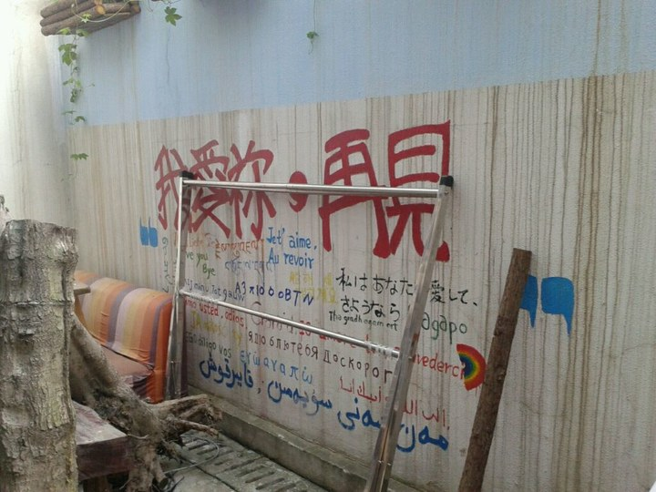
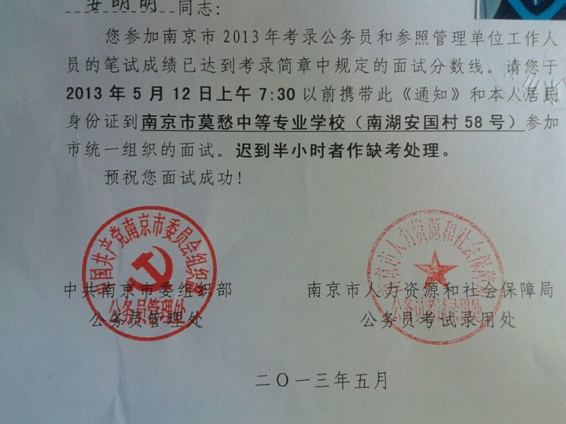
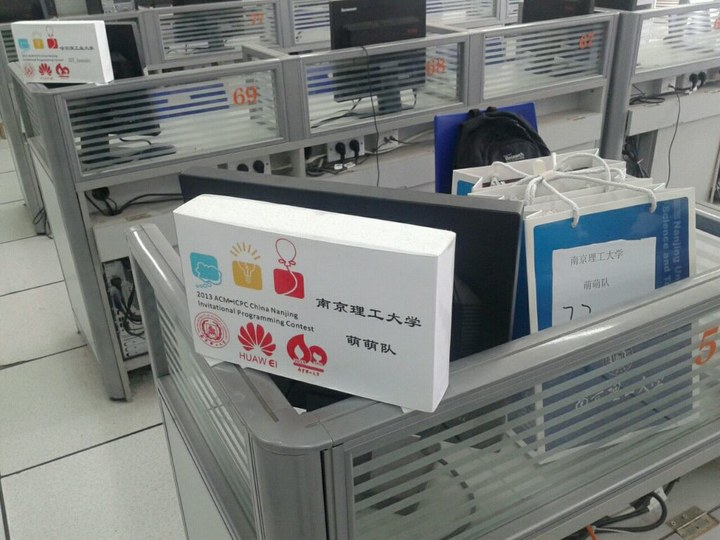
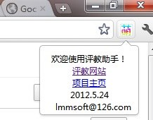
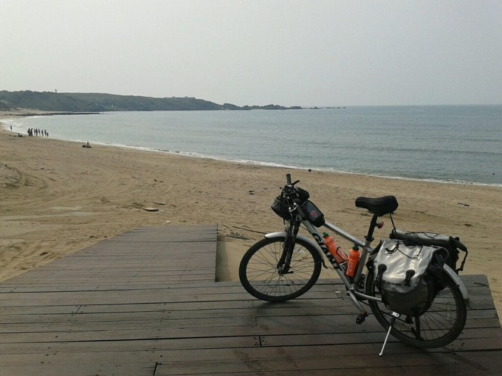
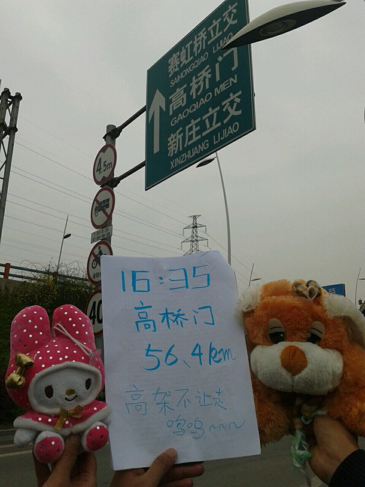
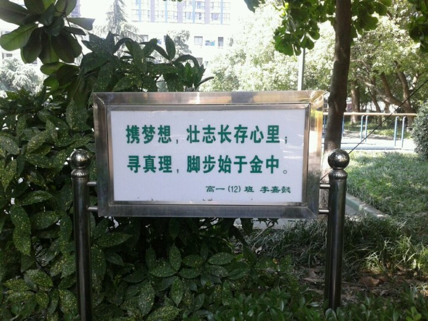
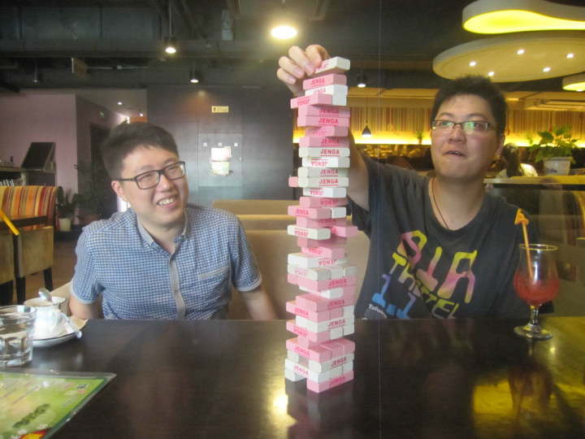
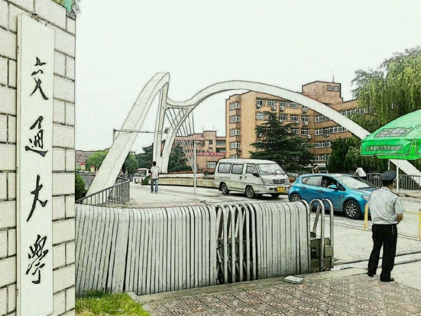
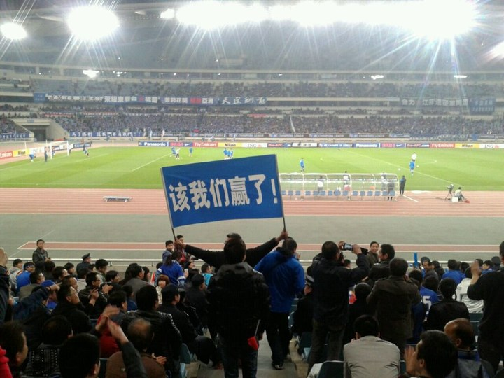

以我完美主义+拖延症的糟糕特质，不可能把“总结”写出来的，所以还是承接《龙年我做过哪些有意思的事情?》

通过一个小的角度切入，把大四下好玩的事情写一写，就当是总结吧，报喜不报忧什么的~

# Part1 工作：
## 1.1 毕设
* 
* 不知道这能不能算好玩的事，虽然最后教务处给出的成绩是优，但我真的没好好弄
* 导师是通过类似套磁的办法找到的（勾搭喜欢的女老师什么的），然后选题也可以和老师一起拟了

<!--more-->
* [本来想趁机做点自己喜欢的东西，但最后还是败给了贪玩。。。开学之后我告诉老师，我这学期想好好玩玩。。。老师特别好，后来真的就没太盯着我
* 大家都说“毕业设计是本科生帮研究生做点东西”，可我完全相反，坑了带我的研究生师兄，去台湾玩的时候正好刚上来中期报告，我啥都没有，师兄帮我交了报告，后来还给了几乎所有的算法代码，以至于后来我主要的工作是搭界面。。。
* 某天下午2:00开始查程序，我中午12:00开始连接算法和界面，到了一点感觉果断完不成，于是就把算法都扔了，直接rand结果。。。所幸答辩组长姓娄，非常照顾，没怎么check我的程序。。。
* 答辩也很那个。。。很多功能都没实现，穿了件MIT logo的T恤护体，就水过了
* 因为]()怕查重，所以我没有申优，结果因为答辩相对较好，被列入强制申优的二次答辩的名单，比例是27/270人。自己偷偷查了下重，吓死了，延毕的节奏啊。。。于是第二天以“睡过了”为由没去答辩，最后居然还是得了优，谢谢教务处，么么哒~
    
## 1.2 考公务员

* 这档子事是算是大学四年最让全家开心的事情了。父母，爷爷奶奶，各种亲戚，听说我考上公务员，都非常开心O(∩_∩)O
* 我考上了南京市六合区统计局信息管理公务员，然后拒掉了。。。
* 写过很详细的流程、经验、总结，没公开发，毕竟我没好好准备，会误人子弟的。。。

* 下面简单说说流程：
* 【报名】对比了南京市需要软件工程专业毕业生的职位，选择了一个竞争相对不激烈的职位，1:29（南京市平均是 1:45.2，热门职位都是 1：100 以上）
* 【复习】笔试前只做了一套模拟卷，面试前只找同学练了半天
* 【笔试】公基 66.5 行测 63.8 申论 60，总分 190.3
* 【面试】找准备考选调生的同学练习了半天，知道了考试形式，感觉面试相当于 “领导讲话”，这里面学问很大，需要达到一个 “让听众很爽，但仔细想想，也没有太多实质性内容” 的效果
* 【结果】面试完没过几天就出成绩了，然后按要求写了 “放弃声明”，恰好第二名和我已经认识十一年了，肥水没留外人田 XDDD
* 

## 1.3 NJUST ACM 邀请赛

* 我加了好多OI/ACM圈子的童鞋，但没参加过regional比赛
* 我校秋天举办regional，毕业前正好有邀请赛，于是就去打了个酱油
* 我负责冠名“萌萌队”，队友负责做题，我几乎没碰键盘，依靠，杨益民的出色发挥，获得银奖~
* 

## 1.4 开源程序

* 写过几个与学校有关的小程序，毕业了，没找到有意维护的人，就准备都开源啦
* 最近天天都在玩，好几个程序还没重构，过一阵子再放出来吧~
     * GPA查询
     * [GPA查询android客户端 by 陈凯健](https://github.com/ckj375/Njust-StudentHelper)
     * [自动评教](https://github.com/lmmsoft/njust-teacher-evaluation-assistant-chrome-plugin)
     * [图书馆助手](https://github.com/lmmsoft/njust-library-chrome-plugin)
     * 课表一键打印
* 

## 1.5 写在毕业前系列
本来规划中还有好几篇的呢，后来玩得太多，都没写，也不知道哪天能补完~

- 之一：[送书]
- 之二：[大四狗的求职经历]
- 之三：[南理工生活的 100 件事]
- 之四：[突破收费和断网限制，23 点之后继续免费使用校园网，还能翻墙]
- 之五：[南理工自动评教插件]

# Part2 生活：
## 2.1 环台湾 / 香港游

* 和两个好同学一起，在台北Giant租了辆自行车，骑了11天，1200公里（ 北京至上海的空中距离为1084公里）
* 在台湾一共玩了15天，然后在香港又腐败了5天，乐不思蜀吖~
* 游记一定会写的，但现在处于无限拖延当中。。。
* 
* 

## 2.2 骑行南京明外郭城
- 为台湾的骑行拉练，顺便寻访下诸如安德门、江东门、沧波门、高桥门、仙鹤门等老地名
- 依旧和上次 “暴走南京明城墙” 一样，带着小兔兔和小狗狗，在每个城门拍照留念，不过外郭城一个城门都没有了，这次只能找含有名字的地标
- [图文游记] [骑行南京明外郭城] 写在人人网，待整理后迁移过来
- 

## 2.3 阅读分享

* 每天早起睡前都在刷人人，主要看分享的日志，最讨厌长微博了，耗流量而且不清晰~
* 然后快工作了，找了一个有关职场新人的文章，端正了三观
* 收获还蛮大的，就是烧时间，而且没有主题阅读效率高~
* 

## 2.4 会好友

* 毕业前列了一个 list，把还在南京的一些好朋友都列了出来
* 后来就一个一个吃饭聊天，都完成了，没留什么遗憾
* 
* 

## 2.5 毕业后的旅行

* 毕业后出去玩了 10 天，南京 -> 上海 -> 杭州 -> 武汉 -> 合肥 -> 南京
* 见了各种好友，大部分是 CS 系的，保内、保外、出国、工作、创业的都有，开阔了眼界，收获很大
* 还看了两场中超客场比赛（全输了，客场虫，呜呜～）
* 花了不到 2000 元，写了一万多字日记
* 

## 2.6 看球

* 我从舜天冲超的第一个赛季才开始现场看球，但是排骨送了我季票，我看了高考之后几乎所有的比赛~
* 然后两个赛季去现场的次数不多，赛季都不到五场吧
* 见证这球市越来越好，每场上座从（周末一万多，周中大几千，好比赛两万多）到（轻松上两万，周中也能快两万，最多的6.8W，东亚上座记录）
* 球票最低价格也从15块到40块，，季票从150送签名球衣到含亚冠600
* 这个赛季看了2场亚冠、2次客场、1次猪协杯，其他还有个主场
* 围观氛围，发泄情绪，其实我不懂足球的，嘿嘿~
* 

# part3 自评：
- 学业和技术上毫无进步，但是玩得挺开心的~
- 如果按照如下规则：
1. 吊
1. 有趣
1. 有点意思
1. 一般
1. 呵呵
- 自评应该是 3 (2012 年自评是 2)