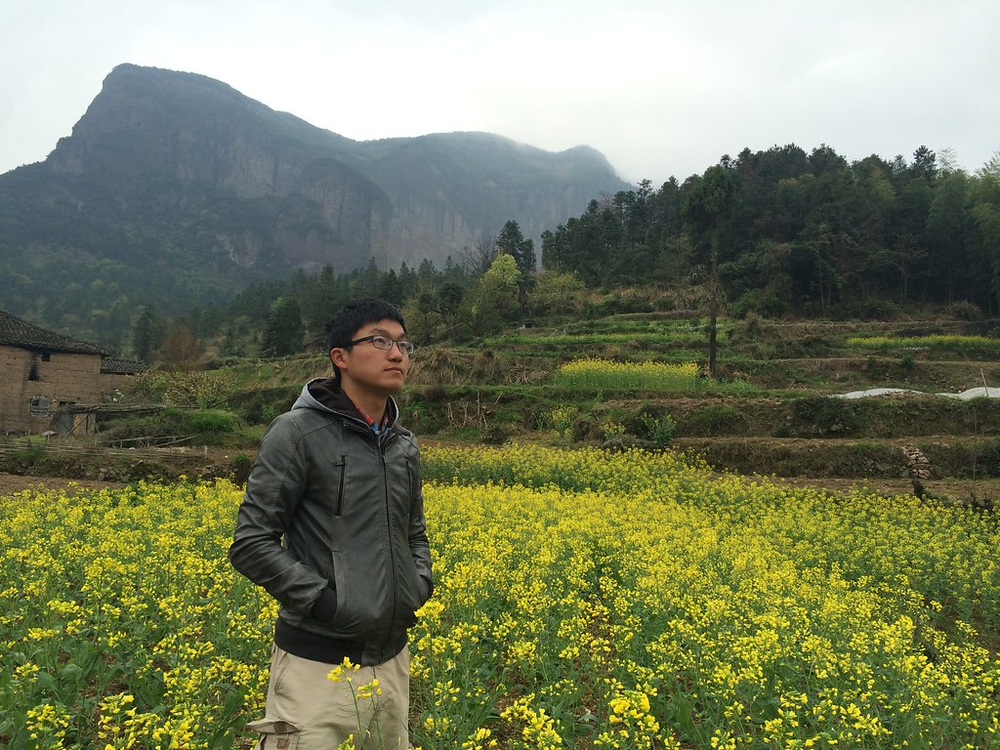

# 台州，仙居，皤摊古镇，公盂岩，椒江入海口，石塘千年曙光碑游记

# Part 0 目录

# Part 1 人物介绍
##队长，某理工大学博士，负责带路，比如带大家逛窑子（如图）

##会计，某挨踢公司民工，负责记账，拎包

##晨晨，电子商务从业者

##鹏鹏，也是电商人，帅小伙一枚

##蘑菇，海归白富美，去过很多高大上的地方，这次想试试接地气的感觉

# Part 2 流程攻略

## day1 台州 椒江 临海花街 2014-04-04

- 乘坐动车，苏州到台州，8:30-12:44，因为是清明前一天，所以车上学生很多，坐我右边是苏州去绍兴玩的大一学生，左边是嘉兴回家的学生，在宁波的时候还上了好多穿校服的高中生
- 火车上拍的浙江田园风景

- 铁路紧邻高速

- 台州我到啦，图为台州汽车站

### '贪吃渔人'午餐
- 第一站:吃~~~选了点评上推荐的海鲜店'贪吃渔人'
- 饭店外景，门口用渔网装饰

- 饭店里的布置颇有特色，船舵

- 太饿了，看到菜样，口水直流啊

- 队长在点菜

- 小海蟹 62元

- 带鱼饭，48，太诱人啦

- 章鱼酸菜48，清炒虾仁芥兰22

- 摆拍一张

### 椒江入海口
- 吃完饭，打车去'七号码头',城市里小山还挺多了，绿化也挺好，我们到了浙J的地盘

- 椒江边的纪念碑

- 七号码头边停了很多船

- 很整齐

- 离开码头，我们坐5元的三轮车，到了入海口的东山公园，免门票，我们是从大门进入的，这是后门

- 进了大门，是个游乐场，还有摩天轮呢

- 爬到山顶，登上观景楼，就可以看到入海口全景啦

- 山背后，老房子

- 来张夕阳下的背影

- 下了山，乘坐一路公交回汽车站，老站台，长椅~

### 临海花街
- 从台州坐车到下面的县级市临海，住在汽车站边的旅馆，在花街边逛边吃

- 水潺面11元

- 最后又吃了烧烤，甘蔗

## day2 皤摊古镇
- 起了个大早，坐了7点从临海发往仙居的大巴，临海汽车站背靠大山，早上的空气很清新

- 到仙居汽车站啦，再转(到横溪的)小巴去皤摊古镇

- 到皤摊镇啦

- 进古镇

- 古镇算是半开放的，不买票可以在大街上随便乱晃，但是有些专门的几个景点不能进（比如祠堂/故居/窑子）

- 镇口晒春笋

- 水埠头旧址

- 老街

- 旧赌场

- 当铺

- 眺望村外

- 小石桥

- 桥上也是晒笋

- 小童在玩耍

- 池水很绿嘛

- 老邮局是介个样子的

- **文革标语，老房子不言的伤啊**

- 老街稍显破败

- 靠着绿苔来一张

- 靠着石墙来两张

- 仙居这里石墙很多很多

- 我们在田市也看到很多石墙的房子

### 祭祖
- 这绝对是全程的亮点之一，清明出游，赶上了陈家祠堂的祭祖仪式。景观和人文的完美结合，当时发了朋友圈如下
- 游过不少古镇，参观过很多宗祠，这不是最美的古镇，也不是见过最大的宗祠，却留下了特殊的记忆：赶上清明节，遇见了祭祖活动，这宗祠每年363天是景点，只有清明和冬至才发挥它真正的文化意义，碰巧被我遇上了

- 高挂陈氏彩旗

- 祠堂大门

- 祭祖

- 请了艺人唱歌

- 设酒杀鸡，做好午饭

- 门神

## day2-3 公盂岩
- 出发前先来张合影

- 进山前的路，前面是另外一批驴友

- 过了小桥，就告别了大路

- 正式踏上小路

- 一路顺着溪流而上

- 路窄处，仅容一人通过

- 抬头看看远处的大山，这是我们的终点

- 穿山越岭

- 注意平衡

- 走到瀑布前，三面都是山崖，迷路了

- 后来我们边寻路，边往回撤，找到条上山的路，路有各种俱乐部扎的带子，说明这是正确的路。天色昏暗，总算在完全暗下来之前抵达下坪村，稍事休息，直接去不远的上坪村休息
- 各路驴友在农家的墙壁上挂起了旗子

- 并签名留念

- 篝火晚会

- 队长在研究第二天的路线

- 借着微暗的灯火掼蛋

- 农家的孩子们一起睡地铺

- 早上醒来，发现自己枕着梯田，伴着油菜花，睡在群山之间

- 面朝梯田，背靠公盂岩

- 云雾间的公盂背

- 会计在学习拍摄公盂背

- 山间的油菜花

- 再臭美一张

- 梯田

- 山间休息

- 悬崖之上，眺望群山

- 鹏鹏在山脚的小河边

- 胜利到达终点

- 我的朋友圈:
- 山上没有网络信号和wifi，但是有春笋，有土菜，有杨梅酒，有掼蛋，有篝火晚会，有野地里的帐篷和小姑凉们欢快的歌声。
- 有些事哪里都可以做，有的的快乐只有此间有，风景这边独好~ 

- 小伙伴们的：蘑菇

- 晨晨

# Part 3 QA
## Q1花了多少钱：
- 全程花费账单如下
- 一共5个人，我是会计，大家充值，我负责所有的集体花费
- 最后把账单放到onedrive上，直接分享到微信群，小伙伴们不用登陆就可以查看并编辑不对的地方，超级方便~

# Part 4 写点感想

* 未完待续