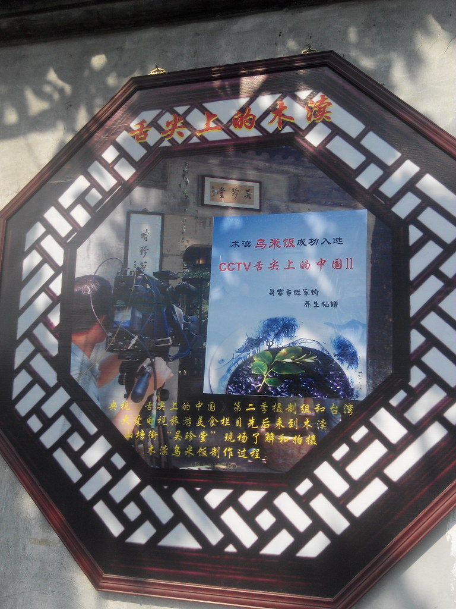

# 太湖西山，木渎古镇、观景美食游
2014 年 3 月初去了太湖西山和木渎，很快就好几个朋友咨询木渎的行程，可能是因为地铁一号线能到缘故吧。当时只能把流程和经验口口相传，早日把图文发出来才是王道啊！

# 2014-03-08 太湖西山，林屋洞，缥缈峰
- 11:12AM 好基友 Lucas 抵达苏州站（人物介绍在最后），然后我们沿北环，太湖大道，直奔太湖
- 1200PM 到达太湖，先吃再玩，有山有水
- 先来张全景，摄于林屋洞，点击可看大图

## 太湖三白吃起来
- 太湖三白：白虾，白鱼，银鱼
- 我们吃了：清水白虾，清蒸白鱼，银鱼炒蛋，超级爽～- 清水白虾

- 银鱼炒蛋

- 清蒸白鱼

## 林屋洞
- 绕着西山岛乱开了一圈后，下午两点，抵达林屋洞景区，门票 60 元

- 洞里面

- 灯光效果，五颜六色

- 山顶有座道士塔

- 面朝太湖

- 背靠西山

- 后来还看了梅花

- 摄影师好认真哇

## 缥缈峰
- 缥缈峰是太湖第一峰，高 336 米，门票 80 元，我们在门口被村民拦下，说可以带进山，25 元每人

- 进山口在【水月坞】，大家可以直接导航前往，都是大路，免费停车 (地质博物馆门口)，没有人检查，下次再去，大家对着下面的图，把车直接开到地质博物馆就可以了，连带路费都可以省了～
-  山路一般，都是石头台阶，不平，也不陡，游客很少

- 地处碧螺春基地，漫山的碧螺春

- 雾中的太湖，胜似仙岛

# 2014-03-09 木渎，拙政园
## 木渎古镇
- 第一天和 Lucas 夜宿木渎，看完 CBA 半决赛开始卧谈，一年半没见，聊了很多
- 木渎的门票 78 元，我们用携程团购，享受了 39 元半价

- 古镇本身不要钱，凭门票可以进四个园林

- 严家故居是其中最完整的园林，这个严家很腻害，打入国共两党内部啊！在台湾的，做过蒋介石和蒋经国之间的那个 “总统”，在国内的是全国人大副委员长
- 小河边很多人在拍古装
- 明是楼，今日最爱 ^o^(因为有伦家的名纸啦)

- 路边都是各种卖特产的小店

- 买了一副苏绣，后来送给 mentor 啦～

## 拙政园
- 回城之后时间还早，正好火车站离拙政园非常近，就火速前往，结果进了古城之后堵车非常严重，门口游客也很多

- 门口有人现场塑像，很像哒～
- 图中间是北寺塔，为保护景观，现在的苏州古城区限高，所有楼房不得超过北寺塔的高度，北寺塔在城北，拙政园在西北，至今然后可以像古代一样，在园子你远眺古塔，毫无视线阻碍

- 拙政园很大，很值得慢慢游，细细逛，以后有机会再逛再拍重游

## 各种吃
- 第二天吃了好多好吃的，下面晒一晒：

- 乌米饭（入选舌尖上的中国 2）

- 苏记姜糖

- 油炸太湖蟹

- 各式各样的包子

# 人物介绍
- Lucas，我初中最好的朋友，现在厄瓜多尔工作，每年回国一次
- 工作后，和小学 / 初中 / 高中 / 大学最好的朋友都异地了，打电话总觉得缺少聊天的氛围，每年用旅游的机会聚一次，真是个不错的选择
- 明年的行程也已经订好了：三国文化游，我们都是三国历史迷，中学时曾多次放学后偷偷跑到家里对打电脑游戏《三国志 9》，从河南开始，穿梭到湖北，时间充足就入川，追随刘皇叔的脚步～