# 虎丘，定园游记
- **时间** 2014年7月6日，周日
- **天气** 晴
- **地点** 江苏省，苏州市
- **人物** 婧哥（我们系花喔~
- 七月初办了苏州园林卡+休闲卡，准备用一年时间，把苏州周边大小景点玩个遍。恰好婧哥被导师派到苏州实习，一年没见啦，上次还是毕业前在学校明苑食堂，这次决定逛苏州园林，一拍即合~
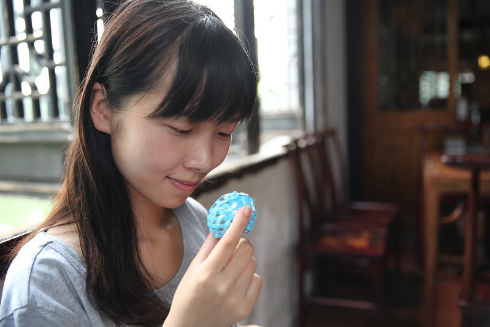
<!--more-->

# 虎丘
- **星级**AAAAA，门票80元，享有“吴中第一名胜”的美誉
- **自评**不是很好玩，去过一次就行了，不会带朋友再去~
- **时间**网上攻略都是2-3小时，我们玩了2小时
- 虎丘算是苏州最有名的景点之一了，在苏州古城区的西北，离市区很近，我们从园区开车过去，全程大概半小时吧，比火车站稍微远一点。
- 虎丘山被誉为“吴中第一山”
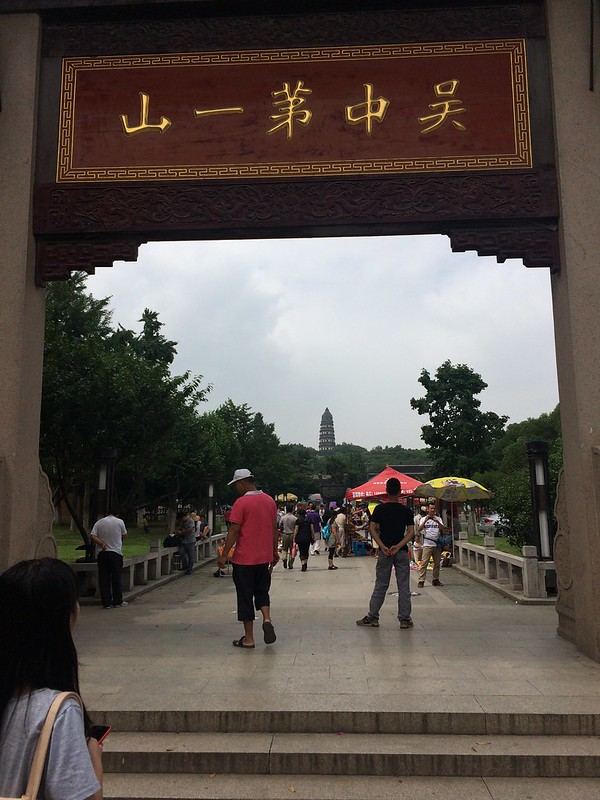

- 虎丘剑池四个大字，为颜真卿所书

- 园内草木葱茏，石刻众多
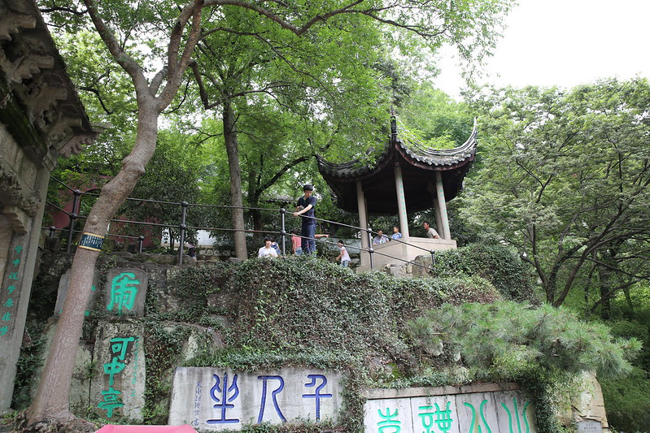
- 剑池，吴王阖闾就葬在这里，他的儿子夫差征调十万民工，建造了三年才竣工。因阖闾爱剑，下葬时以“专诸”、“鱼肠”等剑三千殉葬，故名"剑池"
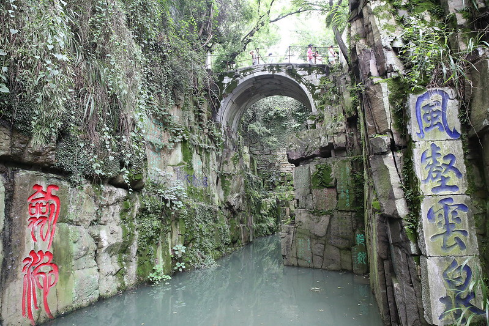
- 虎丘塔真名云岩寺塔，已有一千多年历史，是世界第二斜塔

- 远眺虎丘塔
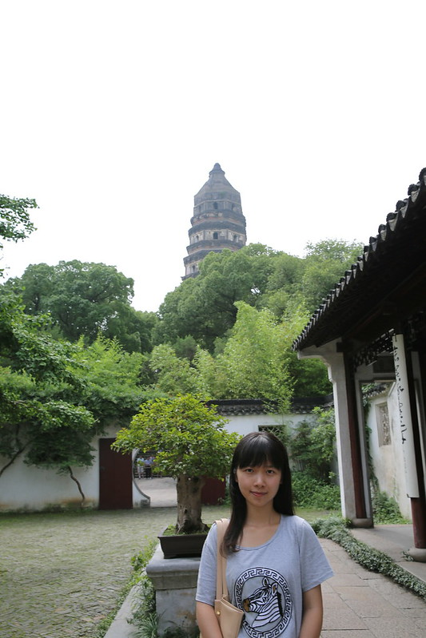
- 虎丘山东侧，眺望苏州古城，图中间的塔，即为城北的北寺塔
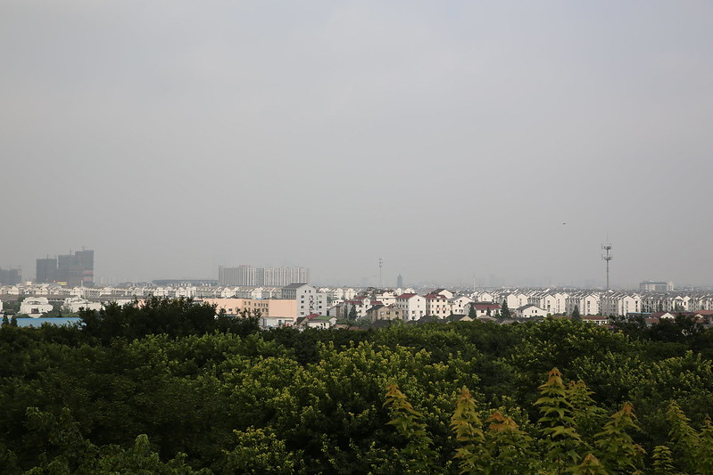

# 定园
- **星级** AAA，门票50元，没学生票
- **自评** 挺好玩的，大门票包含摇橹船，民俗表演，还有免费喝茶听戏，愿意再带朋友来玩，美中不足的是不支持园林卡~
- **时间** 所有游客都有免费讲解，全程导游带领，1.5小时，很紧凑，导游也很nice，主动帮游客取景，拍合影~
- 定园离虎丘很近，步行十分钟左右，我们一开始不了解情况，做了人力车，师傅后来帮我们买票，原价50*2,收了我们95，人力车费也免了，还不错~
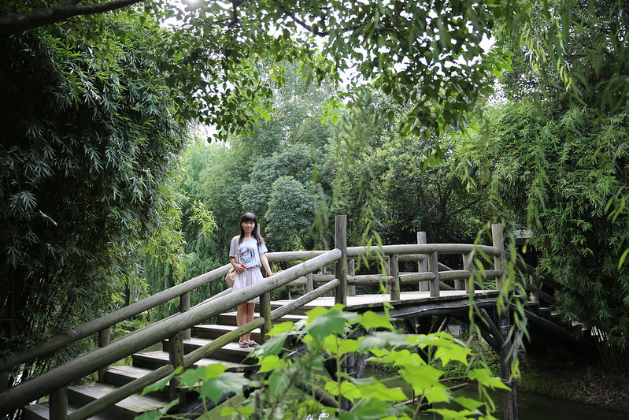
## 历史传说
- 定园始建于明代，相传为刘伯温故居，占地一百多亩，比72亩的拙政园还要大一些
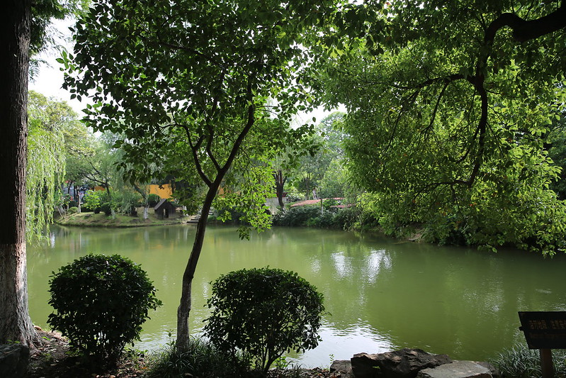
- 刘伯温墓
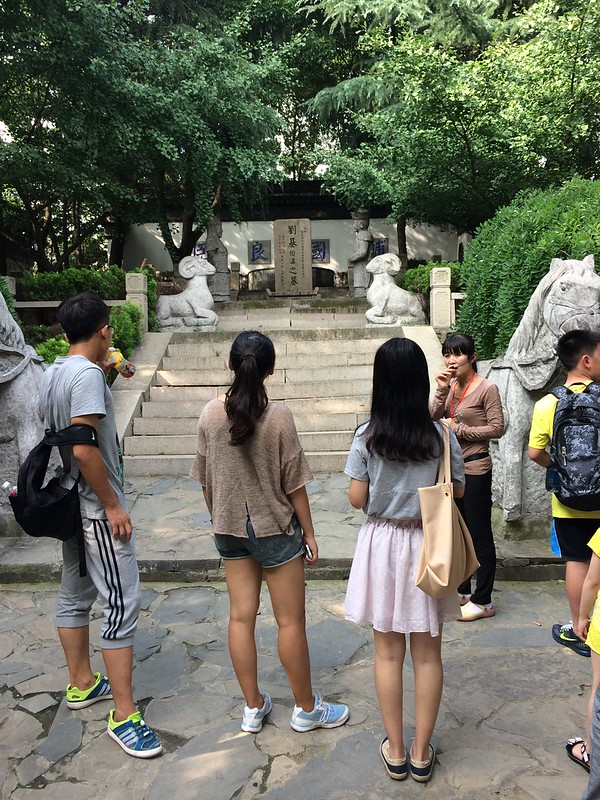
- 园中两口井，一为西施，一为郑旦，纪念勾践献给夫差的两位美女
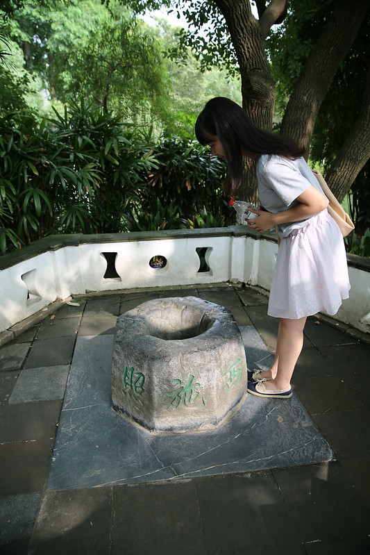

## 小桥流水
- 园内景致
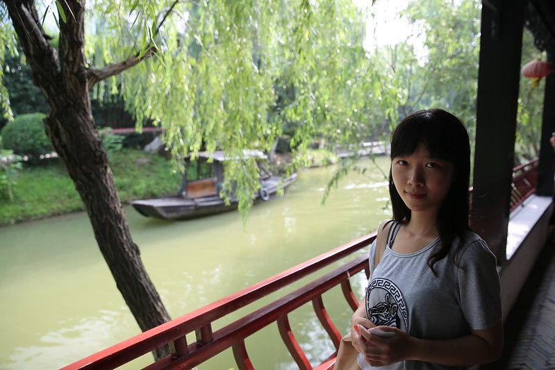
- 塔影湖，好像是苏州所有园林里面最大的湖~
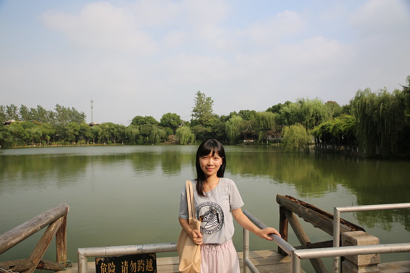
- 摇橹船，8人一船，免费乘坐

- 游船码头
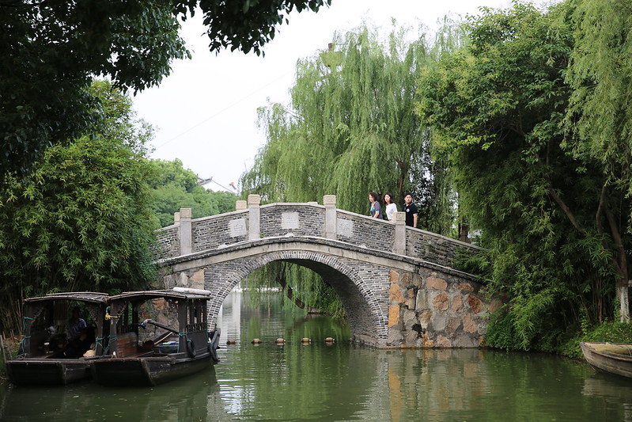
- 古典园林

## 民宿展览
- 唐伯虎点秋香
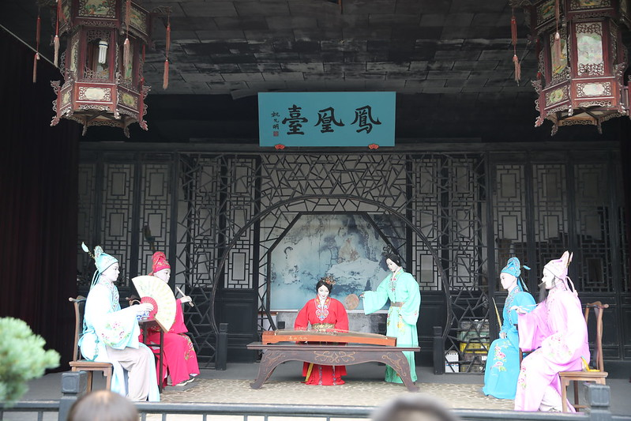
- 不仅有很多蜡像，还有苏州娶亲的民宿现场表演
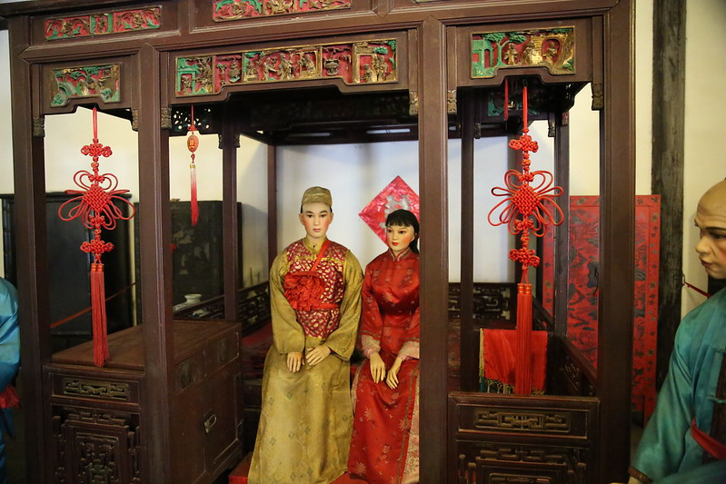
- 根雕展览
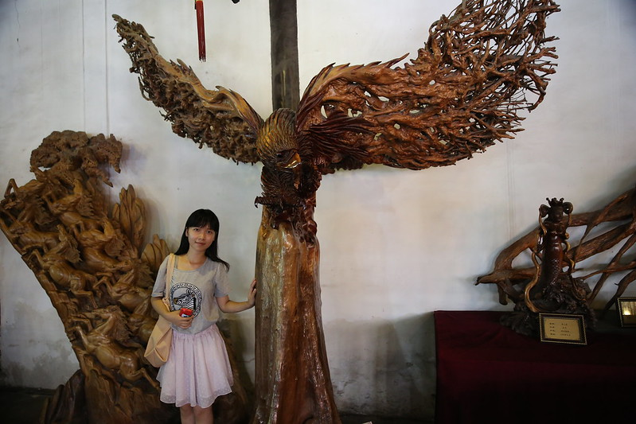
- 苏绣，清明上河图
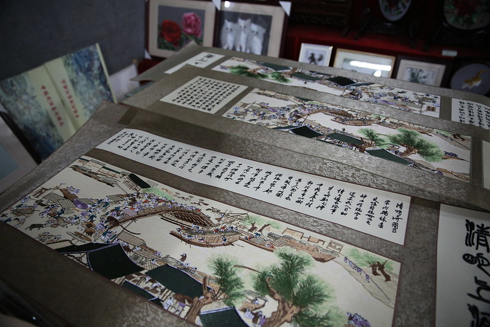

## 花神庙
- 南京原来也有花神庙，可是现在只剩地名和地铁站名
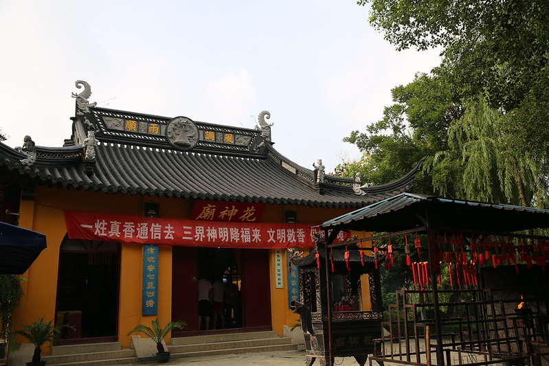
- 十二花神，比如十一月是昭君，十二月是洛神
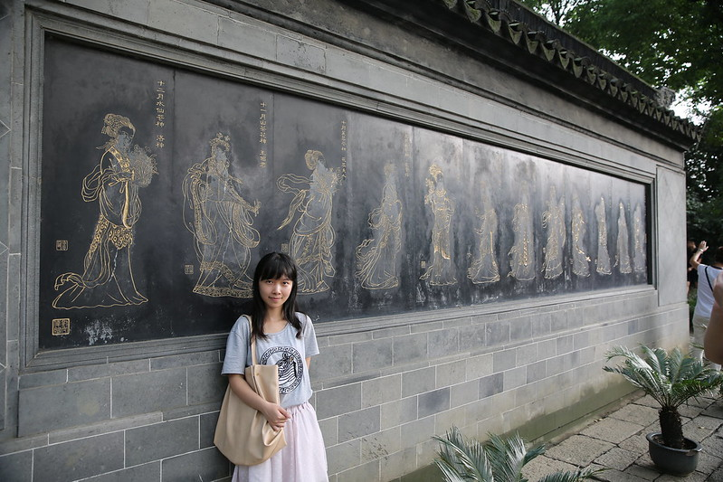
## 茶艺苑
- 游览结束，导游把我们带到茶艺苑，看茶艺表演，听苏州评弹
- 茶具
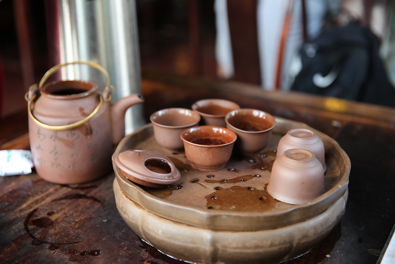
- 弄香

- 品茶

- 最后放一张大茶壶下的合影
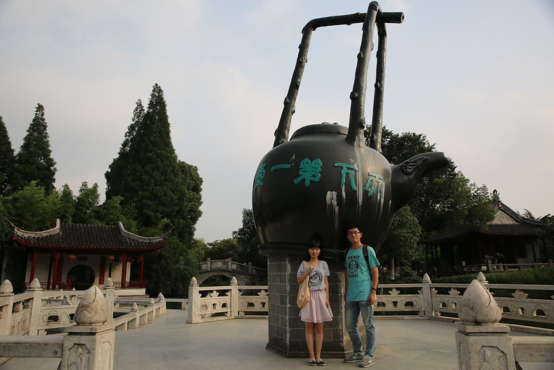