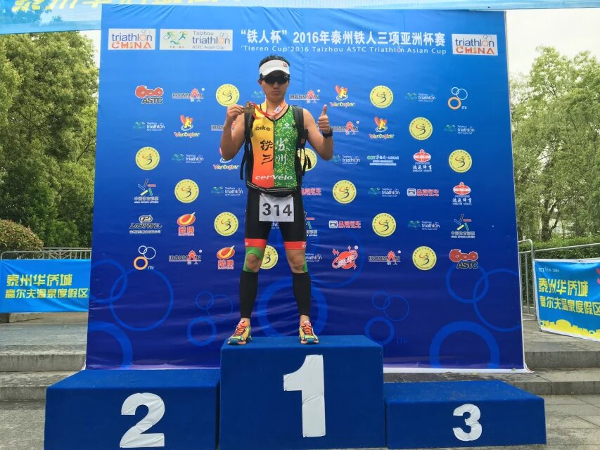

## 概况
```
时间：2016-05-08周日
地点：江苏 泰州 姜堰 溱湖湿地公园
比赛：亚洲杯，中国铁人三项协会积分赛 ，奥运标准距离
成绩：2h56m
```
<!--more-->
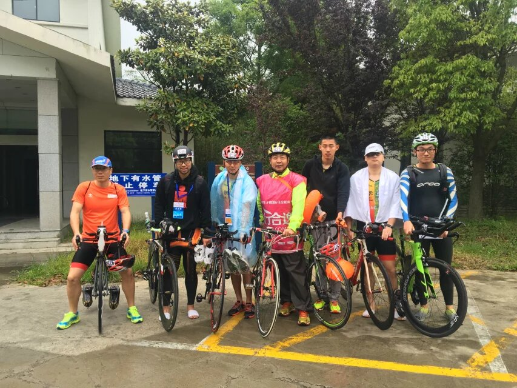

## 流水账

### 05-07 周六

1. 早上六点多就醒了，怕睡过， 
2. 7:30起床，东西前一天晚上基本收拾好，一个大包外加单车
3. 8:20打到车，是辆ford SUV，把前后轮拆掉，后座椅躺下放下
4. 9:00出发泰州，别克驾车，张晓副驾，我在后面休息
5. 11:00抵达溱湖，男子职业组刚好冲线，我们报道之后又看到了女子职业组的跑步冲线，男女青年组的骑车现场，游泳电视转播
6. 中午和无锡铁人一起吃饭，一大桌溱湖湖鲜，才人均50元，爽歪歪，桌上见识了无锡铁人的男女领军人物的风范，尤其是老大，自己打铁十几年，还培养出4个Ironman，6个健将，7个一级，若干二级，仰慕~！
7.  下午和大部队汇合，入住酒店，然后技术会，试赛道，骑车溜了一圈自行车赛道和跑步赛道，风景还不错，最后再试水，水温不算太冷，水质一般，感觉比去年好一点~
8. 晚上继续农家乐聚餐，然后回屋子各自收拾，我的换了脚踏电池，中间还弄错几次，今年的比赛几乎都没拍定妆照，对于比赛的新鲜感在减少，收拾好参赛包，贴号码簿，贴绩效贴，贴放水创口贴，贴水泡贴，折腾一番，也累了。
9. 最后十一点左右就睡了，一人睡标间，没有感染，睡得很舒服，时候证明这个很重要，去年泰州太兴奋，一夜都没睡好

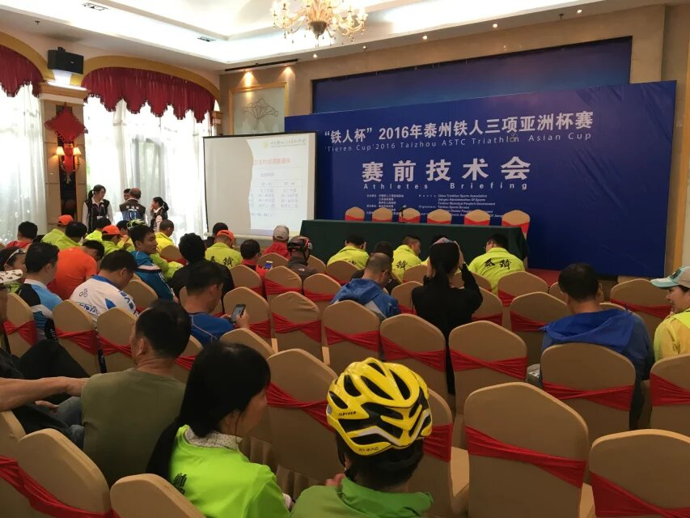

### 05-08 周日

1. 早上6:30 闹铃，不过铁友之前就敲门了，反正我也差不多醒了，睡了7个多小时，不少了~
2. 起床后，吃排酸丸，涂防晒霜，穿铁三服，穿胶衣， 迅速洗漱出门，集体自助早餐之后回房间收拾参赛包，因为可以下午两点退房，就把用不到的东西放房间，免得淋雨。
3. 天气预报有雨，吃早餐的时候一直在下，后来越下越小，游泳开始还有一点，骑车时候雨就停了，减小了比赛的危险，天宫还算作美，比赛结束才又开始下起来。
4. 背着大包小包，拍合影，然后进入换项区。去的路上还练习了一把赤脚上鞋，难度不大，但很不熟练，比赛吃了亏。 现在有了专用的铁三包，再加上有好几场比赛经验，收拾起来很快~
5.  8:30离开换项区，检录，领泳帽，然后等待9点比赛开始，身边站的都是20-24年龄组的几尊大神，3个都是职业队退下来的，这一组后来的确是死亡之组，6个人完赛，最后一名2:33

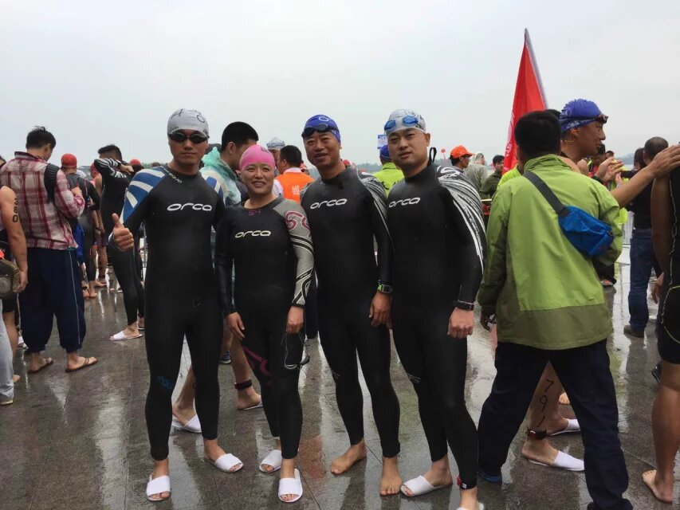


### 游泳 47分12秒，PW, rank14/17
- 春节后就下水三次，一次刚过完春节，上上周下太湖东山铁三训练赛，周四赛前抱佛脚，仅此而已，自由泳游不起来，蛙泳游不快，总之超级慢，最快的那些运动员基本都套了我一圈（750米一圈，一共两圈，第一圈上岸大概23分钟）

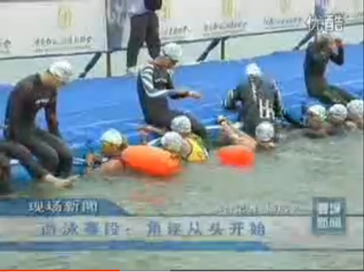

### 换项1， 3:35 rank13/17
- 上次换项花了5分多，这次吸取教训，尤其是上了锁鞋， 把穿鞋的时间省了，感觉还不错，总之是没拖后腿，下次可以继续提高一点~

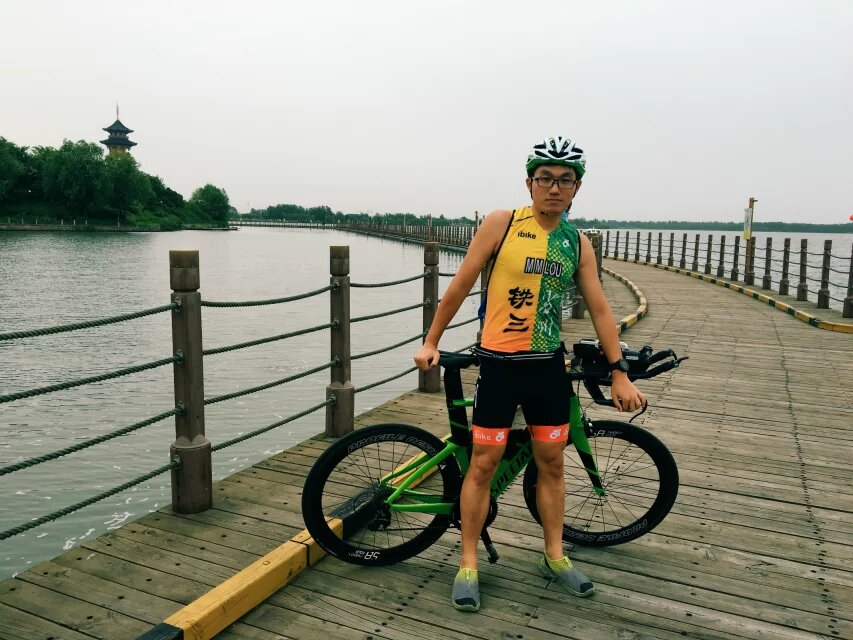

### 骑车 1h12m16s PB rank11/17 
- 进步最大的项目， 从安亭的1:30到富阳的1:18到泰州的1:12，很开心，当然有赛道难易和距离的原因，不过还是能清晰看到买买买和技术进步带来的提高
- 一开始脚怎么都穿不进鞋子，耽误了好一会儿，只能减到很慢的速度然后上手，看了能拆后跟的铁三锁鞋是有意义的
- 随后开始独自破风模式，逆风大概30左右的速度，顺风能拉到35+，折返技术不行，不敢压弯，每次都解锁，上锁，耽误不少时间。
- 前几圈都有速度很快的人从身边飞过，根本跟不上，第三圈找到个速度差不多的小集团， 5km骑出了最快的8:44s，第四圈人家都回换项区了，又被迫独自破风，不过总有个骑白色闪电的哥么，从第一圈就和我相互拉锯，双方前后相互超车不下10次，最后一同过线，后来知道是331号，扬州的铁友。骑行开始吃了一根胶，第三圈吃了一根，本来应该够了，左腿有点酸，怕出问题，第四圈又补了一根~
- 我的ftp是166w，今天 1h12m骑出161w的平均功率，算是发挥得还不错，平均心率163，踏频92，都挺满意
- 前7个5km用时的分别是10:10, 9:06 9:02 9:02 9:25 ，全程均速32.4km，从心率和功率来看差不多到顶了~
- 总结：骑行技术还可以多增强， 功率还有多练才能有大输出啊~

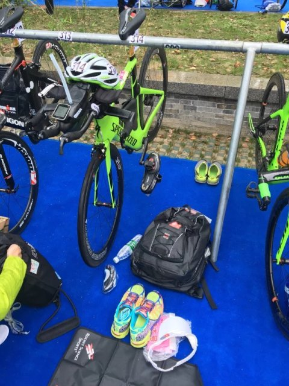

### 换项2 1:24 rank9、rank 12/17
- 下车前看到有人直接把鞋留在脚踏上，又学到一点，果然有用，省了不少时间，新技能get

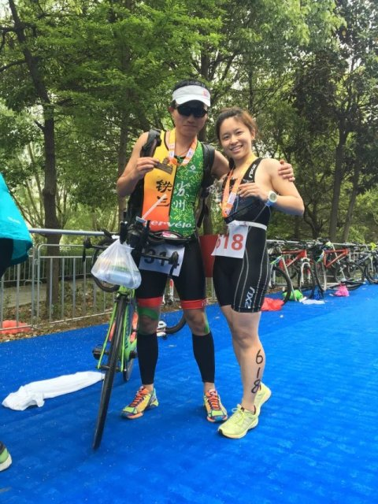

### 跑步 52"04 rank13/17
- 开跑后看了下时间， 205，还剩55分钟，只有530配速以内就能完成，应该还比较有把握，然后一直用515左右的配速跑，跑步路段风景不错，但是要穿过好几次河，所以要爬很多座小桥，桥都不高，但是坡都很陡，严重影响节奏，最后有铁友的统计是一共25座。
- 跑步有个折返，可以看到前后都有谁，距离，挺好的~
- 跑了一圈左右左腿有点酸，怕抽筋，就补了一颗盐丸。
- 跑到后半程有点走神，配速掉了不少，以后要多多注意，把配速练稳了~！
- 经验： 浇水到身上降温，能够大大提升速度，天气热每个补给点都要浇
- 数据：平均心率160，步频184，步长1.01，总配速530，触地249ms，左右平衡52.3% 47.4%,垂直7.7cm，每公里配速515,506,528,516,533,530,532,545,531,539

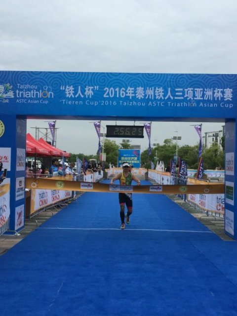

## 总结：
1. 标铁终于进3了，挺开心的
2. 睡得好，全程基本没出什么岔子，比较顺利的一场比赛
3. 不穿袜子+锁鞋套在车上让我节省了大量换项时间，和大部队基本差不多了，尝到了甜头，以后继续操练
4. 标铁300左右的，应该都是有块短板；230以内的，不仅要三项均衡，还得有一技之长，比如游泳快~
5. 下周金山就不作成绩的要求了，游泳争取全程自由泳，骑车争取不解锁，跑步看情况，少吃胶，不要拼太紧， 提升比赛经验。
6. 下一阶段游泳得好好练，短板太严重了

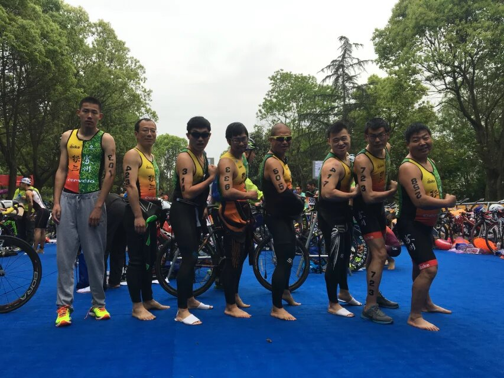

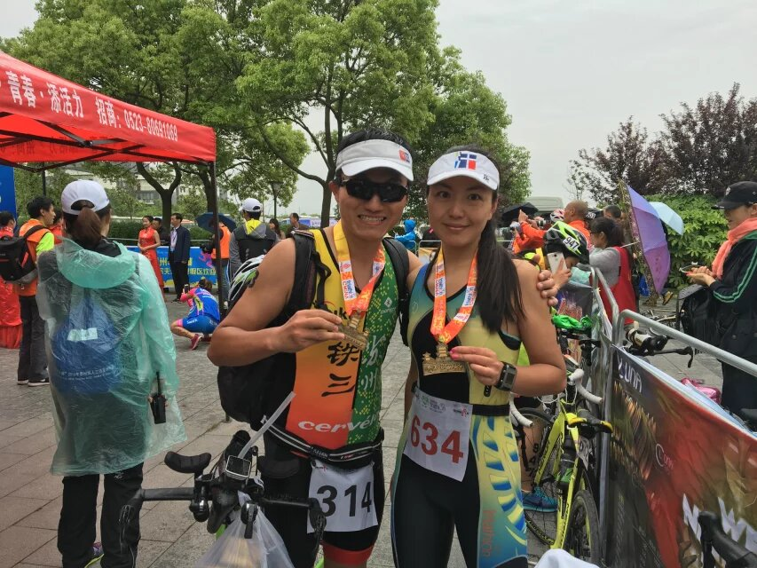