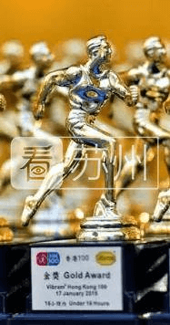

【看苏州专稿 文/雨舟】

1月27-28日，跑界备受关注的香港100km越野赛举行，早晨8:00多分批开赛。

据小编掌握的情况，2018HK100苏州越野圈仅娄明明、gusu刘、小苹果3人参加，其中娄明明以23小时42分钟完赛，得到“小铜人”奖杯（24小时内完赛）；而后两者因为伤痛提前退赛。
<!--more-->

资料图

在这世界上，你也许无法再找出第二条百公里的越野赛道，能够像香港100公里越野赛一样，将城市与山野如此美妙地融合在一起。HK100整个赛道以麦理浩径为主线，穿插了多个景区，总爬升4500米，风光优美，参赛者要求30小时内完赛。HK100在亚洲跑圈享有极高的知名度，由于赛事不设门槛，报名者多。

前几届2位港百小金人获得者 左：小虫 右：阳光

小金人奖杯

苏州跑界与港百也算有渊源了，前几年每年参赛者要10人左右；其中小虫、阳光还获得“小金人”奖杯 （ 16小时内完赛） 。然而近2年，港百中签率越来越低，导致苏州参赛者寥寥无几。

娄明明，今年28岁，非常年轻，喜欢看电影、阅读、旅行等。2013年来到苏州，做IT程序员工作，一开始因为减肥而跑步、跑马拉松，自己也没想到，运动由此成为他最大的爱好。2014年又喜欢上了越野，虽然，50km+赛事完赛的赛事非常少。

“不过，跑马的人，必须要跑个百公里，人生才算完整！”娄明明说。

其实，娄明明在2016年跑过HK100，但那一年，香港大帽山出现了罕见的冰雪天气，赛事提前中断，娄明明跑了71公里。“那一年，自己实力也不够，加上天气原因，没能完赛，非常遗憾！”

2016年HK100冰滑情形

“应该说，2018HK准备不够充分，HK100在越野界很知名，但难度不算太高。当然，前提是平日要有足够的训练量”娄明明承认自己每个月跑量还是不足200km，训练量明显不够。

虽然没有给自己定较高的要求，最主要是安全完赛，但100公里仍是不小的挑战。娄明明说，“这次前半程完全没问题，但后半程都在夜间，犯困，体力不支，最大的困难来自肠胃不舒服，有些痛。”

“吃了不少含咖啡因的能量胶、饮料，好歹算是熬过来了。这次拿到了小铜人，自己还算满意！”

用了将近24小时，28日早晨近8点，赛事完成，娄明明显得很高兴。“这是我完成的人生首个100km!”

苏州小伙伴越野

小编问他有没有遗憾，他反而幽默地说，苏州这几天雪下得很大，“本来可以和大家一起在雪中尽情耍耍，去野一野、嗨一嗨，多好玩呀！”

值得一提的是，娄明明有一件值得夸耀的事——

2015年娄明明继越野之后，喜欢上了铁三，经过2年左右的训练、赛事，于去年4月29-30日在台湾勇敢挑战并完成了铁人三项中最难的226km大铁（游泳3.8km+骑车180km+跑步42.195km）。铁人，也只有完成了226km大铁的极限挑战，才称得上是一名Ironman!

“运动改变了我的生活，最根本的是自己的心态发生了重大的变化。”去年末，这位“程序猿”彻底告别了夜猫子的工作和生活，追逐自己的健康人生，工作也换成了在运动领域中创业发展。“做自己喜欢的事，让喜欢的事有意义！”

什么是美好的生活？“我以前肯定认为是财富和成功，现在则认为，身体健康，与家人能有时间经常在一起，这很重要！”娄明明说。