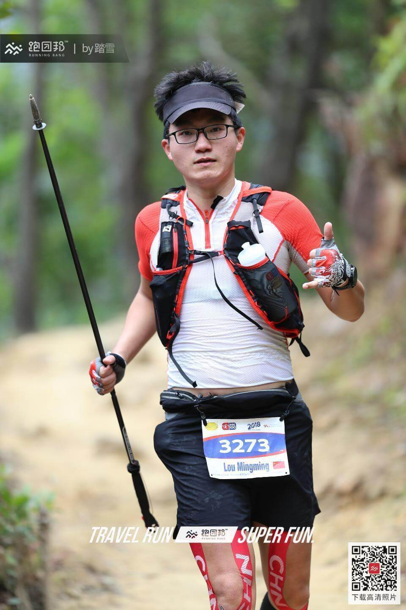

## 背景
2016年HK100遗憾止步于CP7，心有不甘。

2017年摩拳擦掌，但抽签难度大增，未能中签参赛。

2018年，决定直接抢购慈善名额，再次挑战HK100，终于圆梦，以下是当时的赛后回忆。

<!--more-->
## 起点
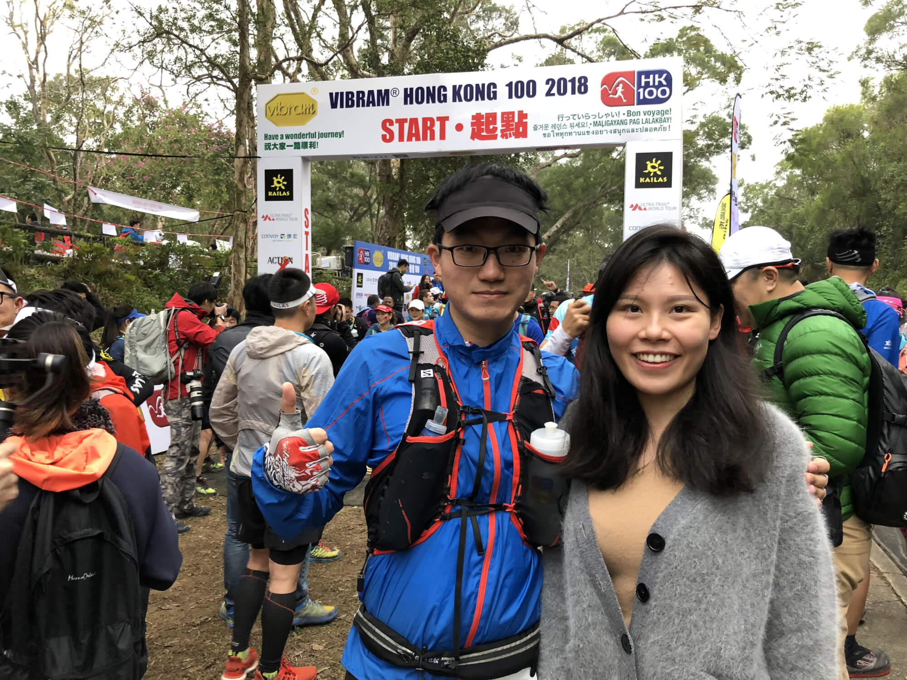

- 出发比较吃亏，山路堵车（视障跑者），以后报名的时候要往前排
- 路跑稍微用点劲

## SP-东坝
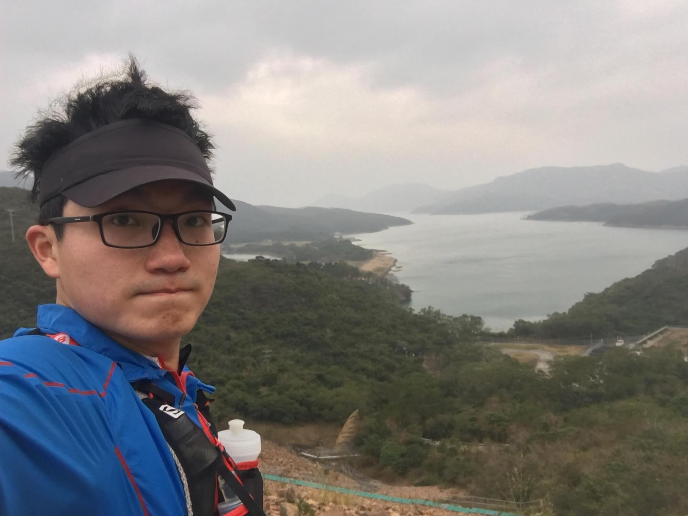
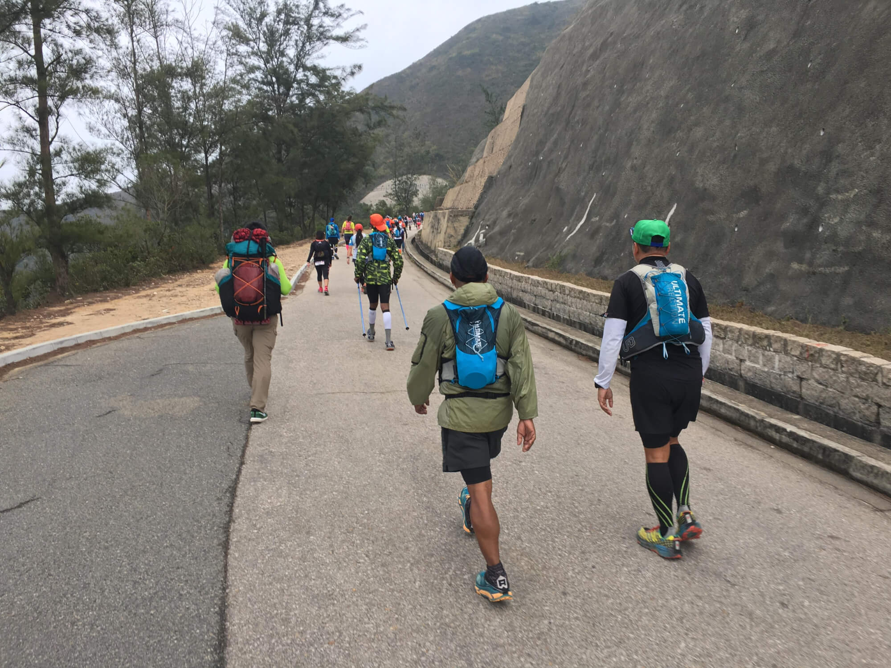

- 乐事+杏脯

## CP1-咸田湾
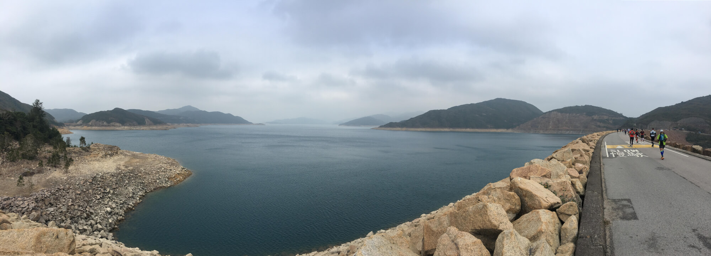
- 过了沙滩就到，没停太久

## CP2-黄石码头
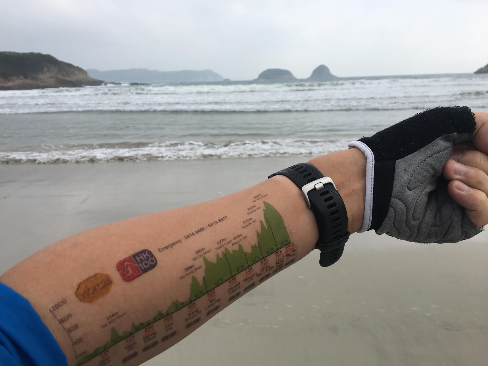

- 大站
- 换袜子（沙滩进沙+磨脚）
- 水果 + 坚果

## CP3-海下

- 2016年这里没有喷雾剂
- 味增汤太好喝了，喝了两碗，袜子外面又加了一层，舒服多了

## CP4-榕树澳
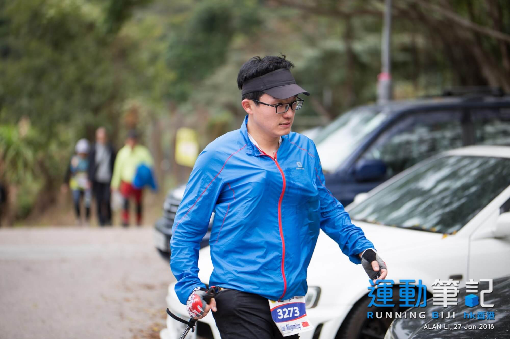

- 小站，感觉和前年位置不同了
- 喝茶提神，太烫，加冷水
- 吃水果/坚果
- 坐下来休息

## CP5-企岭下
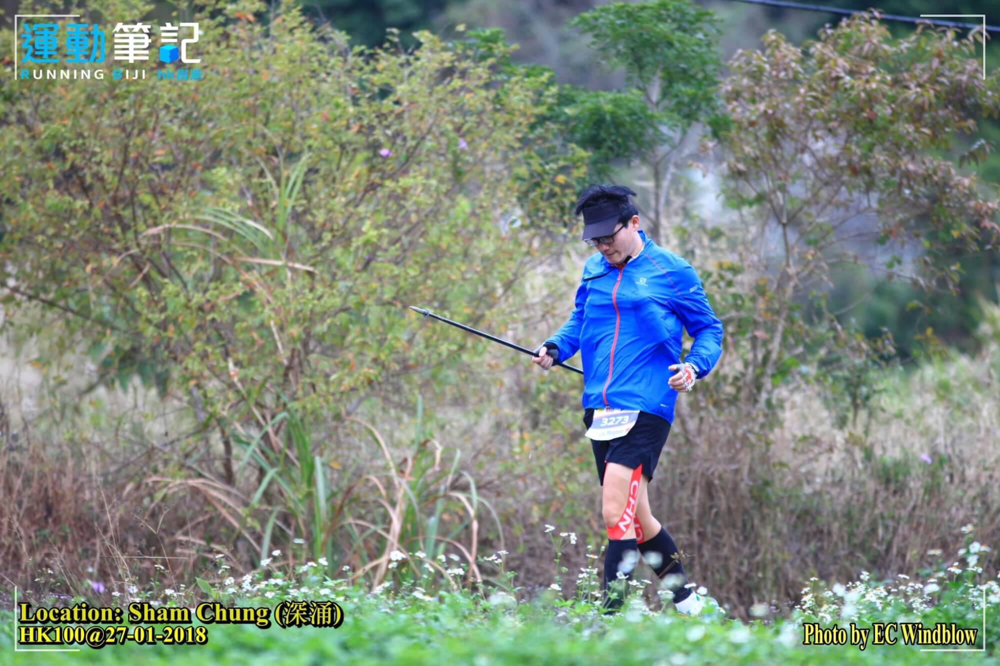

- 停留的约45分钟，时间消耗有点多
- 拿包，小孩不靠谱找了半天，应该直接找大人
- 换袜子，换衣服，衣服方案有三种
    - 1. 快干衣+硬壳
    - 2. 保暖上衣+硬壳
    - 3. 压缩衣+硬壳
- 吃热食
    - 水杯
    - 一次性杯子
- 手表充电
    - 从约50%充满到100%，后半程不需要带手表充电线了
- 创口贴（大拇指）
- 没带压缩长裤裤，失误了，考虑换装包里现有的装备，想到了3种备选方案：
    - 1. odle保暖裤+压缩腿套
    - 2. 探路者冲锋裤
    - 3. 继续短裤+腿套
    - 方案2太重，跑不起来，适合冷天气；方案1还行，夜里没雨水影响不大，大雾可能稍微有点问题；方案3可能比较冷，作罢
- 给家人打电话报平安
- 前半程装备总结
    - 辛亏带了单杖，要不然累死，若是双杖可能会快不少
    - 充电宝完全多余，基本离线，到了CP5还剩50%的电
    - 没带耳机，也不算什么损失，至少手机省电了
    - 袜子没选好，应该起点就上防水泡的
        - 备用袜子救了一命，要不然水泡疼死人
## CP5-6
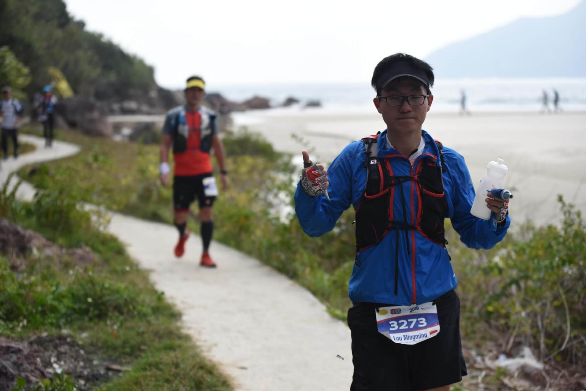

- 刚出CP5没多久就遇到了强制装备检查
    - 手机，求生毯，头灯
    - 我求生毯的位置正好在背包后面，不用取出来就能摸到，节省了时间
- 马鞍山山顶风很大，很多选手都停下来加衣服，我直接把拉练拉好就行，节省了时间
    - 13公里，准备了3壶水，只喝完两瓶

## CP6-基维尔营

- 加袜子

## CP7-笔架山
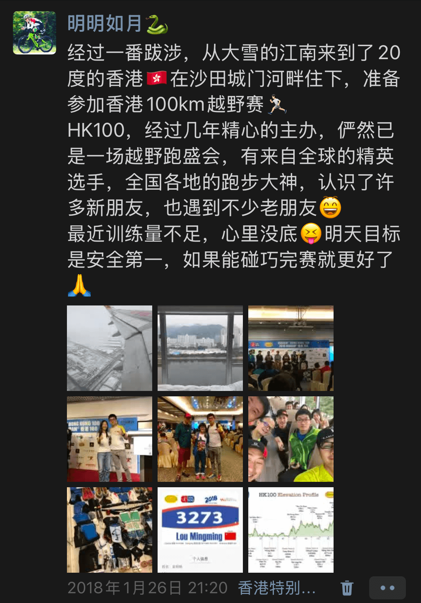

- 2016年止步于此，踏过这里，终于又超越了自己
- 拿福字

## CP8-城门水塘
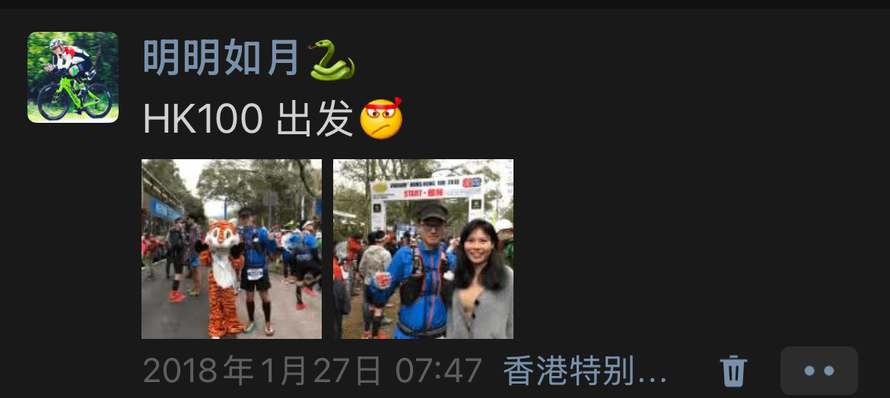

- 时间有点紧张，吸取CP7停留时间过长的教训，只灌了一杯可乐，一壶水，吃了几口橙子+坚果就上路了

## CP8-CP9
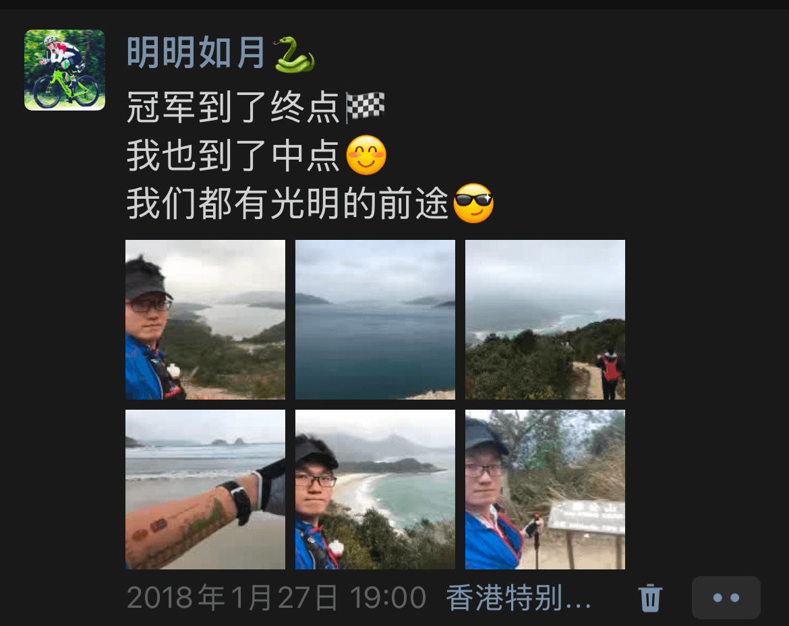

- 走了一段，在灯光下调整装备
- 换头灯电池，新的3节电池明显亮一些，为后来山顶大雾中辨别方向提供了有力帮助

## CP9，铅矿坳
- 感觉时间有点紧，几乎没作停留
- 倒掉了所有可乐（肠胃不舒服，喝不下去）
- 灌满两杯矿泉水
- 大约2分钟就出站了

## CP9-终点-大帽山扶轮公园
- 爬山的路上不断扔装备，减轻重量（变成道具赛了）
    - 右手全指手套，CP5开始携带，一直没用
    - 抓绒保暖帽子，CP5开始携带，一直没用
    - 优极的水壶，CP9把可乐都倒了，放在了背包后面，这里想到有点重量，而且组委会又发了一个，所以就扔掉了，后来到了终点，因为没有杯子，吃不了泡面，只能喝水和可乐，很郁闷
- 连续吃能量胶
    - 因为没运动饮料和可乐了，能量胶几乎是唯一的能源和提神工具，刚爬山吃了一个，大帽山爬到一半的时候又吃了一个，虽然肚子不舒服，但还是得强迫自己吃，保证能量和精神
- 原以为能在大帽山顶看到早上的日出，但是雾太大，全是水汽

## 终点
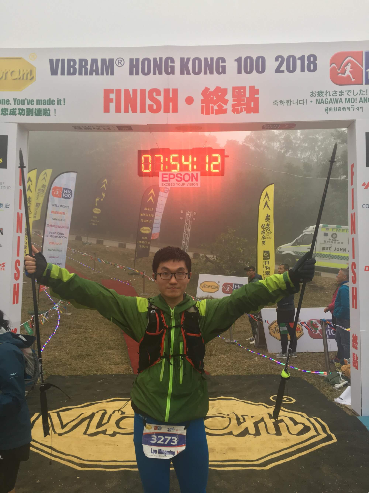

- 一直掐着表看时间，目的是在24小时内到达终点，最后早上7点42分到达终点，总耗时23h42m，很开心，拿到了小铜人，冲线的那一刻，很满足！

## 总结
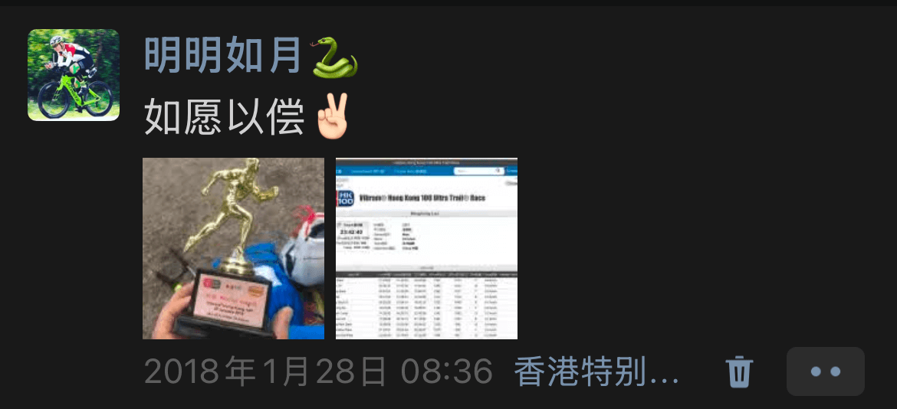
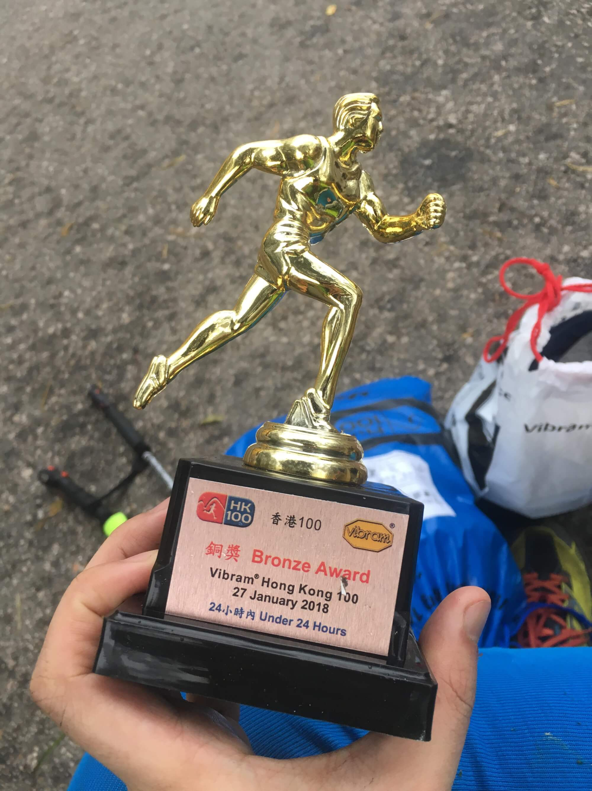

- 能拿小铜人，很开心，有拿银人实力之前，不去买慈善名额了
- 越野过程痛苦，回忆起来很美好
- 港百地面太硬，脚底板痛
- 这次吸取了很多上次的教训，比如上次每个cp点都发朋友圈，这次路上只在CP5发了一条，节约了不少时间。
- 这次路上拍的照片也远远少于上次，可能是少了新鲜感，尤其是后半程，夜里和早晨，几乎没几张照片，节约了不少时间。

## 港百照片寻找

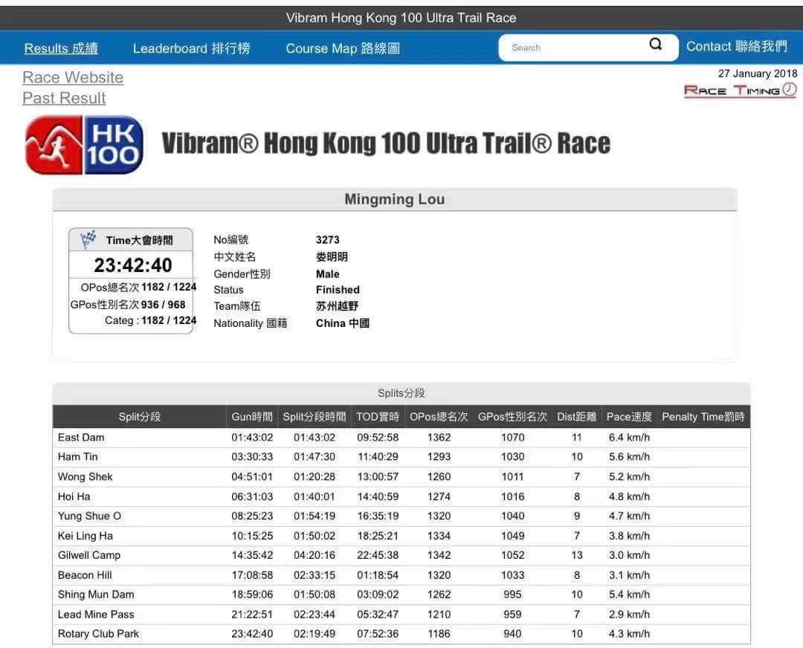
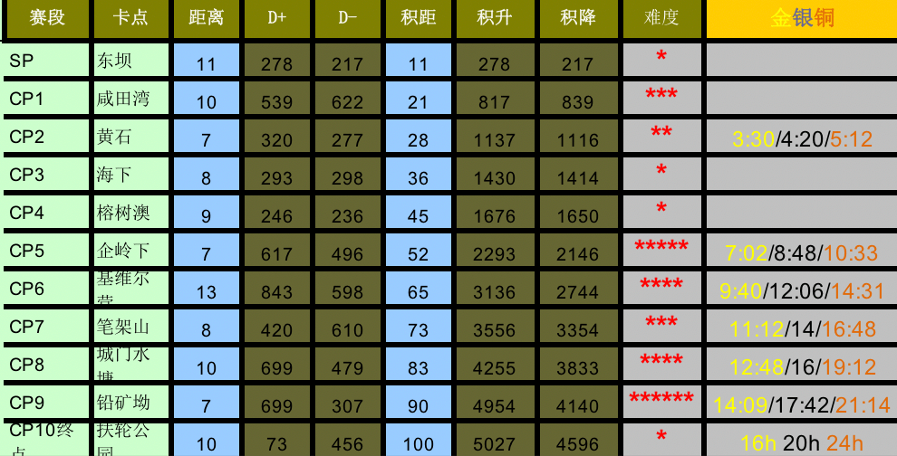
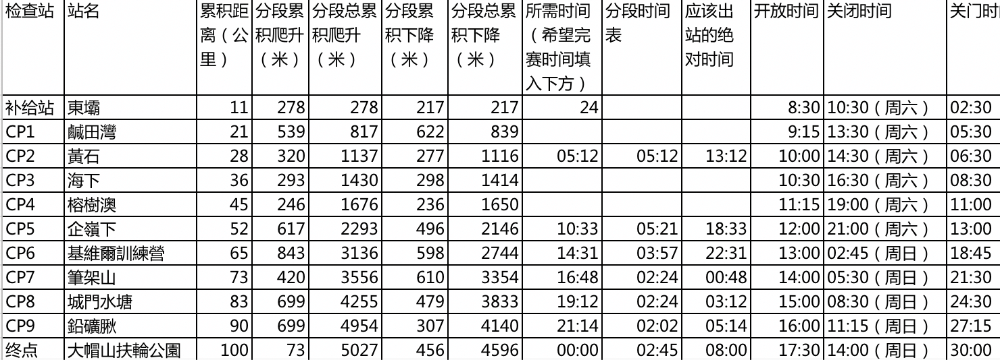

- 跑团帮
- 运动笔记
- Facebook
- （时隔多年，在2025年再看，脸书和运动笔记的照片都还在，原始链接都还能打开，但是内地的几个网站，很多都打不开了）