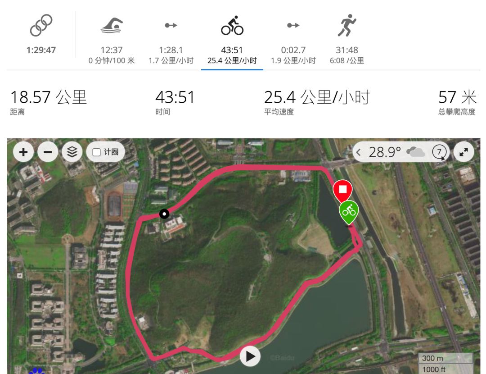
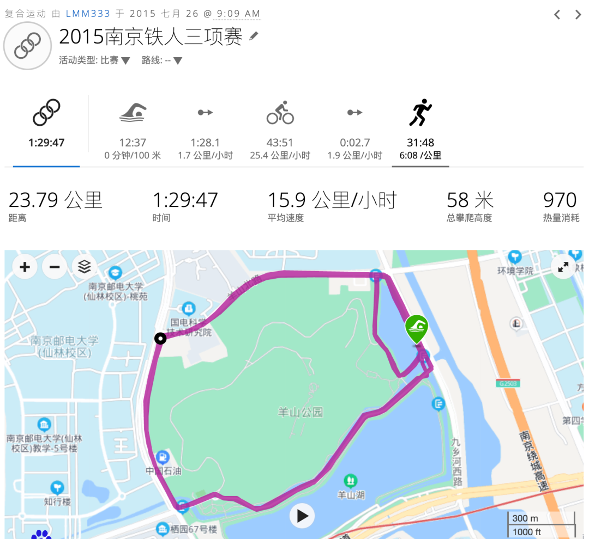

> ## Excerpt
> 我的首场铁人三项比赛，南京羊山湖训练赛的记录

---
上一篇[《如何备战第一场铁人三项比赛》](http://mp.weixin.qq.com/s?__biz=MzkxMzM0MTQyNg==&mid=2247483697&idx=1&sn=3c84ee525668b873dc9a75296a329760&chksm=c17e6facf609e6bab01feb14db3efb23b5b492e4328a87f6286431edae5f3980a6286ebc4ebd&scene=21#wechat_redirect) 中写了我的主要铁三比赛经历，2015是我的铁三元年，循序渐进，依次完成了训练赛，半程奥运标准距离的中铁协比赛，奥运标准距离的商业赛，突破了自己的边界。

<!--more-->
最近计划通过连载的方式整理这些比赛的经历，这篇是我的首场铁人三项比赛：南京羊山湖训练赛的记录：

2015年7月26日，周日，南京时而烈日炎炎，时而突降阵雨。几个月的独自训练之后，我在仙林大学城的羊山湖公园参加了人生首场铁人三项比赛。

比赛由南京市铁人三项协会主办，主题是“全国铁人三项青少年夏令营”，主要是短距离的青少年组比赛，另外也邀请了数十位江浙皖的铁三爱好者，组织了一场长度约等于半程奥运标准距离的成人组比赛。

夜里面没太睡好，估计一两点才睡着，可能是平时睡得都太晚了吧。

6:00 闹铃，起床，早餐两个包子

6:30 对着昨晚写的清单收拾好比赛装备，下楼，装自行车车，只拆了前轮，后轮不太会拆，后备箱放不下，只能把龙头露在外面，地库里找了根绳子把自行车后后备箱盖子拴好。

7:00 父亲开车出发， 我坐前排，母亲，表姐和外甥女坐后排

7:50 导航到达羊山湖公园，一开始没找到，问了路边的车手才发现

8:00 卸车，换装， 检录，我是34号

8:15 肚子有点虚

8:30 裁判长开始讲话，内容包括领导介绍，比赛规则介绍，一起做热身操，大合影等

  
赛前热身照片

## **游泳**

9:00 第一组1-12号正式下水，两分钟后13-24号下水。前两组都是比较厉害的选手，几乎全是自由泳起步，冲得都挺猛。一圈下来之后几个排后面的选手都换成了蛙泳，这也降低了我的压力（刚学自由泳）。

9:10 第三组25-36号下水，我也在里面，和我同组的很多都是仪征冬泳队的，穿着胶衣，只有三个人赤膊上阵，我是其一，我带了泳裤/骑行裤/跑步裤，感觉后面换衣服会不方便，直接穿骑行裤游泳了。提前一两分钟下水适应水温，随后裁判员哨响，比赛开始，仪征冬泳队的高手都自由泳直接划出去了，我实力不济，又怕被踢到，就等了几秒才出发，蛙泳前进，游了一会儿想换自由泳，但效果不济，膀子好累，又换回蛙泳了。

游泳的过程平淡无奇，羊山湖的水比象山水库清澈，能见度2米左右吧（象山水库大概1米多）

游了一会儿，基本稳定之后，脑子里开始想教练说的各种姿势要领，降低划幅，多漂一些距离的策略。

大概游到80%的距离时被两分钟后出发的女子组第一名超过，我提了点速度，但完全跟不上，最后上岸时落后超过50米吧。

游的时候也套了最后的女子选手一圈，有个选手比较吃力，一直在抓救生圈。

（下图中间携带蓝色跟屁虫是我）

## **骑车**

游泳上岸后换项比较顺利，因为父母观赛，有了场外协助，上岸后立即就换上了眼镜，穿了骑行服，换了跑鞋（没锁鞋），比较遗憾的是为了节约时间没有穿袜子，回家之后双脚后侧都磨烂了。

刚开始骑车，果然腿部没什么力量，尝试高踏频适应，效果还不错。

自行车线路是绕圈5圈，没封路，但也不过红绿灯，路上汽车不算太多，有几个缓坡，回家后看了落差5米，还比较安全，唯一挑战是有几个处地上全是水的S弯，比较湿滑，我怕受伤，基本都是慢速通过。

我骑的是老爸的山地车，其实我好久没骑山地车了，最近一直是公路车+光头胎的折叠车，一开始也有些不适应，一直在被铁三车/公路车选手套圈，第二圈的时候被女子组第一追上，第三圈又被女子组第二追上，女子组第二骑的是和我一样的ATX777，我跟了一会儿就被拉暴。

骑车阶段只超了几个坏车的选手，还有游泳在我前面的胖大叔，也被女子组前两名超掉。

学到不少经验，比如90度的直角弯怎么过，高手都是先往外面绕个大弧线切过，而我则是直行到弯口刹车减速通过，浪费速度和体力。高手都是有休息把的，车子也都是碳纤维的，差距啊。

骑车的时候把水壶里3听红牛喝完了，还吃了3个士力架。

换项2没花太多精力，没换快干衣，车子一扔，直接穿骑行服跑咯。

## **跑步**

换项果然痛苦，一开始腿软得发飘，根本跑不动，不过没停下来走路，坚持跑，全程基本都是坚持跑下来的，手表上的统计只走了3秒，印象里估计是走了10米左右。

第一圈还超了几个跑步慢的选手，也被高手超过，从第二圈开始，完全就是一个人在跑（高手都完赛了），有个姐姐一直跟在我后面10-20米，我的配速逐渐从5:30掉到6:30，一直没追上或是掉队，后来她是女子组第三，有奖杯的呢~

## **完赛**

10:40 冲线，1h30min完赛，成绩比想象中好，但和高手还是有较大差距，第一名59min，第20名1h13min，一共46个男选手。

具体看：游泳600米花了15min，100m配速是2.5min，比平时在独墅湖游泳馆训练时3min/100m快一点

换项1用了1min30秒，有赖父母帮助

骑车19公里用了44min，均速25.41km/h，这是用山地车骑出的成绩，以后换公路车还会有提升吧~

跑步5.18km 用了32min，配速6m5s，比平时自己训练跑步时稍快，跑步是我最弱的项目，能坚持下来很痛苦，不过也没拼了老命跑。

## 总结：

1. 半铁是很适合自己目前能力的距离，完赛不那么痛苦，也有机会突破自己，赛后基本不会出现伤病的情况。

2. 阳光下挥洒汗水的感觉太美妙了，赛后一直处于兴奋之中

3. 感谢父母，表姐，外甥女的陪伴观赛。不与父母诉说训练的痛苦，只和他们分享成功的喜悦，感觉好极了~

4. 赛场见到了很多周边城市的铁友，当时是第一次见，但是在随后的几年里，大家经常在周末的各种赛场相遇，赛前的晚宴成为了叙旧的圣地。

男子/女子组颁奖仪式（当时不认识，后来参赛多了，发现都是国内叱咤风云的铁人，颁奖台常客）

这是明明如月公众号的第003篇推送，感谢你的阅读，欢迎点击下方名片关注。
