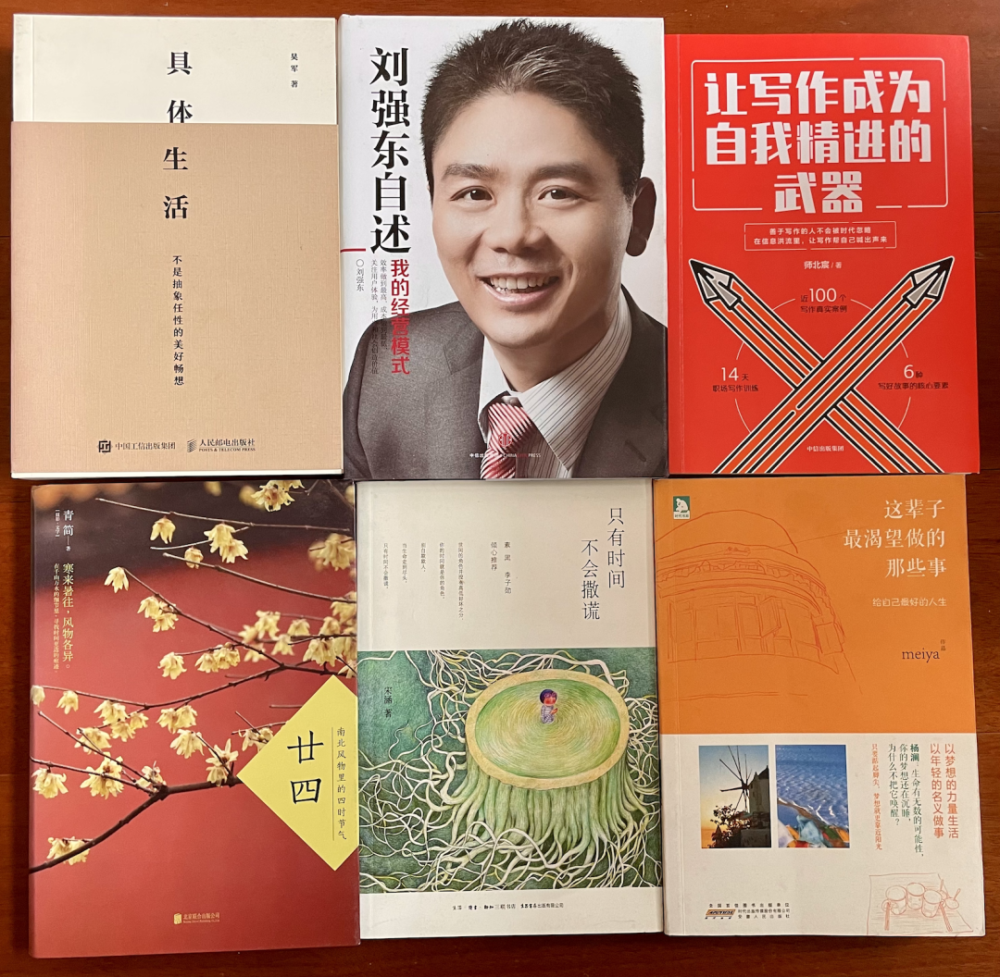
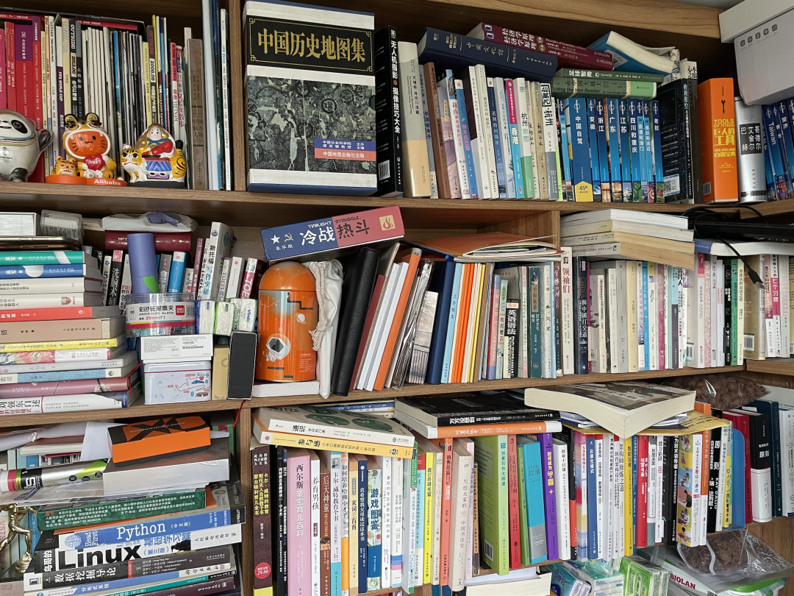
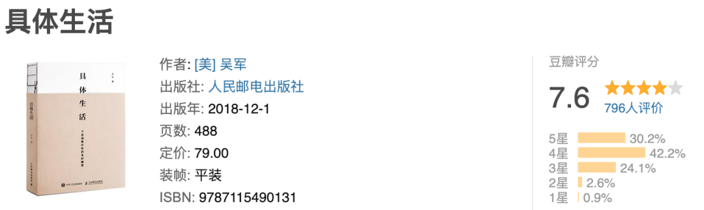
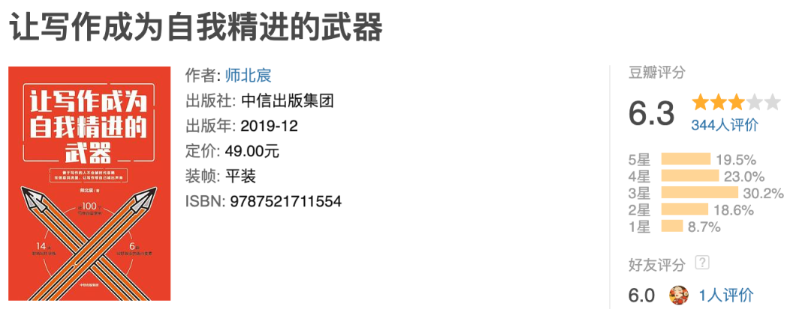
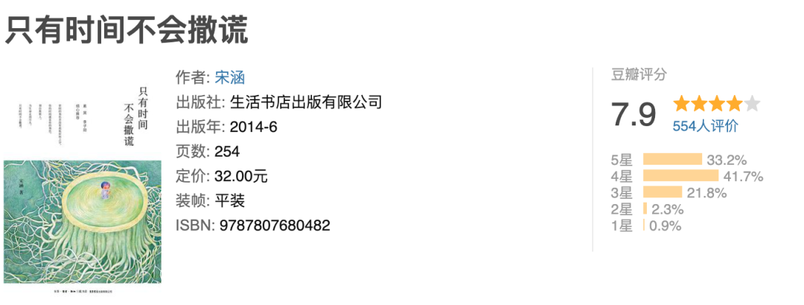
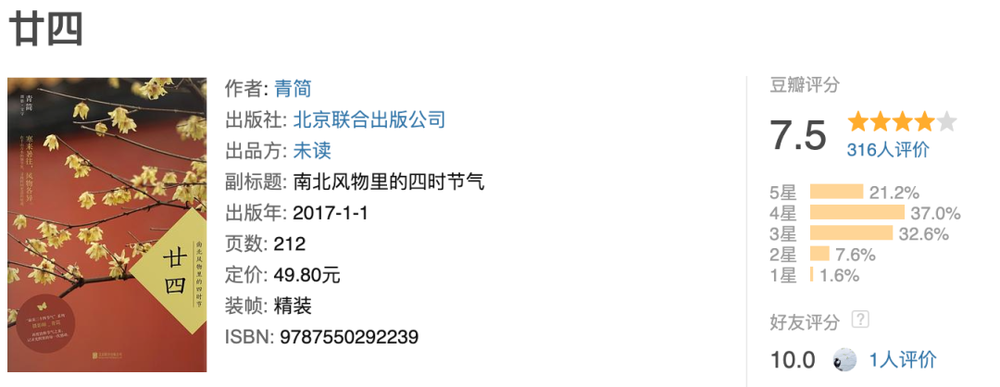
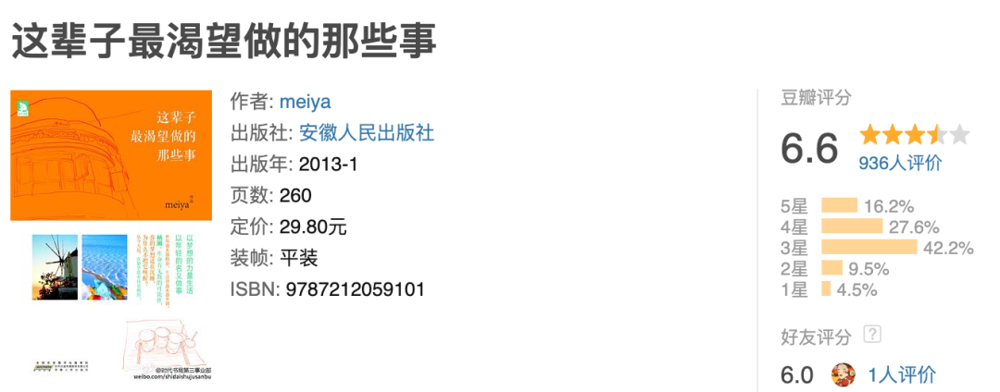

> ## Excerpt
> 10月共读完6本书，纸质书6本，电子书0本

---
10月共读完6本书，其中纸质书6本，电子书0本，电子阅读让书籍获取变得容易，翻开的多，但是读完的少。
<!--more-->
1.  《廿四 : 南北风物里的四时节气》
2.  《刘强东自述 : 我的经营模式》
3.  《只有时间不会撒谎》
4.  《让写作成为自我精进的武器》
5.  《具体生活》
6.  《这辈子最渴望做的那些事》

10月买书一本，是个诗经的字帖，购于龙湖西溪天街的西西弗书店。

家里书架里外放了两层，已经放不下了更多书了😭

为了快速清库存，以迎接即将到来的双11采购，本月尝试从书架上随机取几本看得顺眼的书，然后找一本能看得下去的，花一两天时间翻完，效果还不错。

图：书架现状

## 1

书名：《具体生活》

作者：吴军

豆瓣评分：7.6 https://book.douban.com/subject/30356082/

我的评分：★★★★

出版日期：2018-12

购买日期：2019年4月23日购于京东

工作和生活如何平衡，吴军老师给了大家答案。这本书有七大主题，包括旅行，博物馆，读书，音乐，摄影，美酒，奢侈品，原载于日更专栏《硅谷来信》，聚沙成塔，积少成多，每天的专栏写了几年，汇总起来就是很多本不同主题的书，太棒了。比较让我感叹的是高中生书单和大学生书单，大部分我都没读过，而吴军同时期都读过，这就是差距啊。

## 2

书名：让写作成为自我精进的武器

作者：师北宸

豆瓣评分：6.3 https://book.douban.com/subject/34911222/

我的评分：★★★

出版日期：2019-12

购买日期：生财有术9月抽奖

书名叫写作，但内容里写作的具体技巧只占很少一部分，大部分在描述写作的好处。作者读过很多书，旁征博引，更像是一本精进手册。内容不算连贯，有点像公众号短文汇总。

## 3

书名：只有时间不会撒谎

作者: 宋涵

豆瓣评分：7.9 https://book.douban.com/subject/25901703/

我的评分：★★★

出版时间：2014-06

购买日期：2014年7月8日购于京东

14年6月出版的图书，14年7月购买并在豆瓣标记了想读，22年国庆终于翻完了。女性主义的内容，如今我已兴趣阑珊。

## 4

书名：《刘强东自述 : 我的经营模式》

作者：刘强东

豆瓣评分：8.0 https://book.douban.com/subject/26801556/

我的评分：★★★

出版时间：2016-6

购买时间：2020-10-31购于京东

## 5

2016年6月第一版。内容挺诚恳的，主要讲经营模式，封面的几行小字非常的概括：效率做到最高，成本做到最低，关注用户体验，为用户和社会创造价值。对经营的各方面都做了介绍，让读者了解刘强东对行业的判断，个人做事的风格，京东的人才观，价值观等。这本书在我的书架放了两年，在出版的第6年我才看到，书中说京东和腾讯合作后，微信里电商的流量转化率提高了一倍，可是这本书出版之后的一两年，拼多多强势崛起，把微信流量的转化率又提高了很多倍吧？

**5**

书名：《廿四 : 南北风物里的四时节气》

作者：青简

豆瓣评分：7.5 https://book.douban.com/subject/26925487/

我的评分：★★★

出版日期：2018年7月

购买日期：2017年购于苏州诚品书店

2017年在苏州诚品书店里买的，2022年才集中读完。文字很淡雅，摄影也很清新，需要一个没有压力的安静午后，才能读得进去。作者常常引用古文里的句子，从景物中探寻曾经的样子，多读书，可以多体会古人的意境呀～

## 6

书名：这辈子最渴望做的那些事

作者：meiya

豆瓣评分：6.6 https://book.douban.com/subject/20432499/

我的评分：★★★★

出版日期：2013-01

购买日期：购于2013年，来源未知

人在不同时期会有不同的陪伴读物，作者meiya是豆瓣写手，这本书主要是豆瓣日记的分类汇总。谈梦想，谈职场新人的生活，谈旅行，谈用零碎时间提高自己等。现在看来，内容有点浅，有点天真，但在出版和购买2013，我是大四毕业刚工作的新人，喜欢刷豆瓣和人人网，迷恋正能量，对生活充满幻想，meiya以过来人身份写的这本书正合我口味，甚至我在豆瓣自我介绍里的大段文字，也是在模仿meiya姐。如果按照现在的标准，只能给三颗星，多一星给当年的自己吧。

写到这里，发现自己本月读的书豆瓣均分只有7.35，下个月争取读点高分的，提高一下品味😄

读完的书原计划卖给多抓鱼，结果3本不收，另3本收购价太低（均价2.4元），最后决定在我的社群里抽奖送掉。上个月抽奖送了几本新书，这个月送上面几本二手书。

欢迎加我微信lmmsoft(备注读书)，拉你进我的社群，免费🆓

这是明明如月公众号的第004篇推送，感谢你的阅读，欢迎点击下方名片关注。
