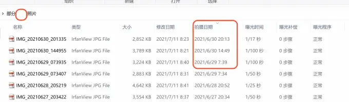
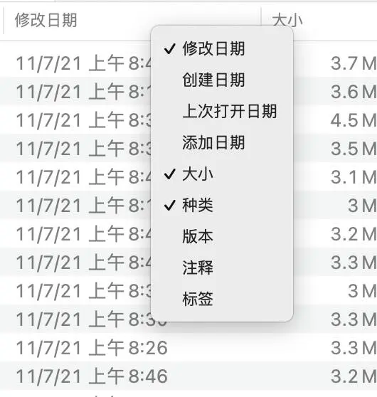
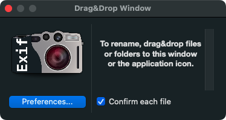
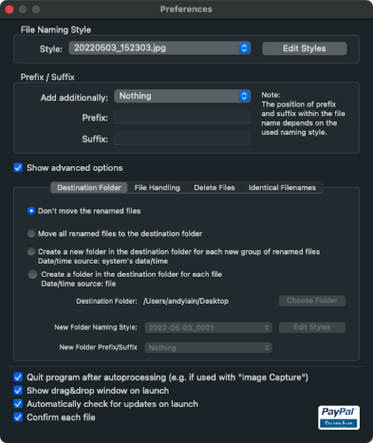

整理照片的时候，按照拍摄时间排序，是很常见的需求。

Windows 系统很方便，文件管理器里可以自定义列，轻松实现根据照片 Exif 信息里的拍摄时间进行排序。

MacOS 也有排序功能，但自定义的列非常少，只能根据文件的创建时间，而不是 Exif 信息的拍摄时间。

这样会导致一个问题，如果你把照片拷贝到电脑，那么照片的创建时间就是文件拷贝的时间，而不是拍摄的时间。

那么 MacOS 是否有原生的方法在 finder 里按照照片拍摄时间排序呢？
<!--more-->
经过一番搜索，结论是，**不行！**

要么使用 Photos 应用，想要在 finder 里使用就必须通过第三方工具！

推荐的免费工具：EXIF Renamer
- 官方网站： [https://www.qdev.de/?location=mac/exifrenamer](https://www.qdev.de/?location=mac/exifrenamer)
- 下载地址： [https://www.qdev.de/download.php?file=ExifRenamer.dmg](https://www.qdev.de/download.php?file=ExifRenamer.dmg)

特性（一句话总结：麻雀虽小，五脏俱全）：
- 免费
- 可以自定义文件名格式，比如我是 [时间 + 原始文件名]
- 可以批量重命名
- 支持拖拽

我使用的参数如下:
> %P%Y-%M-%D_%h-%m-%s%S_%o%C%F

解释： 前缀_年-月-日_时-分-秒_后缀_旧文件名.扩展名

参考资料：
- https://discussions.apple.com/thread/251162651
- https://meta.appinn.net/t/topic/24837
- https://www.qdev.de/?location=mac/exifrenamer
- https://blog.andylain.com/2022/05/mac-exif-renamer.html