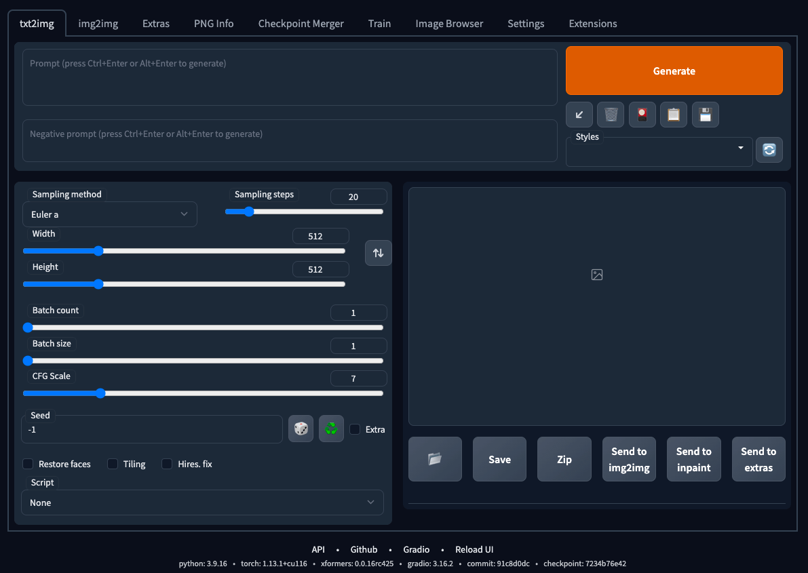

今晚动手学习了用谷歌colab生成AI小姐姐，记录一下过程。

<!--more-->
前置条件：科学上网

## step1
- 打开谷歌的网址：https://colab.research.google.com/
- 连接机器
- 选择GPU


## step2: 安装
- 开启新的jupyter notebook窗口
- 创建code, 输入以下安装命令，点击左上角运行
```shell
!git clone https://github.com/AUTOMATIC1111/stable-diffusion-webui
!git clone https://github.com/yfszzx/stable-diffusion-webui-images-browser /content/stable-diffusion-webui/extensions/stable-diffusion-webui-images-browser
!curl -Lo chilloutmixni.safetensors https://huggingface.co/nolanaatama/chomni/resolve/main/chomni.safetensors
!curl -Lo ulzzang-6500.pt https://huggingface.co/nolanaatama/chomni/resolve/main/ulzzang-6500.pt
!curl -Lo koreanDollLikeness_v10.safetensors https://huggingface.co/duthanhduoc/chilloutmix-set/resolve/main/koreanDollLikeness_v10.safetensors
!mkdir /content/stable-diffusion-webui/models/Lora
!mv "/content/koreanDollLikeness_v10.safetensors" "/content/stable-diffusion-webui/models/Lora"
!mv "/content/chilloutmixni.safetensors" "/content/stable-diffusion-webui/models/Stable-diffusion"
!mv "/content/ulzzang-6500.pt" "/content/stable-diffusion-webui/embeddings"
%cd /content/stable-diffusion-webui
!git checkout 91c8d0d
!pip 22.0.4 from /usr/local/lib/python3.9/dist-packages/pip (python 3.9)
!COMMANDLINE_ARGS="--share --disable-safe-unpickle --no-half-vae --xformers --reinstall-xformers --enable-insecure-extension-access" REQS_FILE="requirements.txt" python launch.py

```
- 安装完成后，会出现一个网址，格式是 xxx.gradio.live 点击网址,进入stable diffusion的web ui，如下图所示




## step3: 生成AI小姐姐
- 在左上方的两个文本框里输入正面和负面提示词
prompts(正面提示词): 生成的小姐姐的描述，比如：小姐姐，你好漂亮，我喜欢你
```
<lora:koreanDollLikeness_v10:0.35>,best quality ,masterpiece, illustration, an extremely delicate and beautiful, extremely detailed ,CG ,unity ,8k wallpaper, Amazing, finely detail, masterpiece,best quality,official art,extremely detailed CG unity 8k wallpaper,absurdres, incredibly absurdres, huge filesize , ultra-detailed, highres, extremely detailed,beautiful detailed girl, extremely detailed eyes and face, beautiful detailed eyes,light on face,(Hanfu:1.1),1girl
```
Negative prompts(负面提示词): 生成的小姐姐不希望出现的描述，比如：小姐姐，你好丑，我不喜欢你
```
sketches, (worst quality:2), (low quality:2), (normal quality:2), lowres, normal quality, ((monochrome)), ((grayscale)), skin spots, acnes, skin blemishes, bad anatomy,(long hair:1.4),DeepNegative,(fat:1.2),facing away, looking away,tilted head, {Multiple people}, lowres,bad anatomy,bad hands, text, error, missing fingers,extra digit, fewer digits, cropped, worstquality, low quality, normal quality,jpegartifacts,signature, watermark, username,blurry,bad feet,cropped,poorly drawn hands,poorly drawn face,mutation,deformed,worst quality,low quality,normal quality,jpeg artifacts,signature,watermark,extra fingers,fewer digits,extra limbs,extra arms,extra legs,malformed limbs,fused fingers,too many fingers,long neck,cross-eyed,mutated hands,polar lowres,bad body,bad proportions,gross proportions,text,error,missing fingers,missing arms,missing legs,extra digit, extra arms, extra leg, extra foot,
```
- 下方 Sampling method 选择 DPM++ SDE Karras
- Width 选择 512, Height 选择 768, CFG Scale 7 
- 右边 Batch count 1, Batch size 1 
- 点击Generate，不到一分钟，就可以看到生成的小姐姐了

