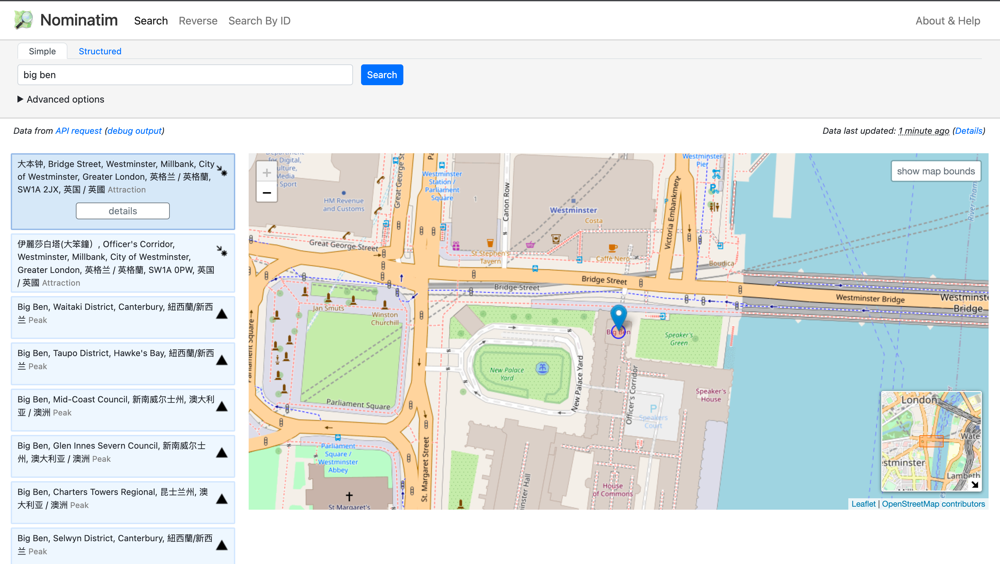

# Part1: Nominatim(OpenStreenMap/OSM)

晚上调研了一下地理信息的API，发现了一个很好用的API: Nominatim
- 可以根据地址查询详细信息（包含经纬度，各种人类语言的名称，邮编等等）
- 还可以根据经纬度查询同样的详情信息

## 数据源
数据来源是 [OpenStreetMap](https://www.openstreetmap.org/) ，一个开放的地图数据项目

[Nominatim](https://nominatim.openstreetmap.org/ui/about.html) 是OpenStreetMap的搜索引擎

该API由Nominatim提供，[官方 API 文档](https://nominatim.org/release-docs/develop/api/Overview/)

## 使用举例
<!--more-->
### 根据地址查询
- 文档
  - https://nominatim.org/release-docs/develop/api/Search/
- 以查询查询 英国大本钟 "big ben" 为例
- 网页体验：
> https://nominatim.openstreetmap.org/ui/search.html?q=big+ben


- API地址
> https://nominatim.openstreetmap.org/search?q=big+ben&format=json&polygon_geojson=1&addressdetails=1
- API返回：
```json
[
  {
    "place_id": 16357159,
    "licence": "Data © OpenStreetMap contributors, ODbL 1.0. https://osm.org/copyright",
    "osm_type": "node",
    "osm_id": 1802652184,
    "boundingbox": [
      "51.5006542",
      "51.5007542",
      "-0.1246221",
      "-0.1245221"
    ],
    "lat": "51.5007042",
    "lon": "-0.1245721",
    "display_name": "大本钟, Bridge Street, Westminster, Millbank, City of Westminster, Greater London, 英格兰 / 英格蘭, SW1A 2JX, 英国 / 英國",
    "class": "tourism",
    "type": "attraction",
    "importance": 0.5169301795209977,
    "icon": "https://nominatim.openstreetmap.org/ui/mapicons/poi_point_of_interest.p.20.png",
    "address": {
      "tourism": "大本钟",
      "road": "Bridge Street",
      "quarter": "Westminster",
      "suburb": "Millbank",
      "city": "City of Westminster",
      "ISO3166-2-lvl8": "GB-WSM",
      "state_district": "Greater London",
      "state": "英格兰 / 英格蘭",
      "ISO3166-2-lvl4": "GB-ENG",
      "postcode": "SW1A 2JX",
      "country": "英国 / 英國",
      "country_code": "gb"
    },
    "geojson": {
      "type": "Point",
      "coordinates": [
        -0.1245721,
        51.5007042
      ]
    }
  },
  {
    "place_id": 133736079,
    ... 还有有很多叫 big ben 的地方，返回值是列表，此处省略若干包含不同名为big ben的地点
  }
]
```

## 备注：
- 优点：无需注册，免费，也不存在注册和付费的渠道，QPS有一定限制，官方要求是 1 query/second，亲测频率高了会报错
- 缺点：需要科学上网

# Part2: MapQuest

## 介绍
- 感觉用的是OSM的数据和 Here（曾经被诺基亚高价收购的地图服务）的地图(不是很确定)
- 地图官网 https://www.mapquest.com/
- API网址 https://developer.mapquest.com/ （需要注册）
- API文档： https://developer.mapquest.com/documentation/
- 每个月 15000 次免费 API 查询，基本够用了，我用超了一次，感觉付费有点贵，就注册了小号(生成新的API KEY)临时顶一下
  
## 使用举例
- API文档: https://developer.mapquest.com/documentation/geocoding-api/address/get
- 参考请求: > GET https://www.mapquestapi.com/geocoding/v1/address?key=KEY&location=Washington,DC
- 感觉API的结果质量和结构比 Nominatim(OpenStreenMap/OSM) 稍微好一点，比如地理位置的层级会用 adminArea1-6标注类型和名称，而Nomination则只有 "city", "city_district", "municipality", "village", "county" 这类key，不同国家搞不清楚会用哪个key，大小关系是什么
- 参考返回
```
{
  "info": {
    "statuscode": 0,
    "copyright": {
      "text": "© 2023 MapQuest, Inc.",
      "imageUrl": "https://api.mqcdn.com/res/mqlogo.gif",
      "imageAltText": "© 2023 MapQuest, Inc."
    },
    "messages": []
  },
  "options": {
    "maxResults": -1,
    "thumbMaps": true,
    "ignoreLatLngInput": false
  },
  "results": [
    {
      "providedLocation": {
        "location": "Washington,DC"
      },
      "locations": [
        {
          "street": "",
          "adminArea6": "",
          "adminArea6Type": "Neighborhood",
          "adminArea5": "Washington",
          "adminArea5Type": "City",
          "adminArea4": "District of Columbia",
          "adminArea4Type": "County",
          "adminArea3": "DC",
          "adminArea3Type": "State",
          "adminArea1": "US",
          "adminArea1Type": "Country",
          "postalCode": "",
          "geocodeQualityCode": "A5XAX",
          "geocodeQuality": "CITY",
          "dragPoint": false,
          "sideOfStreet": "N",
          "linkId": "282772166",
          "unknownInput": "",
          "type": "s",
          "latLng": {
            "lat": 38.892062,
            "lng": -77.019912
          },
          "displayLatLng": {
            "lat": 38.892062,
            "lng": -77.019912
          },
          "mapUrl": "https://www.mapquestapi.com/staticmap/v4/getmap?key=KEY&type=map&size=225,160&pois=purple-1,38.892062,-77.019912,0,0,|&center=38.892062,-77.019912&zoom=12&rand=306744981"
        }
      ]
    }
  ]
}
```

# Part3: Google Map API

## 简介
- 大名鼎鼎的谷歌地图API，无需多言，应该是世界上最好的地图
- 优点：
  - 功能完善，数据强大，多语言支持丰富，文档丰富
  - 还有多种语言的SDK，开发效率高
- 缺点：
  - 要钱，以下面查询地理位置的信息的API为例，$5/1000次查询，换成人民币，大约3分钱一次查询
  - 要先注册谷歌云(有些技巧，要)，一定要绑定信用卡(亲测国内的AE/VISA可以使用)，新用户有 3个月$100的免费额度

## 参考链接
- 查询地理位置的API https://developers.google.com/maps/documentation/geocoding?hl=zh_CN
- 多语言支持 https://developers.google.com/maps/faq?hl=zh-cn#languagesupport
- 地域编码 https://developers.google.com/maps/documentation/geocoding/requests-geocoding?hl=zh-cn#RegionCodes

## 参考代码 JAVA SDK， 查询地理信息
```java
import com.google.maps.GeoApiContext;
import com.google.maps.GeocodingApi;
import com.google.maps.errors.ApiException;
import com.google.maps.model.AddressComponent;
import com.google.maps.model.GeocodingResult;
import com.google.maps.model.Geometry;

public static List<GeocodingResult> search(String query, String language, String countryCode) {
    // Create a client object with the API key
    GeoApiContext context = new GeoApiContext
            .Builder()
            .apiKey(apiKey)
            .build();

    GeocodingResult[] results;
    try {
        // Send a request to the Places API to retrieve the place details
        results = GeocodingApi
                .geocode(context, query)
                .language(language)
                .region(countryCode)
                .await();
    } catch (ApiException | InterruptedException | IOException e) {
        e.printStackTrace();
        return null;
    }

    return Arrays.asList(results);
}

public static void main(String[] args) {
    search("Gazion", "el", "GR"); // 查询 地名 "Gazion"，在 🇬🇷希腊国范围内查询，并使用"希腊语"返回
}
```
