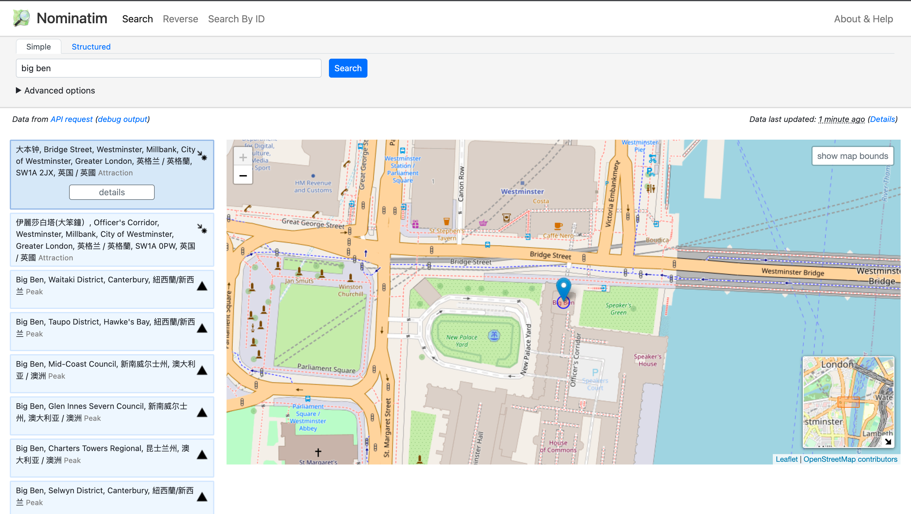

晚上调研了一下地理信息的API，发现了一个很好用的API: Nominatim
- 可以根据地址查询详细信息（包含经纬度，各种人类语言的名称，邮编等等）
- 还可以根据经纬度查询同样的详情信息

## 数据源
数据来源是 [OpenStreetMap](https://www.openstreetmap.org/) ，一个开放的地图数据项目

[Nominatim](https://nominatim.openstreetmap.org/ui/about.html) 是OpenStreetMap的搜索引擎

该API由Nominatim提供，[官方 API 文档](https://nominatim.org/release-docs/develop/api/Overview/)

## 使用举例

### 根据地址查询
- 文档
  - https://nominatim.org/release-docs/develop/api/Search/
- 以查询查询 英国大本钟 "big ben" 为例
- 网页体验：
> https://nominatim.openstreetmap.org/ui/search.html?q=big+ben


- API地址
> https://nominatim.openstreetmap.org/search?q=big+ben&format=json&polygon_geojson=1&addressdetails=1
- API返回：
```json
[
  {
    "place_id": 16357159,
    "licence": "Data © OpenStreetMap contributors, ODbL 1.0. https://osm.org/copyright",
    "osm_type": "node",
    "osm_id": 1802652184,
    "boundingbox": [
      "51.5006542",
      "51.5007542",
      "-0.1246221",
      "-0.1245221"
    ],
    "lat": "51.5007042",
    "lon": "-0.1245721",
    "display_name": "大本钟, Bridge Street, Westminster, Millbank, City of Westminster, Greater London, 英格兰 / 英格蘭, SW1A 2JX, 英国 / 英國",
    "class": "tourism",
    "type": "attraction",
    "importance": 0.5169301795209977,
    "icon": "https://nominatim.openstreetmap.org/ui/mapicons/poi_point_of_interest.p.20.png",
    "address": {
      "tourism": "大本钟",
      "road": "Bridge Street",
      "quarter": "Westminster",
      "suburb": "Millbank",
      "city": "City of Westminster",
      "ISO3166-2-lvl8": "GB-WSM",
      "state_district": "Greater London",
      "state": "英格兰 / 英格蘭",
      "ISO3166-2-lvl4": "GB-ENG",
      "postcode": "SW1A 2JX",
      "country": "英国 / 英國",
      "country_code": "gb"
    },
    "geojson": {
      "type": "Point",
      "coordinates": [
        -0.1245721,
        51.5007042
      ]
    }
  },
  {
    "place_id": 133736079,
    ... 还有有很多叫 big ben 的地方，返回值是列表，此处省略若干包含不同名为big ben的地点
  }
]
```

ps: 白天在公司使用正常，晚上在加使用，似乎需要科学上网。。。