# TL;DR

2023-03-26 周日，我去了上海历史博物馆参观。
<!--more-->
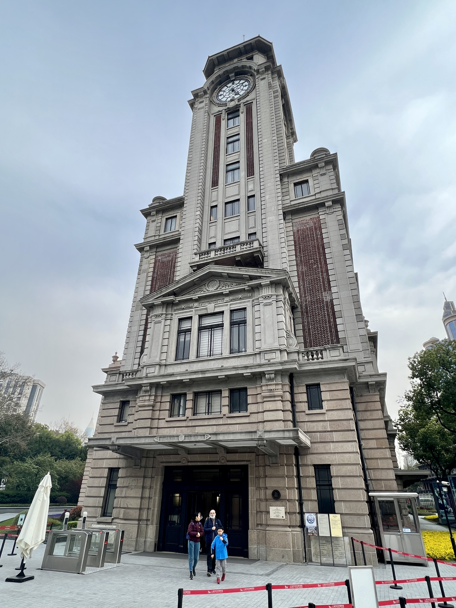

# 为什么去？

春节后就恢复了单休的作息，本周是春节后第一个双休的周日，一定要出去逛逛。

本来想去上海博物馆的，中午查看的时候，全天的免费和付费的票都约满了，只能去同在人民广场，门票比较好约的上海市历史博物馆。

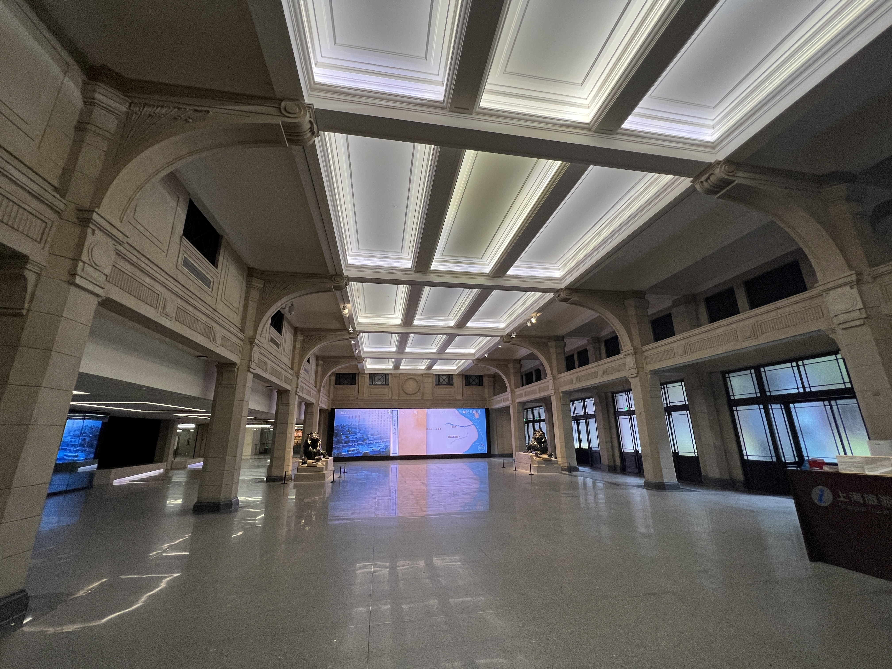

# 看到了什么

上海市历史博物馆（上海革命历史博物馆）位于市中心的人民广场，建筑原来是跑马总会的钟楼。门票免费，扫预约码入场。

一楼是临展，暂时没有布展。

## 古代上海

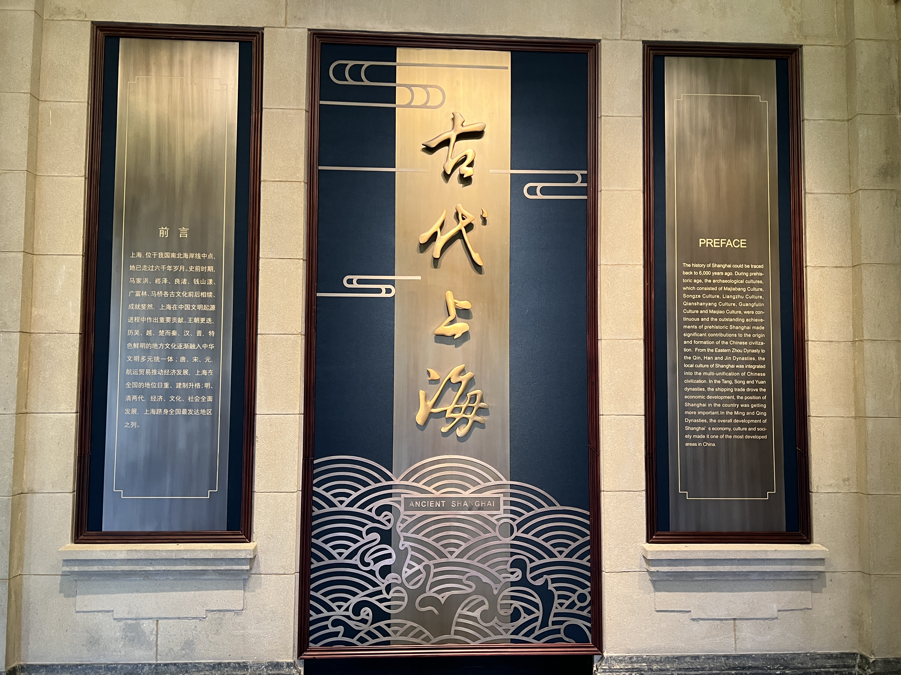
二楼是古代上海，从马家浜文化，崧泽文化，良渚文化开始讲起。

上海原来是觉得无古可考，因为之前都是大海，海岸线不断东移，1万年前才开始有上海，但是后来在多个新石器时期的文化遗迹，先后用上海的地名命名了崧泽文化，广富林文化，马桥文化三个考古学文化。
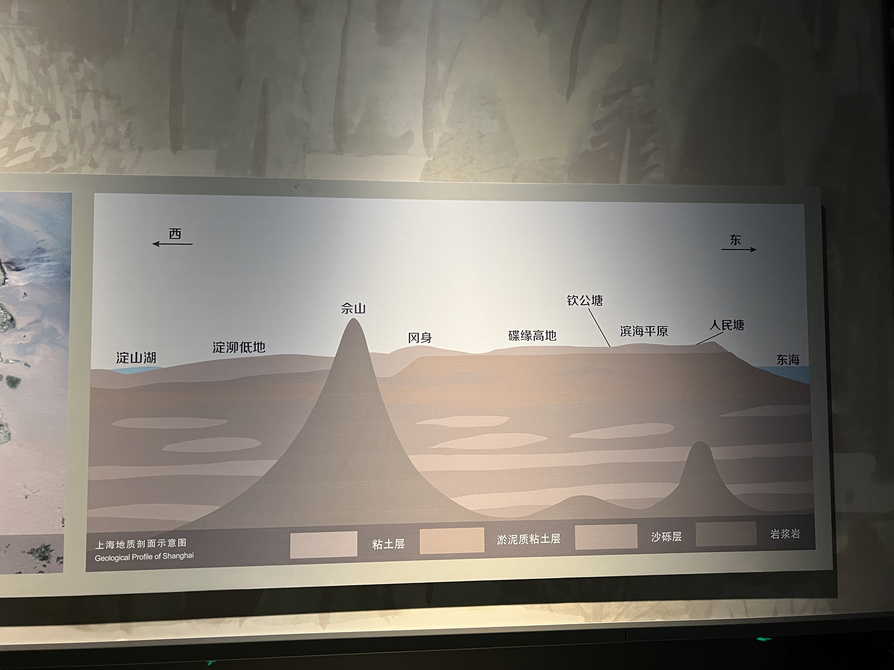
江南一代的史前文化，都是以地名命名的，按照时间顺序：

- 马家浜文化，距今 7000-6000 年，嘉兴
- 崧泽文化，6000-5400 年，青浦
- 良渚文化，5400-4300 年，杭州
- 钱山漾，4300-4100 年，湖州
- 广富林，4100-3900 年，松江
- 马桥，3900-3200 年，闵行

之前去过嘉兴的马家浜文化博物馆，杭州的良渚博物院。

上海的三个遗址都有博物馆：青浦的崧泽遗址博物馆，松江的广富林文化遗址，闵行的马桥古文化遗址公园。

湖州的钱山漾也有文化公园，抽空可以都去一趟，深度了解江南史前文化。
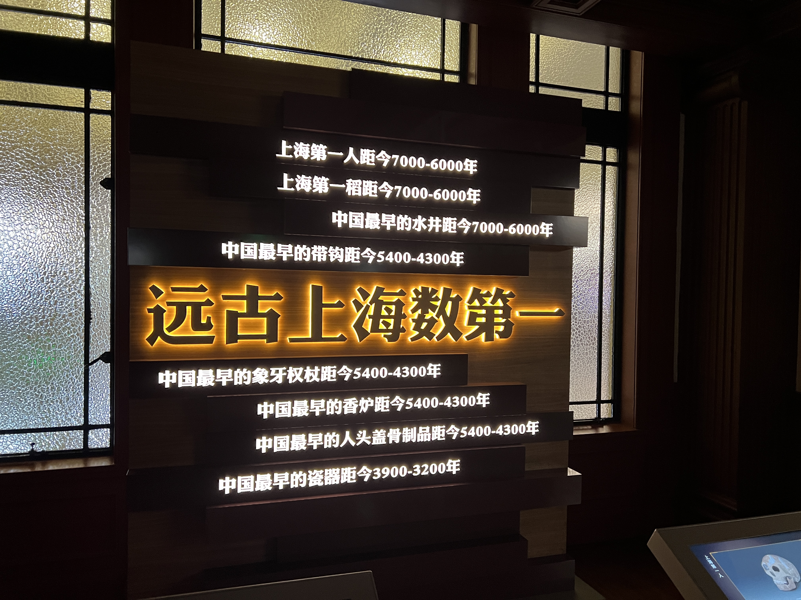
后来的朝代史，上海的存在感都不强，行政区划一直在变，隶属于江苏娄县，松江府，浙江海盐等。

上海简称是申和沪，“申” 是春申君黄歇，上海是他的封地，“沪” 是一种捕鱼的工具。
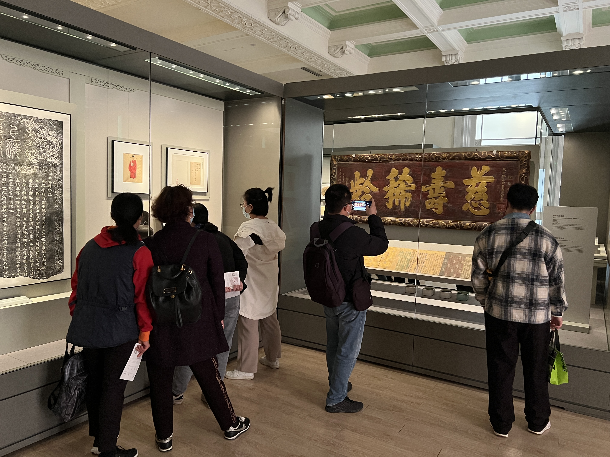

## 近代上海

三楼四楼是近代上海，这一段是上海最璀璨的历史。

《南京条约》之后，上海开埠，中西势力，各方资本，黑道白道，在这里角逐，把上海变成了中国经济、文化、思想的中心。
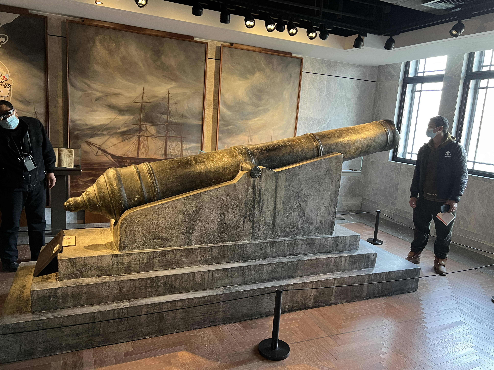
后来中共也在上海创立，再后来是淞沪抗战，上海解放，走进新时代。

展览的形式很多样，有物品展，声音展，放映厅里还有上海建国后发展的历程短片，看完让人热血沸腾。
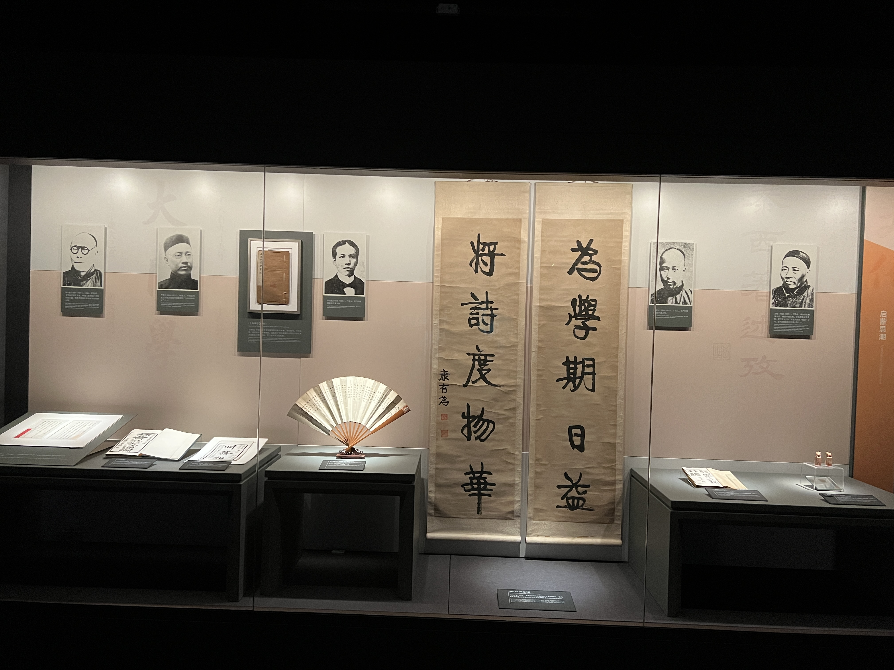
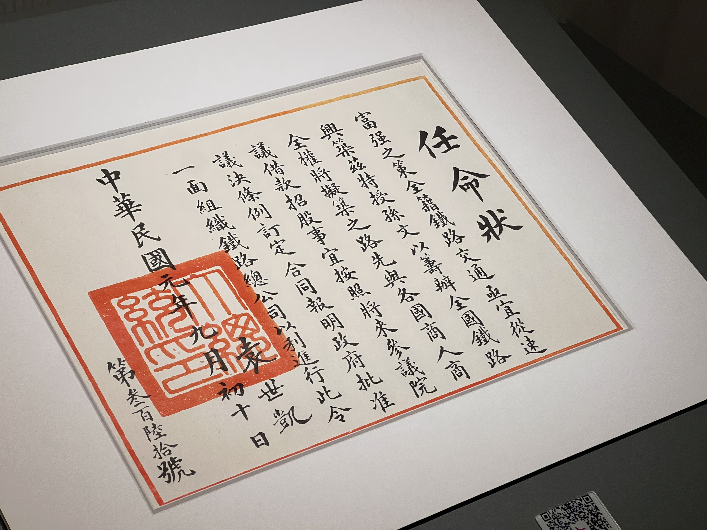
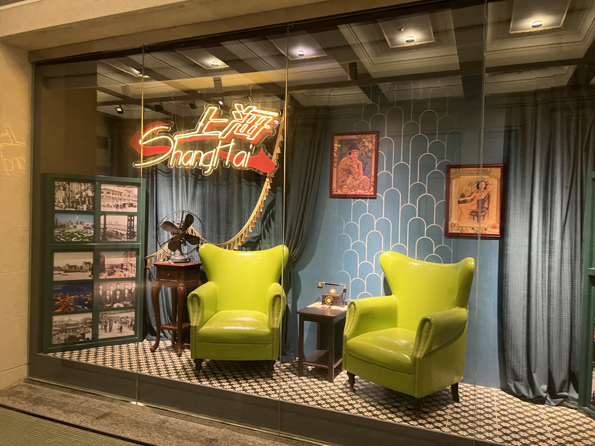
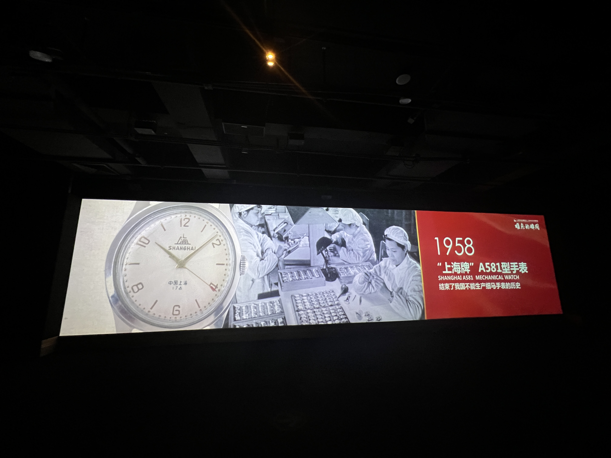

## 露台

五楼有个大露台，还有牛排馆，我去的时候正在举行一场楼顶婚礼，司仪说，这是上海最著名的 10 个露台之一
[露台和钟楼](../images/23-03-26/2023-03-26_17-03-30_IMG_5899.jpg)

# 小贴士

- 地点：上海人民广场
- 游览时间：2 小时
- 预约方式：【上海市历史博物馆】公众号
- 预约难度：容易，比上海博物馆容易很多，几乎可以随到随约
- 门票：免费

