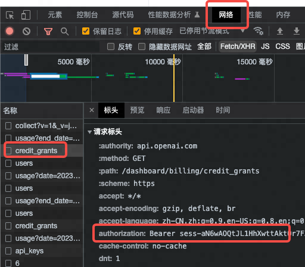
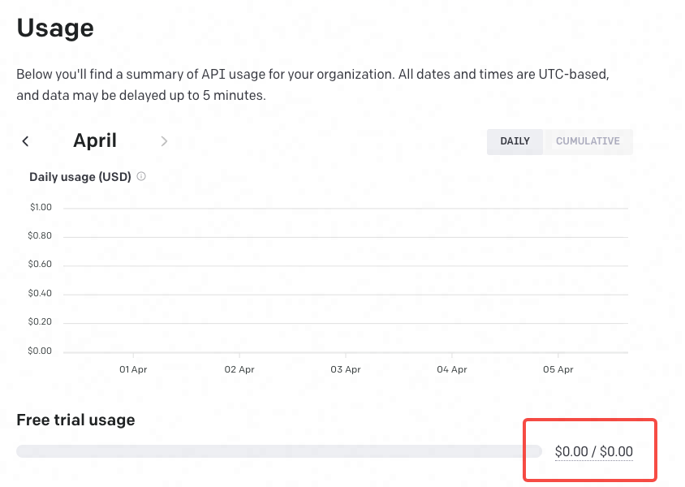

# TL;DR
OpenAI修改了查询API余额的方式，原来使用api_key的方式已经失效，现在需要使用session key：

# 背景

新注册的 OpenAI 账号会赠送 18 美金的免费API用量，可以用来学(bai)习(piao)，如何查询余额呢？

登陆网页 https://platform.openai.com/account/usage 是标准查询方式，但是如果多账号多 api key 轮流使用的话，挨个登陆网页比较麻烦，是否可以通过 API 查询呢？**答案是肯定的**

# 旧 API 与报错

旧的API是 https://api.openai.com/dashboard/billing/credit_grants 把api_key加入到header中即可， shell 和 python 参考代码如下

```shell
curl -X GET https://api.openai.com/dashboard/billing/credit_grants \
         -H "Content-Type: application/json" \
         -H "Authorization: Bearer sk-xxxxxxxxxxxx"
```

```python
import requests

api_key = "sk-xxxxxxxxxxxx"
url = "https://api.openai.com/dashboard/billing/credit_grants"
headers = {
    "Content-Type": "application/json",
    f"Authorization": f"Bearer {api_key}"
}

response = requests.get(url, headers=headers)
print( response.json())
```

4月份之前，上面的curl命令和python代码都可以正常返回余额信息，也可以侧面用来检测账号是否被封（被封会返回 *This key is associated with a deactivated account.*），但是这几天突然就报403错误了：

```python
{
  'error': {
    'message': 'Your request to GET /dashboard/billing/credit_grants must be made with a session key (that is, it can only be made from the browser). You made it with the following key type: secret.',
    'type': 'server_error',
    'param': None,
    'code': None
  }
}
```

报错的意思是"只能使用 session key 请求，也就意味着只能用浏览器网页打开"。

按照它的说法，以后只能在网页 https://platform.openai.com/account/usage 上查询API的余额了，那么真的不能使用API了吗？**答案是否定的**

# 新 API 用法

经过一番尝试，发现只要把api_key换成session key就可以了

## session key 如何获取？
session key可以在 https://platform.openai.com/account/usage 网页的请求里抓包得到。

在浏览器按 F12 打开调试模式，在【网络】里找到  credit_grants 请求

然后在请求的【标头】里找到 authorization 后面的 Bearer sess-xxxx 就是 session key 了

ps: 【响应】里可以看到余额，格式和后面api返回是一样的




## 参考代码
```shell
curl -X GET https://api.openai.com/dashboard/billing/credit_grants \
         -H "Content-Type: application/json" \
         -H "Authorization: Bearer sess-xxxx"
```

```python
import requests

session_key = "Bearer sess-xxxx"
url = "https://api.openai.com/dashboard/billing/credit_grants"
headers = {
    "Content-Type": "application/json",
    f"Authorization": f"Bearer {session_key}"
}

response = requests.get(url, headers=headers)
print(response.json())
```

亲测可用，参考返回
```json
{
  "object": "credit_summary",
  "total_granted": 0.0,
  "total_used": 0.0,
  "total_available": 0.0,
  "grants": {
    "object": "list",
    "data": []
  }
}
```

# AIGC 正式进入全面收费时代了么？

我有个上周新注册的账号，理应有 $18 的免费API用量，但事与愿违，API返回如上面的参考返回所示： "total_granted": 0.0, 总授予额度为0，网页查询如下图，Free trial usage 也是 $0



OpenAI的论坛上查了一下，有多种说法：
1. 有人说是因为用同一台机器注册了多个账号，后面的号都没api quota
2. 有人说是因为收验证码的手机之前注册过其他账号，后面的能用chatgpt但是没api quota
3. 还有人说是4月1日之后大量封号，有的账号4/1之前有 $18 并且能用，4/1之后突然变成0了

看来和最近的大量封号有关，结合画图的AI服务 Midjourney 开始收费，OpenAI 突然加强封控，也许白嫖时代正式结束，AIGC正式进入全面收费时代了，且行且珍惜吧~