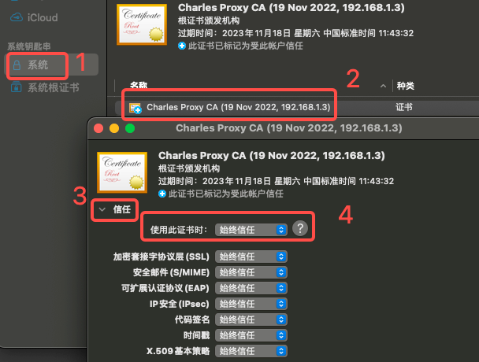
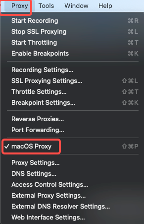
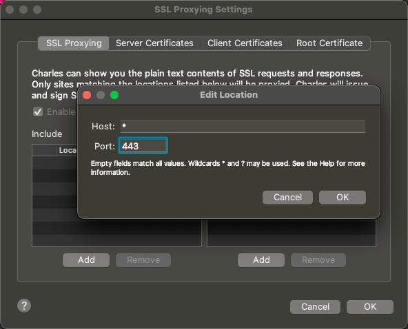
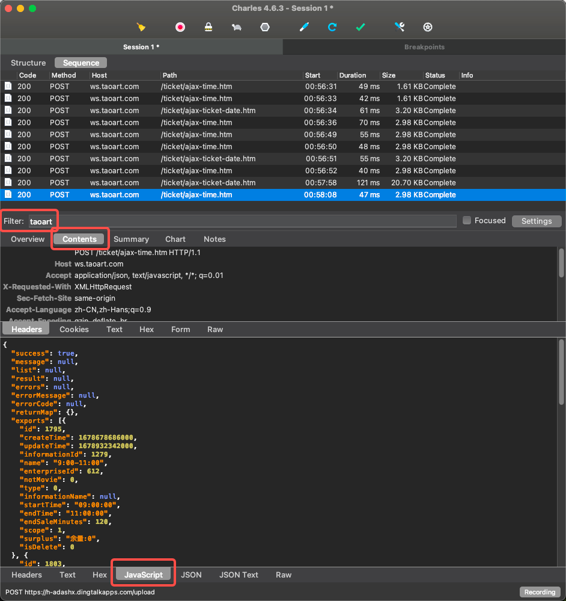
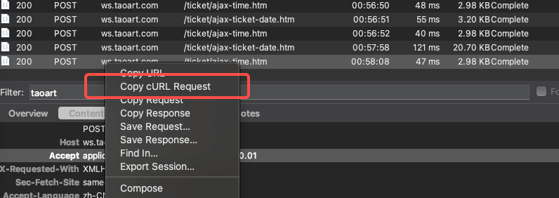
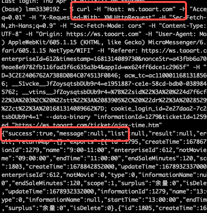
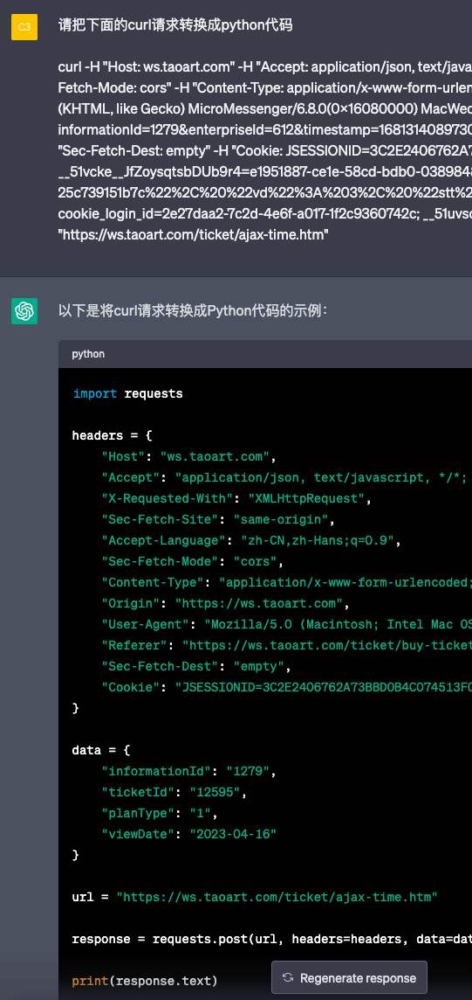
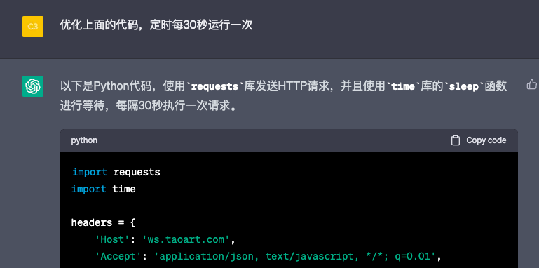
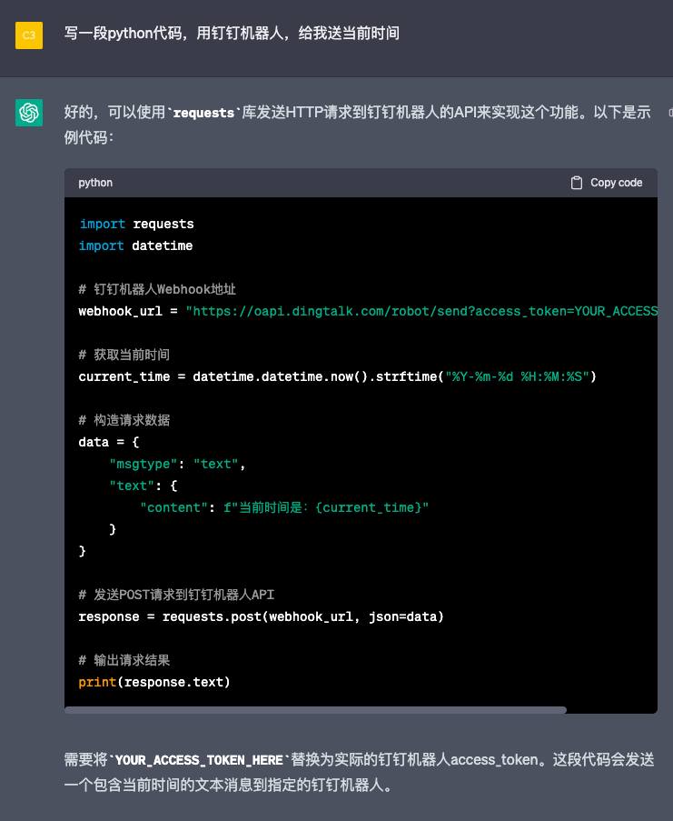

# 背景
展览火爆，一票难求
我周日的票，想换成周六，周日带宝宝去看熊猫🐼
没票了，写代码抢票

# 环境
MacOS M1机型

# 安装Charles
- 官网下载地址：https://www.charlesproxy.com/download/
- 注册机网址：https://www.charles.ren/
- 免费版可以试用30天，到期后建议付费使用，支持正版软件！
- 付费有困难的话可以考虑注册机，注册机网站上随便输入个用户名，点击生成 License Key，然后打开 Charles -> help -> 注册，输入用户名和 License Key，点击激活即可。

# 配置 Charles

## 安装根证书
- Help -> SSL Proxying -> Install Charles Root Certificate
- 此时会弹出"钥匙串访问"窗口，按照下图的顺序，依次点击 1.系统 2.Charles Proxy CA证书 3.信任 4. 始终信任
- 关闭窗口时，会弹出密码窗口，输入电脑密码，点击确定



## 打开 macOS Proxy
- 证书安装完成后，打开 Charles -> Proxy -> 勾选 macOS Proxy
- Proxy 打开后，用浏览器访问的记录都会记录在 Charles 中
- 此时Charles界面上记录下所有网络请求，如果没有开始，点击 Proxy -> Start Recording 手动开始



## 打开全部网站的 https 解析
- 因为现在大部分网站都是加密的 https， Charles 默认不会解密，看到的返回都是乱码，需要手动需要解密的网址，这里我们用通配符打开所有网站
- 点击菜单 Proxy -> SSL Proxying
- 在打开的窗口中，SSL Proxying 下点击 Add, 添加 Host: * , Port: 443, 点击 OK
- 此时所有 https 请求都会解密



此时 Charles 的配置就完成了，可是顺利完成后续的抓包任务。没有没搞清楚，可以观看下面的视频，讲得很详细
- https://www.zhihu.com/zvideo/1409544387408424960

# 抓包
- 正常的购票流程是在手机微信上，搜索"中国美院美术馆"，点击预约，选择日期，有余票就立即购票
- 手机抓包稍微麻烦一点，需要装证书，并把代理配置到电脑的上，一般是 8888 端口
- 这里用使用微信电脑版，可以实现手机上同样的操作，Charles 也可以直接抓包
- 下图是微信网页里搜索门票的页面


- 打开 Charles， 在 sequence 里查看网页的请求
- 如果电脑上的请求过多，看花了眼，可以用界面中间的 Filter 过滤，输入网站中关键词 taoart
- 抓包的情况如下图所示，主要图中圈出的重点
- 可以看出请求有两种， /ticket/ajax-ticket-date.htm 和 /ticket/ajax-time.htm
- 根据下方返回的 json 内容判断， ajax-ticket-date.htm 对应图中的选择票种，ajax-time.htm 对应图中的选择场次，这就是我们想要的余票数据



# 用 Python 写爬虫
- 既然抓到了具体的请求，我们就可以写爬虫轮询了，发现余票就发通知，然后手动下单（自动下单涉及支付，比较麻烦，暂时没精力折腾了）

## 找到 curl
- 在Charles里，右键点击我们想要的请求（这里就是 /ticket/ajax-time.htm） -> Copy cURL Request


## 测试 curl
- 这时候打开打开"终端"，粘贴刚才复制的 curl 请求，回车，返回如下图所示的 json 数据， {"success": true, ...} 说明是成功的


## curl 转换成 python request 代码
- 使用 ChatGPT 
```
请把下面的 curl 请求转换成 python 代码
"""
curl -H "Host: ws.taoart.com" -H "Accept: application/json, text/javascript, */*; q=0.01" -H "X-Requested-With: XMLHttpRequest" -H "Sec-Fetch-Site: same-origin" -H "Accept-Language: zh-CN,zh-Hans;q=0.9" -H "Sec-Fetch-Mode: cors" -H "Content-Type: application/x-www-form-urlencoded; charset=UTF-8" -H "Origin: https://ws.taoart.com" -H "User-Agent: xxx" --compressed "https://ws.taoart.com/ticket/ajax-time.htm"
"""
```
- 注意，如果你使用代理访问 ChatGPT，代理可能会和 Charles 冲突，导致同时只有一个能用



- 生成的代码如下（用xxx代替了部分隐私信息）
```python
import requests

headers = {
    "Host": "ws.taoart.com",
    "Accept": "application/json, text/javascript, */*; q=0.01",
    "X-Requested-With": "XMLHttpRequest",
    "Sec-Fetch-Site": "same-origin",
    "Accept-Language": "zh-CN,zh-Hans;q=0.9",
    "Sec-Fetch-Mode": "cors",
    "Content-Type": "application/x-www-form-urlencoded; charset=UTF-8",
    "Origin": "https://ws.taoart.com",
    "User-Agent": "Mozilla/5.0 (Macintosh; Intel Mac OS X 10_15_7) AppleWebKit/605.1.15 (KHTML, like Gecko) MicroMessenger/6.8.0(0x16080000) MacWechat/3.7(0x13070010) Safari/605.1.15 NetType/WIFI",
    "Referer": "https://ws.taoart.com/ticket/buy-ticket.htm?informationId=1279&enterpriseId=612&timestamp=1681314089730&xxx",
    "Sec-Fetch-Dest": "empty",
    "Cookie": "xxx"
}

data = {
    "informationId": "1279",
    "ticketId": "12595",
    "planType": "1",
    "viewDate": "2023-04-16"
}

url = "https://ws.taoart.com/ticket/ajax-time.htm"

response = requests.post(url, headers=headers, data=data)

print(response.text)


```

- 把代码复制到 Pycharm 里（或者任意 IDE， Jupyter Notebook），直接可以完美运行！ ChatGPT YYDS!
- 注意代码里的 data = {}, 这是请求题，包含了我们想要的信息，比如门票 ID，日期等，我们多观察几个不同的请求，找到规律，然后按需修改
- 这个网站比较简单，直接把日期 2023-04-16 就可以使用，比如 2023-04-15
```python
data = {
    "informationId": "1279",
    "ticketId": "12595",
    "planType": "1",
    "viewDate": "2023-04-16"
}
```

## 解析返回值
- 返回值是 json, 可以用 response.json() 转成 python dict, 然后解析具体的内容
- 下面是我的示例参考代码，如果有票，就打印出来，然后我就可以手动下单了
```python
js_dict = response.json()

exports = js_dict['exports']
for export in exports:
    if export['surplus'] != '余量:0':
        print(f"找到票啦: {export['name']}, {export['surplus']}, 赶紧抢票！ ")
```

## 定时轮询

- 简单点可以写个 while True 的死循环， 每次抓取都 sleep 一下，直到抢到票即可
- 也可以给 ChatGPT 提需求，让它帮忙写代码
- 比如我问 "优化上面的代码，定时每30秒运行一次"， ChatGPT 写了个 while True + sleep 的死循环，和我想的一样



```python
import time

while True:
    response = requests.post(url, headers=headers, data=data)
    print(response.json())
    time.sleep(30)
```

# 通知
- 通知可以用各种IM的消息，或者邮件，甚至是打电话。不要怕，把需求提给 ChatGPT 试试
- 比如我问了 ChatGPT  "写一段python代码，给我打个提醒电话，我的手机是 138-1234-5678", ChatGPT 给了一段 Twilio 的代码
- 然后我追问 "Twilio 不能给中国大陆手机打电话，请换个中国能用的服务商"， ChatGPT 说 "中国大陆可以使用云之讯提供的电话服务"，并给出参考代码。我去云之讯官网查了一下，的确，但注册认证比较麻烦（要有营业执照，还要500元起充等），就没继续了

- 我自己比较熟悉钉钉机器人， ChatGPT 给出的参考代码如下
```python
import requests
import datetime

# 钉钉机器人Webhook地址
webhook_url = "https://oapi.dingtalk.com/robot/send?access_token=YOUR_ACCESS_TOKEN_HERE"

# 获取当前时间
current_time = datetime.datetime.now().strftime("%Y-%m-%d %H:%M:%S")

# 构造请求数据
data = {
    "msgtype": "text",
    "text": {
        "content": f"当前时间是：{current_time}"
    }
}

# 发送POST请求到钉钉机器人API
response = requests.post(webhook_url, json=data)

# 输出请求结果
print(response.text)
```

# 安全
- 为避免账号被封，我用微信小号，重新抓包，更换了请求的Cookie
- 另外为了避免过度请求票务网站的服务器，造成"攻击"的嫌疑，我把爬虫的轮询间隔设为 180 秒

# 最终代码
- 最终代码如下，可以直接运行，抢票成功后，会发钉钉消息
- github 地址：