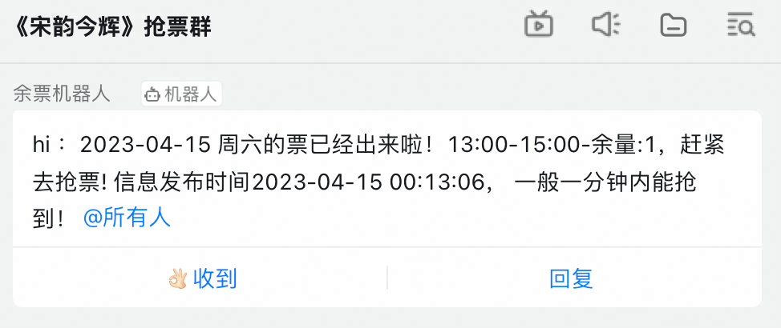

# TL;DR
- 我在 MacOS 上使用 Charles 抓包，再用 ChatGPT 辅助写爬虫，不到一小时写完代码，当天就成功抢到了展览门票！

# 一、背景
事情的背景是这样的： 

位于杭州西湖边的中国美院，办了"宋韵今辉"艺术展，藏品等级很高，汇集了宋代大家的国画珍品。 

展览火爆，一票难求！本周日是最后一天。

我提前买好了两张周日的票，计划和宝妈一起去。结果宝妈对艺术毫无兴趣，强烈要求周日带宝宝去安吉看熊猫🐼

我既想看展览，也想带宝宝一起看熊猫，两全其美的方案就是退掉周日的票，改成周六看展，周日看熊猫。

可惜展览实在太火爆，周二的时候再刷，整周的票都已经全部售罄了。

陷入犹豫纠结之时，我发现可以退票，尝试退掉宝妈周日的门票之后，库存立刻增加，出现了"余票1"的字样。

太好了！既然可以别人退票之后立即放票，那我就写个机器人刷票吧~
<!--more-->

# 二、用到的软件
- Charles v4.6.3
- Python v3.11
- ChatGPT 免费版 GPT 3.5 模型

# 三、安装Charles
- Charles 是个跨平台的抓包工具，支持 Windows、MacOS、Linux，大家可以按需下载
- 官网下载地址：https://www.charlesproxy.com/download/
- 免费版可以试用30天，到期后建议付费使用，支持正版软件！
- 注册机网址：https://www.charles.ren/
- 付费有困难的话可以考虑临时使用注册机，注册机网站上随便输入用户名，点击生成 License Key，然后打开 Charles -> help -> 注册，输入用户名和 License Key，点击激活即可。

# 四、配置 Charles

## 安装根证书
- 原理：
  - 抓包软件为了能解析加密的 https 请求，需要在电脑上安装和信任抓包软件的证书，然后伪装成中间人，骗取浏览器的信任
- 安装步骤：
  - Charles菜单: Help -> SSL Proxying -> Install Charles Root Certificate
  - 此时会弹出"钥匙串访问"窗口，按照下图的顺序，依次点击 1.系统 2.Charles Proxy CA证书 3.信任 4. 始终信任
  - 关闭窗口时，会弹出密码窗口，输入电脑密码，点击确定，证书就安装并信任成功了


## 开始抓包
- 证书安装完成后，打开 Charles -> Proxy -> 勾选 macOS Proxy
- Proxy 打开后，用浏览器访问的记录都会记录在 Charles 中
- 此时Charles界面上记录下所有网络请求，如果没有开始，点击 Proxy -> Start Recording 手动开始


## 打开全部网站的 https 解析
- Charles 默认不会解密http的请求，看到的返回都是乱码，需要手动添加需要解密的网址，这里我们用通配符添加所有网站
- 点击菜单 Proxy -> SSL Proxying
- 在打开的窗口中，SSL Proxying 下点击 Add, 添加 Host: * , Port: 443, 点击 OK
- 此时所有 https 请求都会解密


到此 Charles 的配置就完成了，可以顺利完成后续的抓包任务。如果没搞清楚，可以观看这个视频，讲得很详细 https://www.zhihu.com/zvideo/1409544387408424960

# 五、抓包
- 正常的购票流程是在手机微信上，搜索"中国美院美术馆"，点击预约，选择日期，有余票就立即购票
- 手机抓包稍微麻烦一点，需要装证书，并把手机的网络代理配置到电脑的上，一般是 8888 端口
- 这里用使用微信电脑版，实现手机上同样的操作，Charles 可以直接抓包，比较方便

- 下图是微信网页里搜索门票的页面，可以看见所有时段的票都是 "余量0"


- 打开 Charles， 在 sequence 里查看网页的请求
- 如果电脑上的请求过多，看花了眼，可以用界面中间的 Filter 过滤，输入网址中的关键词 taoart
- 抓包的情况如下图所示，注意图中圈出的重点
- 可以看出请求有两种， /ticket/ajax-ticket-date.htm 和 /ticket/ajax-time.htm
- 根据下方返回的 json 内容判断， ajax-ticket-date.htm 对应上图中的选择票种，ajax-time.htm 对应上图中的选择场次，选择场次就是我们想要的余票数据。


# 六、用 Python 写爬虫
抓到了具体请求之后，我们就可以写爬虫轮询了，发现余票就发通知，然后手动下单（自动下单涉及支付，比较麻烦，暂时没精力折腾）

## 找到 curl
在Charles里，右键点击我们想要的请求（这里就是 /ticket/ajax-time.htm） -> Copy cURL Request


## 测试 curl
打开"终端"，粘贴刚才复制的 curl 请求，回车。如果返回如下图所示的 json 数据，{"success": true, ...} 说明这个请求可以直接使用。


## 用 ChatGPT 把 curl 转换成 python requests 代码
- 询问 ChatGPT，要求它帮我们把 curl 转换成 python 代码，参考 prompt 如下 

```text
请把下面的 curl 请求转换成 python 代码
"""
curl -H "Host: ws.taoart.com" -H "Accept: application/json, text/javascript, */*; q=0.01" -H "X-Requested-With: XMLHttpRequest" -H "Sec-Fetch-Site: same-origin" -H "Accept-Language: zh-CN,zh-Hans;q=0.9" -H "Sec-Fetch-Mode: cors" -H "Content-Type: application/x-www-form-urlencoded; charset=UTF-8" -H "Origin: https://ws.taoart.com" -H "User-Agent: xxx" --compressed "https://ws.taoart.com/ticket/ajax-time.htm"
"""
```

- 小提示：如果你使用代理访问 ChatGPT，代理可能会和 Charles 冲突，导致同时只有一个能用
- ChatGPT 的回复如下图所示，直接给出了可用的 python 代码


生成的代码如下（用 ****** 代替了部分隐私信息）

```python
import requests

headers = {
    "Host": "ws.taoart.com",
    "Accept": "application/json, text/javascript, */*; q=0.01",
    "X-Requested-With": "XMLHttpRequest",
    "Sec-Fetch-Site": "same-origin",
    "Accept-Language": "zh-CN,zh-Hans;q=0.9",
    "Sec-Fetch-Mode": "cors",
    "Content-Type": "application/x-www-form-urlencoded; charset=UTF-8",
    "Origin": "https://ws.taoart.com",
    "User-Agent": "Mozilla/5.0 (Macintosh; Intel Mac OS X 10_15_7) AppleWebKit/605.1.15 (KHTML, like Gecko) MicroMessenger/6.8.0(0x16080000) MacWechat/3.7(0x13070010) Safari/605.1.15 NetType/WIFI",
    "Referer": "https://ws.taoart.com/ticket/buy-ticket.htm?informationId=1279&enterpriseId=612&timestamp=1681314089730&******",
    "Sec-Fetch-Dest": "empty",
    "Cookie": "******"
}

data = {
    "informationId": "1279",
    "ticketId": "12595",
    "planType": "1",
    "viewDate": "2023-04-16"
}

url = "https://ws.taoart.com/ticket/ajax-time.htm"

response = requests.post(url, headers=headers, data=data)

print(response.text)
```

把代码复制到 Python的开发环境里(我用的是 Pycharm, 也可使用其他 IDE， Jupyter Notebook等），代码可以直接可以完美运行！ ChatGPT YYDS!

注意代码里的 data = {}, 这是请求体，包含了我们想要的信息，比如门票 ID，日期等，我们多观察几个不同的请求，找到规律，然后按需修改

这个网站比较简单，直接把日期 2023-04-16 就可以使用，比如 2023-04-15

```python
data = {
    "informationId": "1279",
    "ticketId": "12595",
    "planType": "1",
    "viewDate": "2023-04-16"
}
```

## 解析返回值
- 返回值是 json, 可以用 response.json() 转成 python dict, 然后解析具体的内容
- 下面是我的示例参考代码，如果有票，就打印出来
```python
js_dict = response.json()

exports = js_dict['exports']
for export in exports:
    if export['surplus'] != '余量:0':
        print(f"找到票啦: {export['name']}, {export['surplus']}, 赶紧抢票！ ")
```

## 定时轮询
- 每次请求不到1秒就完成了，可以每隔60秒请求一次，直到程序停止
- 简单点可以写个 while True 的死循环， 每次抓取后都 sleep 一下，直到抢到票即可
- 也可以给 ChatGPT 提需求，让它帮忙写代码
- 比如我问 "优化上面的代码，定时每30秒运行一次"， ChatGPT 写了个 while True + sleep 的死循环，和我想的一样


```python
import time

while True:
    response = requests.post(url, headers=headers, data=data)
    print(response.json())
    time.sleep(30)
```

# 七、通知
- 机器发现余票之后，为了及时抢票，需要通知我们
- 通知可以用各种IM的消息，或者邮件，甚至是打电话。不要怕，把需求提给 ChatGPT 试试
- 我问了 ChatGPT 
> "写一段python代码，给我打个提醒电话，我的手机是 138-1234-5678", 
- ChatGPT 想了一段 调用 Twilio 打电话的代码
- 然后我追问 
> "Twilio 不能给中国大陆手机打电话，请换个中国能用的服务商"， 
- ChatGPT 说 "中国大陆可以使用云之讯提供的电话服务"，并给出参考代码。
- 我去云之讯官网验证了一下，ChatGPT说得没错，可以发短信、打电话，但注册认证比较麻烦（要有营业执照，还要500元起充等），就没继续了。
- 因为要治理电话诈骗，现在国内的语音电话服务被严格管理，必须通过营业执照注册，个人无法使用。


- 我自己比较熟悉钉钉机器人， 让 ChatGPT 帮我写出参考代码


```python
import requests
import datetime

# 钉钉机器人Webhook地址
webhook_url = "https://oapi.dingtalk.com/robot/send?access_token=YOUR_ACCESS_TOKEN_HERE"

# 获取当前时间
current_time = datetime.datetime.now().strftime("%Y-%m-%d %H:%M:%S")

# 构造请求数据
data = {
    "msgtype": "text",
    "text": {
        "content": f"当前时间是：{current_time}"
    }
}

# 发送POST请求到钉钉机器人API
response = requests.post(webhook_url, json=data)

# 输出请求结果
print(response.text)
```
- 在钉钉群里创建机器人，替换上面的 YOUR_ACCESS_TOKEN_HERE ，代码可以直接使用

# 安全
- 为避免账号被封，我用微信小号，重新抓包，更换了请求的Cookie
- 另外为了避免过度请求票务网站的服务器，造成"攻击"的嫌疑，我把爬虫的轮询间隔设为 180 秒

# 最终代码
- 把爬虫和通知组合起来，最终代码如下，可以直接运行，抢票成功后，会发钉钉消息
- github 地址: https://github.com/lmmsoft/crawler/blob/main/ticket.py


# 下回预告
- 我最终有没有抢到票？除了自己抢到票外，后续如何变现？请关注后续的文章~
- 如果你对 ChatGPT 感兴趣，也请关注本公众号，后续会继续分享相关知识，并放出账号福利~

# 作者简介：
- 明明如月，互联网大厂做码农，是个有多年工作经验的 CRUD BOY。最近在学习 ChatGPT，希望能用它做一些之前做不到的事情，突破自己的边界。
