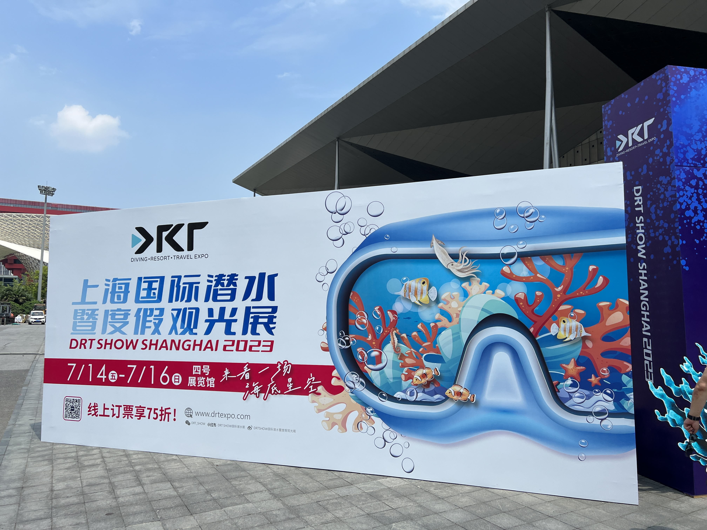

2023-07-15，我在上海世博展览中心参观了DRT上海国际潜水暨度假观光展🤿

展会从周五持续到周日，共计三天，我是周六来的，观众很多，挺热闹的，尤其是各展台的抽奖时刻，都被围得水泄不通。

展览主要是潜水观光推介，包括潜点，度假村，船宿，俱乐部，旅行社等。潜水用品的制造商、经销商。

此外，还有马来西亚和印尼的旅游局， PADI/SDI/TDI等潜水培训系统，文创展示、潜水摄影比赛，专业讲座等活动。

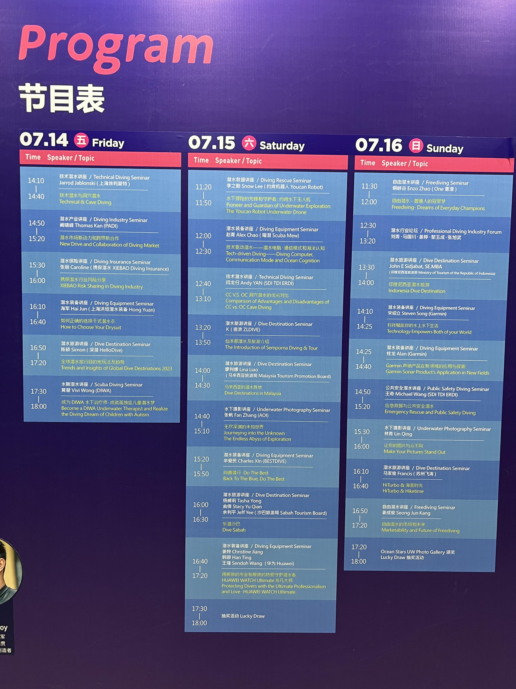

我逐个参观了每个展台，并尽可能地拿了材料，扫码关注，参与抽奖，与展商亲切交流。

<!--more-->

## Part1: 潜点丰富度

与疫情前我参加过的另一次上海潜水展相比，这次潜点的丰富程度明显比之前少了很多，最多的是印尼，其次是马来西亚，还有少量的马尔代夫、菲律宾等。相比之前，多样性明显下降。

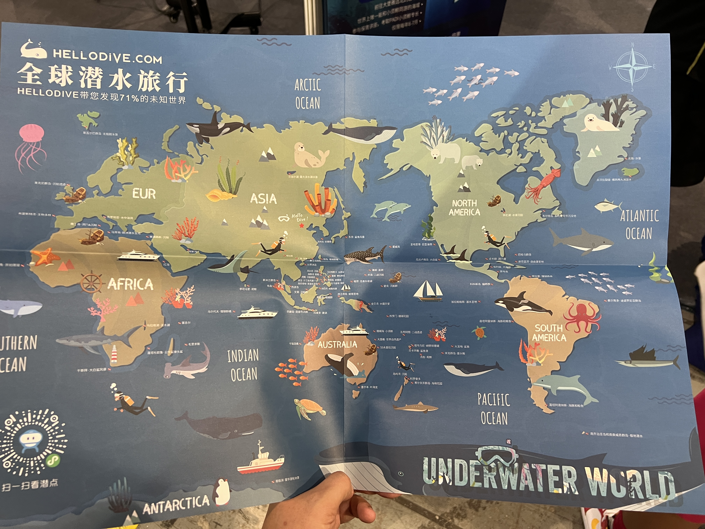

### 【中东】

上次有许多参展商来自红海地区，但这次一个都没有来，中东只有一个迪拜和一个阿曼🇴🇲

这是我第一次听说阿曼也可以潜水，在展台上多聊了一会儿，还品尝了一种特殊的阿曼美食。
负责的是个中国人，他们是第首个把阿曼潜水引入中国的商家，行程先飞迪拜，从迪拜转机到阿曼首都马斯喀特约1小时，在马斯喀特上船，前往阿拉伯海船宿，游览阿曼的海洋公园。在三到九月这个季节，潜水条件非常好，洋流带来丰富的海洋生物，号称比红海更出色。费用也不便宜，7天船宿3000+美金，含迪拜的十日游则为$4000+。

### 【美洲】

上次我记得还有加勒比海，甚至是加拉帕格斯群岛的参展商，这次也完全绝迹了，只有几个全球性的潜水公司捎带列出了相关产品，没有做重点推介。可能是中美航线只有疫情前的1/10，价格过于昂贵吧。

这次倒是看到一个做南极潜水的商家，图片上都是穿着厚厚的干衣，应该是从南美过去。

### 【东亚】

东亚这次只有一个韩国济州岛的展台，几个韩国小哥用英语和大家交流，没有会汉语的工作人员。我记得上次有日本冲绳的专题，当时我还估算过，日本每一潜的价格是泰国、菲律宾的好几倍。

宝岛台湾的元素这次也少了很多，有些操着国语的工作人员，还有来自台湾的潜水杂志和文创产品。

上次有台湾的专题，比如绿岛/垦丁的潜水和旅行推介。 这次完全没有了，我猜是因为陆客自由行暂停，想去台湾潜水可比东南亚困难多了。

2017年我去绿岛潜水时，是在淘宝上找到的当地的自营潜店，老板告诉我，他是来大陆参加潜水展，顺便开了淘宝和支付宝，拓展了客户群，刚才去淘宝上搜了一下，店铺已经关闭了，哎😌

### 【东南亚+太平洋】

展会上最热门的是印度尼西亚，有很多展台，包括巴厘岛、科摩多、美娜多，达拉湾，四王岛等热点。印尼的潜点太多啦，我只去过巴厘岛的图兰本和佩尼达岛，下一个想去科摩多，看科摩多龙🐲+粉红沙滩🏖

在展会上认识了一个印尼的新潜点：韦岛，在苏门答腊岛的西北侧，也是整个印尼的最西边和最北边，这里是安达曼海，属于印度洋的边缘海，价格好像在印尼里算是便宜的。印尼其他的著名潜点都是属于太平洋的范围。

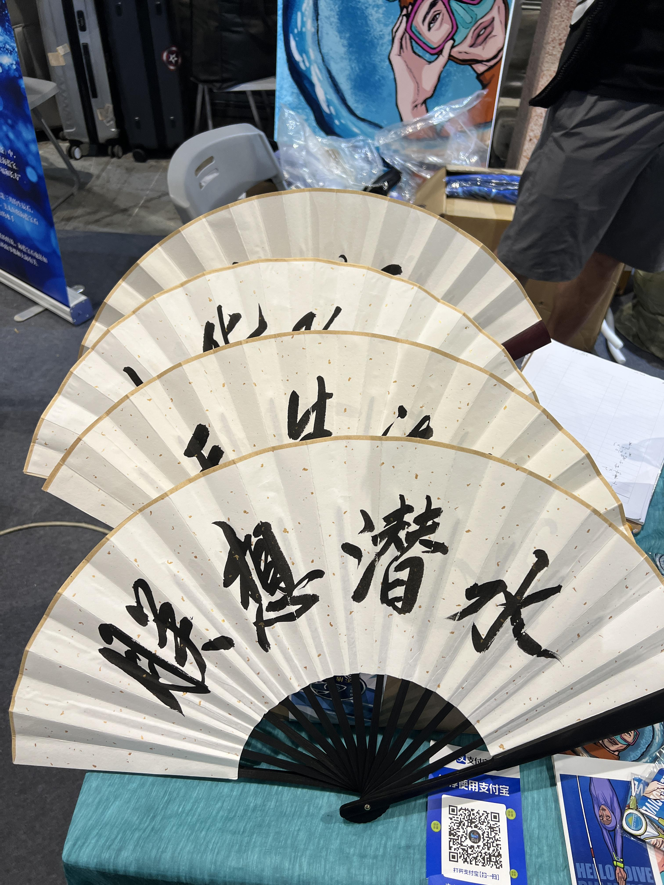

展会第二热闹的地方是马来西亚，马来西亚的旅游局印刷了很多旅游手册、地图发放给大家，这一点比印尼旅游局做得好。主要是沙巴和沙捞越。我在沙巴的仙本那、马布岛、诗巴丹潜过水，尤其是诗巴丹，那次看到了好多"大货"，让我印象最深刻的一次潜水🤿
看新闻说下半年会恢复杭州直飞沙巴的航班，到时候就方便啦~

东南亚和太平洋一些小众地点的参展商也没有看到。
比如上次有文莱和巴布亚新几内亚的代理商。我看到他们时非常兴奋，没有他们我可能不知道还能够去那里潜水。几个月后，我真的通过潜水展上的代理商，去了文莱潜水，在废弃的油井上潜水，这算是产油国文莱的特色了吧。

至于类似塞班岛等美属群岛，这次没有看到展台，其实今年我看了不少关于二战太平洋战场的播客、电影和电视剧，很想去看看那些美日之间的战斗遗迹、沉船，但今天一无所获。

这次帕劳也有，毕竟后台老板是中国人，因为邦交原因，能从澳门飞就不错了。

其他还拿到了斐济和澳大利亚珊瑚岛的宣传册，但是汤加，塔希提等高端目的地都没看见。

## Part2 装备

- 现场的装备挺全的，包括潜水服、潜水镜、脚蹼、潜水电脑表、潜水灯、潜水相机等各种装备。

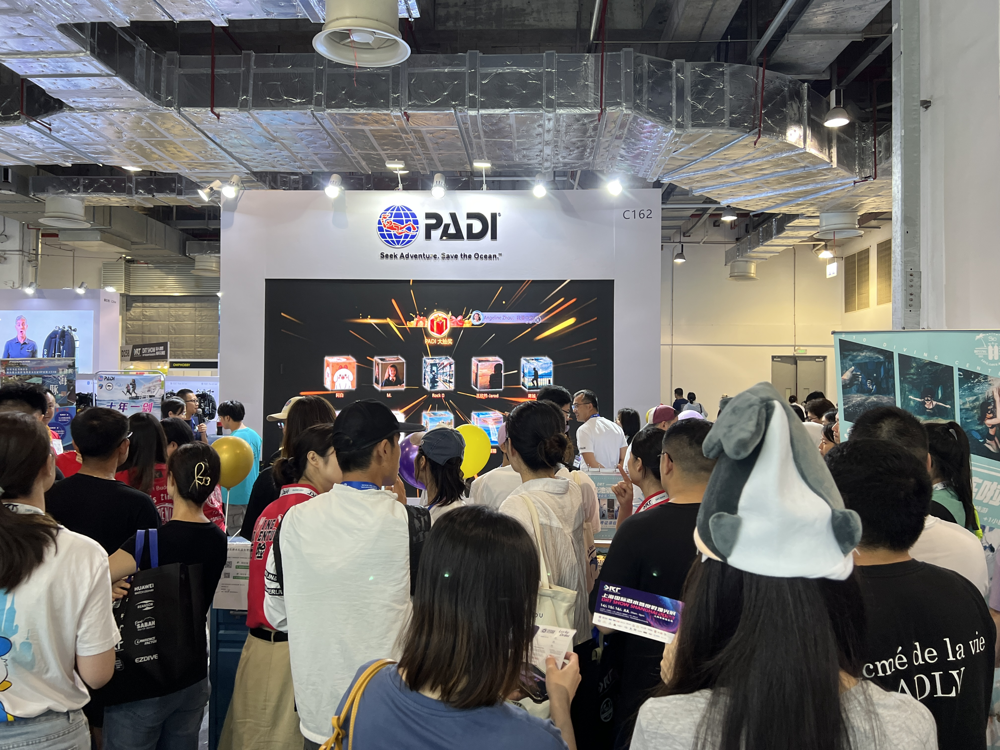

### 电脑表

- 进门右手边第一个展台是PADI，而左手边最醒目的第一个展台就是我们的民族品牌————华为
- 华为带来了今年三月份新发布了第一款潜水电脑表，名叫"非凡大师"，价格从5999元起，具有漂亮的彩屏和鸿蒙系统，外观和易用性远超传统潜水电脑表。它可以在100米的水下使用，功能和价格都非常棒，但不支持ANT+外设，生态系统还有待完善。
- 华为几年前开始做运动手表，和老牌玩家佳明、松拓抢市场，培养了很多新用户。这次潜水电脑表的发布，让我感到华为在消费电子上的野心更大了，越来越往专业领域进军呀。希望它能重塑生态，给大家带来更好的装备！

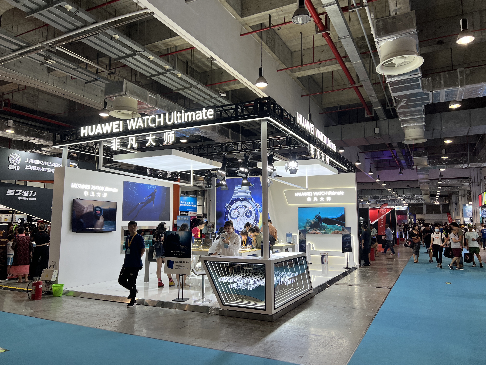

### 潜水相机

- 从展台上来看，潜水相机主要有三种：卡片相机、相机壳、手机壳。
- 【卡片相机】主打的是防水和微距，配合水下专用的摄影灯，可以拍摄到很多细节。奥林巴斯的展台，放了个一排很小的模型，可以用相机现场拍照，并实时投影到上面的大屏幕上，生动形象。

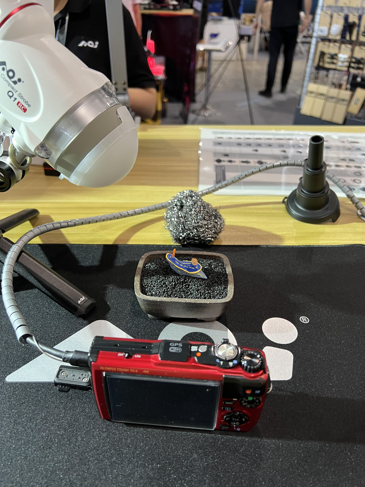

- 【相机壳】主要是给单反和微单使用，好大的体积，价格也不菲。外面可以搭配各种闪光灯、补光灯、滤镜等，获得专业的拍摄效果。

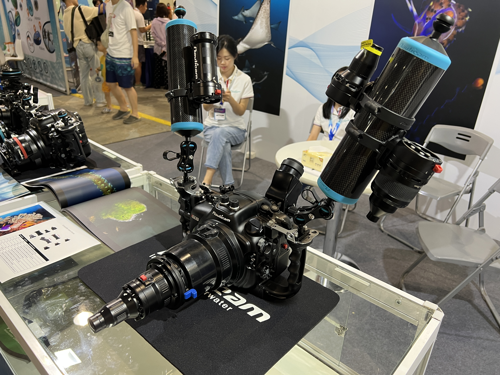

- 【手机壳】最吸引我，因为我是手机党，拍照后也就发发朋友圈，暂时没有进军水摄的预算。手机壳的优势是轻便，价格也比较亲民，从百元到上千元不等，比相机便宜很多。搭配各种好玩的滤镜、鱼眼、广角、微距、半水上半水下等等镜头，可以拍出很多有趣的照片。

- 我在展会上看到了一款非常厚实的防水手机壳，还能搭配灯光和不同的镜头，价格在千元上下。
- 介绍的小哥非常热情，打开了他手机上常用的几个拍照app，给我展示了各种滤镜和镜头的效果，比如拍照前直接调色温，优化水中偏蓝的光线，不用再后期调色了~

### 水下无人机

- 展会上有上海本地的水下无人机厂商：约肯机器人
- 他们的水下无人机用线缆和地面连接，可以在岸上用遥控器控制。
- 主要用于拍照、救援、探险等场景。目前线缆的的长度可以达到200米。

## Part3: 市场恢复

通过与一些展商的交流，我了解到潜水旅行正在快速恢复，很多船宿已经订到了2024年。但是大陆市场没有完全恢复，三个主要原因是：机票、签证、外交

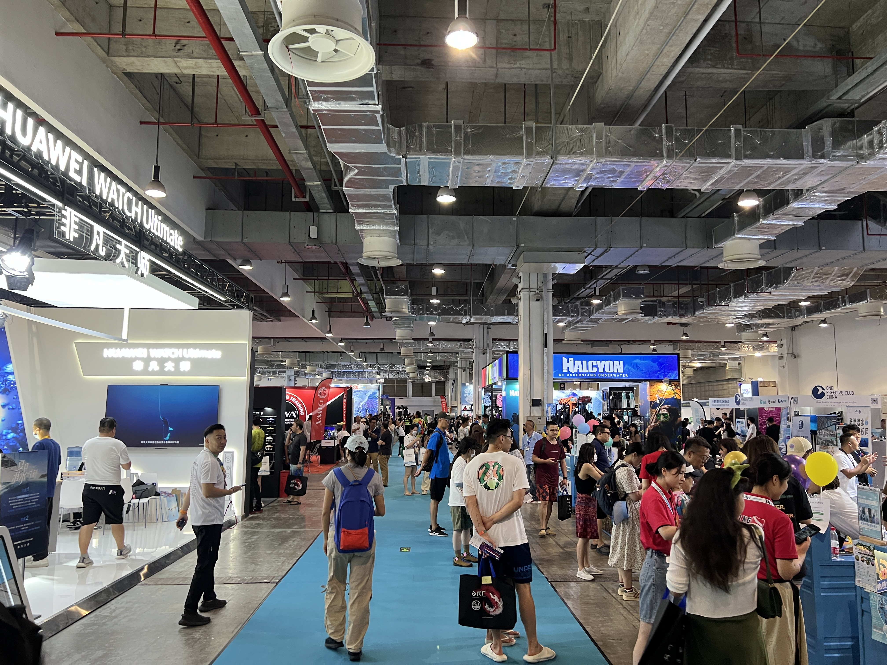

### 【签证】

某个印尼的展商是新加坡华人。疫情前，日本、新加坡和文莱都可以免签来中国大陆（为了推动改革开放），但疫情后这一政策一直未恢复。现在新加坡的人想来中国大陆参加展览，面临复杂的商务签证手续，需要去领事馆采集指纹，昂贵的费用，填写一堆资料，还需要质押护照等待签发，非常麻烦。

### 【航班】

目前率先恢复的是飞往首都等大城市的航班，但直飞海岛的旅行航线恢复较慢。

比如疫情前上海有到印尼美娜多的定期直飞，我记得机票+住宿+8潜+考证只要5099元一口价，淡季甚至可以更低，现在想去美娜多，需要先飞往雅加达或者新加坡。然后再转机，上海去这两个城市往返的机票就要4000+，航线紧张，很少有打折票的。

再比如疫情前杭州可以直飞亚庇，现在也一直没恢复。据说现在广州飞东南亚的恢复了不少，华东地区等年底再看吧。

### 【外交】

如上所述，部分地区因为外交不睦，民间往来也受到了很大的影响。

## Part4: 观感

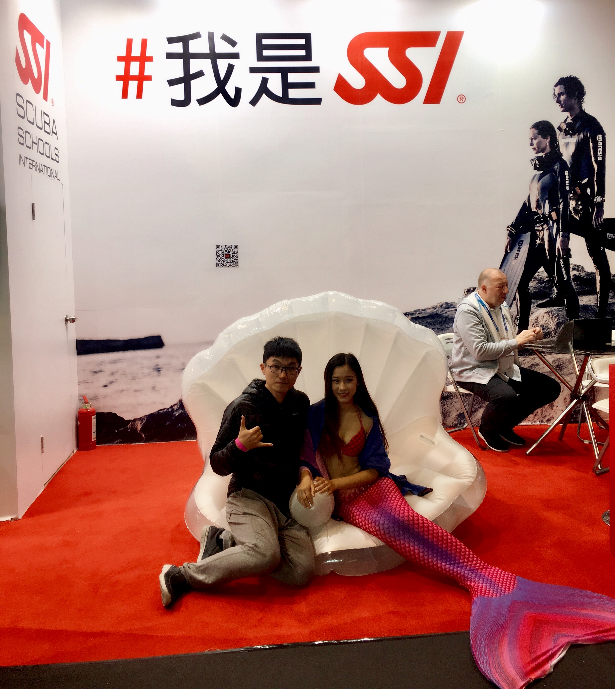

- 上次展会上有美人鱼展示🧜🏻‍♀️我还跑去和漂亮的美人鱼小姐姐合影了(如上图)，这次没看见，有点遗憾喔~
- 观众年轻人比较多，女孩占比很高，也有许多新人潜水爱好者，正在计划十一黄金周的潜水考证之旅。展会给了他们更多的选择，拓宽了视野。
- 展览的规模比疫情前小，不过也能看出市场正在蓬勃恢复中，看到吃了三年憋的商家们都在卖力宣传，观众们也跃跃欲试，有理由相信未来会更好！

## Part5: 我的规划

到家后把所有带回来的手册、海报都整理了一遍，扫码关注了一堆公众号、视频号、小红书，还加了若干好友。

下图是2018年的我和2023年的我

大致整理一下后面的潜水规划吧：

- 【日程】今年十一计划呆在杭州看亚运会，下一个能去海岛潜水的长假或许是年底？白天潜水，下午和晚上在沙滩上躺平放空🏖现在工作很忙，年底得好好放松下~
- 【偏好】想去没去过的地方旅行+潜水，我最想去看二战沉船，其次想体验一下高氧，宝妈和我对微距兴趣都不大，都喜欢看"大货"。
- 【预算】由于房贷压力大，生娃后家庭旅行预算几乎被砍光。昂贵的船宿，高端的目的地暂时不敢考虑。
- 【理想目的地】综合路程和费用，菲律宾应该是不错的选择，离得近，价格便宜，之前只去过一次长滩岛，考了OW，下次找有二战沉船的地方去探寻。
- 【精打细算】如果未来有明确的目的地，可以顺便参加一次类似的潜水展，展会上所有商家都有折扣，甚至还能抽奖试试运气。（这次参加了好几个抽奖，一个都没中，哈哈）, DRT在中国的北京、上海、深圳、香港、台北都有举办。

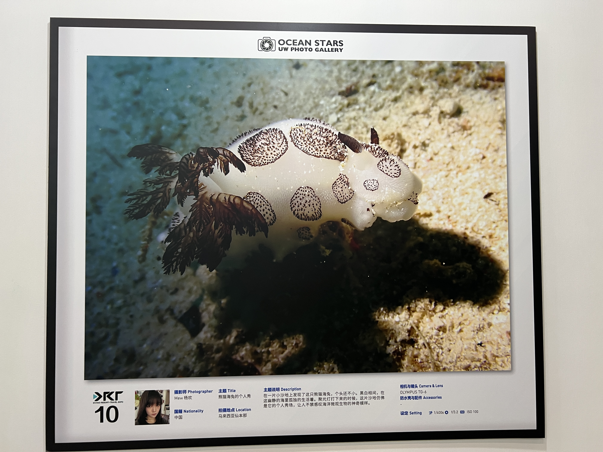

## Part6: 参考链接
- [DRT潜水展官网](https://www.drtexpo.com/)
- [DRT上海潜水展主页]()
- [阿曼潜水介绍的链接，有图有视频有联系方式](https://www.meipian.cn/4tdp4d89)

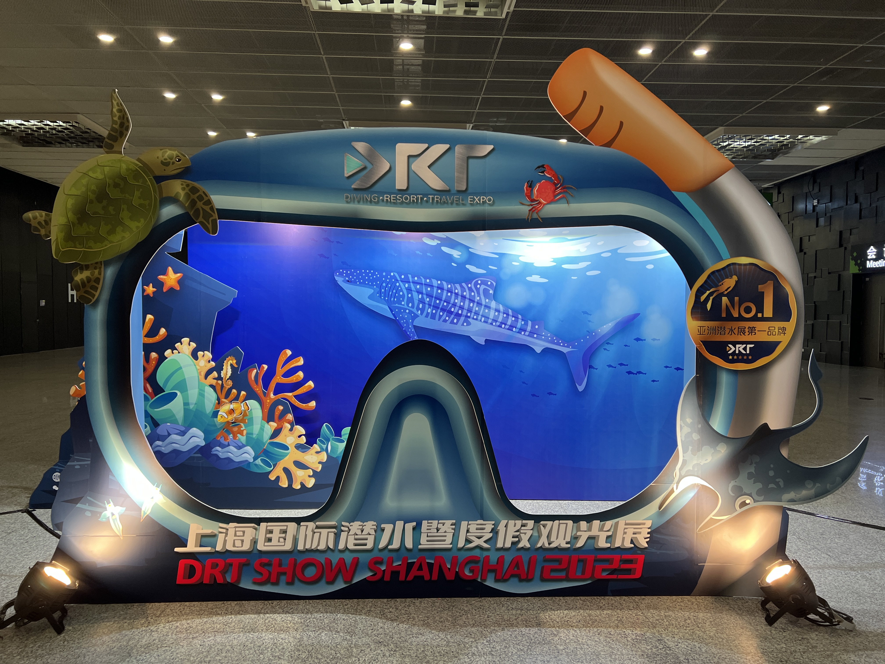