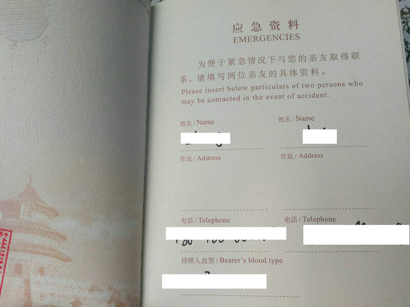

## 源起

疫情期间旧护照过期，今年换了新的护照，宝宝也申领了新护照，今晚发现新护照都没有留联系方式，赶紧补上，并分享一下经验。

## 应急资料页

新版的中华人民共和国护照，在第46页签证之后，有个应急资料页，这是很重要的页面！

原则上，护照上不能乱涂乱画，这一页是唯一可以自由发挥书写的页面✍🏻 正确留下必要的信息，能提高护照丢失后找回的概率，也有助于找到紧急联系人，一定要写哦！



<!--more-->

## 个人信息

页面上写了"应急资料"，下面用中英文设计了可以写两位亲友的姓名，地址，电话和持照人血型的格式。我觉得这个格式不算太完善，我自己是这样写的：

首先，最重要的是自己的联系方式！假设我在海外旅行时丢失了护照，此时我最希望捡到护照的人优先联系我，而不是远在国内且不会外语的父母。
所以 ，一定要留自己的联系方式！
我是这样写的：

```
My Email: nanjinglmm@gmail.com / mm.lou@qq.com
My Phone: +86-188-8888-8888 / +86-199-9999-9999
My WeChat 微信：lmmsoft
```

优先用英语，因为在国内的话，哪怕好心人没联系我，直接交给警察叔叔，我也有有很大希望被联系上。

我留的是邮箱，手机和微信，手机号前别忘了加国际区号+86，微信特地写了两个汉字，只会汉语的人也能看得懂。

希望好心人在海外通过邮箱，在国内通过手机号或微信联系我。邮箱和手机号各留了两个，可以防止某个账号出问题/字写得不清晰导致联系不上等意外情况的发生。

## 亲友信息

个人信息之外，两位亲友的联系方式也很重要：

我留的是妻子和父亲的姓名，电话，住址处写的是电子邮箱，信息时代，地址用处不大，而电子邮箱在海外比手机号更有用，一定要留哦！

妻子很有可能和我同行，所以在我们两人都联系不上的情况下，第三人很重要，我留的是父亲。

## 孩子护照

宝宝还小，暂时没有自己的联系方式，我在亲友处留了宝爸和宝妈的姓名，手机，邮箱。顶端空白处留了爷爷的姓名和手机，作为重要的第三人。


## 互动

你的护照写了联系方式么？写了哪些内容，欢迎评论区交流经验~