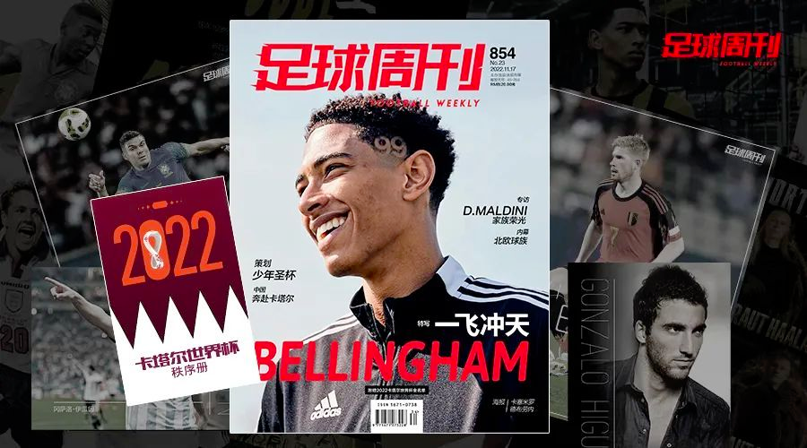

# 开放式学习笔记（第 001 期）

在这个系列中，我将记录下过去一周我看过并认为值得分享的内容。

我享受读书、看杂志、听播客、看视频。也一直在探索用不同的方式收藏和整理其中有价值的内容。

近期，我萌发了一个新的想法，与其记录一堆自己都不看的笔记，不如将这些内容直接公开分享，或许能给大家带来一点点启发呢。

为了减轻心理压力，不让自己过于焦虑，别太把自己当回事，我不会强迫自己按照固定的频率发布内容，随缘更新哈。

## [2022.11.17 《足球周刊》](https://new.qq.com/rain/a/20221118A01L7V00)

杂志20元，包含128页全彩杂志，海报2张，还附赠2022卡塔尔世界杯全名单。

好几年没买足球杂志了，这次网上购买，完全是因为世界杯足球赛，冲着这一期附赠的全名单去的，有助于看球时了解球队和球员。

后来证明名单对看球很有用，没看名单时，解说里提到的很多球员都对不上，而赛前了解下双方球员，踢什么位置，在哪个俱乐部，年龄身价等等，对观赛帮助是很大的。

杂志和杂志里的海报倒是闲置了。海报是卡塞米罗和德布劳内的俱乐部球衣的照片，都不是让我有冲动贴在墙上的海报。

时隔大半年，我找了一个晚上快速翻完。这些年看报纸和杂志的习惯没变，从第一页到最后一页慢慢翻，没有推荐系统干扰，能避免信息茧房，看到更丰富的内容。

下面介绍一些对我有收获的文章。

## 《希望之杯》⭐⭐

"足球让我相信历史会有曲折，但时代终究会向前推进，因为年轻人的力量一定会爆发出来，就算出现一代两代懦弱的犬儒，青春的力量同样会在某个时刻迸发。"

"我想看到更多的英雄主义，听到更多发自年轻人内心的声音。"

"这是我对世界杯的期待，我对分裂的世界没有药方，也不寻找药方，但我不会停止对青春的期待，因为每一次青春的胜利，都是人类重新联合的起点。" ——王勤伯
<!--more--> 

## [《少年圣杯》](https://new.qq.com/rain/a/20221121A00R0800) 
介绍了一些在世界杯上年少成名的故事。

## 《小小鸟之歌》⭐⭐
回顾了从1958到2018每届世界杯年龄最小的球员，有终成巨星的贝利，罗纳尔多，里维拉，埃托奥，也有很多高开低走的球员，比如和我同年同月同日生的英格兰"小老虎"沃尔克特，17岁就去世界杯的高光毁了他，后来没有达到应有的高度，再没参加过世界杯。

## [《球探的自我修养》⭐⭐⭐](https://new.qq.com/rain/a/20221225A022YK00)
1. 英格兰4级职业联赛，每家俱乐部都有完备的球探系统
2. 顶尖和传统水平和球探部门的区别：传统只评估球员天赋和潜力，顶尖还要考察目标的家境、个性、精神意志。全面的评估还包含精神状态、与周边人的关系、学生时代的过往等。
3. 比如会关注球员的社交账号，关注的对象，有哪些粉丝，网上发生过什么事。夜生活和女孩对一名刚赚大钱的年轻球员的有很大影响。如果每周花很多时间看不同女孩的照片，这就是一种警告⚠️
4. 关注球员把钱花在哪里，比如皇马放弃引进了一个年轻才俊，因为他把钱都花在赌场
5. 关注共同利益，各方面的利益，和球员身边的人聊天，最好是妻子。比如球员身边出主意的人要能融入俱乐部的计划。身边的人不靠谱是不行的🚫
6. 对于南美球员，考察是否有欧盟护照，是否有前往欧洲踢球的心理素质和文化素质。
7. 收集信息，报考关注业余联赛的当地记者，青训营教练，经纪人，出租车司机。交叉求证。

## 《马尔蒂尼》
老马尔蒂尼和大马尔蒂尼都为AC米兰获得过重要的荣誉，而26岁的克里斯蒂安效力于意丙，21岁的丹尼尔从米兰租借到斯佩齐亚，新赛季又租借到恩波利，很有可能和齐达内的儿子一样，未能踢出来啊。这个姓氏太沉重了。
大马尔蒂尼说过：“做一个球员的儿子比做一个球员的爸爸更受折磨”

## 《龙之家族》
讲述的是兄弟踢球的故事，姆巴佩的弟弟在巴黎青年队，哈兰德的弟弟在挪威，贝林厄姆的弟弟在伯明翰。球星弟弟受到的关注会高于普通球员，但是影响要比作为球星的儿子小。

## 《波折》⭐⭐
讲的是70年代伊朗足球的辉煌，统治了亚洲，政府和高层对足球的投入也很大，但是巴列维王朝走到了崩溃的边缘，西化改革不成功，君主的独裁，秘密警察等让老百姓不满。

伊斯兰主义者霍梅尼在国外领导了反抗运动，共产主义也影响了年轻人。

大家以为国家会新生，结果事与愿违，霍梅尼创建伊斯兰共和国后，宗教人士无法理解和控制足球——这个现代化、西方化的运动项目，后来10年都没有足球联赛，严重倒退。

## 《争强"浩"胜》

讲的是在中超山东队踢球的韩国球星孙准浩，当时入选韩国国家队，参加世界杯，走向职业生涯巅峰。现在已经因为赌球在山东被抓了。

## 《哨声响起来》

讲的是卡塔尔世界杯的裁判，最大的亮点是首次有女裁判执法，这几个女裁判都有丰富的执法经验，比如日本人山下良美，执法过2019女足世界杯和2020东京奥运会，也是第一位执法日本J1联赛和男足亚冠的女性主裁判。

## 《中东集结号》
采访了一些参与卡塔尔世界杯周边工作的中国人。
- 有选拔上的官方志愿者，后来从事媒体内容制作的工作。
- 有B站UP主，主要是视频制作，用VLOG记录所见所闻，也有探营和后方连线工作。
- 有媒体公司创始人，商务工作，服务品牌客户，在前方帮助他们制作视频，涉及创意、拍摄、剪辑、当地资源和对接和梳理。主要展现球场外有趣的地方。
- 有体育主播，能被选上去前方特别开心，提前到了卡塔尔，开始在代表性的地方么拍摄。

## 其他
后面有专栏，介绍了球衣、球鞋、游戏等世界杯周边装备。

足球地理，介绍的是卡塔尔赖杨。

每次世界杯也是商业盛会，比如电视机品牌会推出新品。类似的游戏、球衣、球鞋、球探、啤酒等也是，甚至应该还包括义乌视角，分析谁会夺冠。

## 总结

通盘来看，两个"对比"和三个"对应"很有意思：

两个"对比"是志愿者对世界杯的热爱：
- 选上官方志愿者酪王说志愿者们对工作都特别热情，东京奥运会是这样，卡塔尔也是这样。
- 最后的专栏中，记者武一帆提到，上届俄罗斯世界杯的采访很不顺利，媒体班车不按时出发，经常无故取消，让人苦不堪言。因为这些志愿者并非"志愿"。
- 评："热爱能抵挡岁月漫长"，希望大家都做热爱的事情~！

三个"对应"是聚光灯下的少年，年少成名的球员很多，但是聚光下的压力也很大
- 参加世界杯的青年才俊，很多没有兑现潜力
- 马尔蒂尼的两个儿子，应该都没能踢出来（大儿子意丙，二儿子继续被租借），齐达内的前两个儿子也是（大儿子前锋，二儿子门将）。
- 球探文里，介绍开始赚大钱的年轻球员，容易在夜生活和女孩中迷失。比如英格兰的媒体和小报太厉害，曝光了太多年轻球员的花边。。。
- 评：年轻人，还是低调的猥琐发育吧~