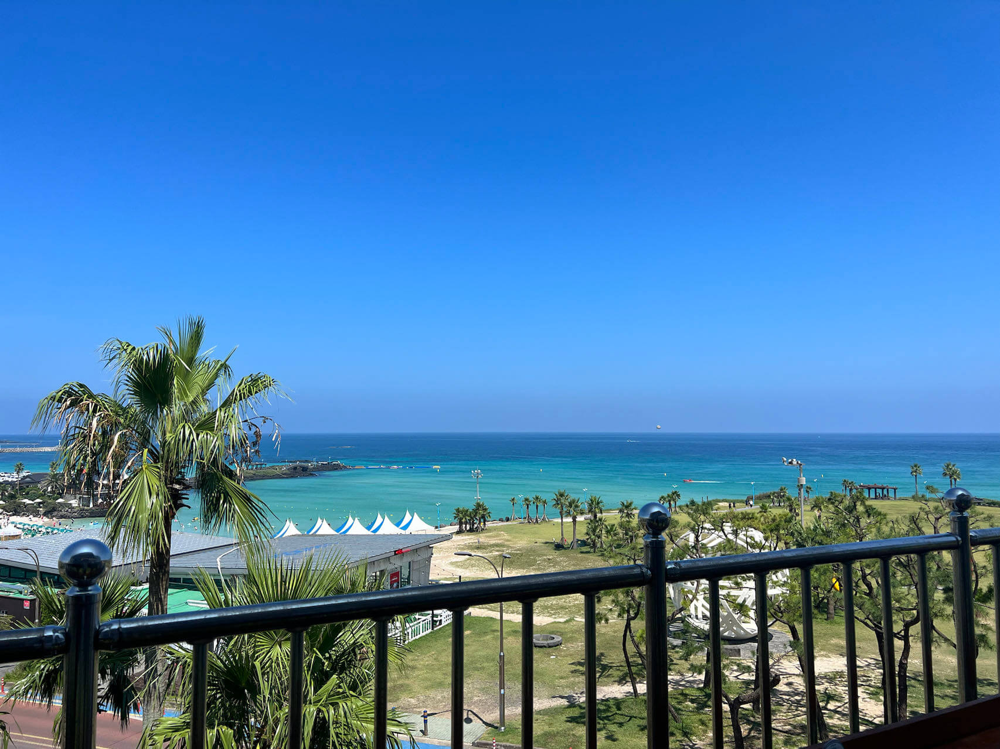
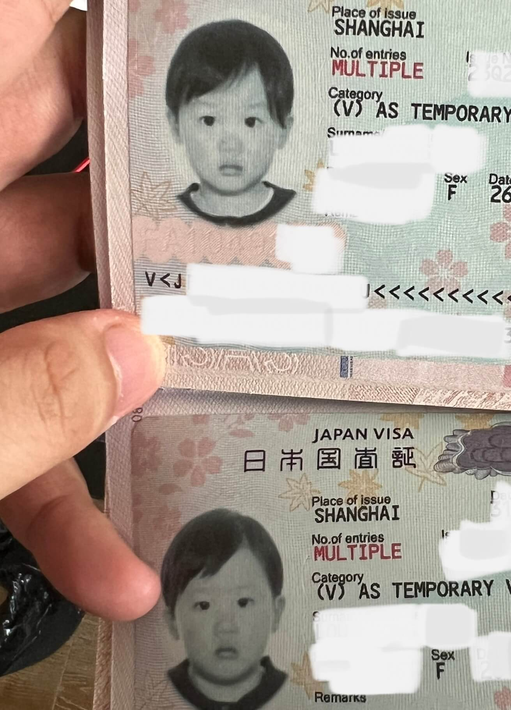
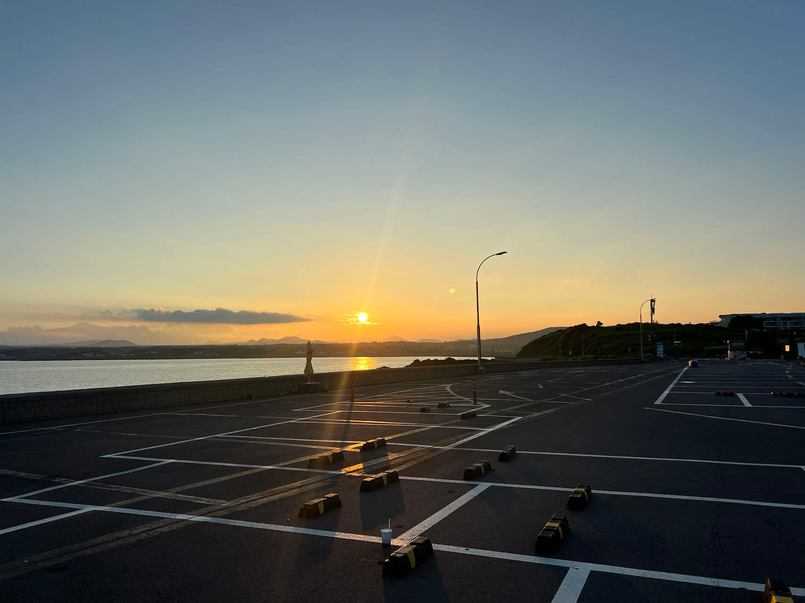
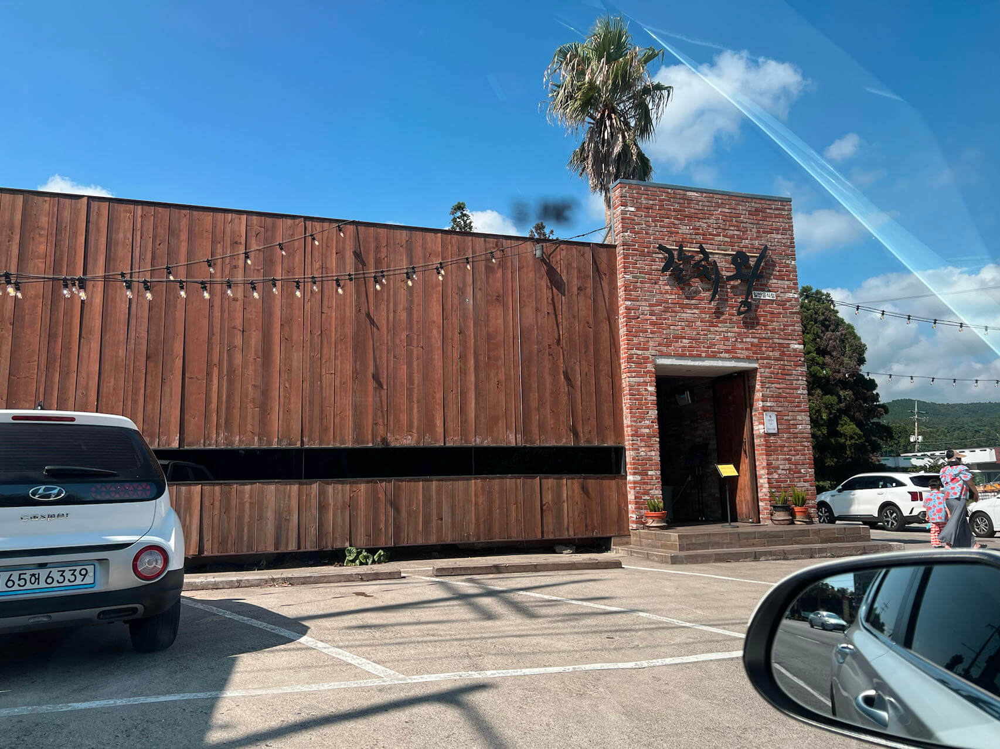
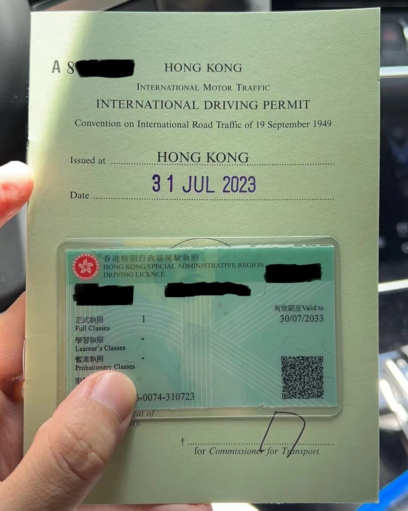
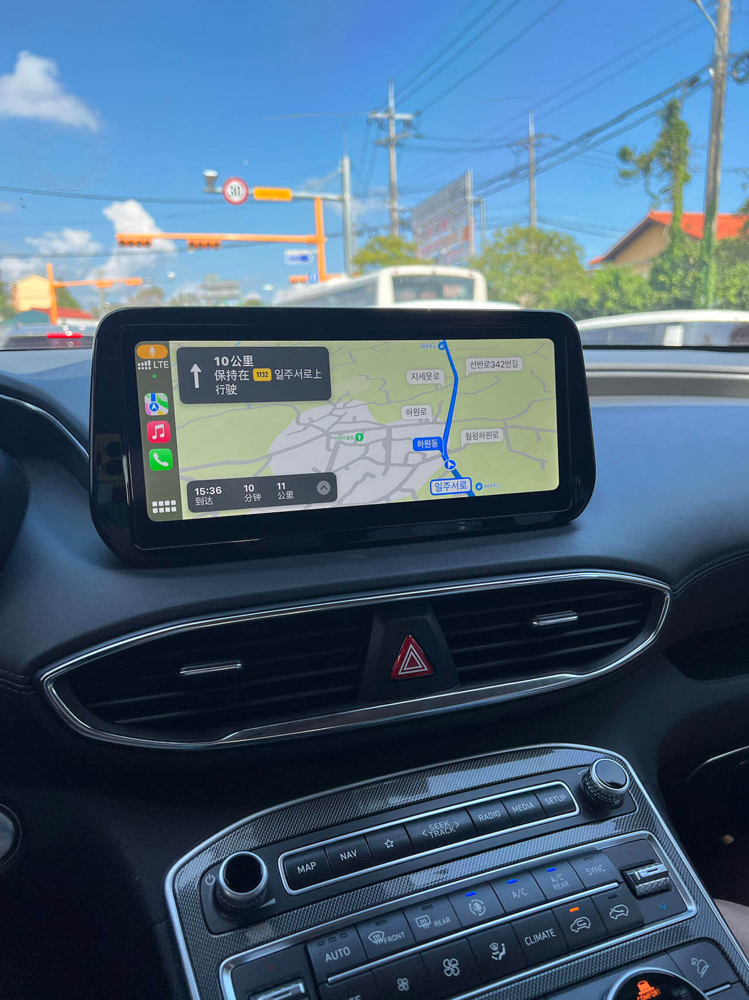
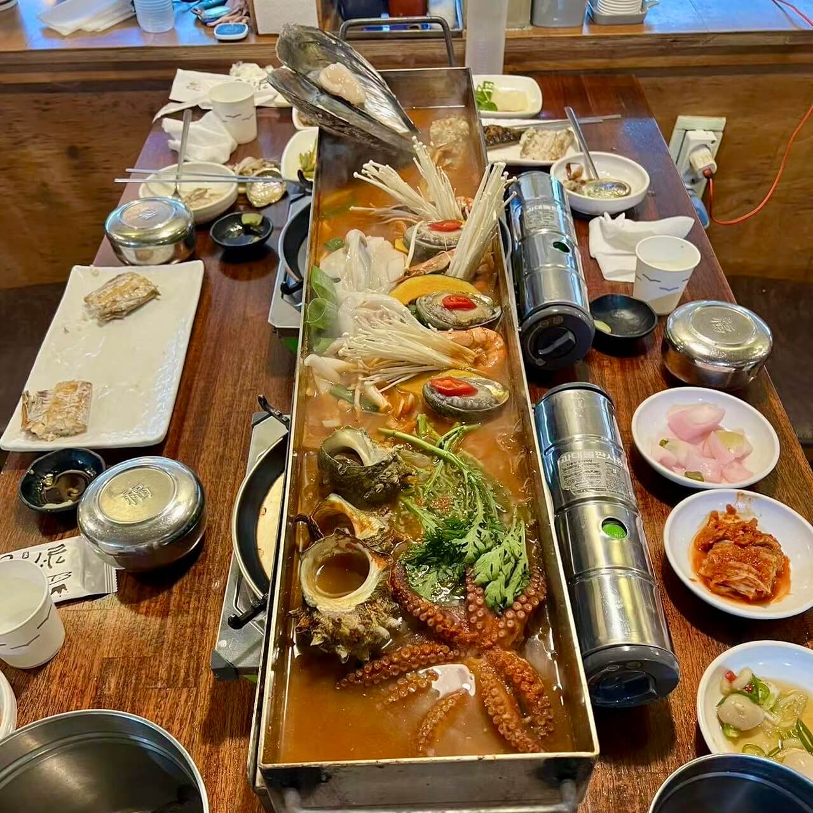
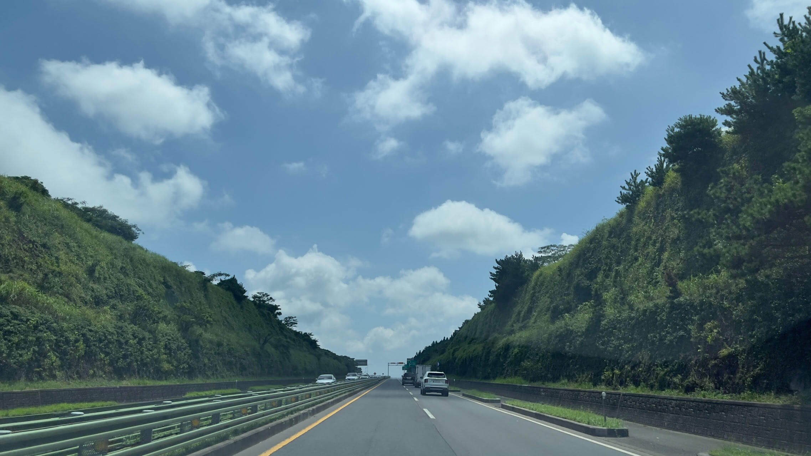

(图：济州岛的海滩)

最近身边发生了两件旅行中的"曲线出国"的故事，颇有启发，分享一下。

## 故事一：大国签证

疫情之后，菲律宾个人旅游签证变得非常麻烦和昂贵，淘宝上均价约 2500 元，而且需要三人团办，同进同出。
这让很多想去菲律宾潜水的人非常困扰，尤其是一些潜水教练，我在潜水群里就经常看见教练拼团办签证。
<!--more-->
但是，中国人有一种曲线的办法可以免签进菲律宾，就是拥有有效的发达国家签证，包括申根、日本🇯🇵、美国🇺🇸、加拿大🇨🇦、澳大利亚🇦🇺签证等。根据菲律宾的规定，在这些国家的签证到期之前，可以前往菲律宾，有转机或往返机票就行。默认7天，还可以续14天，最多停留21天。

于是，一些人采取了这种办法，办一个日本的单次签证，在单次签证使用有效期到期之前，前往菲律宾，再从菲律宾前往日本或回国。
但是，如果去了一次日本，单次签证过期，就没有办法了。

更好的办法是办日本的多次签，包括三年多次或五年多次。满足一定的纳税条件就能委托旅行社办理，比申根、美签等容易一些。

根据领区和材料不同，价格也略有区别，三年多次一般小几百元，五年多次大几百元。

我就是办的五年多次日本签证，2500元的单次菲律宾签，够给全家四口办日本签证了，能省不少钱呢。

(图：宝宝的日本签证)

由此展开，持有很多大国的签证，都有附加的福利。

比如日本签证，不仅能免签往返菲律宾，还能过境韩国🇰🇷、新加坡🇸🇬、中国香港🇭🇰、墨西哥🇲🇽、格鲁吉亚🇬🇪等国家。

再比如申根签证，除了26个申根国外，还有很多其他欧洲国家也可以免签入境，主要在巴尔干地区，包括克罗地亚🇭🇷、罗马尼亚🇷🇴、阿尔巴尼亚🇦🇱、波黑🇧🇦、北马其顿🇲🇰、塞浦路斯🇨🇾等。

美国签证在拉美特方便，可以免签墨西哥🇲🇽、洪都拉斯🇭🇳、多米尼加🇩🇴、巴哈马🇧🇸、百慕大🇧🇲、哥斯达黎加🇨🇷、哥伦比亚🇨🇴、智利🇨🇱、秘鲁🇵🇪、阿根廷🇦🇷、乌拉圭🇺🇾等很多国家。亚洲的菲律宾🇵🇭新加坡🇸🇬也都能免签过境。

(图：济州岛海边的停车场🅿️)

## 故事二：变相拿国际驾照

第二个故事发生在宝妈身上。

宝妈八月底和大学同学去韩国济州岛玩，济州岛对中国人是免签的，所以不需要办签证，比较方便。（插一句，韩国的签证办理很麻烦，最麻烦的地方是要刷身份证原件，大家被迫得把身份证寄给旅行社，期间自己出行就不方便了，这让人很困扰）

在济州岛怎么玩呢？大巴很难等，包车太贵，最方便的方法是租车自驾，需要有国际驾照IDP。

(图：韩国自驾)

而我们中国内地没有加入维也纳国际道路交通公约，导致外国人的国际驾照在大陆不能用，中国人的驾照也不能换国际驾照，网上十来块钱就可以做的驾照翻译件其实是打的擦边球，不算正规的国际驾照，只有少量国家可以凑合用。

宝妈找到了一个迂回的办法，就是先办香港驾照🚗 可以凭借大陆驾照 + 港澳通行证/香港居民身份证先换香港的驾照，再凭香港驾照 +
香港身份证 换IDP国际驾照。

(图：宝妈的香港驾照+国际驾照)

于是，宝妈在淘宝上找了一个代办的商家，花了 1000 元换到了香港驾照，又花了 300 元换到了香港签发的国际驾照，全程10天左右，就拿到了国际驾照。

开开心心去济州岛自驾租车咯，租的是现代的SUV Santa Fe（我们以前在新西兰北岛自驾也是这个车型）。

(图：韩国自驾，使用 CarPlay + 谷歌地图导航)

有了驾照可以自驾之后，旅行就愉快很多。想去海滩，随时出发，非常的灵活和自由，海滨公路让她和朋友们度过了一个愉快的周末。

需要注意的是，想用香港驾照换国际驾照，必须要有香港居民身份证。据说以前可以用港澳通行证换到国际驾照，现在口子被堵上了，港澳通行证只能换香港驾照。

(图：宝妈说只有自驾才能到达的带鱼餐厅， 名叫 "갈치왕 중문점"，地址是 "1146, lljuseo-ro, Seogwipo-si, Jeju-do (Zip Code)63534")

## 总结

上述两个小故事饶有趣味，也颇有启发。

出门旅行时，有些手续看似繁琐，但只要仔细研究规则，通过一些别的办法，也能够降低成本，达到目的。

生活中的其他领域也是如此，较高的合规成本，往往也会留下一些口子，供有想法的人去突破。

(图：行驶在济州岛的高速公路上)