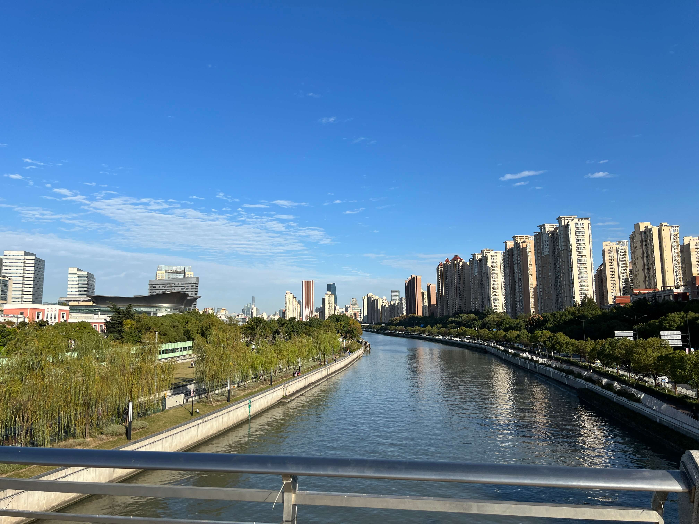

十年前我住苏州园区的时候，就经常骑车跨过吴淞江上的车坊大桥，往同里方向郊游。现在在上海工作，住的地方离苏州河不到1公里，也经常沿着河两岸跑步和骑车。

从同一条河的上游搬到了下游，办公地点到河边的距离从3.5公里降到了1公里，让我对吴淞江(苏州河)有了更丰富的感情，一直想更深入了解它。

今天是周六，中午饱食午餐，下午又睡足午觉，睡醒快三点，时间有限，去不了太远的兴趣点，于是选择了离家不远且一直想去的**苏州河工业文明展示馆**。

苏州河两岸的工业文明，见证了上海的发展，展览还不错，展馆三楼的咖啡厅还给了我意外之喜☕️
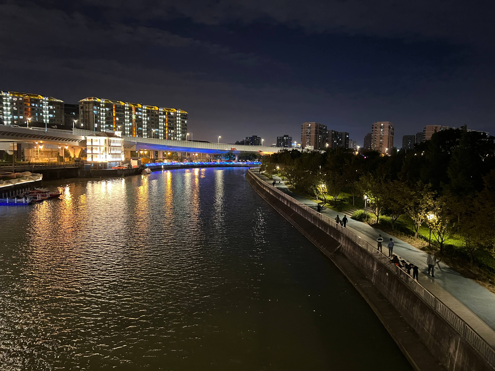

<!--more-->
## 半马苏河公园
从家骑车到苏州河工业展览馆很近，4公里，15分钟就到了。

展示馆位于上海市普陀区，中环内，苏州河北岸，半马苏河公园里，旧址是上海眼镜厂。附近几个公园连成了半马苏河公园，可以在公园里的滨河跑道完成21公里的半程马拉松跑步，上周的上海10公里精英跑步比赛就在这里举行。
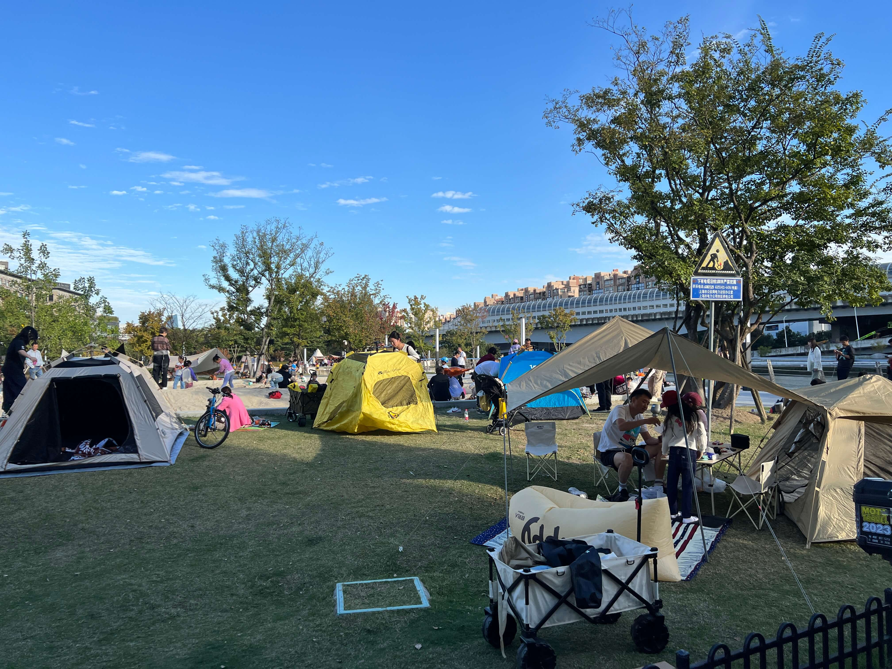
公园里有不少帐篷在露营，还有一块专门的沙地，是孩子们的乐园，宝贝们铲沙子，玩得不亦乐乎，沙坑外还有专门的水龙头，可以洗手冲脚，特别方便。此外，公园外还有一个游船码头，虽然暂时游船还没有停靠。

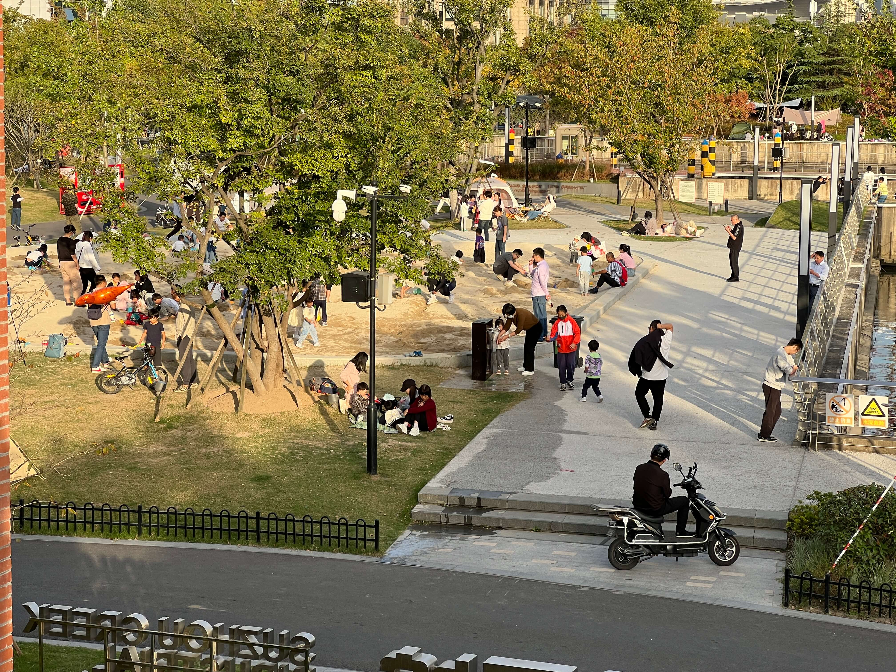
公园非常漂亮，各种花草树木，跑道自行车道，还有一些长椅供人们休息。我沿着河漫步了一会儿，感受到了大自然的美好，心情格外舒畅。

## 苏州河工业文明展示馆
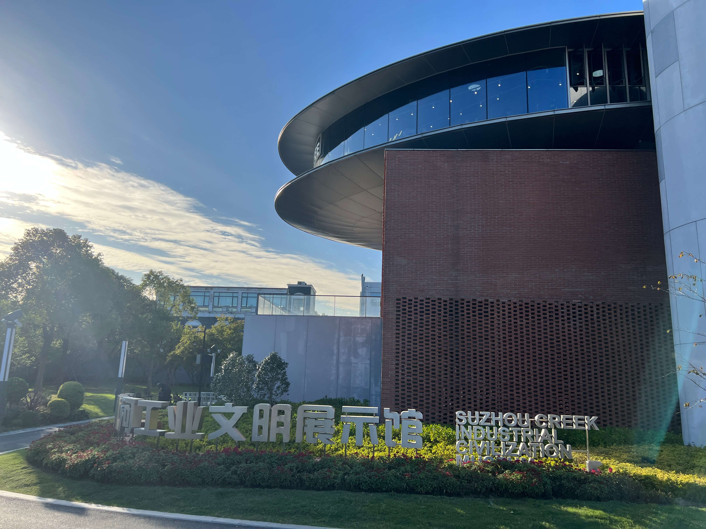
展示馆是个三层建筑，位于公园一角。进入大门后，可以看到一个七五型双柱立式冲饼机，这是上海造币厂自制的机器，曾用于生产1、2、5分硬币，一直用到了2000年。

后面墙上有习总书记的寄语："挖掘苏州河百年工业文明，传承历史文脉，着力发展水岸经济，促进沿岸文化创意的集聚"。
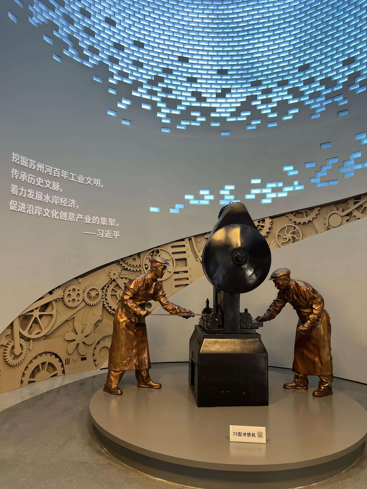
进门左手的服务台可以拿到两本册子，一本是苏州河工业文明展示馆的介绍册，另一本是2023.10普陀区文旅资讯介绍册。里面列举了上百个展览、文化活动、文艺演出，这只是普陀一个区一个月的量，太丰富啦！

## 第一展区：回眸，苏州河的历史记忆
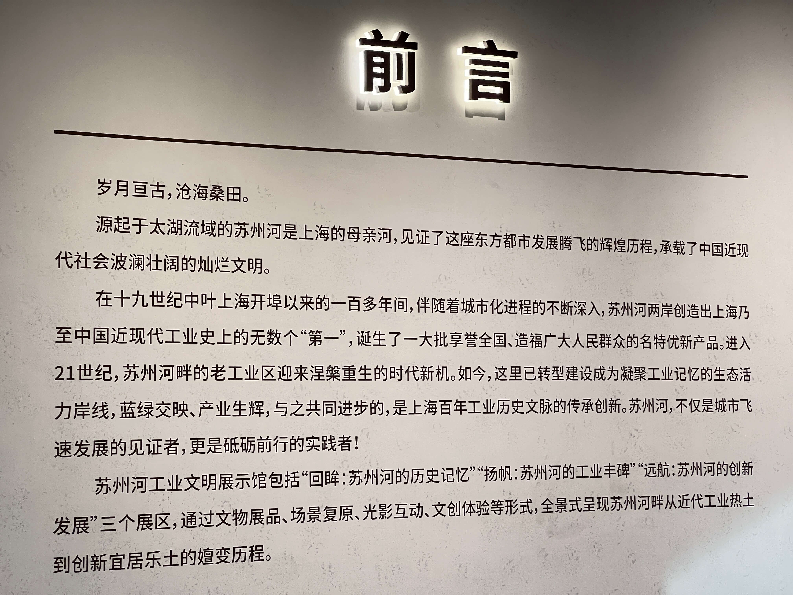
进门后，右手边是第一展厅：名为“回眸，苏州河的历史记忆”。

首先介绍的是苏州河的历史。

相传大禹治水疏浚了太湖三大泄水道：松江、娄江和东江。
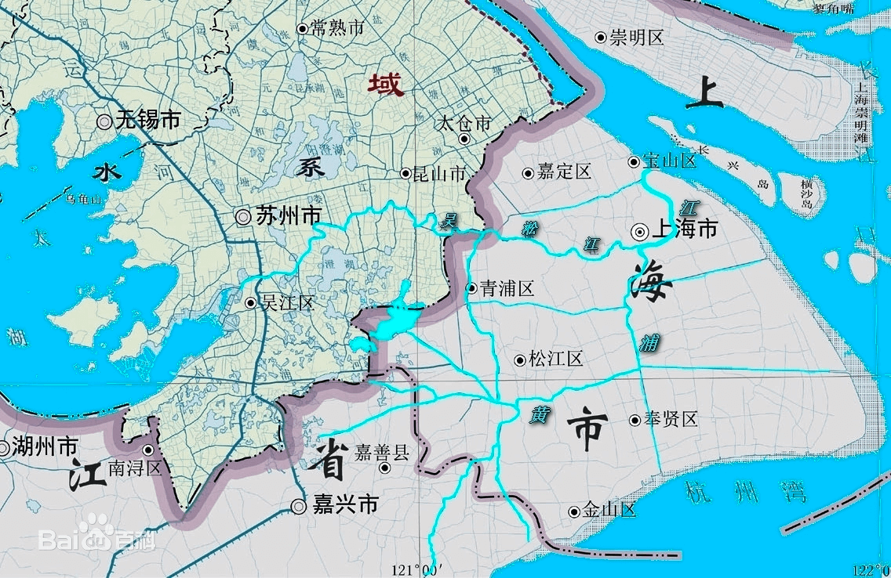
娄江在北边，发源于苏州娄门，经昆山，太仓浏河流入长江。
东江在南边，现已不存。
松江在中间，也就是现在的吴淞江，水量最大。一直都是江南重要的航道，唐朝时就有很多船只在通航，宋朝之后，由于泥沙淤积，河道变窄，直到明代中叶才重新疏浚、改道，从今天的外白渡桥处流入黄浦江，并从吴淞口汇入长江。

苏州河原名吴江、松陵江、松江、吴淞江等。苏州的吴江区，上海的松江区，都是用吴淞江的旧名来命名的。

苏州境内80公里，叫做吴淞江，上海境内50公里，地图上的名称是"吴淞江(苏州河)"，因为上海开埠后，洋人发现沿着这条河可开船到当时的江南贸易中心苏州，于是就称其为"Soochow Creek"，后来写入了很多租界的文件中，于是这条河在上海市区又被称作苏州河。
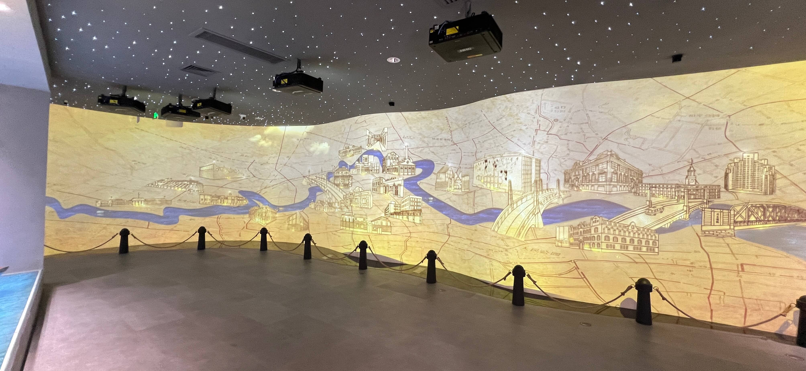

## 第二展区：扬帆，苏州河的工业丰碑

### 上海开埠，万商云集

第一次鸦片战争之后，清政府签订了《南京条约》，1843年11月17日，上海开埠，正式成为对外开放的通商口岸，许多外国人来上海进行贸易。

初期，英美企业凭借特权最先利用苏州河这条黄金水道，以及中国廉价的原料和劳动力，赚取了高额利润。
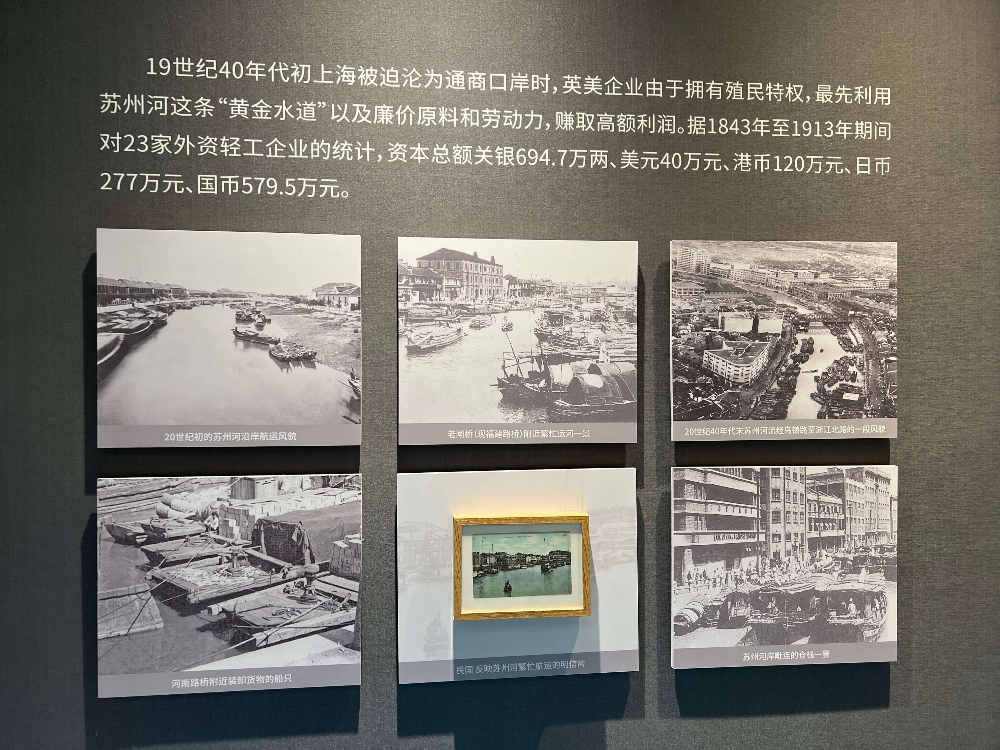
随后，西方列强对华贸易的第一口岸就逐步从广州转移到上海。上海也逐渐发展成为贸易中心，金融中心，航运中心，这也极大地推动了上海内河航运的兴盛。1919 年的统计数据显示，每天在苏州河口行驶的载重 10 到 90 吨货船共有 1858 艘，这个数字表明，苏州河的船舶货运量比沪宁、沪杭两条铁路的任何一条都要大 5 到 6 倍。苏州河两岸的行业码头也非常密集，米、酒、水果、砂石、木材、土产、垃圾、粪便等什么都有，令人眼花缭乱。

于是，沿着黄浦江和苏州河两岸，出现了工业文明。20 世纪上半叶，苏州河两岸的工厂企业占据了全市近一半的份额。

### 名族工业发源：筚路蓝缕，实业救国
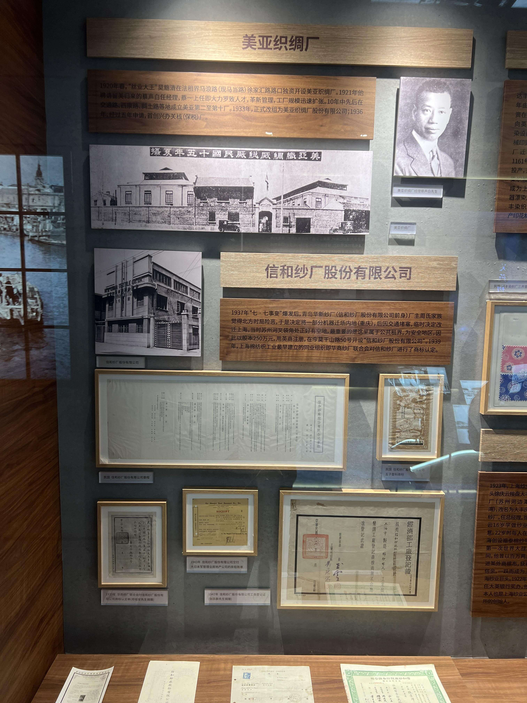
苏州河沿岸地区也是中国近代民族工业的发祥地，留下了大量的工业遗产，这里讲述了名族工业的起源。

在外企中工作的高级职员，学习了西方的智慧和管理经验，然后集资，创立了很多民族企业，移植西方的经验。

尤其是在 1914 年到 1918 年第一次世界大战期间，西方列强把注意力转移到了欧洲战场，中国民族工业获得了很好的发展机遇。1919 年的五四运动后，民众又开始抵制洋货、振兴国货，苏州河畔的中国民族企业因此得以发展壮大。在这里，我们可以看到诸如抚风机器面粉厂、机器榨油股份公司、福星面粉厂、裕通面粉公司、天厨味精厂、纺织公司、染织厂、纱厂、织绸厂等众多民族企业。可以看到这些工厂的一些照片、股权、票据等。

比如光复西路 17 号，中远两湾城附近的河岸上，当年是中央造币厂，是民国为了统一银元而建立的，现在有上海造币博物馆。

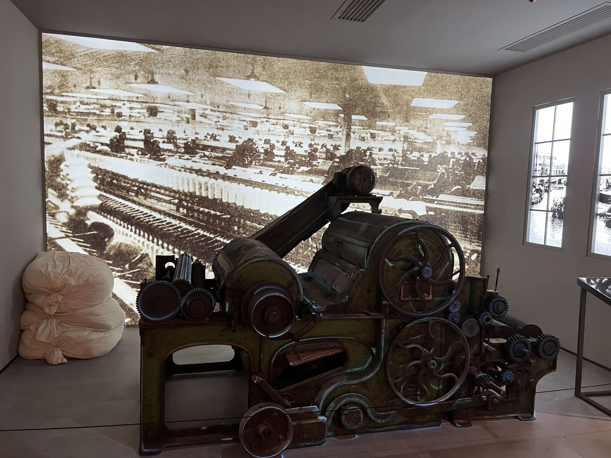
图：1920 年的英国青花机头，这是苏州河畔原来一个纺织厂的生产设备，由英国一家公司生产，用于将棉花纺成纱。

然后上楼梯进入二楼展览，楼梯道两侧是一些苏州河和沿岸的老照片，展现了老上海苏州河畔的繁华。
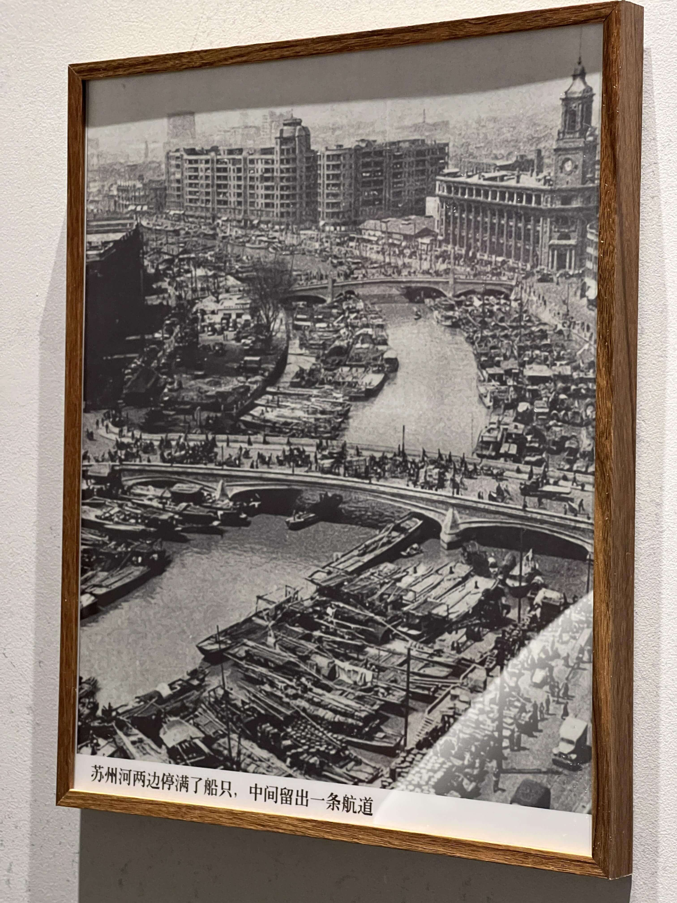

### 公私合营，续写辉煌
二楼的第一个主题叫做“公私合营，续写辉煌”。
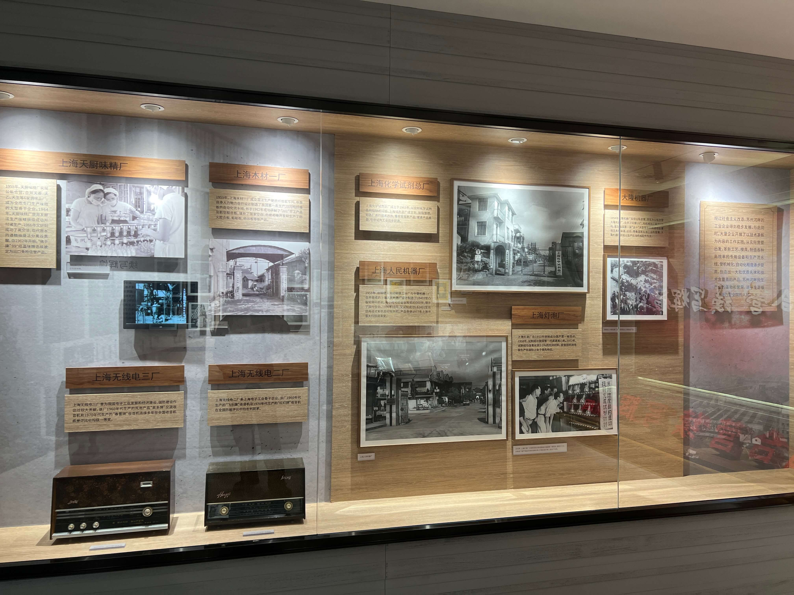
建国后，上海百废待兴。1953 年到 1956 年，上海市委市政府按照党的过渡时期的总路线，对资本主义工商业进行利用、限制和改造，逐步将资本主义私人所有制转变成社会主义全民所有制。当时，荣氏家族等代表企业就位于苏州河畔，这些企业都经历了这样的过程。

这时展示的一些厂的照片和产品明显变了，都变成了“上海某某厂”，比如上海天厨味精厂、上海木材一厂、上海无线电二厂、三厂、上海人民机器厂、上海化学总厂等，还展示了无线电厂的半导体收音机实物。
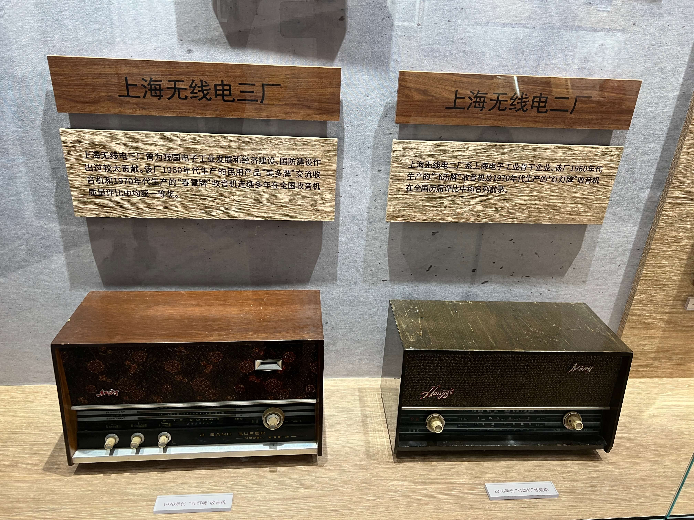

其实当时公私合营也遇到了很多问题，对于当今的私企退潮也很有启发，但这里的展示过于正面，没有提到这段曲折的转型。

### 改革开放，产业转型
1978 年 11 届三中全会召开，拉开了改革开放的大幕。苏州河畔原有的产业结构持续深化转型升级。 

产业方向调整了，优先发展轻工业等日常生活日化制造领域，推动了生活物资由短缺到丰富的巨大转变。

除了工厂之外，苏州河附近还建起了很多综合市场，有小商品市场，禽肉蛋交易市场、农商超市、上海物贸中心等。1996 年，麦德龙在中国的第一家商场也开设在普陀区。

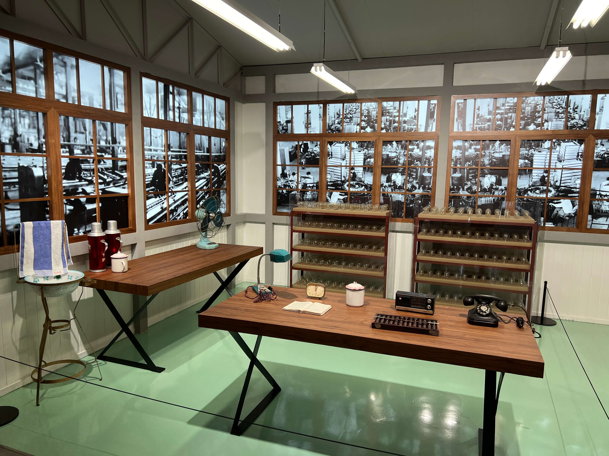
图：复原了工厂车间的办公场景

曹杨新村建于 1951 年，是新中国建设的第一个工人新村，有两万户。后来在 20 世纪末进行了旧改。

河边的“两湾一宅”，潘家湾、潭子湾和王家宅旧改是当时上海最大的旧改工程，1998 年启动，七年建设，“两湾一宅”棚户区变成了现在巨大的"中远两湾城"社区。

这里的照片里提到了住宅的旧改，但工厂的旧改，是怎么把工厂逐步搬走，搬到哪里，没有看到。

## 第三展区：远航，苏州河的创新发展

下一个主题是“创新、发展、远航”。从 90 年代起，上海启动了苏州河环境综合治理工程，对两岸公共空间进行了综合治理。到 2020 年末，苏州河 42 公里的滨水岸线基本都贯通了，把河岸还给人民，河边还建设了多个创意园、创意产业园等。

截止到 2021 年底，上海中心城区的苏州河上一共有 31 座桥梁，还有 7 座正在规划建设中，有路桥，也有一些只通行人的步桥。

两岸建了很多游步道、骑车道、绿地，景色特别好看，老百姓也可以享受这样的城市河岸生活。这里还展示了一些苏州河相关文创产品。

## 补充，水质的演变
回来查了一下资料，展馆翻新过一次，老馆是 2014 开馆，2021年原拆原建为现在的新馆。在老馆的展示里，有提到水质的变迁：

古代，河水没有污染，甚至《后汉书·左慈传》里提到“所少吴松江鲈鱼耳”，吴淞江的鲈鱼美味，让身在中原的打工人怀念故乡。

开埠前，上海还是农业社会，两岸居民在河水里洗衣淘米。

开埠后，水路物流走向兴盛，河水开始慢慢浑浊。

工业文明发展，河水污染加剧，开始季节性发臭。

建国后，工业继续发展，河水终年乌黑发臭。

转型：二十世纪九十年代初起，产业结构大调整，新兴产业在河畔崛起，水质逐步变好。

现在：两岸高楼林立，岸边是绿树成荫，再也听不到码头工人劳动的铿锵号子声，而工业遗产却是星罗棋布。
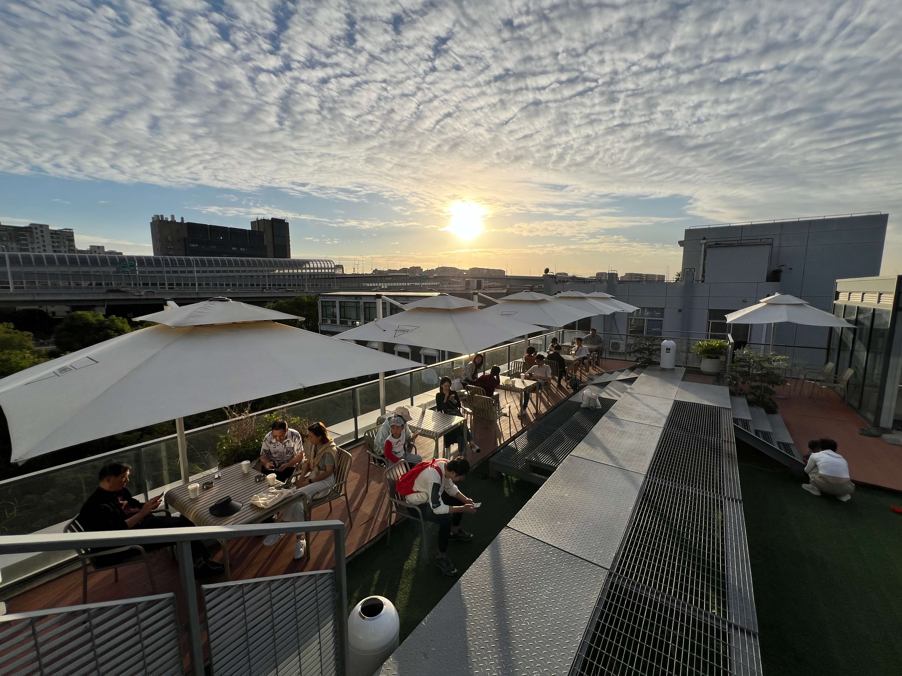
## 不足

回来查资料，二楼有个苏州河2035的短片展示，评价不错。可以今天没有播放，一直是静止画面。

转型的阵痛没有提到，建国后公私合营、90年代起工厂外迁、都是痛苦的转型过程，应该很有启发，但是没有找到，有点遗憾。

展馆后面的玻璃房子里，有两个大的机器在展示，好像也没有开门。
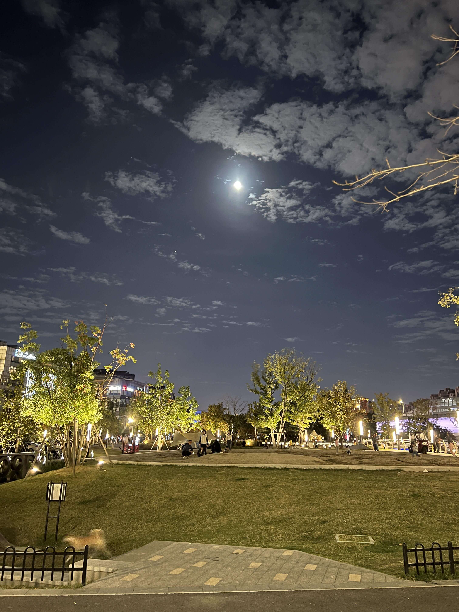

## 意外的收获：三楼咖啡厅
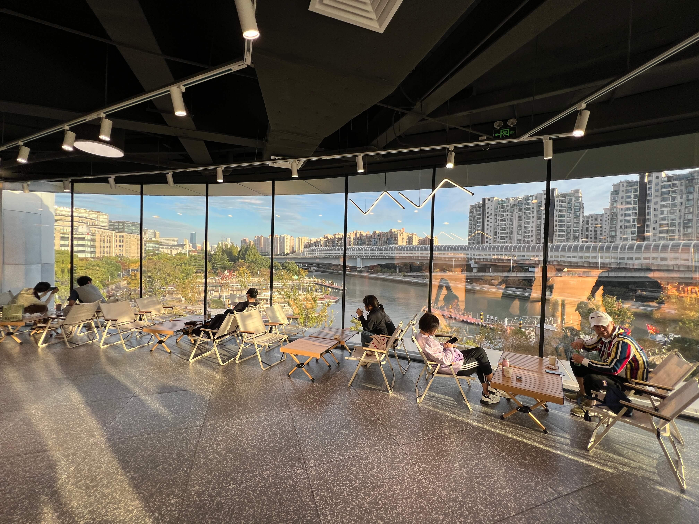
展览馆三楼是 Manner 咖啡，环境非常优美！中间是制作柜台，外面是一圈360度的环绕落地窗，室内有座椅、沙发、靠椅、长桌，既能看书办公也能举办活动，室外有遮阳棚和桌椅，游客可以一边品咖啡一边欣赏苏州河的美景，吹着凉爽的秋风，享受温暖的午后阳光，非常惬意。
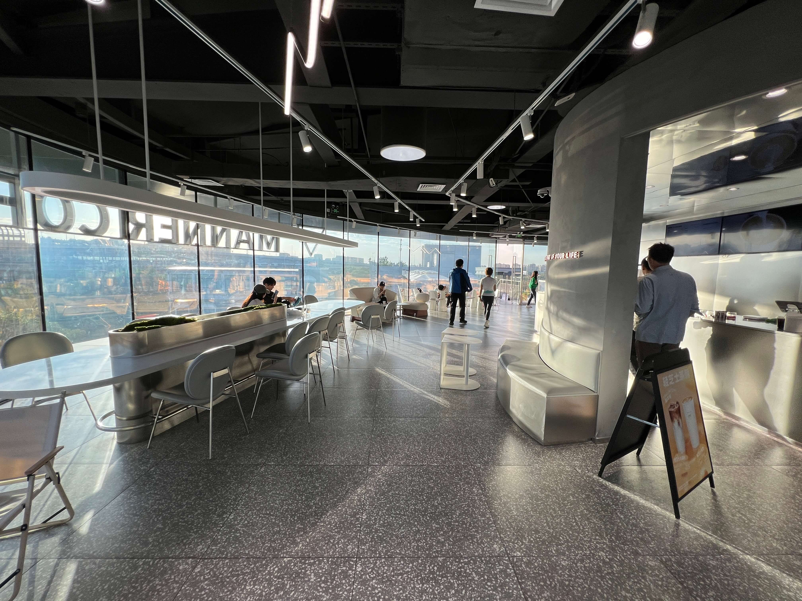

我在室外找了张桌子，拿出了新买的折叠蓝牙键盘⌨️连上手机📱完成了这篇文章，便携又高效。

iPhone外接键盘的体验不错，搜狗输入法支持双拼，还能使用自然码方案！就文本编辑体验而言，明显好于手指输入，和MacOS差距不大！

## 后面怎么玩？

每篇游记的最后都会畅想下面怎么玩，这里也不例外：下一步我想乘坐苏州河上的游船！
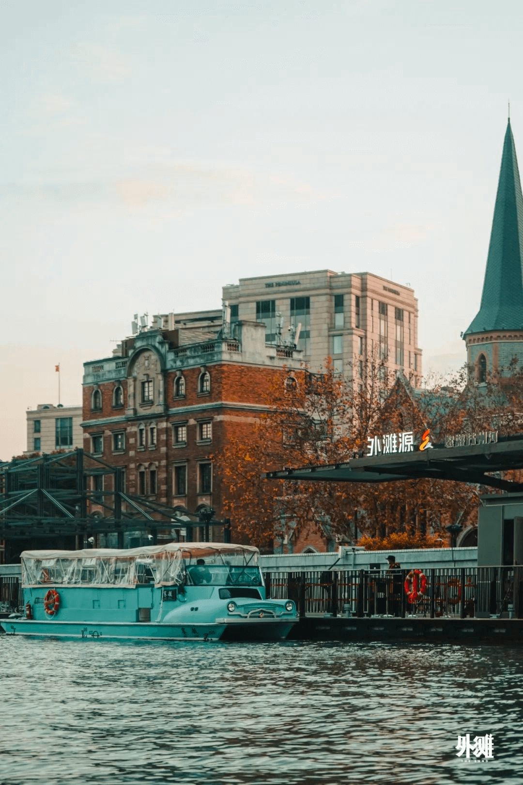
2022年苏州河上的游船恢复了。有五个码头可以上下，从靠近外白渡桥的外滩源码头，经过四行仓库码头、昌化路码头、中山公园码头，终到长风公园码头。全程票价约160元，船程1.5小时，白天和晚上的航线都有，全程、分段、折返的路线也都有，可以在小程序**“悠游苏州河”**购票。

我计划从离我最近的长风公园码头上船，坐全程，到外滩源码头下船，找个周六的白天出发。

查了一下小程序，只能提前2天购票，全程的票比较抢手，中间分段的票不紧张，如果周末想坐的话，可能要提前几天的上午10点放票时第一时间抢票。
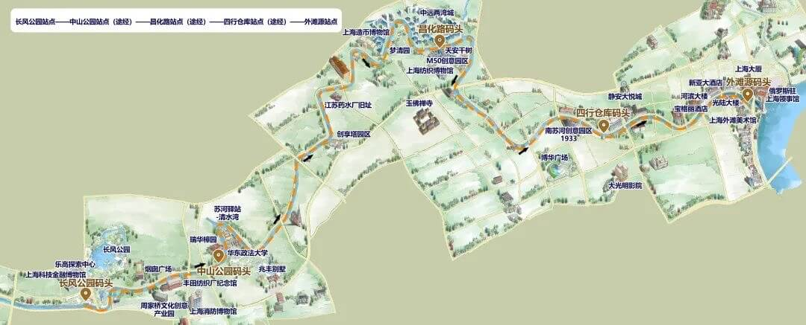

## 参考资料
- [苏州河工业文明展示馆_百度百科](https://baike.baidu.com/item/%E8%8B%8F%E5%B7%9E%E6%B2%B3%E5%B7%A5%E4%B8%9A%E6%96%87%E6%98%8E%E5%B1%95%E7%A4%BA%E9%A6%86/24609053)
- [吴淞江_百度百科](https://baike.baidu.com/item/%E5%90%B4%E6%B7%9E%E6%B1%9F/5402854)
- [一篇关于老馆的游记](http://menpiao.menpiao.net/?a=articleview&id=16840&incdots=yes)
- [苏州河开通游船，坐船看上海太美，票要提前抢](https://baike.baidu.com/tashuo/browse/content?id=242a130850dccbde411c4542)