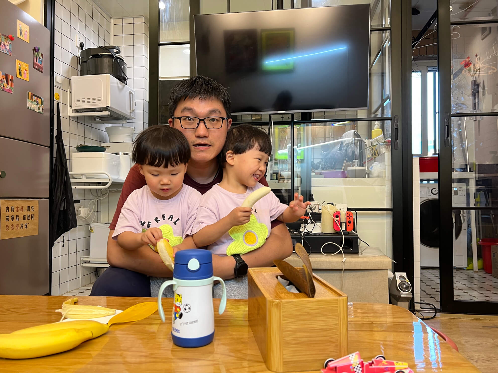

## 面试系列文章：
<!--more-->

1. [报名准备]()
2. [2023-10-28_民生幼稚园]()
3. [2023-11-03_嘉诺撒圣心幼稚园](/hk_kindergarten_interview_Sacred_Heart_Canossian_Kindergarten)
4. [2023-11-04_崇真小学暨幼稚园](/hk_kindergarten_interview_Tsung_Tsin_Primary_School_Kindergarten)
5. [2023-11-04_铜锣湾维多利亚幼稚园](/hk_kindergarten_interview_Causeway_Bay_Victoria_Kindergarten)
6. [2023-11-11_圣士提反堂小学暨幼稚园](/hk_kindergarten_interview_san_stephine_church_kindergarten)
7. [2023-11-14_小世界幼稚园](/hk_kindergarten_interview_small_world_Kindergarten)

## 学校介绍

维多利亚学校是一所以英语为主要教学语言的国际学校，提供从幼儿园到高中的课程。学校注重培养学生的全面发展，强调学术、艺术、体育和社会责任等方面的平衡发展。

学校的师资力量雄厚，教学设施先进，课程设置丰富多样，包括国际课程、双语课程和特色课程等。学校还注重培养学生的领导力和创新能力，提供各种社团和活动，让学生在实践中锻炼自己的能力。

总的来说，维多利亚学校是一所备受推崇的国际学校，拥有良好的教学质量和优秀的师资力量。如果您对该学校感兴趣，建议您进一步了解学校的课程设置、教学理念和校园文化等方面的信息，以便做出更全面的决策。

## 面试流程

铜锣湾维多利亚幼儿园地理位置十分便利，搭乘地铁东铁线从九龙塘出发，在又一城站下车，然后从九龙塘站乘坐东铁线到终点站红磡站，换乘港岛线往东方向列车，在天后站下车，出站后步行 1 分钟即可到达，几乎算是地铁上盖，交通非常便捷。

午餐后来不及去宝妈宿舍休息了，就直奔幼儿园，到了幼儿园后，先拿出之前报名时打印的报名表，进行预约。虽然前面也有一两个小孩，但速度挺快的。

进入幼儿园后，一楼有志愿者引导，中间坐着四个穿西装的工作人员，有男有女，他们会查看报名材料。这时候可以分为两部分，宝贝面试和家长面试，都要等一个多小时，边上有家长休息室，可以慢慢等待。很快两个宝宝都睡着了，爷爷抱了一个，妈妈抱了一个，在里面大概睡了一个小时。

## 家长面试：宝爸回忆
这是我们报名的唯一一个有家长面试的幼稚园，他们把这种见面叫做“家长见面”，依我看，实则是校方在面试家长，探一探家长心底对教育理念的看法。

### 面试前的波折开场
我们家派我去参加面试，肩头贴着条子，上面清晰写着孩子的姓名、英文名还有面试房间编号，一切有条不紊，依序走向面试房间。我家是双胞胎的情况被单独拎出来说明，工作人员告知，俩小孩年龄差距在一年半之内，便无需这场家长见面。

初到三楼，踏入学校报告厅，座椅规整排列，左右各十排左右，每排约八个座位，座上编号一目了然，前为房间名，后接数字，精准定位每个面试时段、每个面试室的具体序号。我虽是 2053 号，却来得格外早，提前了一小时。见前一小时的 2053 号还未开始面试，便坐在 2057 号后方静候。彼时，各个会议室遵循从左到右、由前往后的次序依次开展面试，我前方有人排队，只能乖乖等足一小时。位置不佳，正对着空调风口，短袖蔽体的我被冷风直吹，冻得浑身发麻，双手抱胸挡风也无济于事，偏偏规定座位按序号排，不便挪动。

### 等待中的学校风采
等待之际，报告厅屏幕循环播放学校介绍视频，各类活动影像映入眼帘。学校推行“两文三语”教育模式，视频里孩子操着汉语、普通话、粤语、英语主持、演讲，自信大方；课余生活更是多彩，琴艺、才艺样样精通，足见这所幼稚园实力不凡，令人心生向往。

### 邻座宝妈的交流
我右侧来了位外国宝妈，她家孩子既有中文名，也有英文名。她与身旁另一位宝爸用英语热络交谈，内容多是感慨香港家长常给孩子过大压力，本地家长尤甚，这位宝爸觉得孩子该多玩耍放松，边上宝妈频频点头，深表赞同。

这位宝妈经验老到，落座便披上外套抵御冷风，看来是很熟悉香港。哪像我，长袖都留在深圳，只能瑟瑟发抖。

### 小红书“取经”
等待期间，我狂刷小红书，搜寻铜锣湾维多利亚幼稚园的资讯。帖子五花八门，有夸学校牛的，有中介自荐能辅导面试的，还有干货攻略，详述学校面试题目，涵盖家长面试与孩子面试流程。

### 面试终开启
苦等约一小时，终于轮到我了，顺着台阶下到二楼，在门口座椅静候。室内遵循前一位出来、后一位进去的规则，屋内两位面试官，一港籍、一外籍。我全程普通话交流，外籍面试官怕是听得一头雾水，主要由港籍面试官提问，一连串问题抛来，末了外籍面试官用英语提了两个问题，流程简洁清晰。

### 面试题与应对
家长面试题目果不其然与攻略契合，像询问教育理念、对学校期许、家庭育儿日常、孩子语言引导、分离焦虑这类常见问题，因事先有所思考，回答尚算稳妥；不过了解到我从杭州来的之后，有问是否知晓杭州的维多利亚学校，我竟茫然不知，场面一度尴尬。最后用英文作答的两题，暴露出我的口语短板，表意含糊、用词不当，表现不尽人意。

### 仓促收尾
面试大概持续十来分钟，然后称时间有限，要与更多家长交流，就戛然而止，没有最后连提问的机会。若能提问，我真想问问香港的低出生率降低对这所顶级学校有无冲击，毕竟差校愁生源，名校又当如何？这疑问只能憋在心里了。 

## 宝宝面试：根据宝妈回忆

下午我（宝妈）和爷爷带着宝宝去面试，我们先到了一个等待室。等待室里有很多小朋友，大家一起在教室里玩各种游戏，里面有各种角色区，比如玩假的洗手池、做饭的地方、故事角等。我们家小孩一直在玩切水果的游戏，大约过了 15 分钟，我们分组去面试，我们分到了紫色组。

进入面试室后，大概有六七个小朋友，我们家两个小朋友坐在一组，围着一个圆桌，桌上有一个交通地图和一些假人、小汽车玩具等。老师们在周围观察，一共有三位老师，两位说普通话，一位是英语母语者。那位母语者来到我们身边，用英语问珊瑚海兔各种问题，但她们都没有回答。大概玩了 10 分钟后，大家坐成一排，跟着老师一起唱歌做动作，但小朋友们都没有积极互动。

这个学校的 1 楼有一个很好玩的户外儿童乐园，小朋友最后玩得特别开心。但是前面可能因为是第二场面试，加上他们两个身体状况不是很好，比较疲惫，所以状态不佳，面试发挥得很普通。只能说这次是陪跑了，好在他们在儿童乐园玩游戏时还挺开心的。无论如何，一切随缘吧

## 面试结束
结束家长面试，来到 1 楼后，工作人员引导我去后院的儿童乐园。一进去我就看到了爷爷，两个宝宝正在滑梯上滑来滑去，玩得很开心。我观察了他们一分钟，他们自己压肥皂，在旁边抽取纸巾，自己洗手、擦手，自己拿抽纸，自己踩垃圾桶，这些设施都是儿童尺寸的。感觉这边针对小孩的设计很不错，宝宝们玩得很开心。

我问宝妈面试发挥得怎么样，她说宝宝今天不够活跃，状态一般，很多问题可能不够主动，回答得也比较一般。

出来后，我们在天后地铁站旁的座椅上休息了一会儿。路上人来人往，好生热闹。我买了一些果汁，本想给宝宝喝，但宝宝喝了几口就不喝了，于是便自己喝，没想到橙汁非常酸，怪不得宝宝不喜欢。

之后，我们在地上看鸽子，有好几只鸽子在来回飞舞，宝宝也在一旁数着，1、2、3、4……好多鸽子呀！

这时，我在旁边拿了一份宣传手册，最近香港似乎在选举各个地区的议员。这份手册是关于湾仔区议员选举的，他的时政纲领中提到，铜锣湾地铁天后地铁站 A3 出口出来后，有很多来源不明的黑飞野鸽子，情况很不乐观。

- 第一，这些鸽子随地拉屎，严重影响环境卫生；
- 第二，鸽子可能会传播病菌。

如果他能成功当选，将会加强这方面的治理。手册里还提到了一些关于交通、卫生、康养等方面的议题。

我看了一下这些内容，感觉这位议员应该是一位为民办事的好议员，他是一位年轻的中生代人士参与竞选，背后还有一位知名的女士在全力支持他。

## 面经
下面是小红书上的面经，挺靠谱的，给出了参考面试题和答题要点：

❤️请问孩子对什么特别感兴趣？如何促进他（她）保持这种热情？

答题思路：说小朋友兴趣点+通过音乐+读绘本+玩具形式

Eg：小朋友喜欢音乐，我和先生都会每日播放英语歌童歌和给她买一些带音乐元素的绘本，另外我们还买了各种的音乐器材（摇铃/木鱼/三角铁），她在探索的过程中也非常开心。

❤️你认为孩子的强项或技能是什么？请举例说明。

思路：放大孩子的优点，真诚回答。尽量强调IB理念中有的品质

Eg：小朋友在playgroup参与中，慢慢培养出了勇敢的品质和展现出好奇心的一面。记得有一次在PG体能课中，头次出现走独木桥的游戏，老师都很鼓励小朋友自己独立尝试，有些小朋友会有些胆怯。但是C却带着探索的好奇心第一个走了上去，后来其它小朋友也陆续慢慢参与游戏。（勇敢+好奇心+探索）

❤️❤️孩子即将入读幼儿园，你会为他（她）做哪些准备？
思路:

1. 用绘本或音乐的形式介绍即将开始的校园生活 
2. 用游戏方式介绍介绍即将开始的校园生活（如模仿老师和学生角色扮演） 
3. 带小朋友熟悉校园环境 （带小朋友去校园走走告诉小朋友这是你学校） 
4. 铺垫社交发展 （告诉小朋友即将进入校园生活 会有很多好玩的玩具 认识新的朋友 还有很喜欢小朋友的老师哦）

❤️❤️您认为您在孩子的学校有何角色？您怎样支援孩子的学习和成长？

思路：非常重要的角色+好处

Eg：家长的参与扮演着非常重要的角色，我和先生会经常参与学校的座谈会/PTA/运动会，我们非常珍惜和小朋友一起的时光，上学时有父母的陪伴，能更加容易建立对学校的归属感和安全感。

❤️❤️当孩子幼稚园毕业升读小学时，你期望她（他）具备什么能力？

思路 1 品德（与IB理念一致） 2两文三语能力 3 基本听说读写（学校+家庭的努力）

愿你在面试中流露出对孩子的深爱和信心，感受到你是一个热爱教育，关心孩子成长的家长。用真诚的表达，向他们展示出孩子对这学校的无限期许❤️

## 结果
No offer，这个在意料之中。宝宝过于害羞，没有发挥出来，宝爸的穿衣打扮和临场发挥应该都达不到学校的要求，宝妈去面试说不定胜算会大一些。

## 参考链接
- [学校官网](https://www.cbvictoria.edu.hk/sc/)
- [小红书面经](https://www.xiaohongshu.com/explore/64ff334a000000001e00e925)