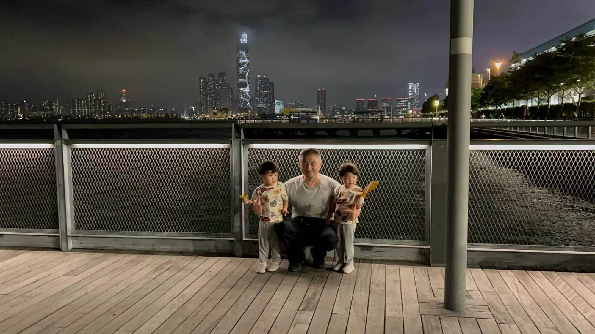

## 面试系列文章：
<!--more-->

1. [报名准备]()
2. [2023-10-28_民生幼稚园]()
3. [2023-11-03_嘉诺撒圣心幼稚园](/hk_kindergarten_interview_Sacred_Heart_Canossian_Kindergarten)
4. [2023-11-04_崇真小学暨幼稚园](/hk_kindergarten_interview_Tsung_Tsin_Primary_School_Kindergarten)
5. [2023-11-04_铜锣湾维多利亚幼稚园](/hk_kindergarten_interview_Causeway_Bay_Victoria_Kindergarten)
6. [2023-11-11_圣士提反堂小学暨幼稚园](/hk_kindergarten_interview_san_stephine_church_kindergarten)
7. [2023-11-14_小世界幼稚园](/hk_kindergarten_interview_small_world_Kindergarten)

## 小世界幼儿园

- **名称** 小世界基督教幼儿园
- **英文** Small World Christian Kindergarten(SWCS)
- **位置** 香港半山，波老道10號
- **学费** 67600 HKD/年,23-24学年，分10期付款。
- **介绍** 建筑物为旧英军医院，由主楼及附属建筑物所组成，工程于1903年展开，并于1907年启用。日占期间，虽由日军控制，但仍继续运作，部分范围被辟作护理患病英籍战俘之用。战后，医院由驻港英军使用，直至1967年京士柏新英军医院落成为止。
- **特点** 35年校史，快乐学校，排名一般；以往的学生家长对学校评价都不错，是个充满爱的环境，学校对孩子的关心是很到位的；国际学校，全英文环境。
- **Offer** 面试后两周内发 Offer，然后一周内交学费，每个孩子一期的费用，加 7000 元建校费。

## 面试经历，宝妈回忆
报名登记： 到达学校后，登记等候。宝妈和爷爷带宝宝进去面试，奶奶在门口和其他家长交流。

与校长见面：进入学校后，与校长进行了一段对话。校长是个修女，简要介绍学校的情况。

自由玩耍时间： 孩子和家长被带到一个房间，有一段自由玩耍的时间，宝宝们随意玩玩具。我们家宝宝比较喜欢玩积木，搭得很高。

老师们都很nice，走来走去，观察孩子的互动能力、社交技能和对环境的适应能力。

老师问问题： 老师向孩子提出一些简单的问题，比如颜色，宝宝能答出红色是red这样，以了解他们的语言能力、认知水平等。

群体活动：老师模拟上课，带着孩子们听听歌，跳舞，讲故事。

家长与校方的交流： 校长叫了一些家长去谈，可能是了解家庭情况，教育理念等。宝妈不久前来参加过学校的开放日，和校长聊了很久，校长还记得她，所以这次没有再约谈宝妈。

结束面试： 大约40分钟，面试就结束了，爷爷奶奶带着宝宝们坐跨境车去深圳机场，然后回杭州。

## 学校印象，宝妈回忆
校舍挺好的，老师也挺好。

来面试的家长，本地的，外国的都有。外国的主要是东南亚的、印度的、马来的，也有白人。这些家长主要和宝宝说英语。

## 结果
很快就拿到 Offer，需要一周内回复，因为心仪的嘉诺撒圣心幼稚园一直没有回复，于是宝妈回邮件希望多给点等待时间，学校也同意了。

后来嘉诺撒圣心幼稚园终于发了上午班的 Offer，另一个考虑是要不要双拼，下午去小世界幼稚园，锻炼英语能力。

最后决定暂时先不双拼，优先保证宝宝的午睡，到港之后再考虑补习班or双拼。

## 参考链接
- [学校官网](https://smallworld.edu.hk/)
- [升学天地](https://www.schooland.hk/kg/swck)
- [教育集团网站](https://www.generations.edu.hk/school/small-world-christian-kindergarten/)