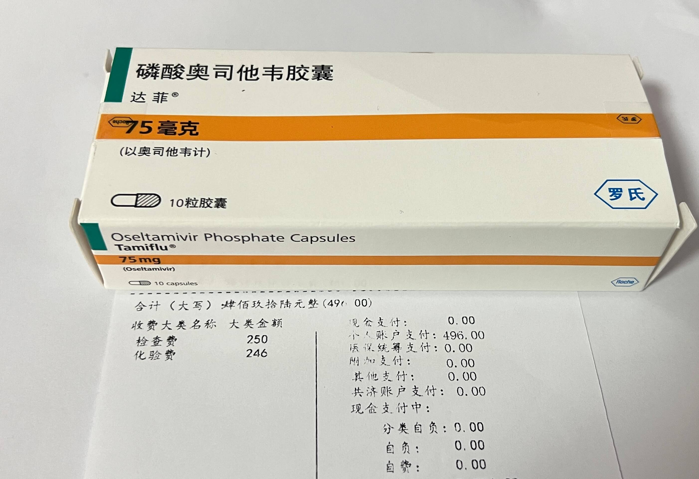
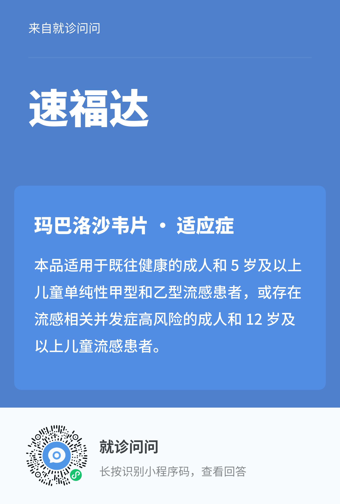

## TL;DR
星期一，我被确诊患上了甲流。

## 感染源
最近，传染病肆意横行，各地疫情严重，我们办公室也未能幸免，座位附近的同事们接二连三地病倒了。我们团队也有几个同事先后感染了甲流。

甲流的潜伏期大约1到3天。坐我右边的同事上周就发烧39度，在家休息了两天，估计我是上周五感染的，潜伏了两天。

周日那天，我咳嗽得比较厉害，感觉像是要发作了。 周一上班时没有精神，下午有点发热，去了医院检查，确认甲流呈阳性。

<!--more-->

## 扩散
令人担忧的是，星期天上午听课时，可能将甲流传染给了身边一起听课的同学。

星期天下午和宝妈一起玩时，又把病毒传染给了她。结果周二宝妈也发烧了，在香港约不到号也买不到药，只能在宿舍里面躺着，非常难受，我感到非常抱歉，希望她能早日康复。

## 看病

周一咳嗽加重，几乎不能完整说完一段话，下午在工位上无精打采，四点多去行政那里测了下体温，额头37.5度，有点发烧。

四点半先去了天山社区医院，耳朵38度，但是发热门诊已经关门了，又去了附近的天山中医院。

挂号费19元，检查费496元，医生开了一堆检查，包括血液常规+支原体+衣原体+末梢血葡萄糖，鼻拭子甲乙流抗原，CT等。最后的结果是甲流阳性，稍微有点肺炎。先问我要不要输液治疗，但是我不想输液，医生也说输液不会加速疗程，于是就开药回家休息。

## 开药

**治疗甲流的经典药物是达菲，新出的药叫速福达。**

天山中医院没有速福达，医生给我开了一盒奥司他韦(达菲)，是意大利米兰工厂制造，上海罗氏分装的进口药。虽然171元一盒，比国产仿制药贵不少，且乙类药还要自付10%，但品质让人放心。 今年吃过好几次**集采药便宜但是疗效不佳**的亏，这次还是药效要紧。 另外还开了一盒抗生素。

当然，作为中医院，医生还偷偷加了口服液，被我拒绝了，于是撕了处方重新打印。今年已经好几次被社区医院/中医院夹带了这种私货，价格都不低，每次都占据了处方总药价的一半以上，简直是**浪费国家医保基金**啊。

最后看病的总花费是 19元挂号费 + 496元检查费 + 198元药费 = 713元，医保卡里的余额又少了一大截。

## 周一晚，没睡好

医生给我开了三天的假条，我请了周二和周三两天的病假，周一晚上也提前下班，有扛不住了。

到家后，我遵医嘱服下药物，然后早早上床睡觉，但周一晚上的睡眠质量很差，一直难以入睡，浑身各种疼痛，夜里翻来覆去。这种感觉和第一次感染新冠时一样，非常难受。

早上起来，佳明手表检测到的睡眠时间居然为零，可见睡眠质量之差，整个人也是浑身酸痛，特别难受。宝妈建议我再买一些止痛药吃，然后继续坚持吃药休息。

## 周二

周二在家休息期间，什么事都做不了，每次咳嗽时头都特别痛。

周二上午断断续续睡到快 12 点才起床，点了外卖，下午接着睡，一直睡到晚上快七点。然后晚上玩了一会手机，看看短视频，一天就这样消耗完了，什么事都没做。

周二晚上睡眠还是很差，早上起来也是腰酸背痛，整个人都不舒服。

## 周三

今天烧退掉了，咳嗽也好了很多，至少能完整说完一整段话了，我最近都在用豆包的AI语音输入写文章的草稿，前两天咳到一段话都讲不完，今天这篇文章的草稿就是用豆包完成的。

今天主要的难受是拉肚子，这两天吃啥都不行，宝妈告诉我，这是吃了达菲后的正常反应，这种**抗病毒药容易引起恶心、呕吐、腹泻等情况**。

上午，我看了一会书，中午看了一会中视频，下午以睡觉为主，晚上准备写这篇《患甲流记》。

## 躺平

两天一直待在十多平方米的小房间里，除了吃饭就是睡觉，看了一下我的微信运动，昨天走了 74 步，今天走了 131 步，这次躺得很平，没有出门的冲动。

明天我会回到公司继续上班。

## 最后

不得不说，今年我的**身体抵抗力严重下降**，遇到一点点风吹草动就会咳嗽、流涕、生病，长期处于亚健康状态，身体快扛不住了。

我有个记录了十年的表格，每天会记录一件大事，三件中事，五件小事，偶尔会有专题，比如备战铁三比赛前会记录三项的运动量，减肥期间记录三餐和体重。

这个月开始的新专题是**记录身体和服药情况**。这个月每天都在流涕，一半的日子在咳嗽，一半多的日子在服用感冒药或抗生素。

这个指标实在太差了，过去几个月也没好多少。我得好好思考现在的生活状态了，**身体爆仓，一切归零啊**！