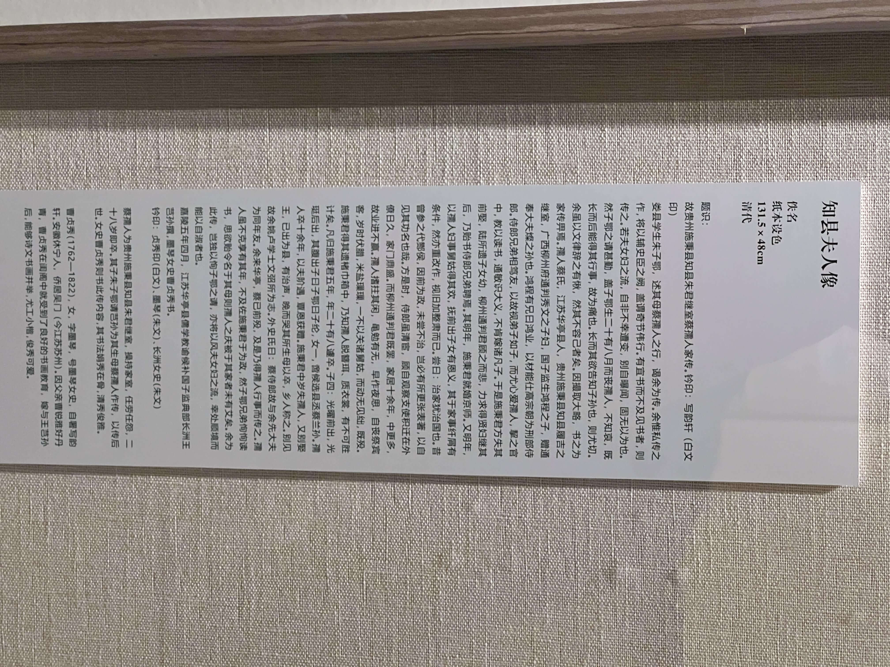

## TL;DR
2023-08-05 周六下午，我去了上海市长宁区的**程十发美术馆**参观。

程十发先生是著名的海派画家，曾经是上海中国画院院长，也是上海美术界的泰斗，他的作品有传统的山水，花鸟，人物，也有一些现实主义的题材，比如《歌唱祖国的春天》。

程十发美术馆是上海中国画院旗下的展览馆，这里不仅能看到中国画展，还有上海第一家书画自习室，可以免费领取宣纸，现场画画，还有老师指导。我临了一幅《金果满枝》，很开心😁
<!--more-->

## 入场
展馆位置很好，在虹桥路和伊犁路的交叉路口，隔壁就是地标古北soho，高岛屋商场也很近。我从娄山关路出发，骑行十分钟就到了。

展厅很新很漂亮，安检入场后，可以先去前台了解最新的展讯。

## 手册和盖章
前台可以拿到两个手册，一本是程十发美术馆自己的手册，一本是长宁区文化相关的宣传手册。

美术馆的手册做得很好，有程十发的介绍，也有美术馆的介绍，还有不同展厅的介绍。比如每个展厅的高度可以办什么样的展览，可以怎么样的变化，哪些展厅可以打通在一起等等，特别详细，而且介绍手册是中英文的，国际范呀！

前台还有三个章可以盖。其中一个章是带日期的，这个很有意思、也很用心。

有观众专门带了自己的盖章册来，我没有准备，就拿着三个章在刚拿到的导览手册上盖了一下，建议手册设计的时候可以多留点空白，这样盖起章来更方便。

## 展览

一楼临展厅的展览是 "2023上海中国画作品展"，展期比较短，6/13-7/30，我来晚了一周，已经闭馆了，要准备布新的展，暂时无法参观。

今天从二楼的第三展厅开始参观

## 《因心造境——上海中国画院院藏明清人物画研究展》

**展览时间：** 2023年7月13日-12月6日

**展览地点：** 第三展厅

展览共呈现上海中国画院院藏明清人物画40余件（套），包括陈洪绶、华喦、黄慎、任伯年等名家作品，部分画作为首次公开展出。

展览以“因心造境”为主题，旨在探讨明清时期画家们如何以心抒情、以情入画，创造出独具内涵与面貌的人物画。明清时期，随着商业贸易、政治经济、思想文艺的蓬勃发展，人物画亦体现出全新的面貌，涌现出诸多具有影响力的人物画家，他们的作品涉及写真、高士、仕女、道释等丰富的题材，在表现方法和情境意趣上也具有时代特色。

展览分为**俗世纷呈、与古为新、道释瑞彩**三个板块，结合渊源流变、时代境况、绘画技法、身份认同等多个角度探究明清人物画所呈现出的艺术家的个人追求，及其对人物画史的影响，特别是人物画在演变过程中所反映出的因社会结构转变而交织的心境变化的复杂内因。

除了外画画本身外，有三点让我印象尤其深刻：

### 特点一：布展用心
布展特别用心，前言啊，每组画的线索，每幅画的介绍，写的都特别好，是那种**不需要导游也能学到很多东西**的好！

### 特点二：介绍详细
每幅画都配有介绍，这是我见过最最详细的，没有之一！除了常见的作者，纸张，尺寸，年代，还有详细的题识，钤印，鉴藏印解释；然后是画画内容的介绍；最后还有详细的画家小传，比如他们的风格、作品、生平、影响等等，非常详细，非常用心，非常好！

有的画的题识的字特别多，这里也事无巨细，完完整整，洋洋洒洒都列出来了，方便读画。

**画画类型** 比如 绢本设色，纸本水墨。这个是画画的材料，绢本是用绢布，纸本是用纸，设色是用颜料，水墨是用墨汁。

**题识**: 作者在画画上题的字，题的诗文等，会介绍画画的内容和背景。

**钤印**: 作者盖的印，印章上的字，印章颜色和类型，

**鉴藏印**: 收藏家盖的印，比如有的画上盖了"十发鉴古"，应该是程十发先生收藏过，后来捐给上海国画院的画。还看到了大收藏家吴湖帆的题识和鉴藏印

### 特点三：维护良好
保安，一直在巡逻，保证安全。

保洁，一直在擦玻璃，一般展览的展柜玻璃上都会沾到小孩的手印，影响观看，这里的保洁人员特别勤劳，一直都在**及时擦拭玻璃上的指纹**。

### 板块一：俗世纷呈
在明清时期，人物画整体趋势是由民间趣味向文人意趣渗透。画家们在满足商业市场需求的同时，也表现了世俗生活、探索了社会现状，无论是取材于传统的文学故事、现实人物，还是描绘生活情境和民间风情，皆从社会生活百态中汲取养分，呈现出浓郁的生活情韵，也带有对现实问题的关怀与文人情怀。

俗世纷呈板块的人物画，写真人物画既取法民间写真术，叉承袭文人画的笔墨意趣，还旁涉西洋造型技术，如曾鲸、张翀的《陈玉璞像》 徐易的《肖像》、任预的《疼萱图》
而《江湖流民图册》描绘了底层人民的生活场景，《西厢记》则是通过文学作品展现了国秀的生活场景，《清代人物写生》描绘了乡绅的闲暇日常生活。正是这种俗世生活的多样性，开启了中国人物画向现代性转型与质变的飞跃之路。

任伯年：遛鸟

任伯年的清代人物写生，画的是一个人遛鸟的图样，边上给了两个历史照片也都是清朝是民国时期中国人遛鸟的一些照片对比。

在晚清民国时期，街上随处可见身着长袍的〝提笼架鸟〞 者。在当时，养鸟不仅是一种娱乐消遣，更是一种身份地位和财富的象征。此轴即描绘了一位士绅形象，他一只手持摇扇，一只手提鸟笼。任伯年幼时受其父影响，练就了默临的与真技巧，后来叉与土山湾画馆主任刘德斋有所往来，旁涉了西方写生的造型技巧。画中人物线条流畅，形神兼备，可见其人物面写生功底之深厚。

### 板块二：与古为新。

经过明清作家的探索，古人已有知的人物话题材，实现了从存乎借借到情境交融的变化。放宽出心意，他们远追传统疼啊又另辟蹊径。将内敛克制和高到意，念与个人化的生命体验融为一起，营造出丰富而具感染力的人，人物，风度，这一时期的作品不仅塑造了华中人物的独特品格和亚麻特真，也是画家们对自我生存状态与社会角色的体验表达是明清人文化呈现出了新的面貌。如正在写神格调起鼓的陈老年，情景交融清新灵秀的华言。诙谐自如雅致轻易的人，过年的他们通过自己的创新探索，是就有传统人物化别开生面。

这个板块橱窗光照条件差一点

簪花曳杖图的介绍

文征明_治平山寺图

### 板块三：道释瑞彩
明清时期，儒释道三教，圆融旧友的神仙。大事，人物与世俗生活联系紧密，常以灵活多变切合生活的形式服务回应于民众，面对这类题材作品，画家常常采取民间文化中喜闻乐见的素材，体验概括出谐音，取义，符号象征等富有吉祥寓意的表现手法，让观者感受到无限的喜悦和祝福等板块所选的钟馗铁管理菩萨等题材。精油画家，活泼多变的笔调，营造出了寓意深刻的意境，使观者从中感受到经典题材的传承和善变，也体会到画家鲜明的艺术风格与审美趣味。

这里展示了 钟馗，铁拐李，菩萨等画像。

佛像，很像是在自拍哈🤳🏻

后面还有四游记主题，四个游记是明代民间流行的长篇神魔小说合集，描写了成魔成仙的故事，包括东西南北游记。

## 三楼常设展

《献给生活——上海中国画院藏程十发作品陈列》

- 展览时间：长期陈列
- 展览地点：第四展厅

 

《海屋星迹——程十发的艺术人生》

- 展览时间：长期陈列
- 展览地点：第五展厅

三楼的两个常设展，一个侧重生平，一个侧重作品。

传统中国画主要由山水，花鸟，人物三种。

程十发先生早年主攻山水画，建国之后，因为政治需要，也有一些现实主义题材的人物画，现场山水、花鸟、人物三种俱全。

除了传统中国画，在特殊时期也画过斯大林列宁的故事。还参与过孔乙己连环画，儒林外史插图等工作。

## 建筑美

美术馆的建筑本身也是很美的，由同济设计。外表看起来像是积木堆叠，内部特别的简约， 有很好的顶部采光，与窗外的景色相映成趣。

此外，还有很多文物，dc'su，比如三楼的楼梯口，放置的是经济学家张五常夫妇捐赠的雕塑《乐师》。还看到了徐根宝签名的足球⚽️等。

## 纪念品商店

一楼出口处是纪念品商店，我买了一本关于宋朝的画画的画册，讲的是李唐的《万壑松风图》，这是和范宽的《溪山行旅图》，郭熙的《早春图》合称"宋画三大精品"。

还买了一个冰箱贴，"敢教日月换新天"，是程十发画的杭州新安江水电站，这个新安江水电站离宝妈的外婆家很近，我们去玩过一次，我想宝妈应该会喜欢这个冰箱贴。

还买了一张明信片，是程十发的代表作《歌唱祖国的春天》

## mz'uu自习室
程十发美术馆的一楼半M层，有上海第一个美术自习室，今年3月1日起开设，现场提供毛笔、颜料、画册和志愿者老师的指导，可以免费领取宣纸画画，我看完展距离闭馆还有半小时，就坐下临摹了一幅《金果满枝》，特别开心。下面是我当天写的日记：

明明如月的日记 23-08-05 周六 (第264天)

收获与分享【花水墨画】

今日最开心，是在程十发美术馆的“书画自习室”。每人可以免费领一张宣纸，桌子上有纸墨笔砚和画册，现场书法国画。

我临了一幅《金果满枝》，原本想画山水的，可是快闭馆了，时间不够，只能选花鸟🌸🐦

小学时学过，但二十年没画，手感完全归零🖌毛笔上要蘸多少水，笔锋浓淡都已忘记。小时候要藤黄+花青合成绿色，现在直接就有了。

现场有个志愿者老师，义务指导大家。画画的主要是老人和孩子，也有来看展的情侣💏

参与感很好，画完带回家，再拍照发个朋友圈，很开心😁

我已经很久没有这样安静地坐下来，做些“闲事”了，工作时间挺长，属于自己的时间有限，每到周末都抓紧时间玩儿，不停地转场，赶场子。

其实下午逛完程十发美术馆，我还准备去附近的油画雕塑院美术馆，还有宋庆龄陵园，儿童博物馆等。

但意外遇到的“油画自习室”改变了我的行程，虽然少去了一些景点，但我收获了一段更愉快，更轻松的时光，这是现在的生活很缺少的～

## 参考资料
- [程十发美术馆_百度百科](https://baike.baidu.com/item/%E7%A8%8B%E5%8D%81%E5%8F%91%E7%BE%8E%E6%9C%AF%E9%A6%86/24707769)
- [上海中国画院](http://www.paintingsh.org/#/chengsf)
- [程十发美术馆_展览信息列表](http://www.paintingsh.org/#/activity)
- [程十发_上海画院网站介绍页面](http://www.paintingsh.org/#/special)