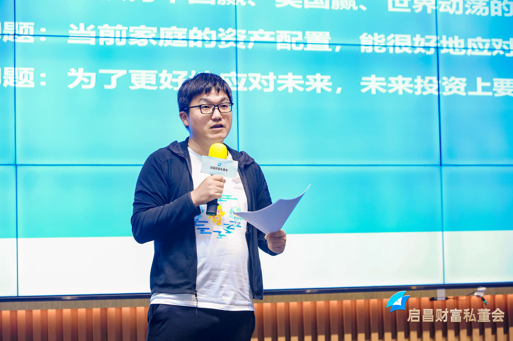
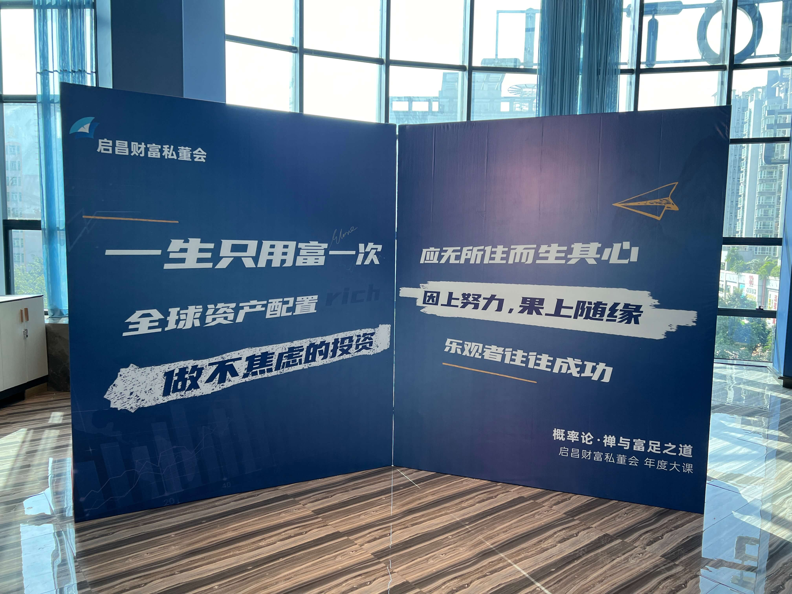

## TL;DR
前几日，我有幸参加了启昌私董会的年度大课，为期两天的财富课程，聚焦概率论和禅道，蕴藉着丰富知识的启迪。

首日上午，课程内容聚焦概率论，先从几个概率问题入手，深入浅出地让我们了解了生活中的一些基础概率，今后做决策时，可以称量风险和收益。

许多概率问题其实有悖于直觉，课程一开始就抛出了五个问题，难度递增，小组间估算并相互PK。
<!--more-->

## 第一个问题：估算考上清华北大的概率
当时我的估算如下：

每年清华北大各招收 5000 名本科生，因为我知道南京几所高校每年招收 4000 多名本科生，而中部的武大华科则每届招收超过 8000 名。

每年全国的考生数量为 1000 万，因此估算出的概率为 1/10000000，即 1‰。

然而，实际答案是**万分之五**。清华北大每个学校只招收三千多名本科生，比硕士6000+，博士2000+要少很多。官方现场提供的答案是 6888 / 1291，得出的概率是万分之五。

查了一下，2022年，清华招收内地本科生3400人，北大招收内地本科生2994人（医学部除外），2023年，清华招收内地学生3505人，北大校本部3018人，医学部859人，2023年全国高考报名人数 1291 万。

## 第二个问题：估算我国资产过亿的家庭数量
这个问题比较难，现场给出的答案是 13.8万 / 49416 万 = 万分之三。

我查了一下，根据 2022 年国家统计年鉴，我国大概 49416 万户家庭。13 亿人口包含4.9 亿个家庭，一家平均两人多，应该差不多。

根据《2021胡润财富报告》：

拥有600万人民币总财富的“富裕家庭”数量已经达到508万户，其中拥有600万人民币可投资资产的“富裕家庭”数量达到183万户；

拥有千万人民币总财富的“高净值家庭”数量达到206万户，其中拥有千万人民币可投资资产的“高净值家庭”数量达到110万户；

拥有亿元人民币总财富的“超高净值家庭”数量达到13.3万户。

根据《2022胡润财富报告》

拥有亿元人民币资产的“超高净值家庭”数量达到13.8万户，比上年增加4,600户，增加3.5％

最后，用 13.8 万个资产超过 1 亿的家庭除以4.9亿个家庭。估算的结果是万分之三。这说明资产过亿比考上清华北大(万分之五)还要难一点。

## 第三个问题：估算攀登6000米以上的喜马拉雅山脉的死亡率。

我当时的估算如下：我记得攀登难度最大的 K2 的死亡率是 50%左右，虽然喜马拉雅山的难度会小一点，但肯定也不低。今年的登山季就有好几个攀登喜马拉雅山九死一生的新闻上了热搜，有的被救但是不给钱，有的著名登山家则死在了山上，这些新闻在网上引起了很多讨论。

我认为这个概率应该不低，后来给出的答案是 10%-13%。这个死亡率已经很高了，征服喜马拉雅的风险居然这么高。兰老师说他肯定不会去，因为死亡率太高了。

## 第四个问题：估算前十大网红学历都没有达到本科的概率

这个问题很有意思，现场实际给出的"中国高收入网红排行榜top10"表格里，前十网红的学历都没达到本科，最好的是大专，还有很多是中专和小学毕业的。这说明成为网红与学历无关。不过类似的表格我还在网上搜到了好几种，比如李佳琦是南昌大学本科，但是提前离校，没有拿到学位，参选人大代表时写了高中学历，也引起过争议。

现场给出的算法与前十大网红无关，而是说随机找 10 个人，他们的学历都没到本科的概率。

根据我国本科学历及以上的人口占比是 4.43%，那么一个人不是本科的概率就是 95.6%，那么 95.6%的 10 次方，大概是 64%。这意味着在我国随机找 10 个人，他们的学历都没达到本科的概率是 64%，还是挺高的。

## 第五个问题：估算一架飞机上 300 人至少有一个医生的概率。
我的算法如下：首先要知道我国医生占总人数的比例，然后计算一个人不是医生的概率，那么 300 个人都不是医生的概率就是它的 300 次方，至少有一个医生的概率就是一减去它。但是我不知道中国医生的比例，所以估算出现了偏差。

最后的答案是，我国的医生比例是 0.3%，一个人不是医生的概率是 99.7%， 300人都不是的概率是 99.7%^300 = 40%，所以 300 个人至少有一个人是医生的概率是 60%。

这是突发疾病，能得到救治的概率，高铁上乘客更多，停战更密，获救的概率也更大。

## 小结

上面第一部分是关于纯数学的估算。首先，你需要了解一些生活中的基础概率，然后遇到实际生活中的问题时，你可以使用这些基础概率进行估算，这样就可以更好地了解生活中许多问题的收益和风险。

第二部分是关于概率的实际应用。例如，80%以上被认为是大概率，5%被认为是小概率，而 0.1%则被认为是黑天鹅事件。这些都是平时很难预测和防范的情况。

然后，我们可以使用大小概率和赔率高低来估算生活中的一些事情。例如，大概率但低赔率的可能是上班，而小概率但高赔率的可能是购买彩票或其他高风险的投资行为。

## 理论结合实际

上面是纯理论的概率计算，实际也要结合自己的本金情况进行考虑。

首先，介绍了一个轮盘赌游戏，一共37等分格子，其中赢了给 35，输了就输一块钱。实际的概率是负的，0.02，这意味着玩的次数越多，一定会因为收益的期望是负的而输钱。

然后，给了一个猜大小的游戏，赢了给 300 万，输了给 100。从概率上直接算，玩一把能赢 200 万。但实际上，要考虑本金情况。如果本金只有 100 万，那么第一把输了就爆仓了，再也赢不回来，这种人叫赌狗。如果本金是 300 万，那么爆仓需要三把连输，概率是 1/8，即 12.5%，这种人叫赌徒。如果身价 1000 万，可以适当参与，因为爆仓的概率只有 0.09%。如果者身家有一个亿，那么输光的概率几乎是零，可以无终止地玩，这种人叫庄家，这就是马太效应。

因此，在实际生活中，参与赌博需要考虑本金情况和爆仓概率，而不是仅仅看收益期望。对于大多数人来说，赌博是一种高风险的行为，应该谨慎对待。

## 三种爆仓情况

讲完收益和爆仓的关系后，又提到了三种爆仓情况：**财富爆仓、肉体爆仓和心理爆仓**。

财富爆仓指的是赌博输光了所有的财富。

肉体爆仓指的是不注意自身安全，例如闯红灯或在身体不适的情况下过度劳累。

心理爆仓指的是承受压力过大，导致心理无法承受。这些情况都很危险，我们平时需要做好仓位管理，以避免这些爆仓情况的发生。

然后给了我们一个很重要的提示，即在做任何决策时都要思考好坏两种结果。“十年前怕错过，未来十年怕做错。”，思考好坏两种结果，很多时候会发现风险不低，这时就需要好好考虑这个决策。

## 现场练习：估算房价
然后，我们一起做了一个计算题，讨论用 300 万买了 1000 万的房子，十年后的收益期望。现场要求考虑利息和税费成本，并且用很好、不错、一般、很差四种情况去估算，每种情况给出相应的概率，然后计算每种情况的期望。

我们组是这样估算的:很好的情况下，年化收益是 10%，但我们认为这种情况只有 10%的可能性；不错的情况是年化收益 5%，可能性是 30%；一般的情况是年化收益 2%，可能性是 50%；很差的情况是年化收益负 2%，可能性是 10%。然后，我们算出来的平均收益期望是 431 万。

然后，我们算上利息，现在的利息是 4%。700 万贷款乘以 4%的年化，就是每年 28 万，十年是 280 万。相当于 431 万的收益有 280 万超过一半是给银行交利息。然后，再算上税费，我们算两个点，用 1431 万乘以两个点是 28 万。最后算下来，收益只有 123 万。

这个收益跟 300 万本金比起来，其实还可以，但其实这也是比较乐观情况下的房产增值，而且大头都被银行利息收走了。

123 万跟 300 万本金比起来，大概收益是 41%，然后年化单利就 4%吧，复利 3%，看着也还行。

最后全场的平均收益是60万，看来大家都不太看好高杠杆买房的收益啊。

## 总结

虽然生活中隐藏着许多我们无法预测的变数,但是通过概率论的启示,我们可以更好地处理赔率,做出更加理性的选择。

就像兰老师说的,面对高风险的事,我们需要审慎。概率论让我们看清生活的本质,拥抱生活的不确定性。

## 后续
后续的课程，第一天下午介绍了各大类资产当前的情况，未来三年该如何配置。第二天讲的是禅道，富足之道。后面有空再分享吧，每次消化课程内容，敲打键盘分享，都是一次再学习的过程。

## 参考链接
- 《清华、北大2023年本科新生统计》https://baijiahao.baidu.com/s?id=1775734907223752533
- 《2021胡润财富报告》 https://baijiahao.baidu.com/s?id=1730132826091139517
- 《2022胡润财富报告》 https://baijiahao.baidu.com/s?id=1759945909084667289