## 出发
寒冬降临之际，万物休憩停顿，仿佛一切都已沉睡。 然而，杭州却以其独特的美丽与气质，吸引着无数游客前往探寻她那饱含诗意的生活方式及饱蕴人文关怀的古迹风华。 

在这个冬日的上午，我选择了梅灵南路，从梅家坞到法喜寺的路线，带着宝宝尽览杭州冬景的无尽魅力。
<!--more-->

## 梅灵南路
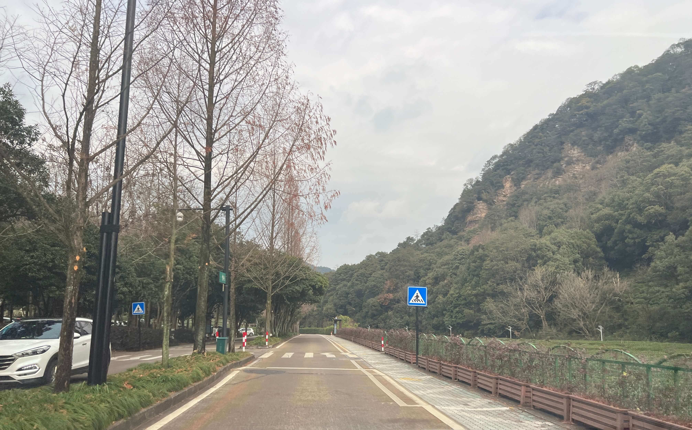
我和宝宝还有外婆从家出发，先绕行紫之隧道，然后从宋城拐入梅灵南路，双向两车道，缓缓前行。虽然本周末气温骤然降到了零度，但梅灵南路沿途风景依旧秀美动人。

其间经过若干个别具风情的村子，村子沿着道路有很多民宿、茶社、餐馆，各具特色。行道树以深红色的水杉闻名，不过叶子已经落了很多，早几周会很好看。
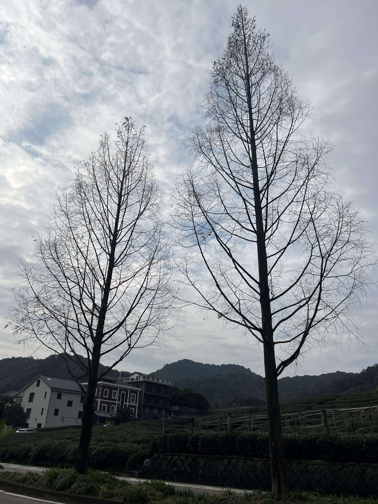
最南边是梵村，道路两旁的茶叶田地交错纵横，一幅幅如诗如画的美景映入眼帘，令人叹为观止。

再向北行进，便是名闻遐迩的**云栖竹径**。这是一个适合登高远足的绝佳场所，上面是五云山，山顶的真际寺有财神庙，每次徒步走标毅行线、过十里琅珰，都会在真济寺补水、休息，然后分叉。

驶过云栖竹径后，随着地势升高，便是梅家坞了。

## 梅家坞

驶过梅家坞，我们将车停在了路旁的茶园边。随后在茶园中漫步了一会儿，出乎意料的是，即便是在冬季，茶园里的茶树依然长得十分茂盛，而且茶树顶端还开了许多茶花。
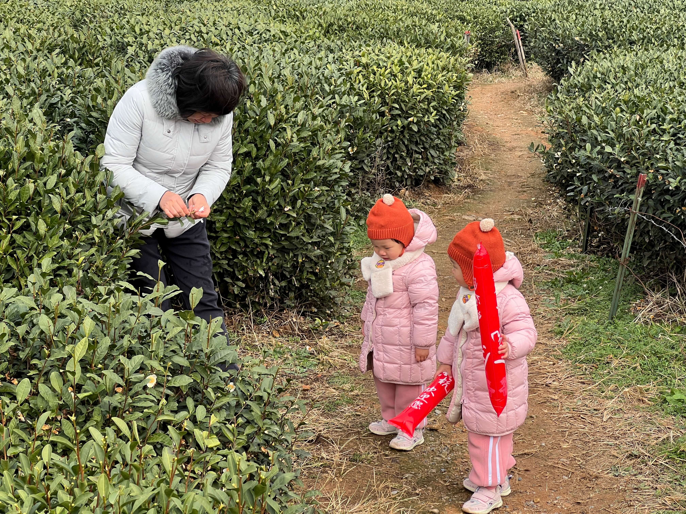
远处的茶山层层叠叠，景色十分美丽。我想起两侧的群山自己曾经都爬过，心里还是很开心的，于是带着宝宝一起走。

这两天刚好大降温，茶树上结了许多冰霜，看上去非常有趣。一开始宝宝不愿意走路，要人抱，后来看到冰霜，又要下来拿着玩，拿起冰霜，再扔到地上，碎了一片，宝宝玩得特别开心。
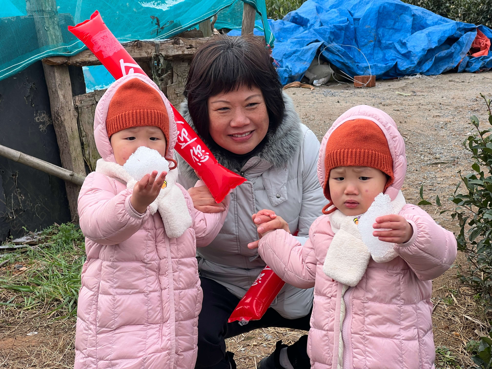
上车继续往前行驶，梅灵南路就到了尽头。上面是天竺山，下面是雪峰梅灵隧道，隧道后是梅灵北路。

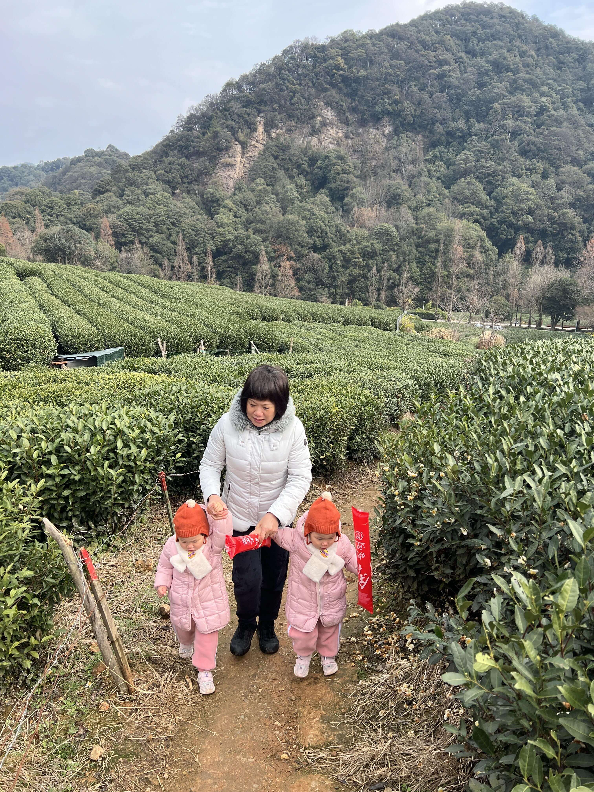

## 梅灵北路

穿越雪峰梅灵隧道后豁然开朗，进入梅灵北路，这条路上寺庙众多，杭州最热门的寺庙都在这里了，从南到北依次是上天竺法喜寺、中天竺法净寺（干净的净）、下天竺法镜寺（镜子的镜），再往北就是灵隐寺了，灵隐寺后面是永福寺，半山腰是韬光寺，山顶北高峰是灵顺寺，也是一个财神庙，山背后还有法华寺。

“天竺三寺”现在的名字都是乾隆起的，各具特色，都值得一游。

上天竺法喜寺自被小红书带红后，成了一座网红寺庙。寺庙内建筑风格独特，游客较多。门票10元，入口处还会免费赠送3根香火。
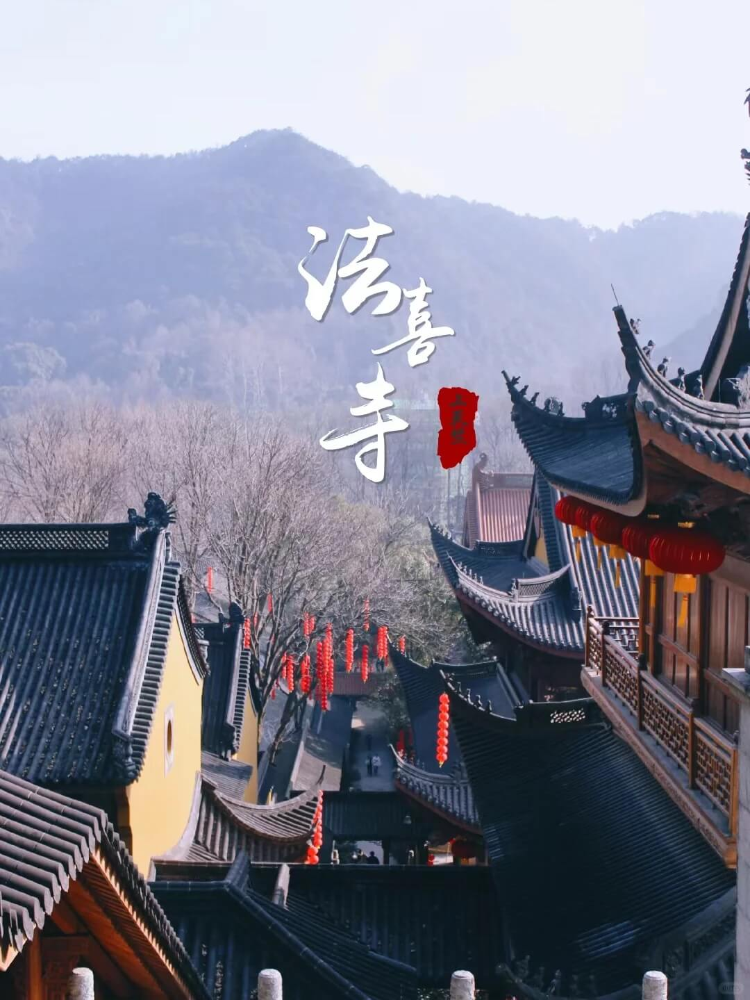

中天竺法净寺是三寺中最安静的，不收门票，送三支香，素斋特别有特色。
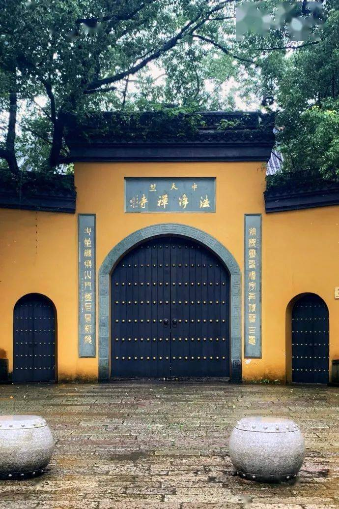

下天竺法镜寺是三寺中历史最悠久的，是杭州唯一的尼姑庵。寺庙内环境清幽，建筑风格古朴，是一个静心的好去处，门票10元。
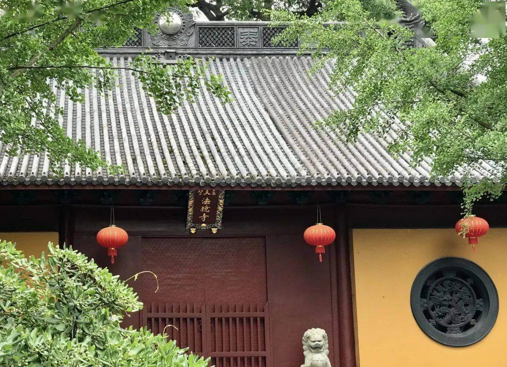

我们把车停在了法喜寺的停车场，边上停的是一辆墨绿色的 mini 车，我拍了一张两车合影，因为宝妈生娃之前也开墨绿色的 Mini Cooper，小巧玲珑，生了宝宝之后换成了6座理想车。

## 法喜寺
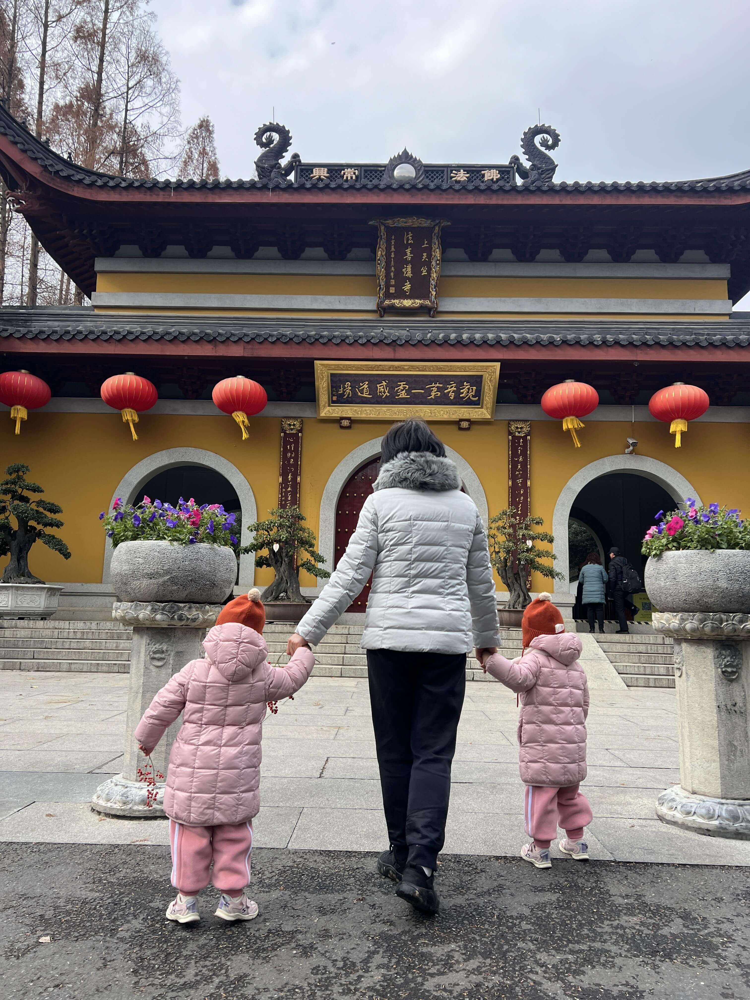

法喜寺位于三天竺，其名字是由乾隆皇帝改的，而法喜寺大门上的“法喜讲寺”也是乾隆皇帝所题。

进入法喜寺后，右侧墙上写着"晋代古刹"，因为这座寺院在晋朝的时候就已经出现了，它跟杭州灵隐寺都是同一时期所修建的。

再往里，山门牌坊上是康熙皇帝题的“入三摩地”，三摩地是梵语音译，进入禅定的意思，也就是以静默来止息一切杂念。

"入三摩地"的背面写着**莫向外求**，落款为“沙门一音”，沙门一音是著名的弘一法师李叔同。 出门时抬头看到了"莫向外求"四个字，给了我今天最多的启发，细细玩味了很久。俗世生活中，想要的太多，争来争去，很是累人，如果能向内求，心境就会完全不同吧，更加处之泰然、云淡风轻。

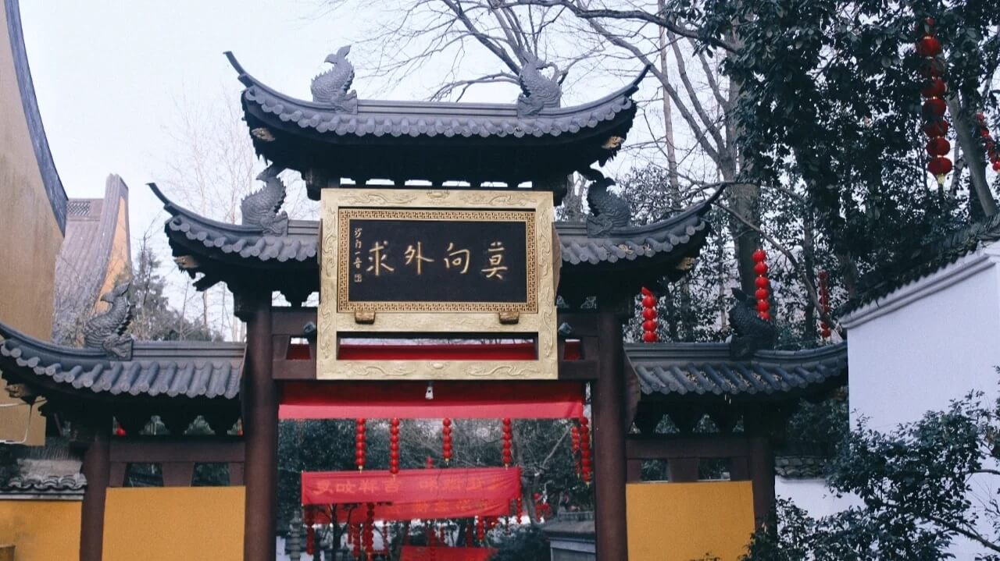

法喜寺如今已跃升为网络红寺庙，据说求姻缘很灵，吸引着善男信女前来参拜。寺内景色幽静秀美，无论是绿意盎然的景致，还是古色古香的建筑，都令人流连忘返。现在又有几个极佳的取景位置，成为无数小红书博主热捧打卡之处。

入口处可以领三支香，由义工发放，不需要钱。大雄宝殿及殿前的香炉顶上有几只白色的鸽子在嬉戏，宝宝看到后特别兴奋。

我们去了右边侧的客堂，客堂的每一扇木门上都刻了不同的动物，宝宝非常喜欢，有珊瑚最喜欢的小羊、海兔最喜欢的小象等。如果不是带宝宝出来玩，我可能也不会注意到这些门上的精美雕刻，带着宝宝，我的观察力也大大提升了。
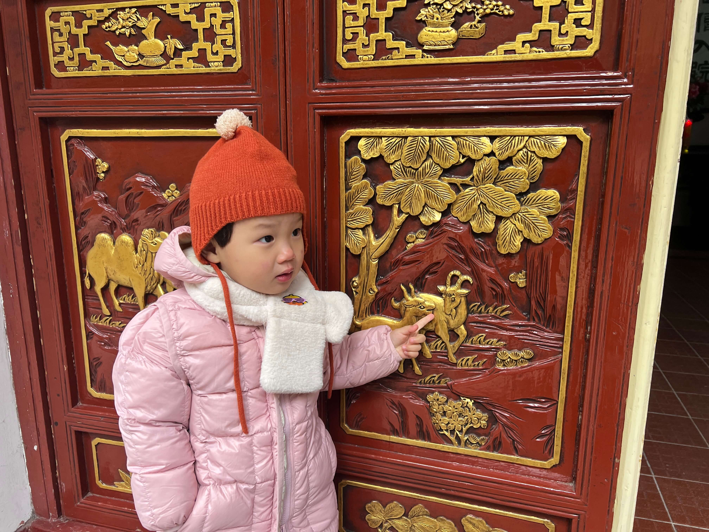

池塘中间有一座白色童子塑像。童子手托如意，憨态可掬，与池中众多的锦鲤相映成趣。那些锦鲤又大又多，它们欢快地游动着，吸引着宝宝的目光。我却趁机教育宝宝，掉到水里面了怎么办？别慌，用老师教的游泳动作，慢慢游到岸边，爬上来就好了。
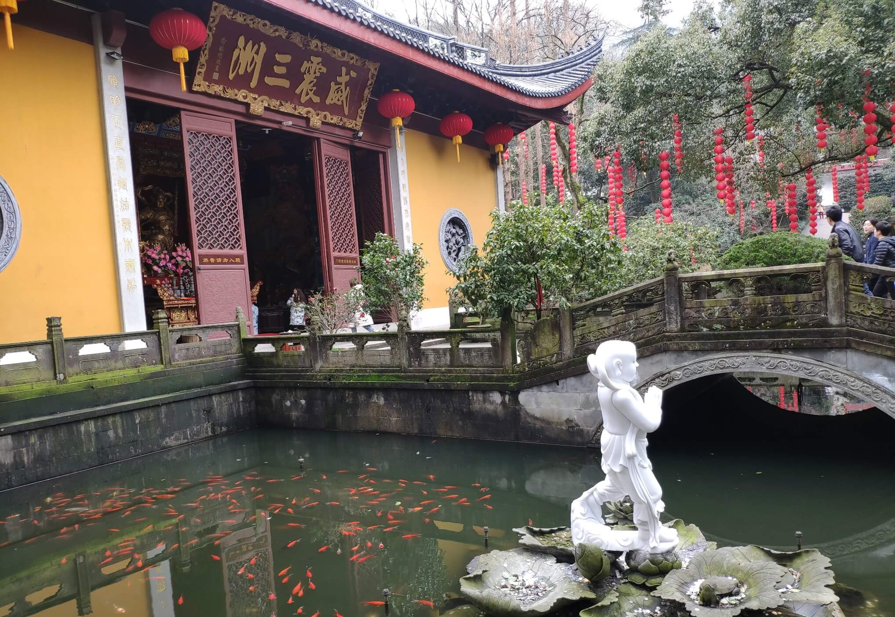

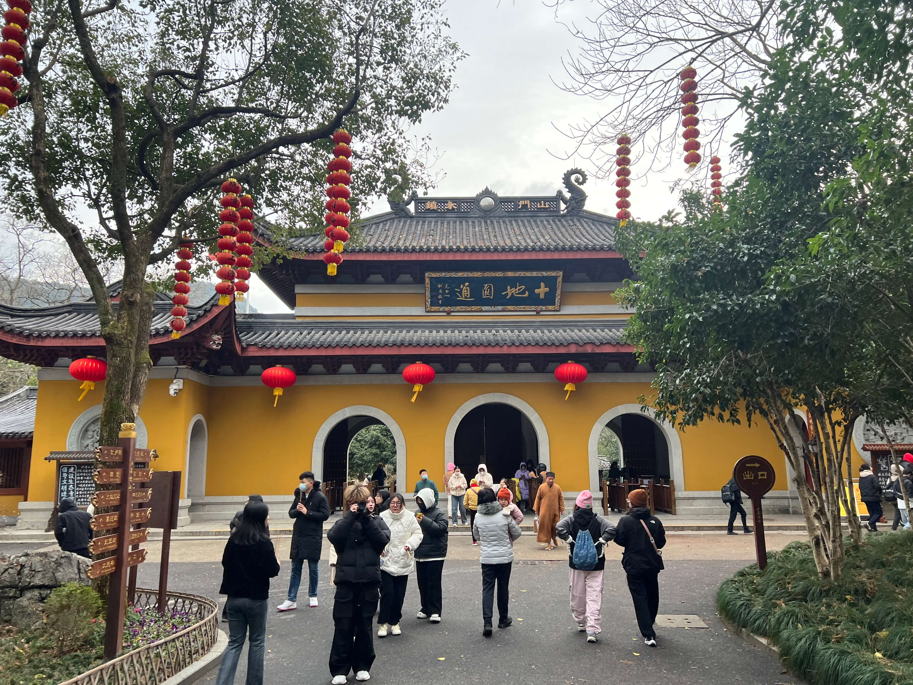

## 归家路途
探访完法喜寺后，我们踏上了返程之路。在回家的途中穿过灵溪隧道，出隧道畅通无阻，和来时堵车绕行完全不同。

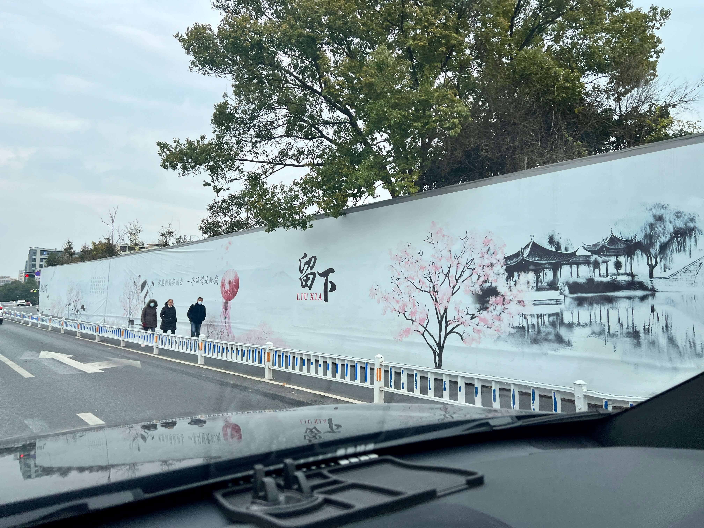

驶出隧道后，马家坞外东侧墙上的墙画吸引了我的目光。

画的是"留下"主题的内容，有着浓郁的中国传统风味，乳白墙面搭配灰黑瓦片房子构造出庄重质朴且雅致的气氛，粉红的桃花、红色的女孩衣服与扇子再添色不少，更妙的是，墙上的古诗文犹如画龙点睛之笔，意境深远，让人沉浸其中，感受到源自古老中华文化的博大精深。
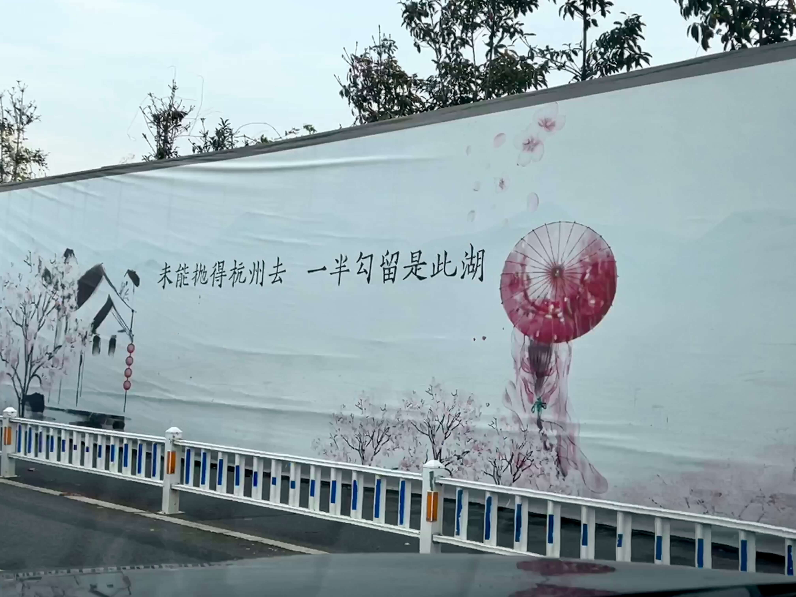

## 感受

这段冬日漫步茶园的经历让我和宝宝都感到无比愉悦。在这个寒冷的季节里，茶园中的生机和美丽让我们忘记了寒冷，而法喜寺的游览更是让我们领略到了佛教文化的庄严和宁静。

我想，这就是在杭州生活的快乐，既有高速的互联网生活，也能快速远离城市的喧嚣，走进自然，看山看水，领略文化和历史。以后我会继带着宝宝们探索更多的未知世界。
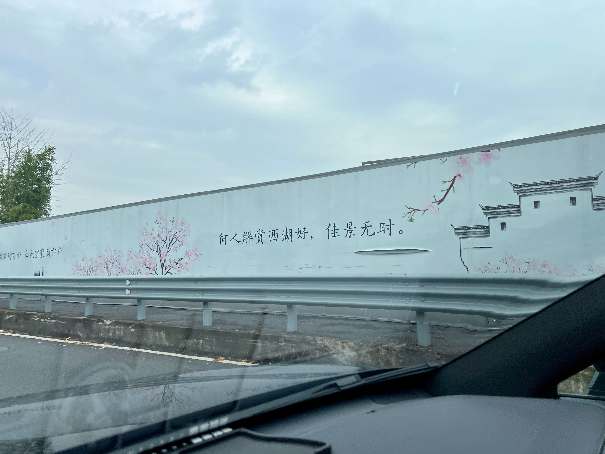

## 参考链接
- [法喜寺_小红书笔记](https://www.xiaohongshu.com/explore/62091dc7000000002103939a)
- [京都滤镜下，杭州的千年古韵](https://www.sohu.com/na/410861415_100650)
- [门票价格](https://mbd.baidu.com/newspage/data/dtlandingsuper?nid=dt_4732204188789151846)