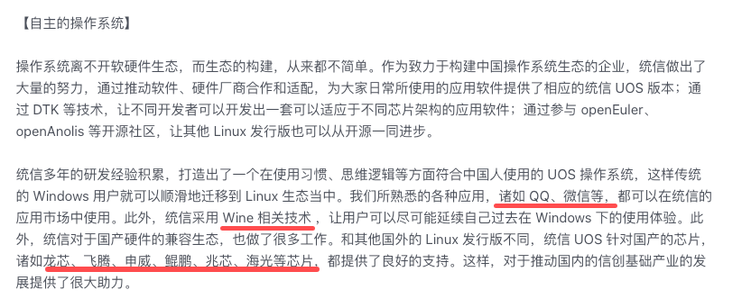
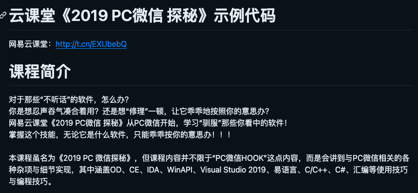
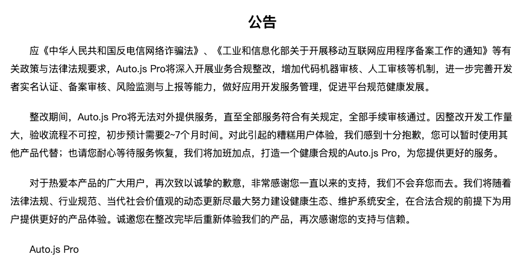

## 一句话总结

- ChatGPT出现之后，带动了套壳微信机器人的发展，这是我最近调研微信机器人的相关总结，内容有点乱，有空再整理吧
- 介绍了微信聊天机器人的三种技术流派：基于网页微信的API协议流，基于PC客户端的hook流，基于安卓客户端的辅助功能流。


## 三大流派

- 网页微信：协议流 api
- PC微信：dll hook， hook流
- 安卓微信： Android Accessibility（辅助功能）辅助流，（群控）

<!--more-->

## 流派一 API协议探索：

### Q1: 微信有公开的 ChatBot API 么？

### Q2: 没有的话有哪些私有的？

### 1. 网页微信

1. https://wx.qq.com
2. 从2017年6月下旬开始，使用基于web版微信接入方案存在大概率的被限制登陆的可能性。 主要表现为：无法登陆Web 微信，但不影响手机等其他平台。 验证是否被限制登陆： https://wx.qq.com 上扫码查看是否能登陆。
3. 从2018年开始，web api 无法创建群聊和自动拉人入群。

```
2017:
为了你的帐号安全，此微信号已不允许登录网页微信。你可以使用Windows微信或Mac微信在电脑端登录。Windows微信下载地址：https://pc.weixin.qq.com Mac微信下载地址：https://mac.weixin.qq.com
新号：一定不行！
老号：有可能不行！
```

#### 参考项目：

- https://github.com/littlecodersh/ItChat 知名网页微信协议框架
- https://github.com/youfou/wxpy  基于 itChat 优化易用性

### 2. 统信 uos

- 深度操作系统(Deepin Linux) https://www.deepin.org/index/zh
- https://www.chinauos.com/
  

### Q3: 国产芯片有哪些？什么指令集？

```
x86 海光的授权来源于AMD，兆芯的授权来源于威盛；
arm 鲲鹏、飞腾使用的ARM指令集，授权来源于英国公司ARM；
龙芯采用的是MIPS指令集
申威使用的是alpha指令集

一段介绍：
兼容x86、ARM、MIPS、SW架构；
支持七大国产CPU品牌：龙芯、申威、鲲鹏、麒麟、飞腾、海光、兆芯；
与40多个国产桌面整机厂商达成合作；适配了180多款桌面类整机型号（笔记本、台式机、一体机、平板）
软件，商店已上架800多应用；与讯飞、金山、网易等300多家国内软件开发商达成合作；适配超过600款桌面商用软件；基于Wine技术，无缝迁移Windows常规应用
外设，兼容主流的打印机、扫描仪、高拍仪、读卡器、Raid卡、HBA卡等外设；与超过80家外设厂商达成合作；适配超过1300款第三方外设产品
```



微信支持：

- LInux: 支持所有CPU架构，但是存在聊天记录无法保存
- Wine(Windows): 因为CPU原因，仅支持飞腾、海光、兆芯、Intel和AMD等CPU
- Android：

问题：

```
现在在Linux下面登录微信，都是通过腾讯封装的web微信版本。这个web版本的微信有多难用呢，我给大家说一说，
1 无法正常登录微信，你必须向腾讯公司报备你的公网IP地址、单位名称或微信号之后才能登录。 
2 该版本的微信不支持语音聊天、视频聊天、无法保存聊天记录。

统信上架的微信版本，说白了就是腾讯在微信客户端加了一个检测操作系统版本的功能，如果检测到是已经激活的UOS操作系统，则不需要加入腾讯的白名单就能登录此微信。
```

UOS下的微信只是网页版套了个electron

#### 原理：uos请求头支持

```
大概的意思就是UOS下的微信只是网页版套了个electron，所以呢有大神就对比了一下请求头，发现了只要在请求的地址上首先加一个?target=t就是这样https://wx.qq.com/?target=t
然后在扫码登陆后拦截 https://wx.qq.com/cgi-bin/mmwebwx-bin/webwxnewloginpage 这个请求，并在请求头上添加两个固定的参数
extspam ='Gp8ICJkIEpkIC...'
client-version' = '2.0.0',
```

#### 技术介绍

- https://wechaty.js.org/2021/04/13/wechaty-uos-web/
- https://github.com/wechaty/puppet-wechat/pull/129
- 最初版本教学视频： https://wechaty.js.org/2017/01/06/wechaty-101-presentation/

### 参考项目：

https://github.com/why2lyj/ItChat-UOS

## 流派二： PC微信 hook

### Q:哪类人操纵windows程序的经验丰富？

A: Windows上的安全工程师，黑客，游戏外挂开发者等



### 参考项目：

- https://github.com/hedada-hc/pc_wechat_hook
- https://github.com/zmrbak/PcWeChatHooK
- https://github.com/aixed/WeChat-Hook

## 流派三：安卓微信操纵

### Q1：为什么是安卓，而不是iOS？

### Q2: 听过群控么？

### 原理

- 继承 继承AccessibilityService 类
- 监听系统事件，服务反馈（震动，语音，声音），监听包名（或者说是应用程序）

### 参考文档

- 使用 辅助功能抢红包🧧
- https://www.cnblogs.com/happyhacking/p/6368888.html

### 参考项目

- TBD

### 要求：

- 安装特定版本的微信， window机器

### Auto.js

- https://pro.autojs.org/



介绍：

- 一个支持无障碍服务的Android平台上的JavaScript 运行环境 和 开发环境，其发展目标是类似JsBox和Workflow。
- 特性

```
由无障碍服务实现的简单易用的自动操作函数
悬浮窗录制和运行
更专业&强大的选择器API，提供对屏幕上的控件的寻找、遍历、获取信息、操作等。类似于Google的UI测试框架UiAutomator，您也可以把他当做移动版UI测试框架使用
采用JavaScript为脚本语言，并支持代码补全、变量重命名、代码格式化、查找替换等功能，可以作为一个JavaScript IDE使用
支持使用e4x编写界面，并可以将JavaScript打包为apk文件，您可以用它来开发小工具应用
支持使用Root权限以提供更强大的屏幕点击、滑动、录制功能和运行shell命令。录制录制可产生js文件或二进制文件，录制动作的回放比较流畅
提供截取屏幕、保存截图、图片找色、找图等函数
可作为Tasker插件使用，结合Tasker可胜任日常工作流
带有界面分析工具，类似Android Studio的LayoutInspector，可以分析界面层次和范围、获取界面上的控件信息的
```

- 本软件与按键精灵等软件不同，主要区别是：

```
Auto.js主要以自动化、工作流为目标，更多地是方便日常生活工作，例如启动游戏时自动屏蔽通知、一键与特定联系人微信视频（知乎上出现过该问题，老人难以进行复杂的操作和子女进行微信视频）等
Auto.js兼容性更好。以坐标为基础的按键精灵、脚本精灵很容易出现分辨率问题，而以控件为基础的Auto.js则没有这个问题
Auto.js执行大部分任务不需要root权限。只有需要精确坐标点击、滑动的相关函数才需要root权限
Auto.js可以提供界面编写等功能，不仅仅是作为一个脚本软件而存在
js转dex / so中执行autojs脚本
```

### AutoX.js

- 不需要Root权限 的 JavaScript 自动化软件
- http://doc.autoxjs.com/#/
- https://github.com/kkevsekk1/webpack-autojs

### hamibot

- https://hamibot.com/


## 开放问题：

- 想获取微信聊天历史记录分析，有哪些方法？
- 想抓取微信公众号的文章，有什么方法？


```
## 1. 基于网页微信的方案

- itchat
    - 项目地址：https://github.com/littlecodersh/ItChat
    - API列表： https://itchat.readthedocs.io/zh/latest/api/ 官方文档里有不少高级用法的介绍，还是指的一看的

- https://github.com/wechaty/wechaty
- 原作者介绍 wechaty 演进
    - 视频
        - https://wechaty.js.org/2017/01/06/wechaty-101-presentation/
        - https://v.youku.com/v_show/id_XMjQ3NjUxMjAwOA==.html
        - https://v.qq.com/x/page/l03679h2u9s.html
    - 幻灯片 https://docs.google.com/presentation/d/13oUOIEnzdLWO6KZWztD_pMuu22AQ3SIMjk2wp8f-f18/edit?pli=1#slide=id.g1a884bdff6_0_212


- hook 相关项目
    - https://github.com/TonyChen56/WeChatRobot

- Auto.js（已暂停服务）
    - 官网：https://pro.autojs.org/
    - 项目地址：https://github.com/clearw5/Auto.js

- AutoJS的升级版本：AutoXJS:
    - http://doc.autoxjs.com/
    - https://github.com/kkevsekk1/AutoX
    - https://github.com/kkevsekk1/webpack-autojs
```