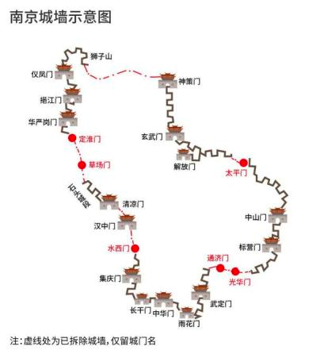

## 一句话总结
2024年3月16日，我和母亲一起参观了南京城墙博物馆，听到了很专业的讲解，深入了解了南京城墙的历史和文化。

<!--more-->

## 入场
南京城墙博物馆位于中华门内，西侧是中华门城堡，东侧是当下最热门的步行街——老门东。

进入博物馆，下到地下 1 楼，左手边便是长设展——“旷世城垣——南京城墙历史文化陈列”，系统展示了南京城墙的从古到今，历史与文化。

"旷世城垣"四个大字左边的前言里介绍提到了南京城墙的几个特点：

1. 它主要由明太祖朱元璋修建，有 13 个城门，全长 34 公里，现存 25 公里，是世界上现存最长的砖石构成的城市城墙。

2. 它从里到外由宫城、皇城、京城和外郭城四座城池组成，外郭城有 18 个门，京城有 13 个门，外郭城长 60 公里，遗迹约有 30 公里，合围的城市面积达到 230 平方公里。其长度和规模都是世界第一。

3. 南京城墙内部也具有很高的文化价值，浓缩了中国 6000 年的建筑文明。

## 天地融合，大明之都
第一个板块名为“天地融合，大明之都”，主要讲述了南京的历史，尤其是城墙的历史。

### 南京城的历史
- 南京建城历史可以追溯到新石器时代的原始村落，到了春秋战国时期，吴越楚国等建立了邑城。
- 秦灭六国后，在此设立了郡县。
- 公元 222 年，三国时期的东吴大帝孙权在这里建立了建业，这是南京建都的开端。
- 此后，东晋在吴都的基础上进行了改造，南朝的宋、齐、梁、陈也都继续建都。
- 隋唐时期是建设低谷期，五代十国时期，南京作为南唐的都城再次崛起，城市规模扩大了许多。宋朝复用了南唐的格局。
- 接下来的重要节点是公元 1368 年的明朝，朱元璋定都南京，建立了宫城、皇城、京城和外城四重城垣结构，现代南京城的大格局从此奠定，成为当时世界上最大、最宏伟的城墙。
- 清代，南京是两江地区的政治中心和驻防地，但后来遭到太平天国的破坏。民国时期，一直到共和国，现在的城墙也是重点保护对象。

展柜里展示了一些古代的钱币和城砖。有些城砖上还印有**铭文**，上面用楷书记录了砖的烧造时间、地点和相关官职等信息。

最近火热的🔥虚拟货币铭文，翻译也十分巧妙，城砖上的铭文是把字烧制在砖头上，虚拟的铭文也是把特殊的标记附加在比特币上，二者有异曲同工，一实一虚。

### 明城墙的历史

明城墙始建于 1366 年，朱元璋命令刘基等人在南京开始营建新城，然后 1368 年朱元璋在应天也就是南京称帝，建立大明王朝，随后 1378 年，经过十年的反复斟酌，最终将南京确定为京师，并开始重点建造城墙。

这里有一个放映厅，半球形的，讲了是天上的天象对南京城市格局的影响，比如紫微垣对应下面的紫禁城，城市的格局，皇宫的布局，跟天象之间的联系，很有意思，值得一看。

还有个"燕雀填湖"的故事，老城区人口密集，修建宫殿需要大量搬迁，不好弄，后来就在城东雁雀湖这里填湖建皇宫，这里靠着中山的龙脉，前面有秦淮河，后面有富贵山，背山靠河，风水特别好。

## 一砖一石，众志成城

第二个章节叫做"一砖一石，众志成城"，讲的是城墙修筑、城砖的运输制作相关的内容。

1368 年，朱元璋下达了筑城令，然后，就是各地大量的这种城砖、石材、木材、建材，从全国各地源源不断地送到南京，山海堆积，汇集京师，一砖一石，聚土成垣，最终成就了这座高尖甲于海内的南京城墙。

南京城墙的建筑技术和组织管理非常先进和严格，主要体现在以下几个方面：
- 夯土砖石技术：城墙内部采用夯土，外部用砖石包裹，这种结构足以抵抗炮石的轰击。
- 糯米灰浆技术：利用糯米熬汤然后混合沙土、石灰等，制造出超强黏合剂，增强城墙的强度。
- 质量监督制度：为了防止偷工减料，城墙所用的砖石上都有负责人的名字。
- 组织管理：朱元璋设立城墙保护委员会，负责协调、指导城墙保护工作重大事项。
这些技术和管理措施的实施，确保了南京城墙的质量和稳定性，使其能够历经600多年的风雨，仍然保存完好。

每一片城砖上面都刻有印有产地，这方便对出了问题进行未责，展览有个旋转的桶，把古代的这个地名跟现在的地名进行了映射，包含江苏、安徽、江西、湖南、湖北等地区。 我粗看了一下，大部分地名现在和古代都是一样的，都是某某县。

### 水系图

在“一砖一石，众志成城”展厅中，有一幅“南京城墙砖产地及运输水系图”，通过文字介绍和地图资料将具体情况全盘呈现给观众。该地图以长江中下游河流为主干，通过灯带方式动感地展现了多条不同水系的城砖运输路线，一览无余。

我看了一下水系图，主线是长江
- 到了江西，有赣江和抚河等水系，还有鄱阳湖；
- 从安徽宣城有水阳江往浙江方向。
- 到了湖南，则是湘江等水系。
- 长江往北还有汉江。
- 而南京往苏北方向，则是大运河。

### 城砖

这里介绍了各种制砖工艺，其中尤为珍贵的是在江西发现了一处明代砖窑的遗址。该遗址是在修建水库时偶然发现的，除了有砖窑和窑洞的遗迹外，旁边还有一些砖泥。这些遗址被运回南京，意义非凡。南京城墙共有 3.5 亿块砖，仅靠南京自身无法炼制，于是发动了五个省的约 200 个县共同参与制砖，并将其运至南京。

## 物勒工名，缤纷砖文
第三个章节是 "物勒工名，缤纷砖文"，这里主要展示了墙砖，满满摆满三面墙。这些墙砖不仅体现了当时的追责制度，更可以用来研究百家姓、古代不同的篆刻技术、徭役制度。

比如能看到"刘德华"烧的城砖，还有百家姓，可以在屏幕上输入你的姓氏，然后会弹出古代同样姓氏的人烧制的砖的照片，并给出了几排几号的摆放位置，可以去看真实的砖块。

这些应该都是历史上的小人物，也许早就应该湮灭在历史的长河里，没想到烧制的城砖让他们的名字和城墙一起，永驻南京，并得到了很好的保护，非常神奇啊！

## 四重城垣，皇都威仪
下一块的这个大标题是四重城垣，皇都威仪，然后是这一块是系统介绍了皇从这个宫城皇城然后到外国城的这个四重的这种城池，介绍了城门这个相关的一些信息，中间有一个很大的这个模型，后面有，有那种短片，然后介绍了里 13 外 18，还有里面的工程，皇城护城河相关的一些信息。

“四重城垣，皇都威仪”：这个展厅高潮部分介绍了南京的外郭、京城、皇城、宫城。其中，外郭有十八道城门，简称外十八，包围了紫金山，分为丧葬区、农林区、运输区等区域；京城有十三道城门，简称里十三，按照北斗七星南斗六星设计，包围了秦淮河和玄武湖水系，分为皇城区、商业区和屯兵区；皇城分为六道城门，包括了宫城、太庙、社稷坛，形成了左祖右社的格局。

南京城分区，南边商市区就是现在南京的老城，北边中山北路，中央路一线是军屯区，东边是皇城区。

皇城：
让我们来看一下这些城门。首先是正阳门，它是明朝，也就是大明王朝的国门，地位极为崇高。它与洪武门、承天门、端门、午门以及象征皇权的三大殿——奉天殿、华盖殿、谨身殿，都处在同一条中轴线之上。现在北京和南京的中轴线也都在申遗。

中轴线：
在中轴街上还有一些地名保留至今呢。比如北门叫做北安门，现在就叫北安门街；皇城的午门，现在有午朝门公园；还有明故宫遗址，南边有一条御街，现在叫做御道街。这些地名在南京城东都还能找到。

光华门在 1958 年被拆除了，通济门也在 1963 年被拆掉了。到了民国时期，又新开了武定门、雨花门和中华东门。

武定门是在 1933 年修建的，雨花门是在 1936 年，中华东门则是在 1931 年。然后在 1958 年，武定门、雨花门和中华东门都被拆除了。不过，它们分别在 2007 年、2009 年和 2007 年又被重新修建了。

聚宝门现在被称为中华门，它是南京城的正南门，也是面朝外秦淮河的最大城门。李白的《长干行》中描绘了外面长干里的生活，其中最著名的一句就是“同居长干里，两小无嫌猜”，这也是“两小无猜”这个成语的来源呢。

### 两个西门
三山门现在叫水西门，石城门现在叫汉西门，而汉中门还是叫汉中门。在民国时期建了一个新的门，也叫汉中门，位于汉中路。1931 年汉中门开辟，1976 年汉中门被拆除，后来城西干道与汉中路相连接。这些城门的变迁反映了城市的发展和历史的演变呢。你对这些城门的历史很了解呀，是对这方面很感兴趣吗😄

清凉门是明朝时建造的，后来改过名字，清朝时还被堵塞了，现在它是石头城公园的一部分。

草场门也是清朝修的，因为里面有草场所以得名，现在地名还在，但城门在 1954 年已经被拆掉了。

定淮门最初叫马鞍门，后来改名是因为靠近外秦淮河，有稳定淮河的意思。清朝时它被堵塞，60 年代被拆除。

在民国时期，南京修了挹江门，在南京保卫战中，日军也没能攻下它。在丰安大典中，孙中山的灵柩从挹江门进入南京。后来，挹江门在 1954 年重建，现在也还在。这些城门的历史真是丰富多彩啊！你是不是特别喜欢研究历史建筑呢？

仪凤门是明朝时期的，后来修建了挹江门之后，它通往中山门的交通地位下降，中间改名为新中门，有振兴中华的寓意。后来修造中山大桥之后，仪凤门的交通节点作用也有所提高。后来在 70 年代，为了修建宁溧路，仪凤门被拆除。然后在 2005 年又重新修建了仪凤门。

钟阜门是明洪武十七年的东门，在 1962 年被拆除。新开门也叫金川门，边上还开了一个小城门也叫新开门。它从 1931 年开始，是现在现存的唯一一个牌坊式的城门。

这些城门见证了南京的历史变迁，也让这座城市更加富有魅力。

金川门是明朝洪武初年修建的，到了清朝，xx铁路全线通车后，就从金川门入城了。这个城门有一个门洞，上面竟然可以通火车，真的很有趣。然后在光绪十四年，也就是 1908 年，1957 年金川门被拆除了。中央门是民国时期开辟的一个城门，1933 年开辟，1957 年也被拆除了，不过现在还有这个地名。

神策门现在叫和平门，对，然后清顺治郑成功北伐，败于神策门下，清朝把它改成那个德胜门，后来又改回神策门。28 年民国政府改成和平门，然后 29 年立法院长胡汉民提了和平门几个字，现在又重新开放成这个公园。

然后玄武门就是清朝时候方便大家有玄武湖修的那个叫丰润门，然后现在叫改成了这个玄武门，现在玄武湖公园的入口。

龙脖子，这里是南京唯一没有护城河的城墙，所以是靠着这个龙脉对？？？

朝阳门叫中山门，然后现在是后来沪宁高速成了进入南京的入口，城门外的金陵辟邪一起是南京的符号之一。

## 皇权中心
这边是皇权中心，下一个小节叫皇权中心皇城工程，介绍一些皇城上面的相关知识，比如明初三郡，就是南京，然后中都凤阳，然后是北京，然后一些明故宫的变迁，比如说明朝是明故宫，清朝是住房，太平天国占领南京之后，把明故宫都拆掉了，然后修建新的宫殿对，然后后来是民国清末战乱，民国初年，民国宫已经大部分焚毁，后来，这个然后民国宫，民国政府在民国宫修了民国宫机场，五八年前民工机场都在使用，然后现在这个中山东路将民工一分为二了，就断开了，然后为了迎接孙中山先生的灵柩，安葬中山陵对。

## 相依相生，成合一体
下一块叫相依相生，成合一体，介绍的是几个水门对比如说这个东水关里面有一些水利设施，现在还在使用。然后下一个大标题叫做战火洗礼，尘缘沧桑，然后讲述的是后期的一些与战争相关的事情。

## “战火洗礼，尘缘沧桑”
下一个章节叫战火洗礼，尘缘沧桑，这边展示了一些火器，知名的武器，还有一些知名的战士，比如说金川门之剑，龙湾之战对，金川门之剑就是南京城墙上的第一次战士对，主要就是朱棣清君侧过来打朱允文。

南京当时也是一个火器这个制作中心，就有这种做了很多火器呀，铳等等这些制造中心，南京也算是一个这个火器的制造中心，绝对不是说中国人在搞烟花，老外才搞炸弹。

？？ 后面的一些南京城墙相关的战士，比如说这个郑成功北伐，打南京没打下来，天津陷落，就是太平天国，然后打下了南京。然后中华民国也有一些战士，比如说南京保卫战等等，就是中国和日本，我们拿手巾对打日本鬼子。

曾国藩然后打，打太平天国的时候，围攻南京城，然后在龙太平门龙脖子的地方的城墙段炸了一个缺口入城，击溃了太平天国军队。事后曾国藩令人修复了这处城的缺口，还在圆缺口处撞了一个，竖了一个碑，亲自撰文，然后记住了进军收复太明天国的收复南京的始末，后世称这个碑为太平门缺口碑。

## 城墙记忆，遗产遗存
下一个板块叫做城墙记忆遗产遗存对，比如说民国时期是定都南京嘛，城墙要不要保护，当时徐悲鸿、孙科和李墨菲都建议保护这个明城墙，对建国之后我们也是一直在保护，然后并且对民国城门还进行了一些更名。

然后民国就是改名，建国之后又有一些改，民国之后又有一些改名还是很有意思的，比如神策门就改成凯旋门，后来改成自由门，后来改成和平门，一凤门就改成中山门，纪念中山总理，后来又改成新中门，新中会的名字。丰润门后来改成中山门，然后中正门，然后又改成桃园门，然后就是现在是玄武门。聚宝门就是改成了中华门，然后纪念中华民国，觉得聚宝太没意思了。朝阳门后来也改成了中山门，一开始改成了汤山门，海陵门，然后现在改成了这个西藏门，后来改成，现在是改成了一江门，正阳门就是改成了红门，现在是叫光华门，对，然后纪念辛亥革命，浙江人从此光复南京城，有光复中华的意思对，然后现在很多人们也是现在这个名字。

## 城砖百家姓 
城砖百家姓这部分非常有趣，因为城砖上也是记录姓氏文化的资料库。砖文上记录了制造砖人的姓名，包括当地的知府、知县、窑匠、批批匠等等。这样一来，所有的姓氏都可以在这里看到。这里展示了 700 块城砖，几乎涵盖了百家姓中的所有姓氏。门口有两台查询机，你可以去查一查。我查了一下我的姓氏，果然在某一块砖里有很多名字，中间有一个是“Hello 某某”。然后我又查了一下我妈妈的姓氏“何”，能查到很多块都有“何”，这说明姓“何”的人会多一些，真的很有意思。

砖头有多方烧制，第一种是工部砖，也就是建设部下的人去烧制的。第二种是军队砖，军队也是烧造和修筑的主要劳动力来源之一，很多军队都会进行烧制。第三种是地方砖，各地的府州县，主要是五个省，都在一起烧砖。

## 中日合作
目前存在一些现有的保护和修缮工作，比如中日友好方面，日本人也出资出力参与了一些修缮工作。其中，东京艺术大学校长平山郁夫做出了很多贡献。

## 颗粒归仓
近两年有一个很好的活动叫做“颗粒归仓”，主要是回收散落在城市中的各种砖头。我们通过颁发奖状等方式，在各种活动和拆迁中收集城砖，目前已经收回了 60 万块，并存放在库房中，一边进行研究，一边进行清理。

## 申遗
中国的明清城墙联合申遗，其中包括南京、西安、辽宁新城、湖北荆州、湖北襄阳、浙江临海、安徽寿县和安徽凤阳这八座城市的城墙。申遗工作并非在 2012 年进行，并且已经申了七次，尚未成功？？？

另外，南京的中轴线，和北京的中轴线一起，也在做申遗准备工作。

## 总结
总体来说，展览很精彩，用了各种形式，很全面的展示了南京城墙的历史与今天，速看一小时能了解大概，仔细也有足够的信息量能在馆内待一整天，是个值得一逛的博物馆。

逛完博物馆，可以去西边的中华门城堡，买票实地登上城楼，也可以去东边的老门东，吃吃喝喝。

## 参考资料
- 南京城墙官网 https://www.njcitywall.com/
- 南京城墙百度百科 https://baike.baidu.com/item/%E5%8D%97%E4%BA%AC%E5%9F%8E%E5%A2%99%E5%8D%9A%E7%89%A9%E9%A6%86
- 申遗会议百科 https://baike.baidu.com/item/%E4%B8%AD%E5%9B%BD%E6%98%8E%E6%B8%85%E5%9F%8E%E5%A2%99%E8%81%94%E5%90%88%E7%94%B3%E9%81%97%E5%B7%A5%E4%BD%9C%E4%BC%9A%E8%AE%AE/24592535
- 南京市文旅局《中国明清城墙申报世界文化遗产工作概况》 https://wlj.nanjing.gov.cn/ztzl/mcq/sygk/201710/t20171026_794967.html
- 《明清城墙申遗为何迟迟申不下来》
  - https://www.thepaper.cn/newsDetail_forward_7848410
  - https://mp.weixin.qq.com/s/ULIVBQEzm5ibefWe0bEB7g