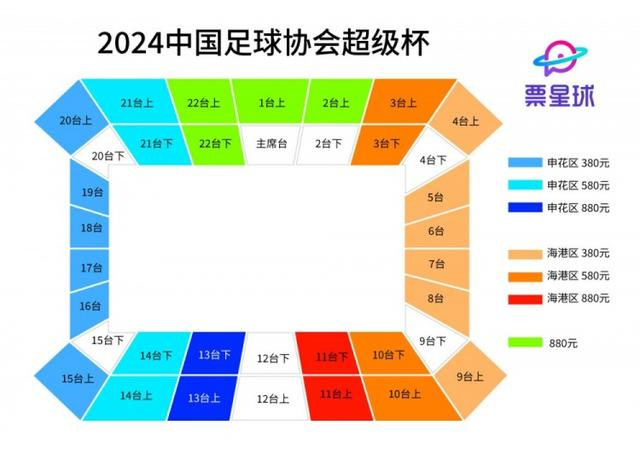
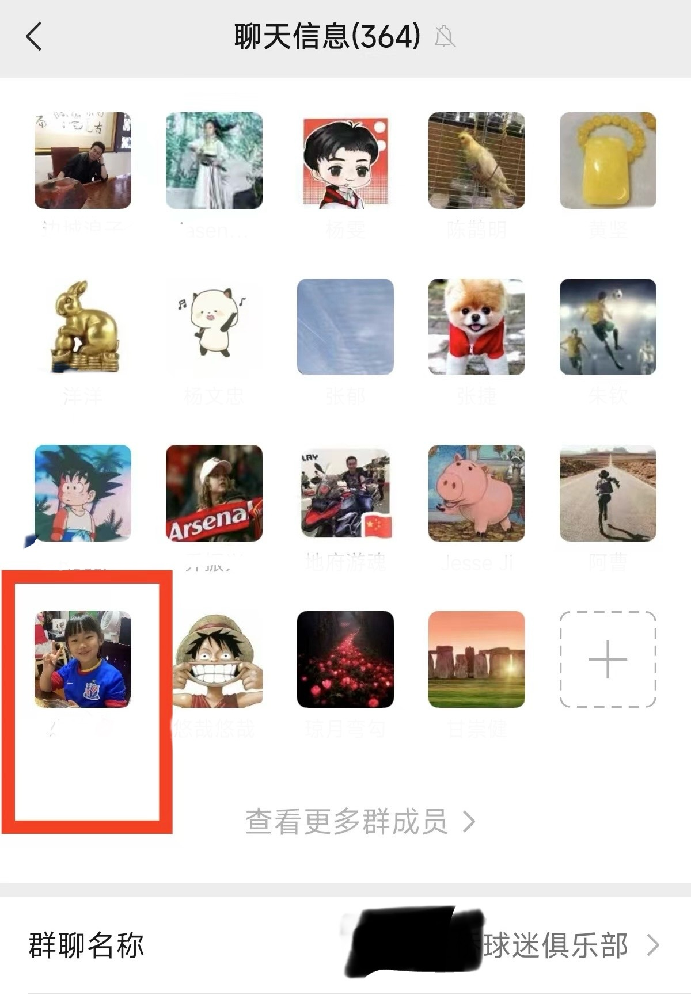
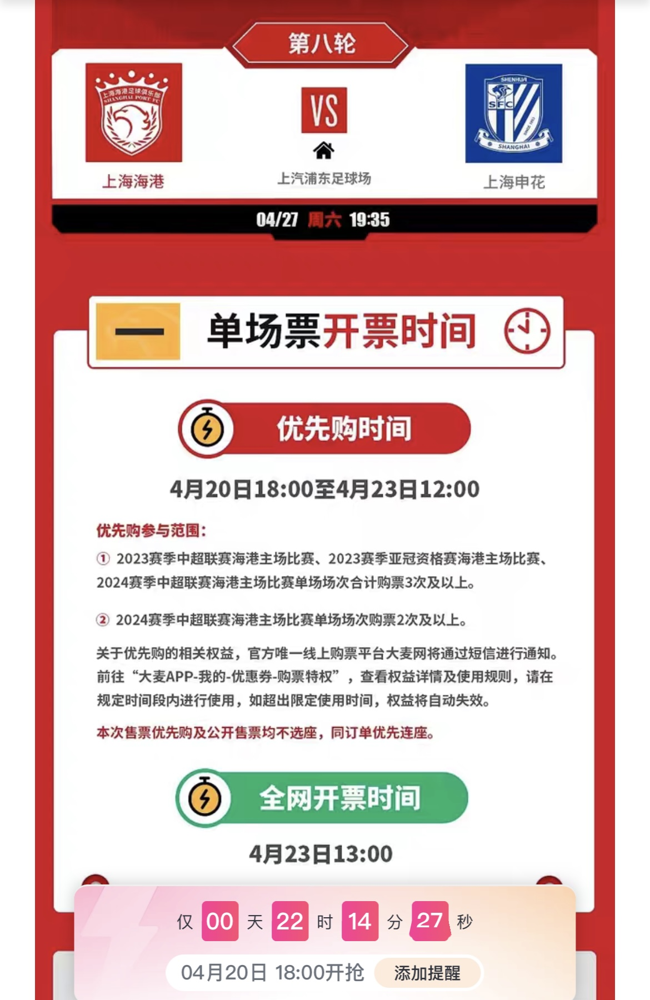
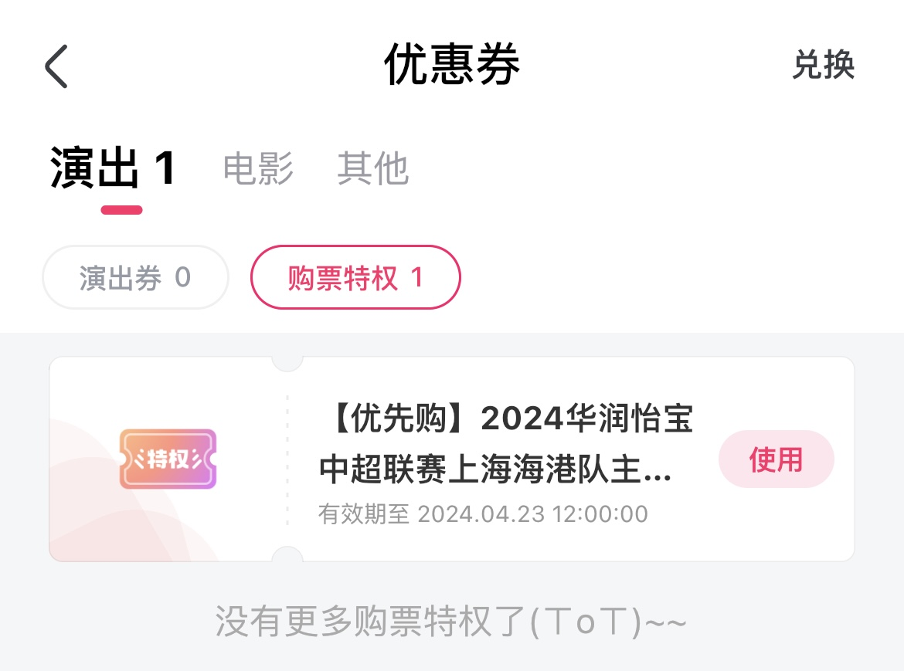
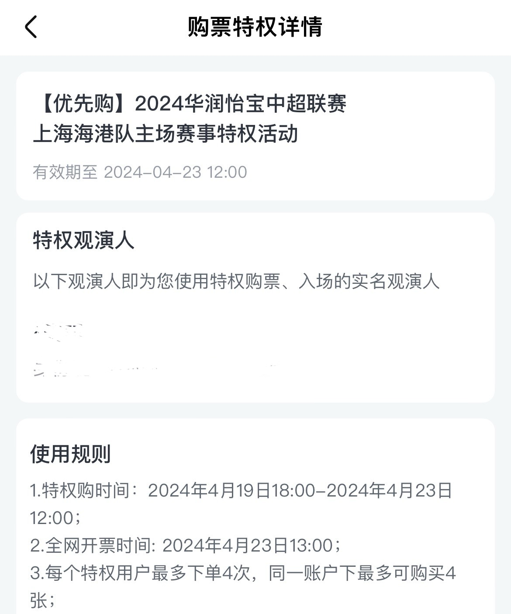

本周六2024-04-27，本赛季的第二场上海德比即将开打，海港主场对阵申花。今天讲一讲购票的故事😜

## 先说背景👀
本赛季中超踢了7轮，目前上海申花排名第一，上海海港排名第三，是唯二保持不败的球队，这场对决是火星撞地球，看点十足！
<!--more-->

## 再说历史
申花是老牌强队，94年中国职业联赛开始后，是唯三从未降过级的球队（另外两支是北京国安和山东泰山）。

海港源于上海足球教父徐根宝在崇明岛的青训，后来组建了东亚队，从中乙一直升到中超，财力雄厚的上港集团收购后，实力大增，上海德比从此成为中国最精彩最激烈最火药的德比。

## 接着说说卖票的历史

海港主场对申花，一直有不公开售票的传统（1.为了安全 2.怕申花球迷占领看台），往往只按照对等原则分600张左右客队票，由大巴直接拉进客队看台。

去年是疫情后开放看台的首个赛季。海港首次在新主场“白玉碗”浦东足球场对阵申花，出于安保等原因，当时并未公开售票，除了季票持有者，票源都在球迷会、工会等内部渠道，申花球迷购票困难🤔

申花主场更有格局！去年德比公开售票，这是9年来“八万人”第一次公开售票（之前是海港主场）。

不过，海港球迷想放开手助威，还是去客队球迷看台更合适，通过球迷会渠道购票，到源深体育场集合，再乘大巴前往，若穿红衣服直接去八万人看球，很可能会被打🤕穿曼联红衣也一样遭殃，网上还有不少视频可查呢😲

## 超级杯抢票
本赛季的德比已经踢了一场🎉

赛季开始前的超级杯，正是联赛冠军海港vs足协杯冠军申花👏（当时我就和朋友说，在国内，上海的球迷是最幸福的🥰除了每周都有中超外，最近半年依次能看到中超颁奖仪式、超级杯、中超开幕式，后面还有亚冠）

超级杯选在了相对"中立"的球场，曾经的申花的主场，现在空置的圣鲁迅——上海虹口足球场。

网上售票时直接分看台，申花和海港各自占据一半的看台，球票分别为380/580/880，需要先在各自俱乐部小程序里登记为球队球迷才能买，中立球迷只能买880元的中间看台的票。当时甚至连地铁进场也建议坐不同的地铁线路，这引发了一些热议🤔。

虹口有3.5w个座位，超级杯卖了不到2w张票，最后实际到场1.8w+。好像海港的880元球票没卖完，后期中立球迷也能买海港看台了。

## 联赛抢票
最后说说这场联赛德比的抢票那些事。

### 球迷会渠道
最近，我所在的海港球迷群里，混入了不少新晋的申花球迷，其中有一个人的头像居然还是小孩穿着申花球衣的照片，太容易就被群友发现并圈出来了🧐。因为群内的票很紧张，所以大家勇于抓“间谍”，混子无处可藏🤷

上周突然群消息暴增，一看原来是出方案了：本赛季必须在群里通过接龙的方式买过一场球票，才能拥有这次德比的抢票资格🎫，这个规则倒是挺合理的，一方面可以在票源紧张的情况下保护老球迷的利益，另一方面也能防止临时混进来的“间谍”买票。

可惜很多人虽然长期在群里，但是一直在用大麦买票，没在群里接龙买就不能参与德比抢票，挺遗憾的😔。

很多人表示买了季票，平时不常看，但只要能看一场德比就回本，因为票真的很紧张🎫 现在都是强实名，季票遇到不看的场次没办法转让，挺可惜的。

### 大麦渠道

球迷会渠道开始后不久，官方的售票方式也出来了🎫 满足条件的海港球迷优先购买：上赛季（包括亚冠）和本赛季买过 3 场主场票的球迷，或本赛季前三场买过两场主场票的，可以优先购票。我刚好在大麦上买过 3 个主场票，（甚至还买过海港客场平浙江的比赛），所以拿到了这个优先购买的资格😎。

购买形式是在大麦里发一张【优先购】的券，上周六晚上开售，没卖完的话，3 天之后再公开销售。这样预售阶段很可能票就卖完了，也能保证进来的都是海港球迷，蓝皮就进不来了😒。

【优先购】券上写符合资格可以买 4 张🤔，导致很多人以为能帮朋友买 3 张，于是闲鱼上多了一堆“有资格”帮抢票的“红皮黄牛”，很多“蓝皮”暗中购票，表示自己文明看球，不穿蓝色衣服，进球不庆祝，最后实际情况是只能给符合资格的人自己买，无法代抢。

球票有130/230/330/430四种，比平时贵不少，而且不能像平时一样选座，会根据票价自动分配。

我设了闹钟准时开抢⏰130的只开了两个看台，秒没，我抢到了230的。当天130和430很快售罄，230/330的还有余票。

后几天多次收到短信提醒有资格购票，看来俱乐部也着急，希望海港球迷赶紧买完哈。可惜事与愿违，最后230的都卖完了，但少量330元的球票流入公开售票，给了申花球迷可乘之机。

## 最后

最后希望明天海港和申花能联袂给球迷们奉献一场精彩的比赛，胜利属于上海！