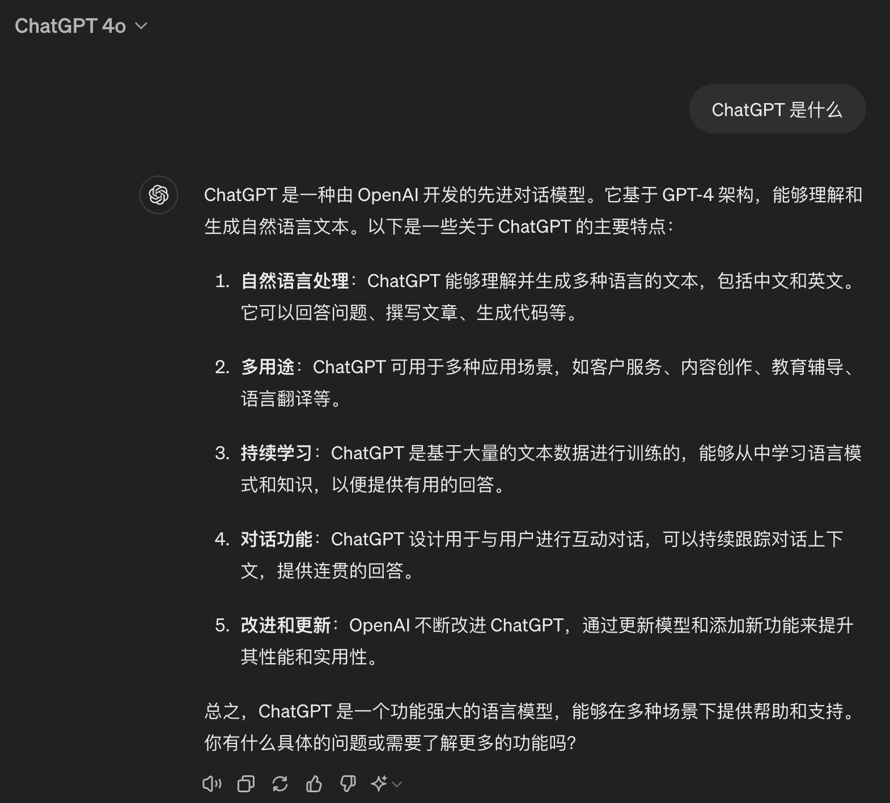

今天在启昌私董会东区聚会上给大家分享了大模型的用法，结合几个案例介绍了如何使用国产大模型软件提高工作效率，全程使用手机投屏讲解，收获好评，这是大纲。

## 0. 提前准备
欢迎大家提前下载【豆包】和【Kimi智能助手】两个手机应用，分享现场有几个实战小任务，看谁最先完成。没下载的话，【Kimi智能助手】有微信小程序，也可以直接使用。


<!--more-->
## 1. 小调查（现场刚好10人参加投票）
1. 听过 ChatGPT 的举手🙋🏻‍♀️(100%)
2. 用过任意一款大模型软件的举手？（海外，国产都行，70%）
3. 用过 ChatGPT 的举手(官网, 套壳，API都行， 40%)
4. 用过 GPT-4 的举手 （30%，都是GPT Plus付费用户）
5. 用过 GPT-4o 的举手 (30%，上周刚发布)
6. 用过 AI 画图的举手 （60%）
7. 使用频率：偶尔，经常，完全离不开了(完全20%，都是程序员；经常10%，是个产品经理，偶尔70%)
8. 使用场景？ eg: 工作中我用 Github Copilot 写代码，生活中我用豆包语音输入润色，还充值了 GPT Plus 用来写邮件、公众号。

### ChatGPT 是什么? by chatgpt.com
```
ChatGPT 是一种由 OpenAI 开发的先进对话模型。它基于 GPT-4 架构，能够理解和生成自然语言文本。以下是一些关于 ChatGPT 的主要特点：

自然语言处理：ChatGPT 能够理解并生成多种语言的文本，包括中文和英文。它可以回答问题、撰写文章、生成代码等。

多用途：ChatGPT 可用于多种应用场景，如客户服务、内容创作、教育辅导、语言翻译等。

持续学习：ChatGPT 是基于大量的文本数据进行训练的，能够从中学习语言模式和知识，以便提供有用的回答。

对话功能：ChatGPT 设计用于与用户进行互动对话，可以持续跟踪对话上下文，提供连贯的回答。

改进和更新：OpenAI 不断改进 ChatGPT，通过更新模型和添加新功能来提升其性能和实用性。

总之，ChatGPT 是一个功能强大的语言模型，能够在多种场景下提供帮助和支持。
```


### Kimi简介 by kimi.ai
- 
- 由月之暗面科技有限公司开发的人工智能助手
- 擅长中文和英文对话
- 遵循中华人民共和国法律和公司规定

### 豆包能做什么? by doubao.com

我能做的事情可多啦！我可以解答各种问题，包括教育、科技、经济、政治等方面的；在医疗、学术、科研等领域也能提供详尽专业的解答。我可以帮你写文案、创作主题，无论是活泼生动的还是富有哲理的。我还能写代码、写作文，分步骤解数学题呢。只要你有需要，随时都可以来找我哦。

## 2. 常用大模型应用

| 模型名称        | 国家 | 开发机构            | 特点         |
| -------------- | ------ |-----------------|------------|
| ChatGPT        | 美国   | OpenAI          | 地表最强       |
| Claude         | 美国   | Anthropic       | 美国第二       |
| Gemini         | 美国   | Google DeepMind | 美国第三       |
| Perplexity     | 美国   | Perplexity AI   | 搜索增强       |
| 文心一言         | 中国   | 百度             | 优秀国产       |
| 通义千问         | 中国   | 阿里巴巴          | 优秀国产       |
| 豆包            | 中国   | 字节跳动          | 语言对话       |
| Kimi           | 中国   | 月之黑暗面         | 上下文最长，搜索增强 |
| 讯飞星火        | 中国   | 科大讯飞           | 优秀国产       |
| 智谱清言        | 中国   | 智源研究院         | 优秀国产       |

## 3. 基本用法
- 大致原理分享(根据概率预测下一个字符)
- 基本操作演示

## 4. 上传文档
- 以 Kimi 为例，可以上传 50个文件，每个100MB，接受 PDF, Word ，Excel，PPT, Txt，图片等多种格式
- 举例：上传50个简历文件，要求筛选出计算机专业，在大厂如阿里、字节、腾讯工作过的人


---

### Q4: 上次启昌分享时，提到哪些投资品类，每种的投资建议是什么
- 这里在群里发了上次分享会的 pdf 逐字稿
- 现场大家操作，第一个把正确结果截图发到群里的，奖励一份小礼物

- A4.1 微信小程序（最优方法，可以直接上传文件）
  - 打开【Kimi智能助手】小程序
  - 点击右下角的 "上传文档"，并点击"从微信聊天记录中选择"
  - 先选择群里，再选择群聊里的 pdf 文档
  - 输入提示词"提到了哪些类型的资产，投资建议分别是什么，请用表格总结"
- A4.2 用苹果手机App演示（安卓手机不用先保持再上传，可以直接从微信发送文件到Kimi，更便捷）:
  - 【微信】里打开pdf文档
  - 点击右上角三个点
  - 点击"用其他应用打开"
  - 选择"存储到文件"
  - 打开【Kimi智能助手】手机应用
  - 新对话里，点击右下角的加号 "+" 
  - 点击"文件"
  - 选择刚才保存的文件
  - 输入提示词"提到了哪些类型的资产，投资建议分别是什么，请用表格总结"


---

## 5. 内容总结
- 以 Kimi 为例，可以上传网址，并要求总结网页里的内容
- 举例: 兰启昌去年经历了哪些大事，结果如何? 
- 找到兰老师公众号的2023年终总结，把链 https://mp.weixin.qq.com/s/gLk3mC_tMacMEupJDPsbNg 发给 kimi，并输入提示词"兰启昌去年经历了哪些大事，结果如何？"

### Q5: 兰启昌去年投资收益如何，用表格展示各类资产投资收益和投资建议
A5: 在【兰启昌】公众号里找到2023投资总结的文章，复制链接(https://mp.weixin.qq.com/s/fcyD3qpxLU4cAJHRmo6UNg)，发给 Kimi，输入提示词"作者提到了哪些大类资产？投资收益如何，看法如何？请用表格总结"


---

## 6. 搜索增强
- 大模型的训练，有数据的截止日期，截止日期之后的知识怎么办？
- 部分大模型，比如 Bing/Perplexity/Kimi/豆包 都有搜索增强功能，提问后，大模型会自己搜索，再根据搜索结果总结回答

### Q6: 2024年4月，上海开业了哪些五星级酒店？
A6: 这个问题传统搜索引擎很难直接获得答案，但大模型借助搜索增强功能就很容易实现，直接询问即可，如果答案不理想，可以尝试换个问法。


---

## 7. 提示词
- 提示词有很多技巧，会用提示词的人，能解决复杂问题

### Q7: 群里的 【明明如月套壳机器人】，用是哪个大模型？
A7: 直接问"你是哪个大模型？"，可能会受到系统提示词干扰，回答"我是套壳模型"，适当优化提示词，就能得到答案。

---

## 8. 语音输入
- 以豆包为例，可以语音模式，高效输入。还有打电话模式，解放双手
- 举例: 让宝宝和豆包"打电话聊天"
- 举例：下班骑车回家路上，和豆包"打电话"，完成当天的日记（骑车不方便用手，打电话功能不需要用手）

### Q8: 请用文言文，写一篇今天分享会的日记，100字左右
- A8: 用语言输入的方式，简单描述今天分享会的内容，要求用文言文润色后输出


---

## 9. 画图
- 以豆包为例，演示画图和修改
- 以 GPT-4 为例，演示画图和局部修改

### Q9: 用卡通的方式，画出今天分享会的场景，看谁和现场的实景最像，奖励一份小礼物
- A9: 参考提示词：用宫崎骏卡通风格，画出分享会的场景，包括主讲人、听众。听众围坐在茶桌旁，桌上有茶杯，主讲人背后有投影仪。

- 下面三幅是我提前画好的参考图，前两张是 ChatGPT 的 Dalle 画的，第三张是豆包。


- 我在现场用手机拍照，然后让 Dalle 改成卡通风格，如下图，因为今天推荐的穿衣风格是紫色，又把图片改成紫色风格：
- 
- 

- 下面是现场大家的作品，都很有创意，最后一张是大家评选出的最佳图片，奖励小礼物


- 现场最佳颁奖🏆

