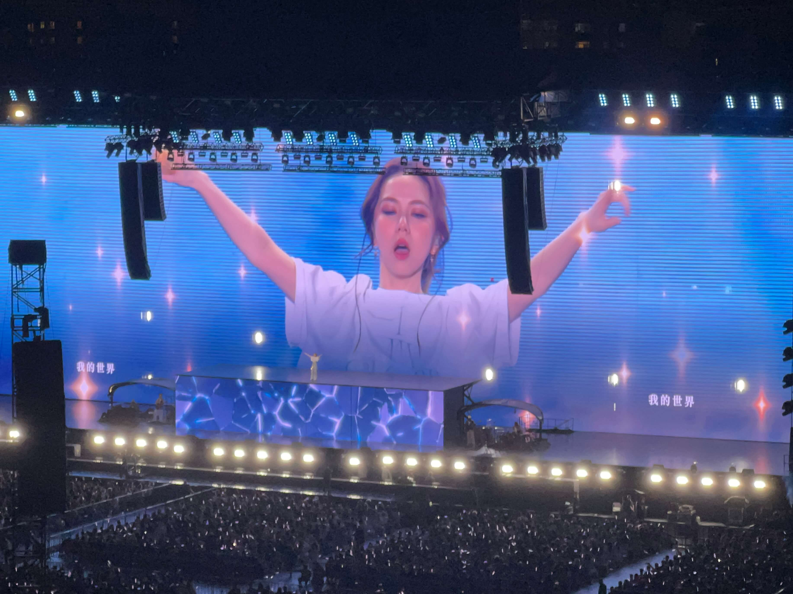

2024-5-28在上海体育场聆听了 "I Am Gloria" 邓紫棋上海演唱会的第五场，现场氛围很棒，晚上到家之后也是兴奋得睡不着觉，一口气写下了我的九点随感。

<!--more-->

## 第一点：破纪录
这次的上海演唱会，让邓紫棋成为首位在体育场连开五场演唱会的亚洲女歌手，这是很高的成就，需要极强的票房号召力和体力，开场时，她坦言之前对连唱五场心里没底，但到了第五天，她感觉很好，充满信心。

今天在这个巡回首次唱了《超能力》，唱完她也说，不休息连唱五天，需要“超能力”！

体育场座位众多，一般只有周杰伦、五月天这样顶流歌手会安排在体育场，大部分演唱会都是体育馆。

邓紫棋介绍说今日上海体育场卖了45000张票，连开五场合计共计 23 万人，从周五唱到周二，若以平均每人 1 千元的票价计算，就是高达两亿元的票房销售额。此外，还能带动了诸多如外地来沪的路费、住宿费以及旅游等方面的消费，拉动经济发展。

## 第二点：场地和设备问题
单场人数为 45000 人，所售门票数量较多，而且座位都是先预售，后开票自动分配座位，有一定随机性。再加上舞台搭建，设备调试等问题，造成不少座位观赏效果差，网络上有很多骂声，指责主办方拉胯。

尤其是第一场演出，存在明显的回声问题，还有那些坐在看台侧面的观众，虽然离舞台较近（因此票价比远台贵），但却因为设备遮挡。

之后，主办方调整了音响，并增添了两块侧面的屏幕，情况有所改善。

我进场前也有些担心，因为我买的是680元的29区山顶票。实际体验还算不错，虽然位置较远，但视角很好，主屏幕看得很清楚，音响效果也令人满意。

## 第三点：观众与氛围
前几日刚在隔壁的上海体育馆听了蔡琴演唱会，今天观众群体与上次全然不同，现场以女观众居多，多为年轻人，还有许多穿着时尚甚至火辣的小姐姐，在现场疯狂地舞动。

如果说蔡琴演唱会聆听的是音乐、旋律与怀旧，那么邓紫棋演唱会展现的则是舞动、激情与青春。

## 第四点：环形天幕
上海体育场（八万人）在疫情期间的改造后增添了顶部的环形 LED 天幕，这是一大突出亮点。足球赛效果不够明显，但演唱会就物尽其用了，顶部的大屏会跟随歌声以及现场灯光一同有节奏地变化，时而展示歌词，时而呈现出各种精彩的光效，动画，极为华丽，而且这样的景致唯有此处才有，可谓是风景这边独好！

## 第五点：互动荧光助威棒
这是我首次体验这种可以跟随歌曲节奏变色的荧光棒。单个荧光棒能够接收无线信号📶，跟随歌曲节奏进行变化。整个看台的荧光棒连在一起，就能玩出诸多花样和效果，比如不同的观看台呈现不同的颜色，时而有光，时而闪烁，还能展示出诸如波浪等流动的效果，现场的氛围非常好，极具激情，大家都挥舞着荧光棒，到后面高潮部分更是集体蹦蹦跳跳！

## 第六点：创作与翻唱
邓紫棋也是一位创作型歌手，专辑里大部分她自己作词、谱曲的，唱出了自己的喜怒哀乐，也通过自己的表达，帮助歌迷们抒发内心那些难以表达的情感以及生活中的美好与哀伤。现场大部分主打歌都是她自己词曲的。同时，也穿插唱了多首翻唱歌曲。多首在《我是歌手》比赛中翻唱过的歌曲，现场也都进行了演唱，《我是歌手》是她打入内地市场的标志，这些歌曲也为广大歌迷熟知，大合唱的比例更高。

## 第七点：内地市场开拓
邓紫棋爸爸是香港人，妈妈是上海人，妈妈毕业于上海音乐学院，是音乐世家。她出生于上海，四岁移居香港，所以普通话非常标准，几乎没有口音，现场还能时不时用上海话问候大家。现场仅演唱了一首粤语歌，其他包括串烧在内的超过 30 首歌曲都是普通话歌曲，这也表明她的内地市场的开拓非常成功。

## 第八点：时代的观察入口
作为年轻一代的歌手，社交网络上能看到她更多的内容，VLOG里拍什么，直播时做什么，短视下如何与歌迷互动，都是值得继续观察的内容，这是时代的缩影。

## 最后一点：解解和霉霉
有人称邓紫棋是中国的泰勒·斯威夫特，她们同样才华横溢，不仅能创作词曲，演唱能力也十分出色。

这次演唱会让我见识到了当代顶流歌手的风采。这也是我第一次听到比我年纪小的歌手的演唱会，仿佛打开了新世界的大门，意义非凡。

