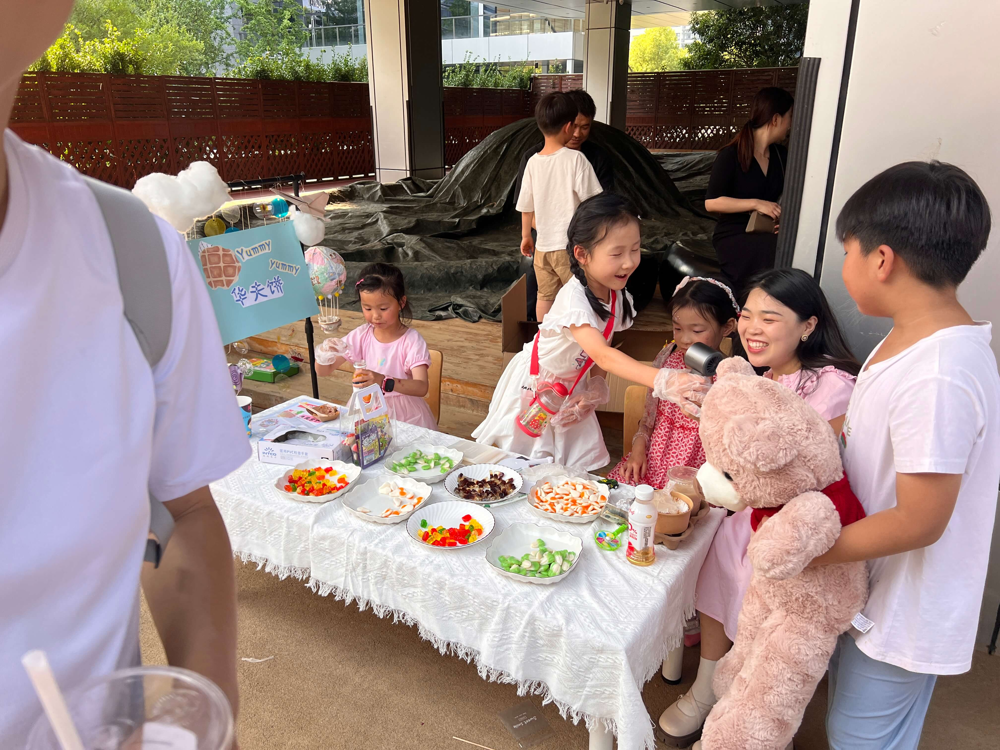
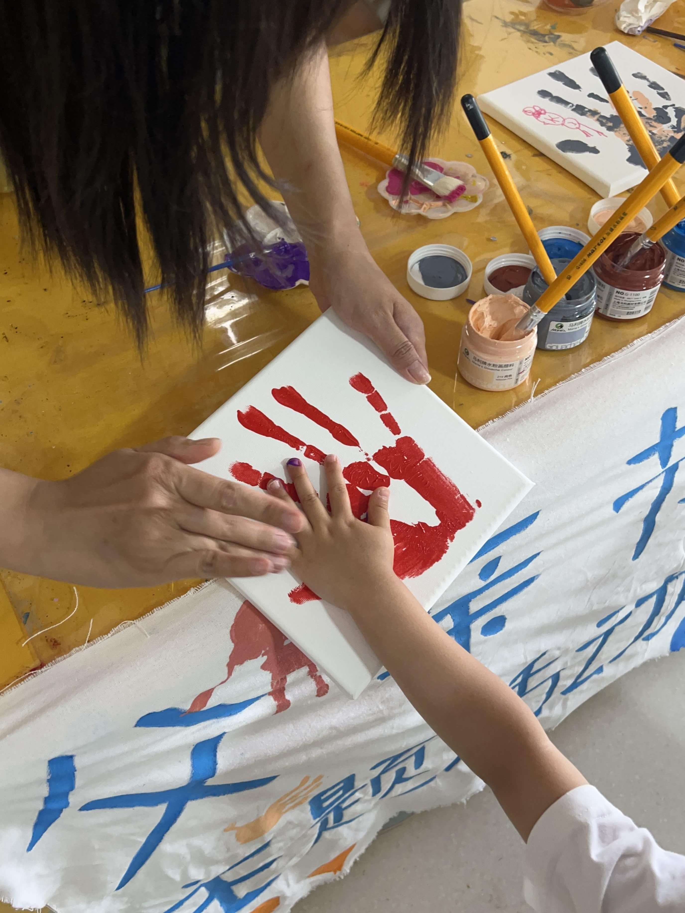
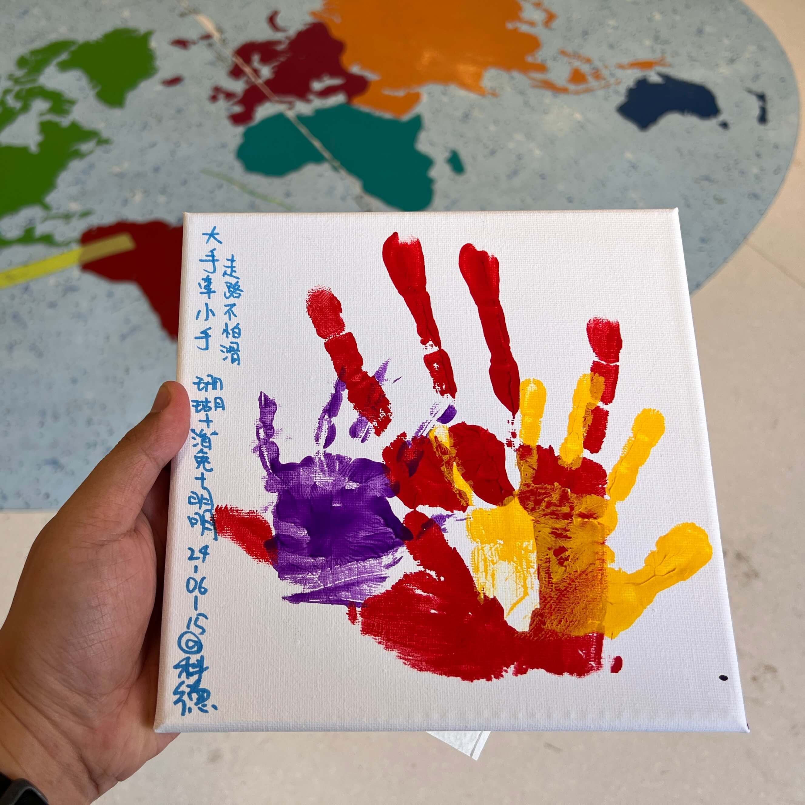
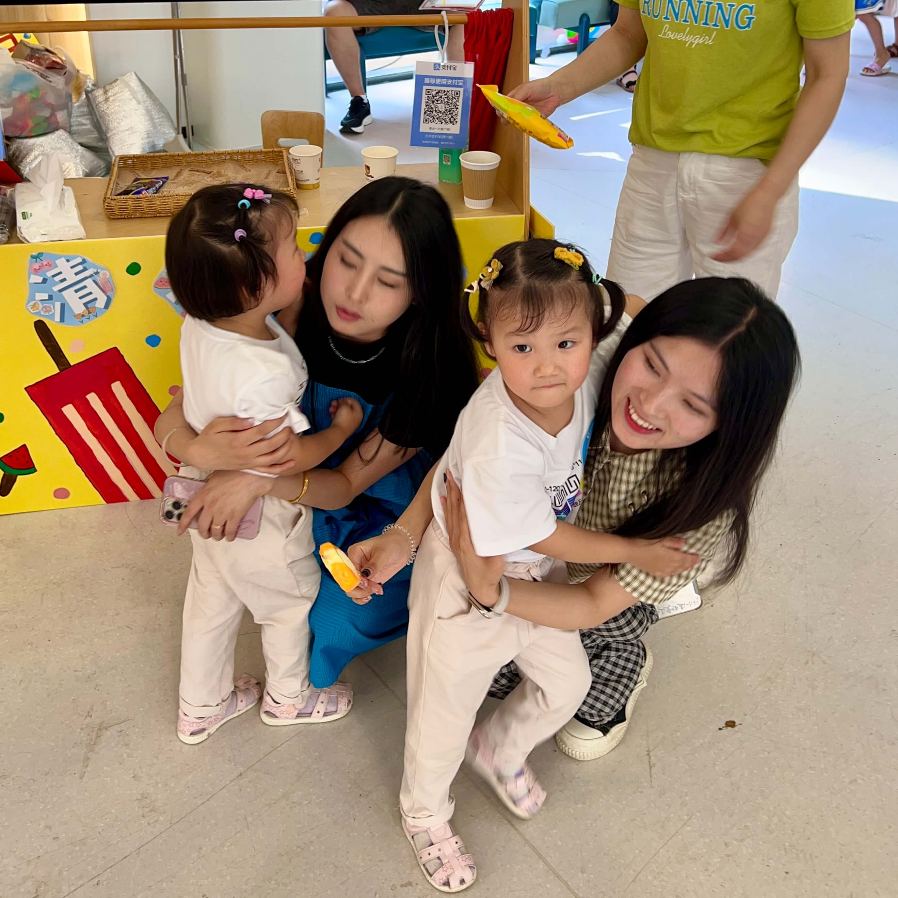

周六下午，我和家人一起参加了宝宝幼儿园举办的夏日嘉年华活动🎡，这个活动真是太棒了！不仅给孩子们带来了无限的欢乐，也让家长们感受到了满满的童趣和温暖，我还收获了惊喜的父亲节礼物🎁
<!--more-->
## 琳琅满目的摊点

嘉年华在幼儿园里举行，现场人山人海，像个热闹非凡的大集市。

大厅里小铺子琳琅满目，售卖着各种各样的美食，比如奶茶🥤、冰淇淋🍦、面包🍞等好吃的，应有尽有！满足了我们一家人的味蕾。

除此之外，还有一些售卖发夹等小物品、售卖玩具和书籍📚的小摊，让孩子们爱不释手。每一个摊位都充满了惊喜和快乐，让我们忍不住一次又一次地驻足。

## 多样的游戏体验

户外的游戏区域是孩子们向往的地方。我家宝贝儿在那儿玩得不亦乐乎，她们尝试了打地鼠🐭、拼地图🧩等游戏，不过成绩一般，拿不到奖品，托班的宝宝和大班的宝宝还是有明显的差距的，嘿嘿😋

竞猜环节也很有趣，有猜小熊名字🐻，猜罐子里糖果🍬数量等游戏。

猜小熊名字的游戏有趣极了，有两只小熊，一公一母，黑板正反面写了50个男孩和女孩的英文名字，二元一猜，猜中了就能把可爱的小熊抱回家。我和外婆，还有两个小家伙各自挑选了一男一女的名字，包括Milly, Ethan等，合计八个。开奖前，我还特意问了老师，名字是否已被选中，如果没有的话，我打算把剩下空缺的都包圆了，哈哈！

## 精彩的舞台表演

嘉年华现场还有一个中央舞台，那里有许多小朋友一起表演唱歌、跳舞等节目。他们跳的可是时髦的街舞哦，动感十足。现场还有一些留学机构，向家长们推荐留学、游学等产品，让人开拓眼界。

## 温馨的按手印活动

最让我回味的是就是按手印活动了！

第二天是父亲节，这个活动是专门给父亲准备的，我在中间按了个红彤彤的手印，两个小家伙也在旁边按了她们最爱的紫色和黄色的手印。

最后用笔写下“大手牵小手，走路不怕滑”的标语，真是太欢乐了！

## 总结

总的来说，这次嘉年华活动真是丰富多彩，不仅让宝宝们度过了一个愉快的下午，更让我们感受到了幼儿园的用心和温暖。看着孩子们脸上洋溢的笑容，我真心感到无比幸福。

希望以后还能有更多这样的活动，让我们和孩子们一起分享更多的欢乐时光！

