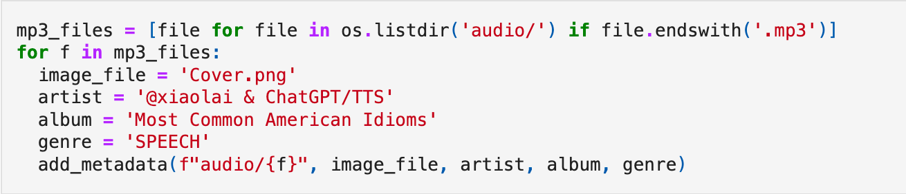

近日，李笑来发布了一本免费的电子书——《美国常用俚语》，这一消息在微博上引起了不小的关注。令人惊讶的是，他声称这本书借助 GPT4o ，仅花费 18 美金和一天时间就完成了创作。

出于对出书过程的强烈好奇，我去研究了笑来老师在 GitHub 上开源书籍项目，包括书籍，音频，还有详细的代码。
<!--more-->
代码是用 Python 写的，使用了 Jupiter Notebook，可以实时看到运行结果。全部代码大概一百多行，从代码里详细的注释来看，应该也借助了 GPT4 写成的：

输入文件叫“idioms.txt”，每行一个俚语，从 A 一直到 Z，一共有 1355 行。

代码则是逐行读取这些俚语，针对每个俚语，调用 GPT4-o 模型。模型返回的内容包含示例、解释，还从美国历史文化角度阐释了该俚语的来源，并按照格式给出了三个美式英语的返回句子。最终，将这些一行一行的内容合并在一起，便形成了全书，有网页版本，也有电子书版本。

提示词如下：
```
你是我的英语教练。我将提供一个带有编号的 idiom，你要帮我把他翻译成合适的中文释疑。
而后，讲解一下这个 idiom 的来历=，以及适用的场合。
再然后，你要为这个 idiom 提供 3 个美式英文例句，尽量使用日常词汇，不要过长。

[Overall Rules to follow]
1. Do not compress your responses.

参照以下例子（markdown）作为输出格式(follow the Overall Rules to follow)，
其中，请格外注意 span 和 audio html 标签的正确，以及，弯引号外与汉字之间应该有一个空格：

"""
## 1. 9-to-5 

**释义**

“朝九晚五” 或 “平常的上班时间”。

这个短语起源于标准的工作时间，即从上午9点到下午5点，这也是劳动法定时计工作时间。在现代社会，“9-to-5” 已经成为了描述一个常规工作日的固定表达，用以表示这样的工作常规和一般的工作时间安排。

This phrase originates from the standard working hours, from 9 AM to 5 PM, which are also the legally defined work hours. In modern society, "9-to-5" has become a fixed expression to describe a regular workday, indicating such a working routine and general schedule.

**Examples**

- <span lang="en">She works a typical *9-to-5* job at an office.</span> <span lang="cn">她在办公室做一份典型的朝九晚五的工作。</span><audio controls><source src="audio/001.1.mp3" type="audio/mpeg"></audio>
- <span lang="en">I'm tired of the *9-to-5* grind and want a more flexible schedule.</span> <span lang="cn">我厌倦了朝九晚五的枯燥生活，想要一个更灵活的时间安排。</span><audio controls><source src="audio/001.2.mp3" type="audio/mpeg"></audio>
- <span lang="en">Not everyone is suited for a *9-to-5* routine.</span> <span lang="cn">并不是所有人都适合朝九晚五的作息。</span><audio controls><source src="audio/001.3.mp3" type="audio/mpeg"></audio>
"""
```


对于音频部分，他使用的是 OpenAI 的 tts-1 模型来阅读每个俚语的三个例句。模型有 6 种不同的语音，每次随机选用一种语音进行阅读，保证了随机性。音频插入了网页，就变成了有声书，可以随时朗读例句。

生成完音频之后，还对这些音频进行了合并，每10个一组，配上前后切换的素材音，连接成五分钟左右的mp3音频，可用于听力练习。

更让人叫绝的是，对于每个声音文件，笑来老师还贴心地添加了元数据，包括作曲家（即他自己）、专辑音乐类型，甚至还有一张图片的封面，这让这些 MP3 文件使用起来更加方便。




从笑来老师的微博发布时间来看，第一天花了一小时写代码，然后用了一夜时间调用模型，生成了全书和音频，第二天早上又发微薄，。

TBD 分享合作精神

一天时间出版一本英文书籍，乍一看似乎不可能，但感谢笑来老师的开源分享精神，把代码都放到了 github 上，让我们能拆解他的写书过程，揭秘后发现这一切并不复杂。

举一反三，我们也可以借鉴他的思路和代码，写出自己的书嘛。

不得不说，在科技的助力下，创作的方式正在发生着巨大的变革。李笑来的这次尝试，让我们看到了人工智能在语言学习和书籍创作方面的巨大潜力。但同时，也引发了我们对于这种创作方式的思考和讨论。
不知您对此有何看法呢，欢迎在留言区讨论~

TBD：
- 自己发
- 生财分享
- 各种群发布