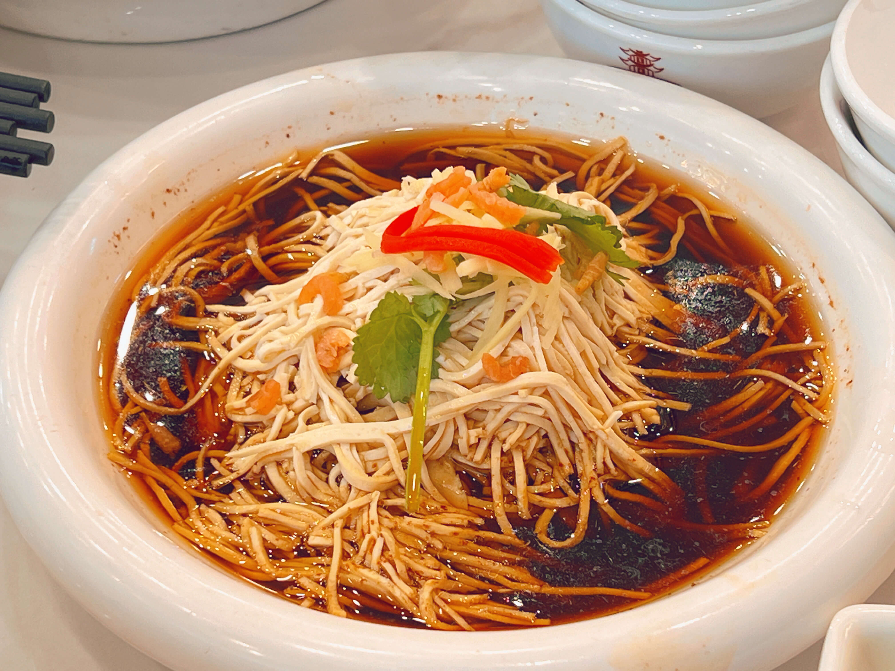

## 前往扬州
2024年8月13日，我和父亲，姑姑，表弟携宝宝们赴扬州游玩。

宝宝此前背过古诗，“故人西辞黄鹤楼，烟花三月下扬州”，亦背过“二十四桥明月夜，玉人何处教吹箫”，对扬州很感兴趣，再加上南京距扬州较近，且今日稍有降温，于是决定自驾前往。
<!--more-->
## 行前准备
提前两天决定出发，提前一天晚上做了些功课。

首先确定去处，因正值酷暑，室外炎热，即便这两天下雨降温，室外仍不太适合游玩，于是主要目标定在扬州博物馆。查询扬州博物馆相关信息，除大人看展外，一楼有恐龙展，适合孩子玩耍，感觉不错。

住宿定在博物馆附近的公寓，博物馆位于主城西边的新城，道路宽阔，公寓楼下有商场，吃饭住宿便利。选酒店公寓房间较大，标准间有一张 1.8 米和一张 1.5 米的大床，方便带两个宝宝睡觉。

# 路途顺畅
从我家至扬州博物馆，约 96 公里。可沿江北大道快速路及沪陕高速前行，交通颇为便利。

早上九点自驾出发后，果真极为方便。江北大道高速路及沪陕高速上大货车很少，三车道的快速路与高速，行驶起来甚为舒适。

## 服务区休憩玩耍

宝宝待机时间有限，坐车一小时后开始闹腾，刚好行至仪征服务区，便下车休息。服务区里有一小型儿童乐园，仅一个小滑梯，但宝宝们仍乐在其中，玩得特别开心。

汽车也借此机会充电，高速上充电的价格都很高，这里 1.8 元一度，是家里谷时电价的 6 倍，比烧油也便宜不了多少，不过能充一些是一些，毕竟为绿色能源。

## 扬州博物馆
十一点到达扬州博物馆附近，还没到饭点，宝宝也不饿，就先去博物馆游览。最近暑期不需要预约，直接刷身份证进场。一楼大厅有很多穿着校服的学生在排队，应该是集体的暑期活动，边上的展板也展示很多暑期的研学活动。

## 龙行“浙”里——浙江出土恐龙化石特展

一楼西侧大厅是来自浙江的恐龙特展，此前宝宝们在浙江自然博物馆、浙江省地质博物馆应该也看过类似的。这里展示了丽水浙江龙、东阳龙、天台越龙、缙云甲龙等几种在浙江考古发现的恐龙。 有大型的复原化石，各类文字展览，还有一些恐龙蛋的化石，甚至恐龙粪便的化石，小朋友们看完皆忍俊不禁。中间还有一些能动的恐龙，颇为有趣。关于恐龙，我今日收获的新知识是现在的鸟类极有可能是恐龙的后代。

## 厚积薄发——积木里的文物世界

一楼东侧小的特展厅是“厚积薄发——积木里的文物世界”。此展厅甚是好玩，运用各种类似乐高的积木搭建了众多扬州的景点和文物，诸如文昌阁、瘦西湖的五亭桥、扬州双博馆，龙舟、青铜器等各种各样的景物，小朋友们甚是喜欢。

## 国宝厅的梅瓶

二楼的国宝厅所展示的是"元代霁蓝釉白龙纹梅瓶"，此乃镇馆之宝，元代景德镇产的文物。1978 年，扬州市民以 18 元卖给博物馆，后被鉴定为国宝，并禁止出境，如今价值数亿。

这种元代烧制的霁蓝釉白龙纹梅瓶仅存三件，颐和园有一个，法国有一个，但那两个皆有瑕疵，扬州这件器型最大、釉色净润且保存最为完好。

二楼还有广州的外销瓷、龙年生肖艺术等临展，宝宝们有点饿了，我们就走马观花，快速略过。

## 广陵潮

午餐和午休之后，我们来到扬州博物馆最精彩的展厅：位于三楼西侧的“广陵潮”，广陵是扬州的古称，这里进行了扬州的通史展示。我和籍贯是“扬州江都”的表弟一起逛了约一个小时，仔细了解了扬州的历史。

展览从扬州的历史讲起，历史最久的展品居然是猛犸象的象牙化石，猛犸象生活在距今250万到1万年的更新世，是适应寒冷气候的动物，竟能出现在扬州，可见当年地球曾经有个非常寒冷的时期。

后面是一些新石器的考古发现。比如龙虬庄考古遗迹，此处人的基因与附近江苏、山东一带的人不同，反而与中原仰韶人基因很像，这表明了中原往江南的迁徙。

西周时期，中原来的人在这里建立起邗国。邗国以铸造青铜兵器著称，今天人们还常用“干戈”作为兵器，甚至战争的代名词。

到了春秋战国时期，吴王夫差北伐，在此修了邗城，这便是扬州最早的建城历史。

再至战国末期，楚怀王修建了广陵城。

之后是秦汉，汉朝实行分封制，吴王刘濞把扬州这里治理得很好，但后来反叛作乱，即“七王之乱”，兵败被杀，这里介绍了各种汉朝分封在本地的王的故事。

随后是三国和晋，东晋南渡，扬州再次发展。

隋唐是扬州发展的高峰期，隋炀帝最爱扬州的琼花，建好京杭大运河后，扬州以漕运为主业，发展甚好，不仅经济繁荣、人口众多，对外交流、贸易、文化也有长远发展。

北宋的韩琦、欧阳修、苏轼都在扬州留下了印记。南宋时期，这里是抗金前线，战争破坏较为严重。

接着是元明清，重视运河漕运，扬州的经济，手工业，文化都很繁荣。诸如雕版印刷、扬州八怪，还有众多的文人学派。

## 看完扬州历史的感受

看完扬州历史，我最大的感受当属地理位置决定论。

我国的海岸线一直向东扩展，早期长江出海口就在扬州、镇江一带，所以扬州是与海外交流的前沿阵地，比如鉴真 7 次东渡，就是从扬州出发，日本韩国人来中国交流，也多从扬州登陆，彼时扬州相当于东方大港，位置优越。

后来京杭大运河开通，扬州处于大动脉线上，经济得以良好发展，先发展的漕运业，可以带动后来的商业、农业、手工业等，朝廷也会派遣得力干将、有名的大臣来扬州做官主政，进一步促进本地发展。

到了如今，大运河的运输能力下降，扬州不在京沪铁路的主线上，扬州主城也不临长江，这些年发展一般，成为一个生活舒适、宜居的三线城市。

## 扬州中国雕版印刷博物馆
双博馆是两块牌子：扬州博物馆和扬州中国雕版印刷博物馆

二楼和三楼东侧分别是中国雕版印刷展和扬州雕版印刷展。这里展示了中国雕版印刷的历史，从最早的木活字印刷，到后来的铅活字印刷，再到现代的电脑印刷，都有展示。这里还有一个雕版印刷的工作室，有大师现场雕刻表演，也可以现场体验雕版印刷。

## 考古发掘体验
下午宝宝们在一楼的考古发掘体验区游玩，小朋友们喜欢的挖沙子游戏，在这里变成了考古发掘现场，宝宝们玩得很开心。

## 富春茶社

富春茶社是扬州有名的老字号，百年老店，喝茶、点心、小吃都很有名。晚餐和家人在富春茶社的瘦西湖店用餐，综合体验挺好的，说几点体会：

先说优点：口味好，性价比高。我们一行四人，人均约 70 元，吃得很饱，心满意足。主要的招牌菜都品尝到了，包括富春"魁龙珠"茶，菜品小烫干丝、文思豆腐、鱼圆汤、冷菜四拼，主食扬州炒饭、虾仁煨面，点心蟹黄汤包、三丁包、翡翠烧麦、千层油糕等。就餐环境优良，比如四人有方桌，六人有圆桌，儿童座椅等各项服务也都跟得上。

再说可以提升的地方：

首先是选址，我们白天在城西的新城游玩，靠近博物馆、美术馆的区域，周边居然没有开设分店。几家分店都在市中心，我们开车前往，得驶入老城，赶上晚高峰，车流量大，车速缓慢。我觉得应该在新城的综合体的商场内，开设连锁分店，拥抱新钱和年轻人的口味，与主城的老字号独立的门店相呼应。我们去是瘦西湖分店，感觉也是个特殊的分店，主要承办大型宴会，面向散客的小桌子数量不多。不过，门口停车比较方便，肯定是比市中心的老店要好些。

第二点是点评上的团购套餐可以优化。现有的几个套餐，比如 188 元的三人餐和 169 元的 3-4 人餐，有点雷同，让我摸不着头脑，不知该如何选择，反复与前台确认。我觉得点评上的套餐应该有明晰的区分度，节省顾客的点餐的学习成本和心智消耗，比如区分为"点心套餐"，"下午茶套餐"，"快餐"等，另外套餐需要让新顾客能快速品尝到代表性的菜品。这样对于餐厅来说便于备菜（主力套餐点的人多），对于顾客来说也能快速品尝到代表性的菜品（方便打卡和点评等）。

## 总结

这是 2024-8-13 扬州之旅的观察和体验，这几天我在对表弟进行文章速写特训，今天白天旅行，晚上快速完成游记，提高输出的效率。这是表弟的文章，欢迎阅读。
