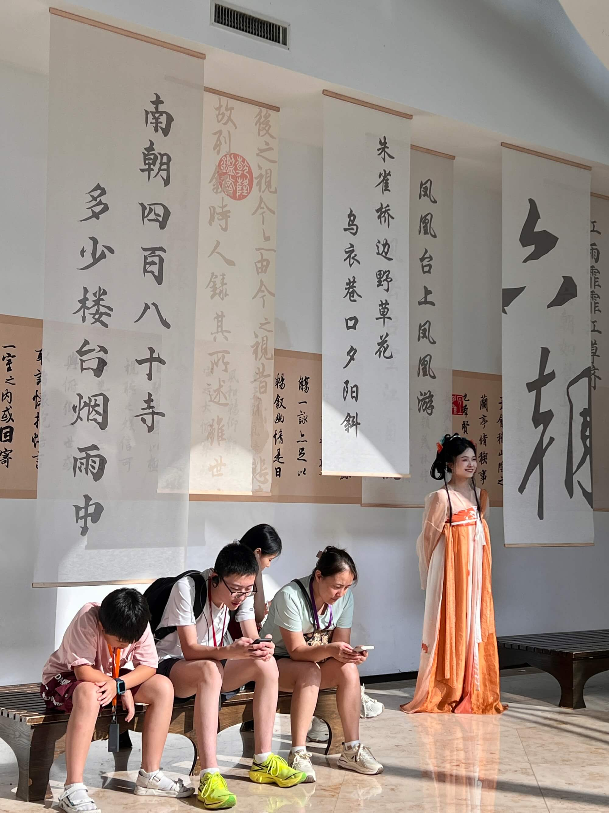

## 六朝博物馆的发掘历史

南京，这座历史悠久的“十朝都会”，在唐朝时便以“六朝古都”之名闪耀于世。东吴、东晋、宋、齐、梁、陈，这六个朝代在南京留下了璀璨的历史印记。然而，战火的侵袭让六朝都城的遗址一度几近湮灭。幸运的是，在 20007 年的土地开发中，考古发现让六朝皇城的遗址得以重见天日。
<!--more-->

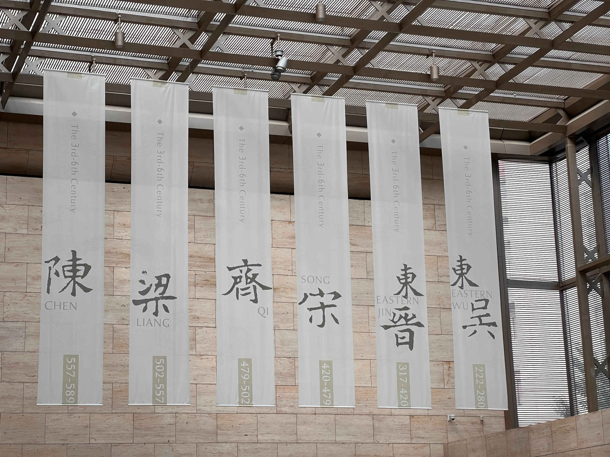

颇为有趣的是，这六朝都城与后来的明归德侯府，汉王府，清江宁织造署，康熙、乾隆下江南建造的大行宫，两江总督署，太平天国天王府，中华民国总统府一脉相承，竟然都在同一位置。南京上下两千年的十个朝代里，有八个皇城都同在现大行宫/总统府这里（另外两个明朝在明故宫，南唐在张府园），历史着实奇妙。

为了更好地保护和展示这段珍贵的历史，南京六朝博物馆应运而生。它建立在六朝皇城遗址之上，总统府的东侧，是一座独具特色的遗址博物馆。在这里，人们可以透过展出的文物、遗迹，感受三国到南朝所独有的魅力。

## 购票参观
门票价格为 30 元，微信上搜索“六朝博物馆”后进入南京市博物总馆，然后跳转美团购买。

暑期炎热，博物馆在室内有空调，再加上适合学生研学，所以门票异常紧张。最热门的南京博物院要提前一周抢，隔壁的总统府也要提前一天预约，六朝博物馆挺好，完全可以现场预约。

我中午约了老友尹博士午餐，下午2:20进馆，恰好在服务台看到了 2:30 有志愿者讲解，时长约一小时。于是跟随志愿者一同游览，事后证明，虽然众多游客聚在一起，要凑近点才能听得清，但听讲解绝对值得，如果没有讲解，很多文物我可能看不懂，并错过国宝。

## 建筑之美

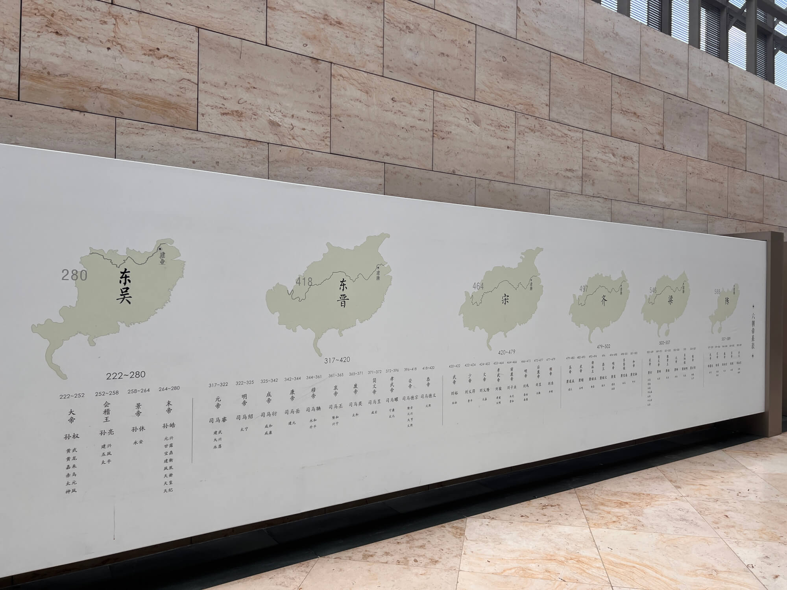

讲解从一楼大厅开始，首先概括了六朝的历史：东吴、东晋、宋齐梁陈。在隋唐之前，南京就已经是“六朝古都”了。还有六朝的历代疆域图、历代皇帝的年号及在位时间等图文展板。

然后介绍了建筑的特色，这座博物馆由贝聿铭的儿子贝建中先生设计，完美地传承了贝式美学。大厅钢构玻璃天棚彰显出结构美与材料美，让人眼前一亮。地面上，镶嵌在米黄 石灰石板之间的 78 个玻璃窗，如同 “满天星” 般璀璨，玻璃与光影巧妙结合。负一楼参观的时候，抬头就能看见从一楼地板上玻璃窗下透出的光线，时不时还有游客从上面走过，这样把自然光引入了负一楼，实在太巧妙了。

## 负一楼：六朝帝都
展览讲解从负一楼的“六朝帝都”展厅开始，这里的展览分为城市篇和生活篇。

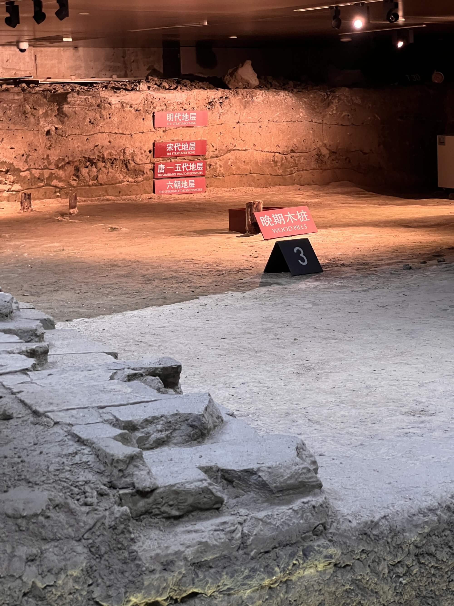

城市篇展示的是考古遗址，两个10平方米的探方，可以看到从明代、宋代、唐五代直到六朝的地层，告诉我们南京是个叠压的城市，一层一层，掩埋着无数的历史。遗址上还能看到六朝的包砖墙、木桩，河道等遗迹，让我们对六朝建康城的建筑规模、宫殿、城市道路和排水系统有了初步的了解。

生活篇则通过大量文物，生动地还原了六朝时期人们的衣食住行。包括夯土墙、钱币，生活物品、瓦当等，静静地诉说着历史的沧桑。此外，2007 年南京邓府巷挖出的台城城壕排水道也被搬进了展厅，让我们更加直观地了解到古人的智慧。

## 二楼：六朝风采

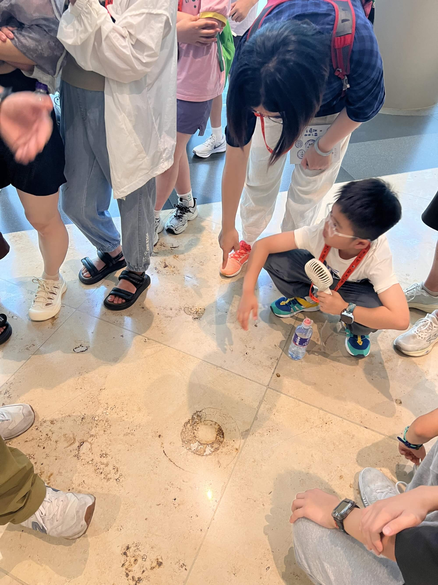

二楼的过道的地砖里，掩藏着很多海洋生物的化石。

“六朝风采”展厅，展出了南京各地六朝墓地里出土的陶俑、青瓷、墓志、瓦当、石刻等大批珍贵文物。从美学视角出发，这些文物为观众解读了六朝艺术珍品的独特魅力。

**第一单元“瓷器里的艺术”**，依次展示了青瓷的点彩工艺、博山炉、鸡首壶等代表性的瓷器。

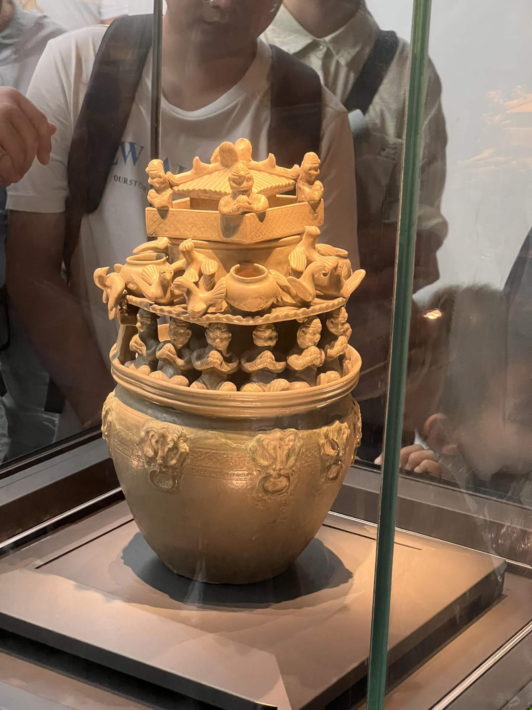

这里值得重点关注的是两件器物：

第一件是“吴青釉褐彩羽人纹双系壶”（下图），三国时期吴国的，我国有195件禁止出国的文物，南京有6件，3件在南京博物院，2件在南京博物馆，1件在南京大学。这件“吴青釉褐彩羽人纹双系壶”就是2件南京博物馆的其中之一（另一件也恰在此处展览，详见下文），83年南京博物馆从雨花台六朝墓地考古发掘出，13年列入第三批禁止出国展览文物，六朝博物馆建好后，开始在这里展览。这个壶的出土，证明早在三国时期就已具备烧制釉下彩瓷的先进工艺，比之前的唐代提前了400年。

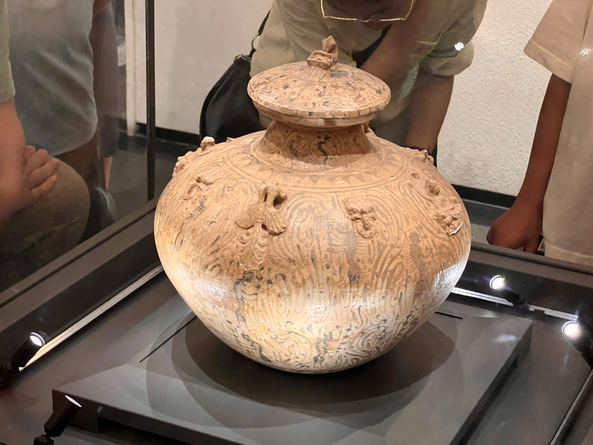

第二件是“青瓷莲花尊”（下图），南北朝时期的作品，目前留存至今的十余件，都是器型高大，代表了南北朝时最高工艺水平。南京仙林的灵山的南朝大墓里出土了一对，保存完好的就是展示在六朝博物馆里的这件。河北衡水出土了四件北朝的青瓷莲花尊，目前分别藏于国博、故宫等地。

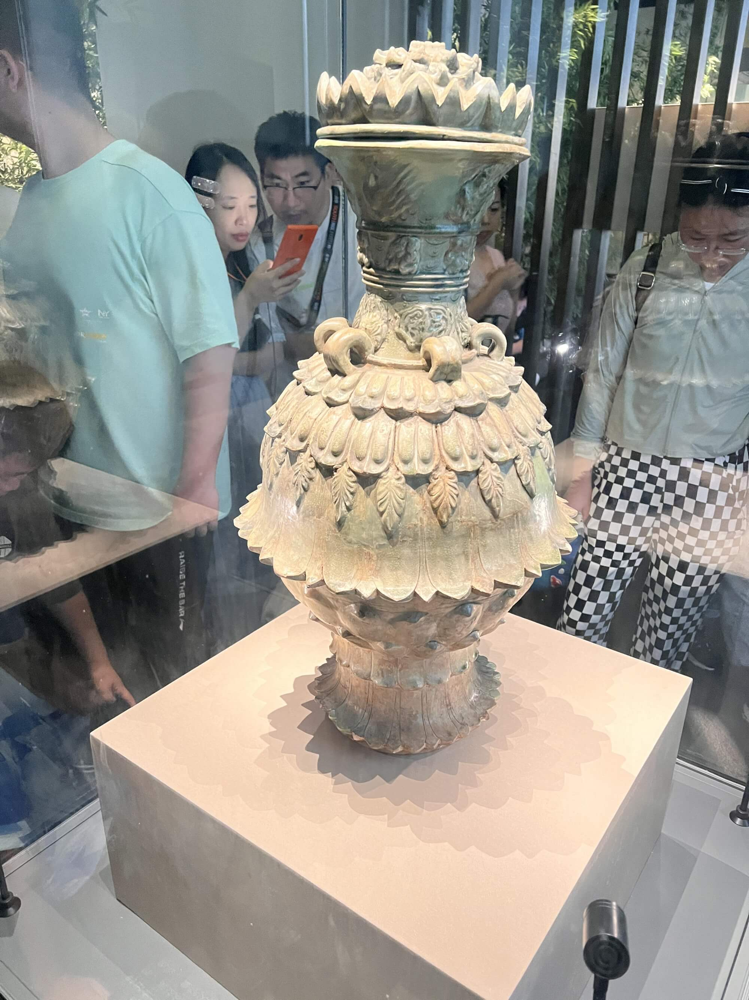

中间休息区悬挂着《兰亭序》，座椅上设有耳机插孔，自带耳机便可欣赏到六朝琴乐，让人在欣赏艺术的同时，也能感受到那份宁静与优雅。不过现在已经是无线耳机时代了，大家的手机都插不了有线耳机，或许放上播放歌曲的二维码，或者是网易云音乐的链接会更好。

**第二单元“塑像里的艺术”**，主要也是陪葬品里的塑像，陶俑等。

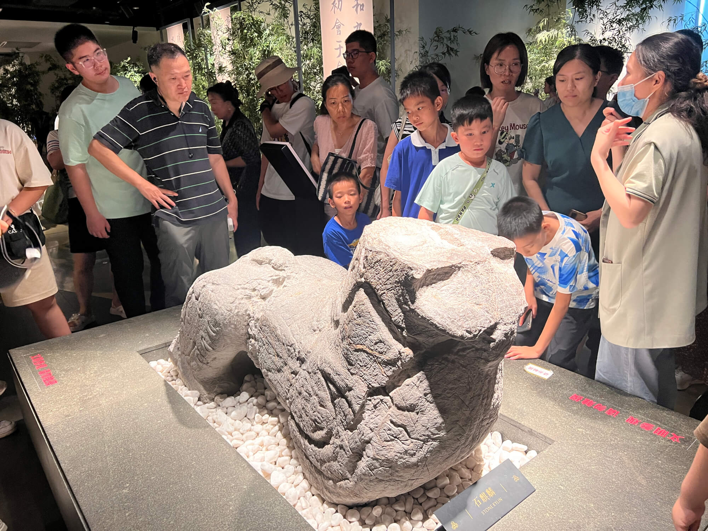

**第三单元“线条里的艺术”**，主讲六朝书法，由于纸张很难保存的缘故，唐朝以前的纸质书法非常稀有，书法研究主要以碑刻为主，这里展示的主要是墓碑。

东晋的包括“王谢”，幕府山发现7个王家大墓，包括王羲之的堂弟王兴之。谢鲲是谢安的伯父，墓在中华门外戚家山，他是南下的第一代人，墓志上写了“假葬建康县石子岗。。。旧墓在荧阳”，意思是临时临时葬在南京，有机会迁回祖墓，可惜都从中原南迁的王朝，东晋、南宋、南明等，没有能再光复中原的。

字体上看，东晋的这些墓碑都是隶书，南朝的都是楷书，这里也能看出字体的转变。1965年郭沫若就《王兴之夫妇墓志》和《谢鲲墓志》撰写了两万余言的考据专论《由王谢墓志的出土论到兰亭序的真伪》，意思是兰亭序和这两个墓志是同一时期，通过这两个墓志的隶书，质疑王羲之《兰亭序》的真伪，认为过于飘逸，不像同一时代的作品，引发了一场论战。后来发现了东汉时期的楷行书曹操宗室墓砖，证明了行书《兰亭序》完全是可能的。

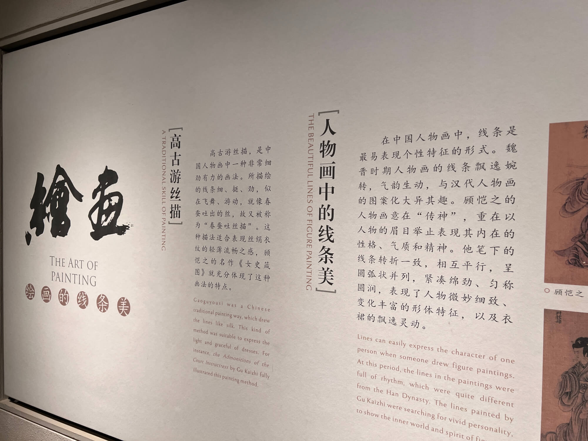

这里还展出了一件文物，“错版竹林七贤拼镶画像砖”，也值得一提：“南朝竹林七贤与荣启期砖画”是南京博物院的镇馆之宝，也是195件禁止出国文物之一，六朝博物馆展出的这件是它的孪生兄弟，它是错版拼接的，砖块之间错乱，内容也有重复。专家推测，有可能当时正值战乱，墓主匆匆下葬，没有充足的时间将这幅壁画所拼接好；还有一种可能，当时竹林七贤与荣启期是规格较高的墓葬才配使用，墓主规格不够，如果按正常的拼法有僭越之罪，所以就成了我们今天所看到的样子。

## 三楼：六朝人杰

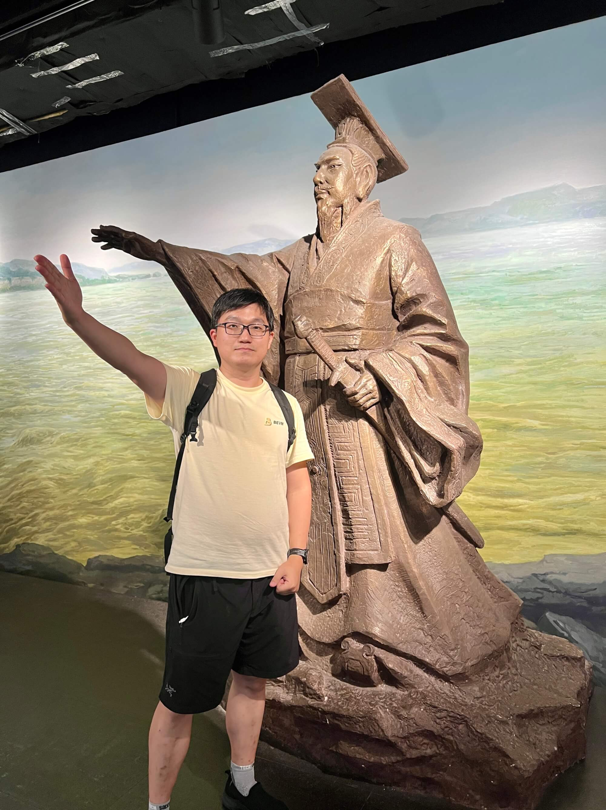

三楼没有志愿者讲解，自行游览参观。从政治军事、文艺思潮等多个层面展现六朝杰出人物，以及相关的历史事件。

展览的入口就非常精彩，头顶有很多支箭，射向了前方的墙面，展示的是“草船借箭”。里面从政治人物开始介绍，首先是东吴大帝孙权的塑像，后面还有科学家祖冲之的塑像等，墙上的展板内容丰富，艺术设计也很有特色，展示了这些风流人物的事迹，向我们一窥当时的文化。

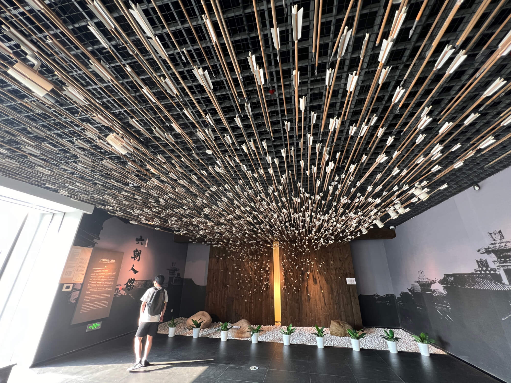

## 一楼特展：《只此中国色，青》
今天更大的惊喜，是一楼的特展《只此中国色，青》。

青，东方色也，其色相宽广，内涵丰富，是体现中国传统文化的色彩符号。

“玉声贵清越，玉色爱纯粹。”青色，可以是浑然天成的青玉。

“明月染春水，千峰翠色来。”青色，可以是新妆如洗的青瓷。

“绿水丰涟漪，青山多绣绮。”青色，亦可以是青绿山水的国画。 

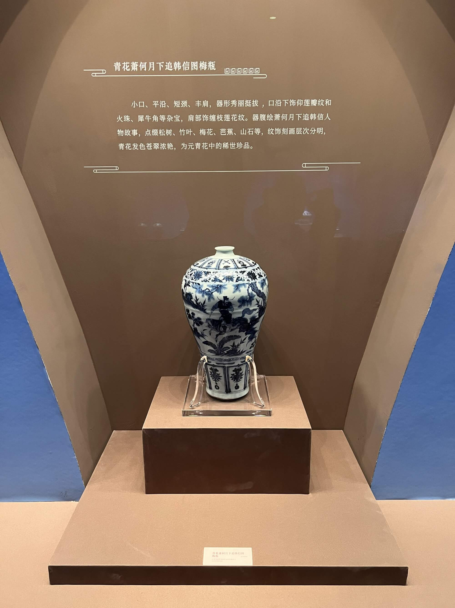

第一单元“何为青色”，借“青、白、红、黑、黄”五色文物及青色矿石，阐释“青色”的概念和色相，以及古人对五行五色的认知。

第二单元“青雅如玉”，通过古代青玉、青瓷等文物，体现青色美学的运用和发展。

第三单元“天地青翠”，展出颜色釉、青花瓷、青色服饰、青色琉璃、绿松石、翡翠、点翠等不同色阶的青色文物，彰显传统色彩的多元运用。

第四单元“只此青绿”，通过古代青绿山水画、长沙窑瓷器等文物展示，展现中国传统色彩美学由古至今的发展，体现中华优秀传统文化的连续性、创新性。

第五单元“青韵中华”，以现代书画、现代青瓷、现代艺术装置及现代建筑蓝图的延伸展示，见证青色跨时代的飞跃。

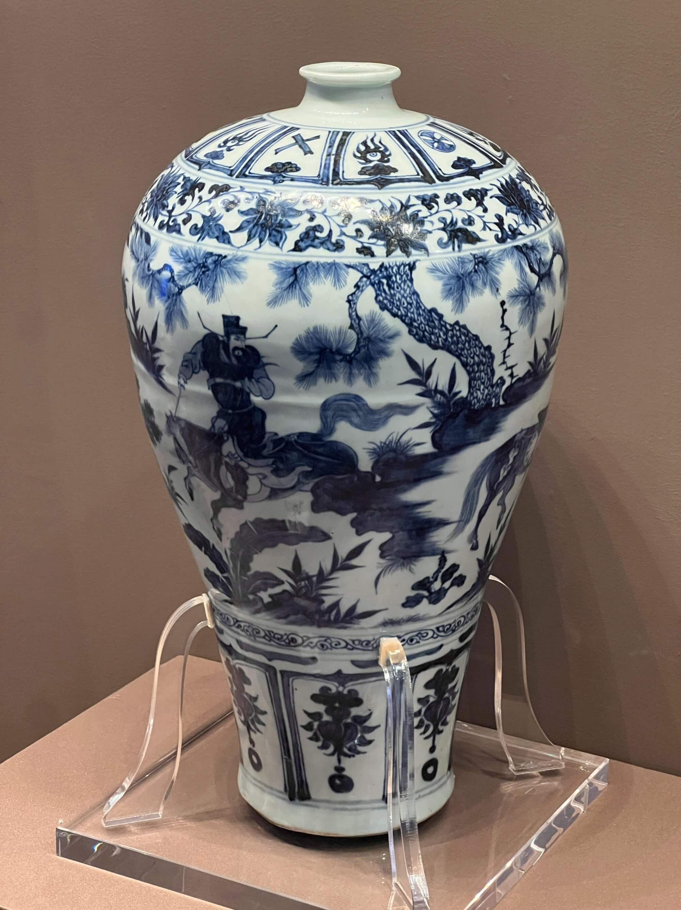

这个特展，最为瞩目的当属南京市博物馆的镇馆之宝 —— 元青花萧何月下追韩信图梅瓶。这件元青花萧何月下追韩信图梅瓶，1950 年出土于南京市江宁区的明朝开国重臣沐英墓，由景德镇窑烧制，小口丰肩，造型优美，线条圆润，白釉洁净莹润，青料浓艳幽雅。瓶身绘有 “萧何月下追韩信” 的故事，画面之中点缀以 松树、竹叶、梅花、芭蕉、山石等纹饰，此梅瓶无论造型、釉色、纹饰及烧造工艺各方面均达到了炉火纯青的地步，体现了景德镇制瓷工匠高超绝伦的技术，代表了元代青花瓷器最高艺术成就，被列为我国 195 件禁止出境文物。

展览并没有给予这件梅瓶专属的展柜甚至是展厅，而是放在了一个展柜的正中间，也没有特别说明它的重要性，很容易被走马观花的关注忽视，我是奔着它去的，所以重点关注一下，大家千万不要错过！

## 总结
南京六朝博物馆不仅通过丰富的文物和精美的展览，展示了六朝时期的辉煌历史，而且还建在考古遗址上，让人们亲身体会古代南京的独特魅力。

无论是历史爱好者还是普通游客，这里都是绝佳的去处。每一件展品、每一处遗迹都仿佛在诉说着一个个动人的故事，让我仿佛穿越时空，亲身感受那段波澜壮阔的历史。

参观完博物馆后，我对早期的南京有了更深的理解，期待未来有更多机会探索这片土地的历史与文化。

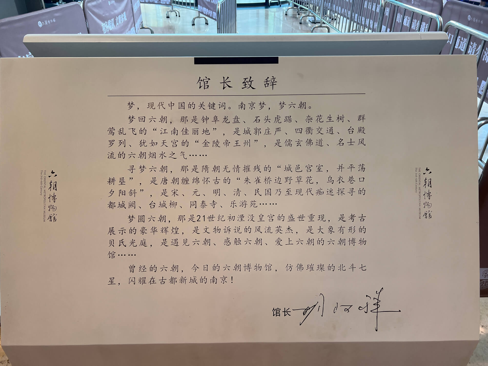