今天是2024年9月15日，中秋假期的第一天，也是宝宝开学的前一天，我带着两个宝宝，从南京飞往香港，和宝妈汇合，开启我们一家四口的港漂生活。

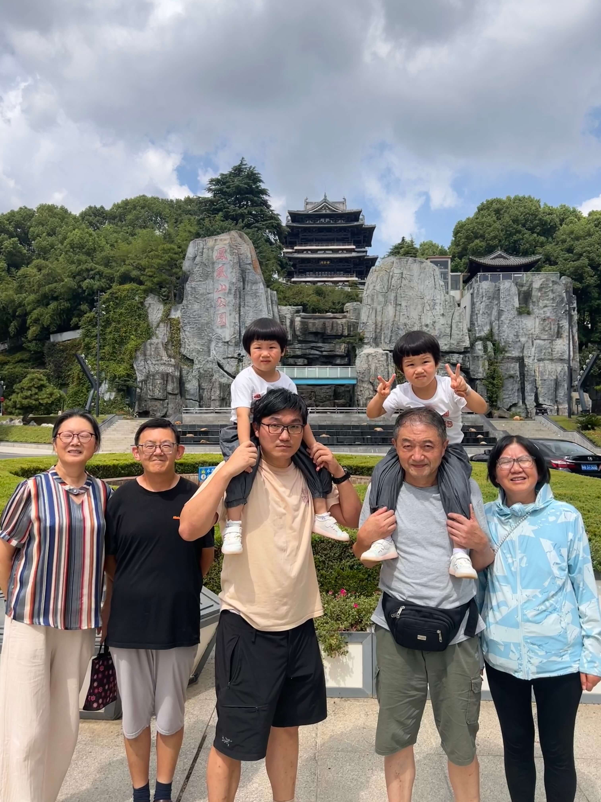
<!--more-->

## 境内送机
前几天光大银行几乎所有的信用卡都进行了"温暖升级"，接送机服务全砍了，我持有的移动中青旅联名卡也包含在内，还剩一次接送机服务没用，要在45天宽限期内用掉。

今天刚好可以用掉，我约了一辆商务车去机场，来的是岚图梦想家，这是一款大型的国产新能源 MPV。车内可以乘坐7人，爷爷很喜欢，他觉得这款车比我们自己的理想 SUV 空间更大、更舒适，当然价格也相对贵一些。

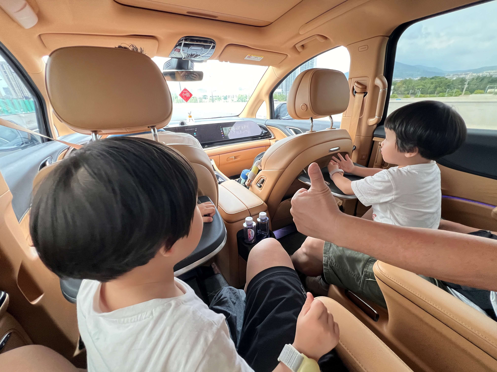

## 前往机场
宝宝的爷爷、奶奶、姑奶奶一起送机，我们先在凤凰山下拍了合影，然后上车出发，司机走的是长江隧道，路费低，但是过江后有点堵，我查了导航，走三桥不堵，能节省20分钟，我提议转过路费的差价43-10=33元给司机，走更快的路，更快更好开，司机没有拒绝的道理。

路过三桥的时候，刚好看到了南侧大胜关铁路大桥上有火车和高铁开过，宝宝们很兴奋。一路畅通，不到50分钟就到机场了。

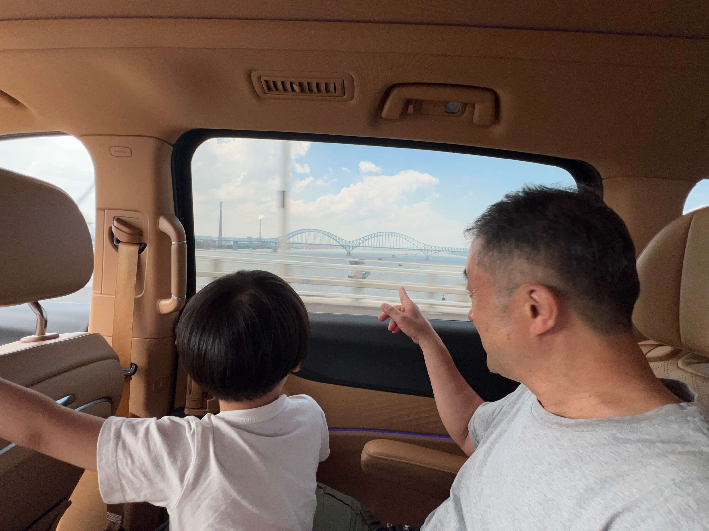

## 机场值机遇麻烦

在机场办理值机的时候，遇到了一点小状况。国内航班每个行李箱最多 20 公斤，国际航班每个行李箱最多 23 公斤。我带了一大一小两个箱子，小箱子 13 公斤，大箱子塞得满满当当的，居然 33 公斤，严重超重，无法托运。

只能去 T2 的 3 号门内的行李打包处临时买纸箱。从大箱子里拿出十多公斤的东西装进新纸箱，这里的包装特别好，纸箱下面先垫了充气缓冲袋，然后放行李，顶部再放一个充气袋，外面先用机器裹了塑料膜，又打了几条圈封装条，让人感觉很安全。封装条顶部还放了两个提手，拎起来手不疼。打包的效果非常好，就是要付 103 元，有点小肉疼。

## 选座问题解决
一开始我在国泰的 APP 上进行选座，这架A330飞机是2+4+2的座椅布局。但在APP上我们三个人总是没办法选到挨在一起的座位，只能选到中间四个座位中 1、2、4 三个座位。

值机工作人员帮了我们的忙，请示上级后给我们换了三个挨在一起的座位，还从 61 排提前到了 48 排，这是经济舱的前一半仓位，APP上选不了的。看来带娃还是有很多便利的。

值机时商务舱通道来了一个年轻的男明星，带着帽子和口罩，包裹得严严实实，后面一堆女粉围着拍照，好不热闹。我好奇问了一下名字，可惜没有听过。

## 机场效率
南京禄口机场国际出发的航班不多，和杭州机场类似，检疫、边检、安检都几乎都不用排队，整体效率挺高的。

过关之后距离登机还有大约 40 分钟，我本来想带娃去儿童乐园玩耍一会儿，打发时间。 小红书上有6 月份的笔记说 T2 国际出发的登机口附近是有儿童乐园的，但现在居然已经撤掉了。

## V7贵宾休息室

南京禄口机场T2航站楼，国际出发大厅的免费儿童乐园没有了，只有V7贵宾厅里好有个小的儿童乐园，于是刷了三点龙腾入场。


儿童乐园令人大失所望，面积特别小，设施也特别简单，感觉只适合一岁的小孩，我们家两个三岁宝宝都太简单了。而且玩具维护得不好，两个小汽车的玩具，车子都没有了，只剩轨道。跷跷板也是直上直下的，也许是弹簧松了，感觉不太安全。

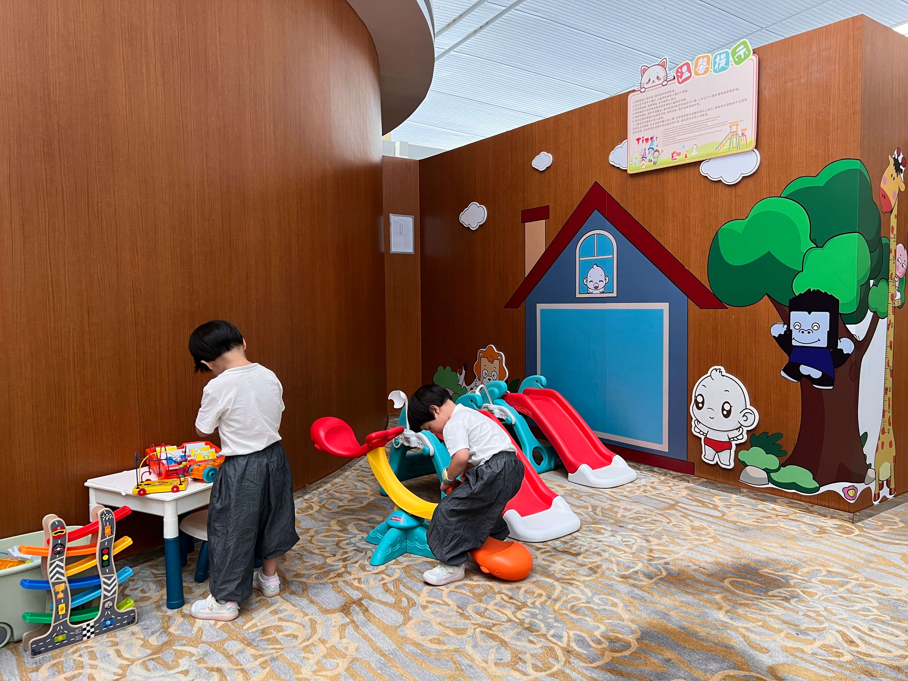

玩了几分钟就带宝宝去吃饭了。吃饭的体验还不错，一点多了还有 5 个热菜，水果沙拉、各种喝的等。宝宝吃了些意面、玉米粒，喝了酸梅汤，还吃了些小零食，哈密瓜等，挺丰盛的。

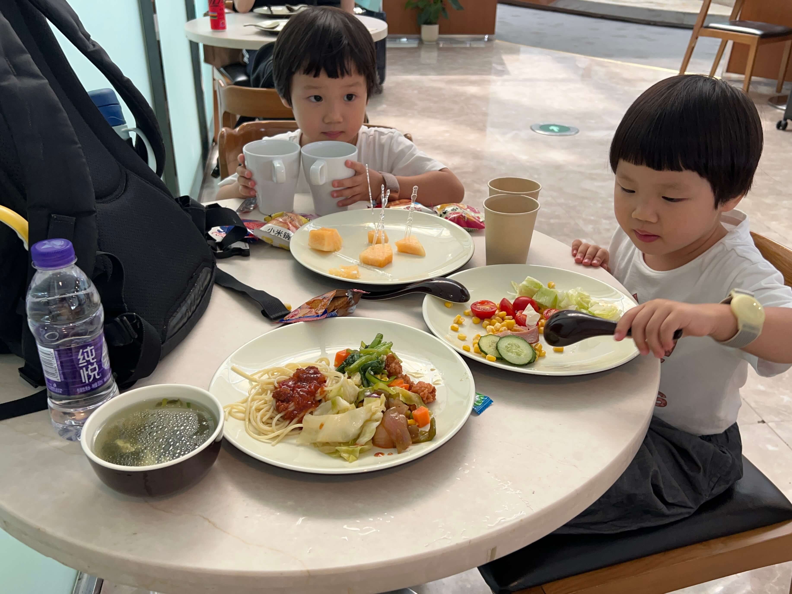

之前在外面被包裹得严严实实的明星，也在V7休息里，正和助理在一起吃饭，就坐在我们后面。口罩也摘了，看上去挺帅的。如果我要是追星的话，这会儿带娃去要个合影肯定大有希望，近水楼台先得月哈。

## 国泰航空初体验
这是我第一次乘坐国泰航空去香港，因为南京直飞香港每天四班，国泰的时间最好。杭州飞香港的选择更多，国泰的价格没有优势，所以之前从未乘坐过。

上了飞机后，国泰航空在多个方面给我留下了深刻的印象：

### 安全介绍影片
其他航空公司通常是由空姐演示氧气囊、安全带这些，再配上航空公司的介绍短片，千篇一律。

而国泰的短片则是以发现香港为主题，用特色的短片进行演示：

```
用京剧演员，演示行李摆放；
在香港特色的叮叮车上，演示系安全带；
在太平山山顶缆车，演示儿童安全带；
用大帽山梧桐寨的徒步，演示氧气面罩按需滑落，很好展现了香港山与海结合的美景。
以龙舟比赛为背景，演示救生衣的使用；
用海边躺椅，介绍小桌板收起和椅背调直。
还有高楼房顶的武术表演，既演泽了安全姿势，也展现了传统文化和香港高楼林立的特点，太妙了！
https://www.douyin.com/video/7396913909229292852
```

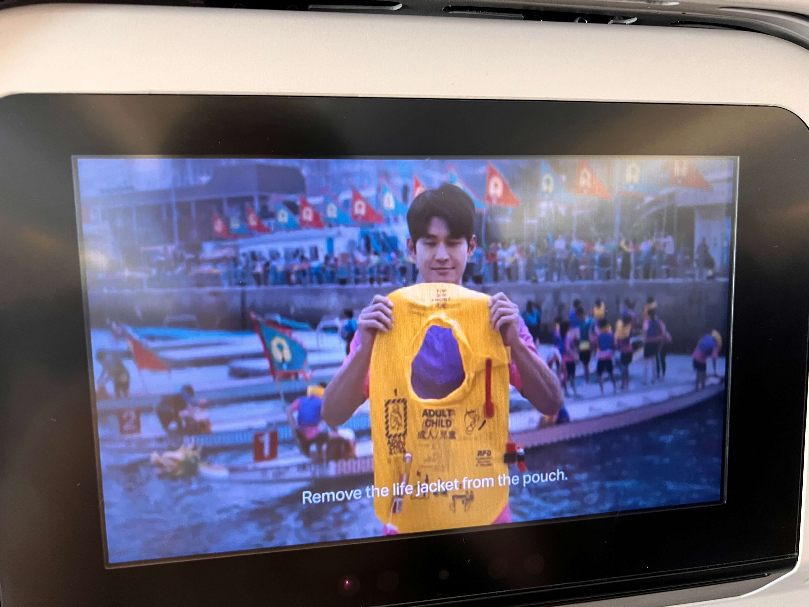

国泰在官方抖音上发布了同款视频，已经8000+点赞了，观众都被惊艳到了，评论里直呼CA MU CZ三大航都被碾压成了廉航。

这个视频让我大开眼界，也督促我思考，生活中还有哪些习以为常的地方，可以玩出花来，用创新和创意，赋予更多的价值~

### 贴心的服务细节
有三个细节让我印象深刻：

一、座位上有电视和耳机，我给宝宝播放了小猪佩奇，但成人的耳机明显偏大，宝宝一直用手扶着。起飞前，空乘主动送来两个宝宝专用的小耳机，说戴这个更合适。戴上后果然小了很多，不容易掉，非常舒服。

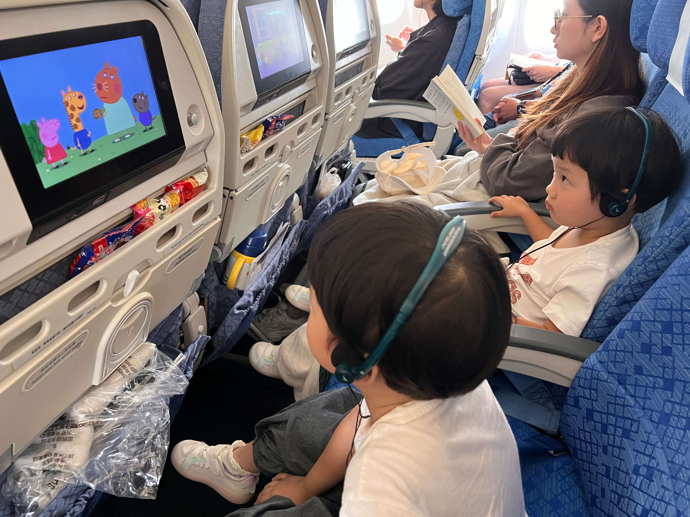

二、给我们这个区域服务的是个日本的空姐，不会中文。我为了让宝宝练习交流，就在提前教了珊瑚宝宝如何用英文说出食物和饮料的名字。空姐给宝宝送餐的时候，给把餐车前推，然后蹲下来和宝宝交流，这个细节让人暖心。珊瑚主动说出了 apple juice and potato，拿到了期望中的食物，也非常开心，自信得到了提升。

第三个细节就是餐食很不错。口味很好，用料足，不仅有主食（牛肉饭或鸡肉土豆，水果（西瓜🍉哈密瓜🍈），还有冰激凌，芒果树莓口味的哈根达斯。于是，宝宝的第一口哈根达斯是在飞机上吃的，法国制造、香港销售，中国内地享用，很有意思。

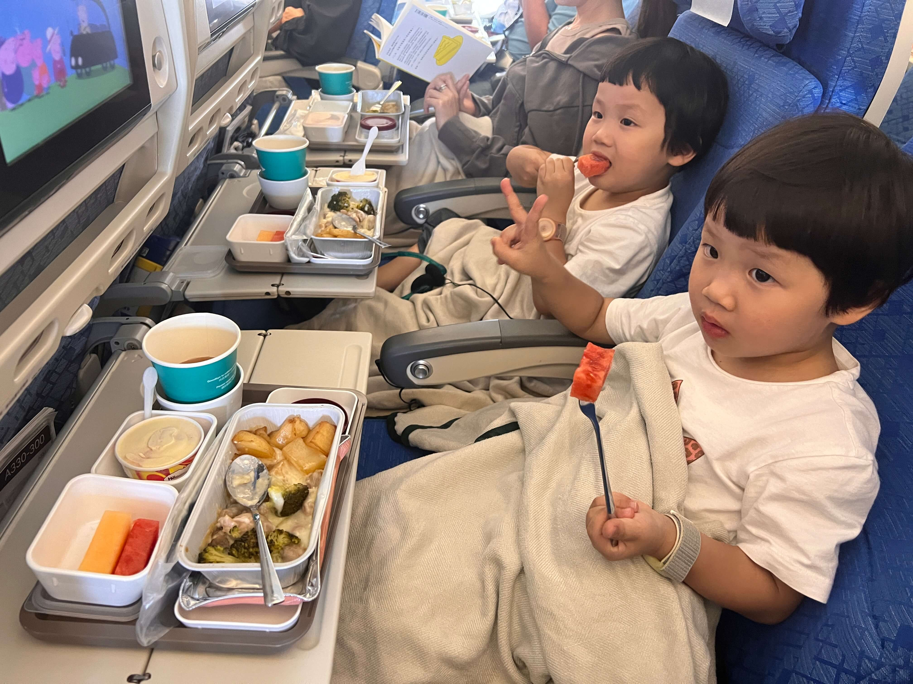

### 航司对比
晚上到家后，宝妈问我一个人带娃坐飞机的体验如何？我说非常棒：有安全带把宝宝固定在了座位上（不会乱跑），有电视可以看动画片（打发无聊），看累了还有空姐送来好吃的（宝宝很喜欢吃冰激凌，刚打开硬邦邦就迫不及待要吃，为此还划断了塑料小勺，只能用金属的大勺🥄），困了抱着毯子睡觉，这种情况带娃真是太轻松了。

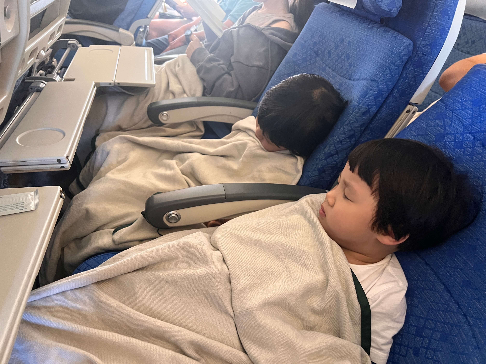

对比之下，下午外婆从杭州飞香港，东方航空，但是全程只有一杯水，没有吃的，也没有电视，这种情况下坐两个多小时，宝宝们不闹就怪了！

### 对国泰航空态度的改观
之前因为歧视事件使得国泰在国内的口碑不太好，再加上杭州国泰航线少，所以我近几年都没乘坐过国泰的飞机。但今天体验之后，我着实感到惊讶，无论是是航空公司的综合水平，还是机上设施，服务水平都非常高，香港最大确实是一家很不错的航空公司。这也让我明白，看待事物还是要用发展的眼光啊。

## 降落后的波折
降落香港后，飞机滑行了好久，最后居然还是用摆渡车把我们送回候机厅。大家起身等待开舱门的时候，宝宝突然喊着要尿尿，还说等不及了，我有点难办，大家都站到过道上了，不好移动了啊。安抚了几分钟，还是不行，宝宝喊着要到裤子上了，我就抱着珊瑚，搀着海兔，往后走找洗手间，这个时候往前挤很困难，往后挤相对容易些。宝宝也挺机灵的，居然一直喊 “借过，借过，上厕所等不及了”，看来是真的很急，喊得身音有些大，搞得我有点不好意思。后来顺利解决，机上小小的厕所里居然挤下了两个宝宝和一个大人，真实太搞笑了。

上完厕所，刚好顺着人流往前走，上了摆渡车，有人给宝宝让座。候机楼入口的位置挺好，上了扶梯就是边检，看来摆渡车的终点也是经过设计的。边检访港游客的队伍很长，而香港居民则是自助机比人多，带宝宝必须要人工通道，永居不用排队，居民只排了一个家庭，入境挺快捷。

## 境外接机
入境后和宝宝外婆汇合，她从杭州出发，早一小时到香港，在行李转盘等我们。

我用上海银行的信用卡预订了境外接机服务，拿到行李后有人在A口拿着写有名字和航班号的Pad接机，检查身份证（防止倒卖权益）后直接专车回家。

上次是 model s，这次是小一些的 model y。我和外婆一共有两个大行李箱、一个小行李箱和一个纸箱，本来还担心后备箱放不下，没想到车前盖下面也能放一个箱子，刚好装下，哈哈。

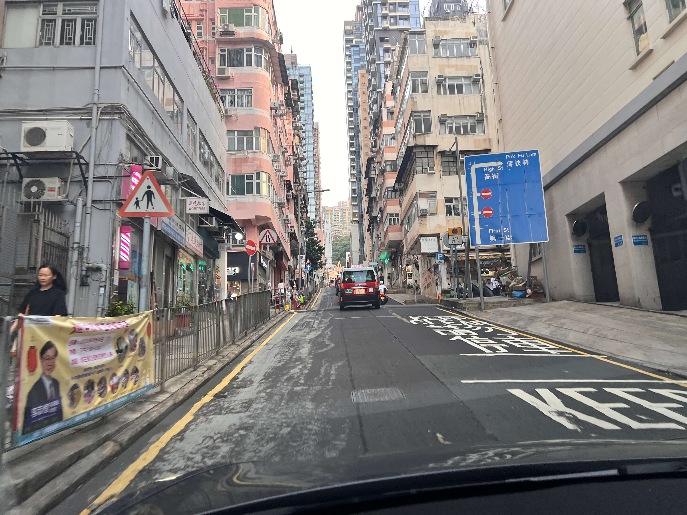

## 接风宴
车行约一个小时到家，宝妈在楼下迎接。我们送东西上楼后，立即出去吃饭。宝宝抵港的第一顿，宝妈预定了一家挺好的菲律宾餐厅，口味不错，环境也好，就是价格有点厉害。

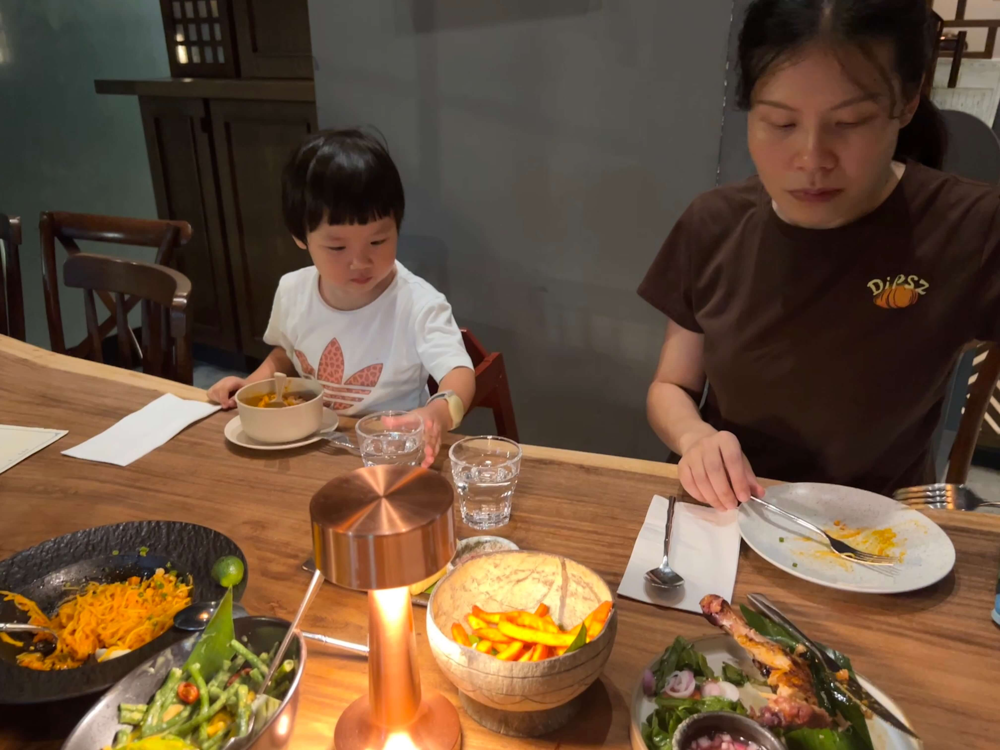

## 境外开通国际漫游难题
如果在国内没有开通国际漫游，到了香港后手机没有信号，想要境外开通，非常麻烦。

正常途径用手机APP或打10086都要接收验证码，但是在境外没国际漫游就收不到验证码，死循环了，拨打 10086 更改也需要验证码同样无法登录。

后来折腾了好久，在小红书上也查询到多种方法，尝试了两个非正规野路子，不仅都没成功，还浪费了 10 块钱（买一天的境外流量，并手动搜运营商）。

最后找到的正规的路子是用另一台手机拨打国际漫游的专用客服电话+86 13800100186，这里只要手机号 + 身份证号就能开通。

死锁的验证流程让人无语，网上很多留学生也有类似的困难，出国前忘了开，出国后开不了，父母在国内帮忙改也不行，不认服务密码，必须要有身份证或者能接收验证码，但是人在国外根本收不到。真不明白现在验证为什么搞得这么复杂，又不是什么特别严重的事情。十年前我也遇到类似的问题，用QQ把手机服务密码发给国内的亲戚，打10086就可以开通。

## 明日期待
晚上我和外婆把带来的 4 大箱行李进行了整理。

宝妈带着宝宝收拾书包，准备校服，明天是宝宝第一天上幼稚园，期待她们在学校能有好的表现！
