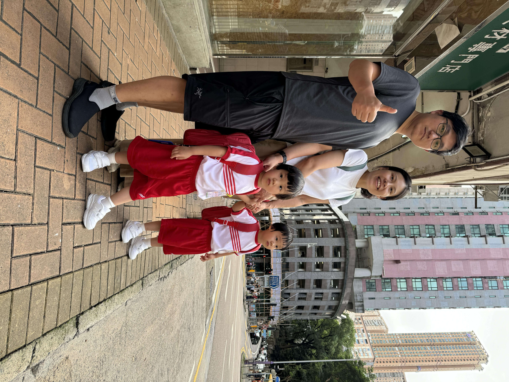
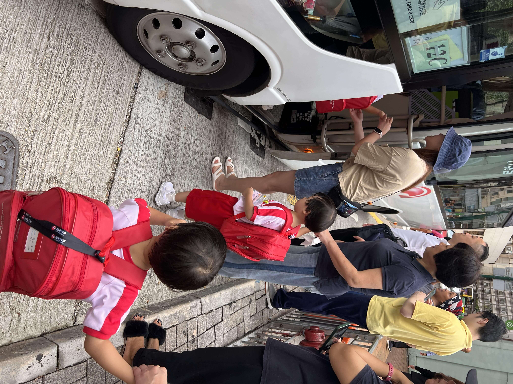
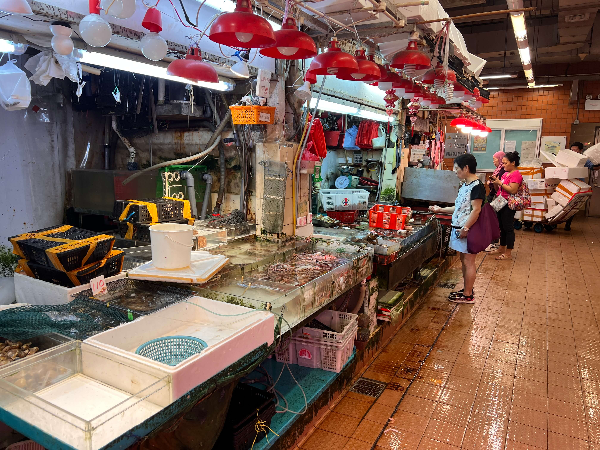
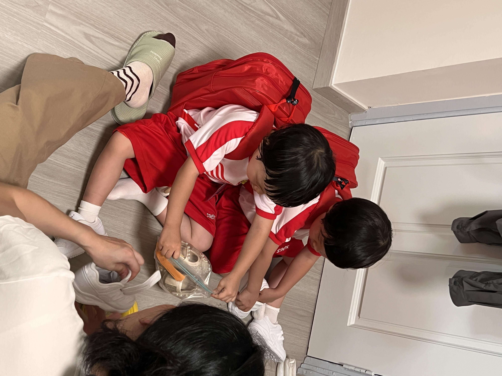
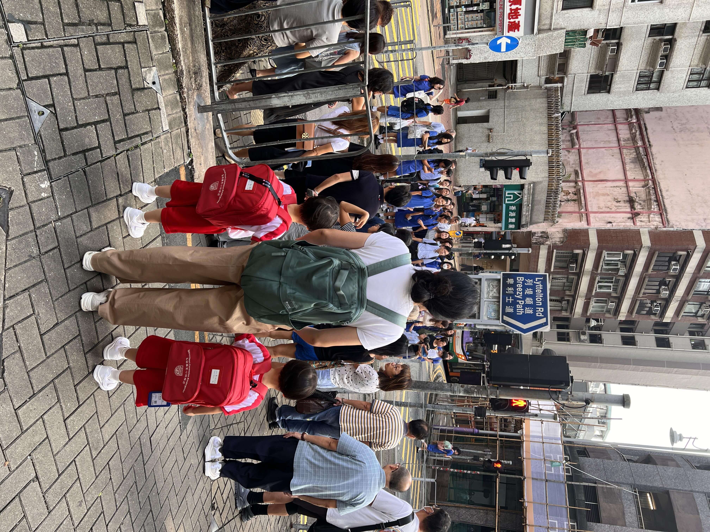

2024-09-16，星期一，内地中秋节假期的第二天，香港，雷阵雨

## 一、宝宝乘校车上学
早上宝宝 7 点准时起床。起床后先穿上新校服，接着刷牙洗脸，随后开始吃早餐，7 点 40 分，宝宝下楼准备去坐校车。

<!--more-->

楼下是知名的女校圣士提反女子中学，萧红有一半的骨灰就撒在这里，女学生们穿着极具传统特色的蓝色长衫，在路口形成了一道独特的风景线。

在此时的公交车站，校车占据了主导，有不少孩子在等车，一部分是家长，更多的是菲佣在送小孩上校车。不同的校车不断地开过来，也许是周一的缘故，穿着整齐校服的学生纷纷上车。

驶来一辆标有嘉诺撒圣心学校的校车，但和我们宝宝校车的牌照不一样，我正犹豫时，宝妈告诉我这辆车是学校的小学部，我们宝宝是幼稚园，要等另外一辆车。

果然，过了一会儿，下一个红灯之后，一下子来了 4 辆小巴，其中一辆就是我们宝宝的校车。

车上除了司机，还有一位阿姨负责看护宝宝，这位阿姨似乎认识大部分宝宝，还能亲切地和家长打招呼，尽管我们是第一次来，她也知晓情况，知道我们是双胞胎。

上车时需要刷身上的名牌卡，刷卡之后，我们就能够在手机应用 CM Track 上看到校车的实时位置。宝宝上车后，阿姨安排把她们调到了同一排，这样可以缓解宝宝们可能产生的焦虑情绪把。

过了一会儿，最后一名晚到的宝宝上车，校车的门关上了，车边的家长们纷纷和宝宝们招手再见，随后校车缓缓开动，载着孩子们出发了。校车行驶得很顺利，十来分钟就把宝宝送到了学校。

## 二、接送规则

补充一下幼稚园接送相关的情况。每个小朋友的衣服上都会夹一个名牌，上面标有学校、班级、姓名，这对学校的管理提供了便利。

小朋友乘坐校车时，会有一张白色的接送牌，家长凭借这个接送小孩上下校车，车后刷一下名牌，就可以查询到跟进状态。家长接宝宝的时候也一定要带上这个白色名牌，如果没带，用手机展示名牌的照片也许，这样能确保是自己家人来接，从而降低宝宝走失的风险。

另外还有个绿色的名牌，是家长去学校接送孩子时使用的，我们暂时就用不到了。

## 三、街市买菜

校车出发后，宝妈前往实验室做实验，而我和外婆则到街市上去逛一逛，街市就是菜场，我们买了一斤基围虾，花费了 80 元港币，还买了一些蔬菜，花了 50 多港币。对比起来，这里的水产价格比杭州便宜一些，但是蔬菜价格却贵很多。

## 四、超市购物

之后我们去了超市，想买一些料酒，但是很疑惑地发现，在调味料柜台，有生抽、老抽等，但就是找不到料酒。经过在网上搜索才知道，香港人不用料酒，可以买花雕酒替代。
不过我们也没找到花雕酒，问了工作人员才知道，花雕酒并不在调味酱的柜台，而是放在酒精柜台。在自助柜台结账时，系统还弹出提示，表明这是特殊商品（酒类），需要年满 18 岁才能购买，并且无法直接自助结账，需要工作人员帮忙确认，才能付钱。
这和内地的情况很不一样，感觉挺新奇的。后来我们还在“日本城”百货店里买了一个锅铲和一些杂物。

## 五、工人房整理

买完东西回到家后，外婆开始准备烧午饭，我开始安装家具、整理杂物间。

家里有个小的工人房，准备在上铺安装工人床，下铺放置行李架和鞋架。下午有师傅来量尺寸，按照这边的惯例，床长一米九到两米左右，宽 80 厘米，高度大概一米六。定做+安装费+床垫合计3000 多港元。我和师傅聊了聊，了解到这些床也是在内地制作的，通过集运运到香港，然后他们负责送货上门，床本身不贵，主要是送货上门和安装的人工费比较高。

## 六、安装智能马桶盖插曲

在国内的时候，我曾买过几次智能马桶盖。要么是商家负责包安装，要么自己在到家平台上找个师傅安装，费用大概也就 50 元左右，整个过程非常方便。

然而到了香港，人力成本极其昂贵，而且很多服务并不是那么容易就能找到的。没办法，只能自己动手，多掌握一些技能也好，毕竟“技多不压身”嘛。

今天安装智能马桶盖时遇到个小插曲。旧马桶盖十字螺丝锈住了，怎么都取不下来。后来我在小红书上搜索了一些笔记，按照网上的方法，强行把十字螺丝生锈的位置砸成了一字，再用一字型螺丝刀打开，最终把马桶安装好了。

## 七、接小孩

在中午 11:51，我去马路对面的公交车站接小孩，很多家长都已到了，大部分是菲佣，有一位看起来像是宝爸，另外一位应该是奶奶，奶奶的肚兜上还坐着一个小婴儿。

随后，校车到站，小朋友们依次下车，大概有七八个。

珊瑚和海兔下车后显得非常兴奋，毕竟今天是第一天上学，从她们的状态来看表现还挺不错的，交流后得知，孩子们到学校认识了老师，教室里面外都有儿童乐园，宝宝们很开心。

问题也是有的，学校上课主要使用粤语，宝宝们基本听不懂，还需要慢慢适应。

如果我自己听不懂，可能半天都忍不了，但宝宝们似乎没那么明显的焦虑感。可能因为他们之前上英语课的时候，也有很多都听不懂，已经习惯了，所以完全听不懂的粤语对他们的影响好像也不大。

我觉得这是宝宝适应能力比大人强的一种表现。

## 八、午餐和晚餐

在今天的午饭和晚饭，宝宝们的情绪都不太好。中午海兔哭了，原因是她想一边吃饭一边玩玩具，我们没允许；晚上则是珊瑚哭了，主要是想家了，大喊想念南京。
中午海兔想念爷爷奶奶的时候，我们就和爷爷奶奶进行视频通话，宝宝的情绪就稍微好了一些。
晚上我们安慰珊瑚宝宝说南京正在刮台风，非常危险，等台风过去之后再考虑回去的事情。并且给她们看了很多最近台风肆虐的视频，有的很可怕，有的很搞笑，宝宝们在欢笑中释放了情绪。

之前宝宝们在家里每天吃饭的时候都会看动画片，现在没有动画片的情况下，让他们自主吃饭还是有一定难度的。我们打算先从第一步开始调整，即吃饭的时候不看动画片；第二步再让他们学会自己吃饭。

## 九、作息调整计划

宝宝的睡眠习惯也需要调整，之前在托班 11 点半吃饭 12 点睡觉，暑假在家习惯乱了，今天吃完饭玩到 1 点多睡，3 点多醒，我们要想办法把作息时间纠正过来。

## 十、对小区环境的熟悉过程

初来乍到，我们对小区物业及环境需要熟悉。今天香港是雷阵雨天气，我们早上洗完衣服没烘干就拿到楼顶晾晒，结果上午和中午下了两阵雨，天台晾晒的衣服都被淋湿损失惨重。而且楼顶晾衣服有规矩，每家有固定架子，不能占用别人的位置，也不许放自己的晾衣架，我们晾衣服时一个说粤语的楼顶老太太跟我们讲了天台晾晒的规矩，但我们听不懂她的粤语，后来去问一楼普通话不错的物业阿姨才明白。物业阿姨还送了我们宝宝一个香港本地的奇华月饼，能感觉到她们很喜欢小孩。

## 十一、垃圾处理的注意事项

在物业方面，垃圾不能乱丢。今天我把装完东西后的大纸箱和纸盒拆开折成小块方便回收，一些大泡沫也折成小块，因为大物品把垃圾桶塞满了，所以我准备分两天投放，这里每天固定时间有工作人员收垃圾。、

结果晚上，我仍在楼梯垃圾桶里的麻袋和里面的杂物又被回收垃圾的工作人员人扔回了楼道，也许体积太大，也许是种类不符合，总之要自己扔去垃圾站。

## 十二、香港报纸的阅读感悟

下午去超市买东西时顺便买了一份报纸，香港报业受互联网影响远小于内地，有好多种，中文和英文都有，版面也不少，报纸大多10元一份，《明报》版面最多，我就买了它。好像便利店也能订报纸，我在711里，看到一个阿姨，拿报纸后，给前台递了一个特殊的小票，没有付钱，估计是订阅的单据吧。

- **头版新闻**：今天《明报》头版新闻讲的是内地网红在香港大屿山骑行被旅游大巴撞死了，还提到很多内地人来香港骑车存在逆行、不遵守交通规则的情况，而香港本身对汽车不太友好，这引发了一些讨论。
- **娱乐版头条**：娱乐版的头条是昨天香港小姐决赛的相关情况。现在港姐日益式微，甚至成了很多内地网红蹭流量的集中点，和心中传统的港姐形象大相径庭。而且这些年也没有特别出名的港姐，甚至每天在视频号上能看到这几年港姐三甲在打 PK，落差有点大啊
- **经济版头条**：经济版头条探讨了美国减息后，香港可能要等一两轮才会跟进降息
- **社会时政版面**：探讨了很多老百姓关心但在内地纸媒或者官媒上无法深入探讨的内容。比如辅助生殖，提到香港有相关政策但还不太完善，某些党派希望能进一步加强；还有内地辅助生殖部分项目被广东省列入医保的情况，认为广东可能是中国未来生育的希望所在；另外还有珠海横琴物业空置率极高，分析了把办公楼改成酒店的政策以及宏观经济形势等新闻。

我觉得这个报纸还算好看，版面和内容丰富，有助于我了解香港社会；另外社会时政里都是老百姓很关注、但内地官媒纸媒很难看到的话题，也许是尺度不容易把握，所以往往只能在自媒体上讨论。