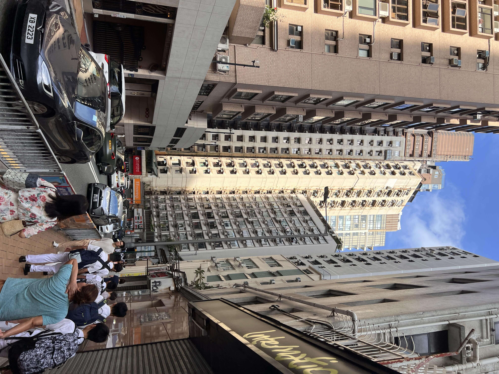
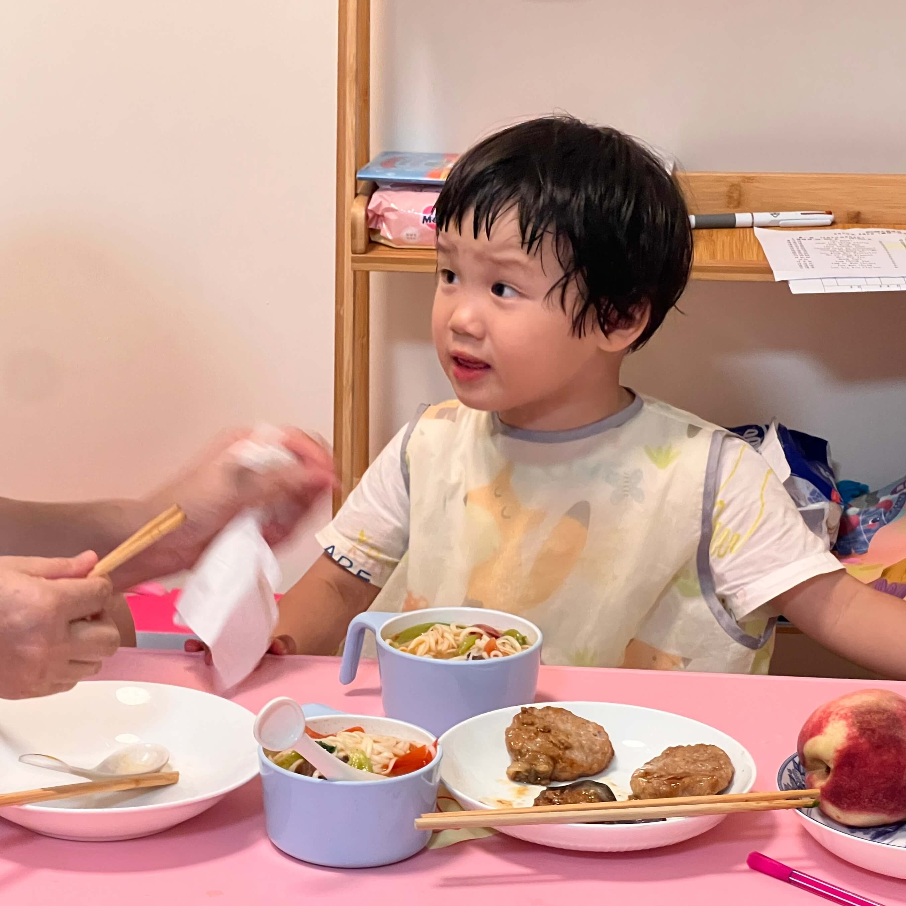
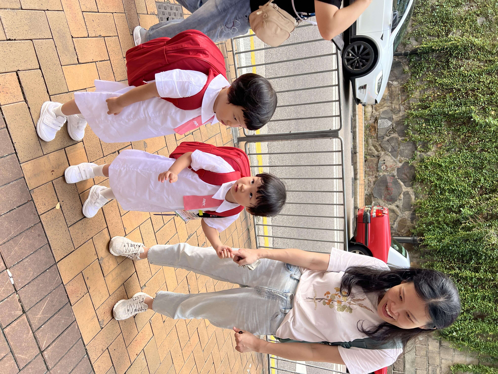

2024-09-19，星期四，香港，雨

## 一、宝宝起床之困

本周宝宝起床变得困难起来，不再是暑期在家轻松自然醒，而是需要叫醒。叫她们的时候，宝宝们仿佛还沉浸在深深的睡眠状态中，尤其是珊瑚姐姐。最近总是海兔先起床，珊瑚再赖很久。看来得让宝宝们更早一点睡觉，或许这样能减少早上起床的痛苦。
<!--more-->

## 二、口罩的小插曲

早上宝宝说上学想戴口罩，可他们不知道宝妈已经在书包前面的小口袋里放了 6 个口罩，其中 3 个白色的，3 个蓝色的。这件事提醒我们，以后放完东西一定要跟宝宝说一声。今天上学前，我特意叮嘱宝宝两点：

- 首先告诉他们口罩的位置，还拉开拉链演示给她们看，这样以后他们需要口罩时就可以自己拿出来，或者让老师帮忙拿
- 其次鼓励他们见到老师一定要喊早上好， Good Morning，这样可以增加他们的社交能力，避免现在在学校不敢开口讲话的问题

## 三、吃饭习惯待改进

最近宝宝早上吃饭的习惯不太好。以前在杭州的时候，宝宝们坐在专门的宝宝座椅上吃饭，座位是固定的，宝宝不能乱动。现在没有餐椅了，坐在小板凳上吃，却一边吃一边离开座位，拿玩具或者走来走去，一点也不专注。而且现在似乎失去了自己吃饭的能力，必须得家长喂才行。之前在学校常常能自己吃，在家偶尔能自己吃，这个习惯必须慢慢改过来。

## 四、宝宝社交的思考

早上等校车的时候，穿着同样校服的几个小朋友在一起玩耍，而我们家宝宝离她们有点距离，没有打招呼，更无法融入一起玩耍，我觉得这样不利于宝宝的社会性发展。

宝妈表示她是 i 人，有点社恐，我是 e 人，这个事必须我主动推动。明天如果我送宝宝到楼下，一定要让宝宝和同校穿同样校服的小朋友站在一起，先简单地打打招呼、说早上好，然后再争去能一起玩，更好地发展社交能力呢！

宝宝学校的同学身上都别着胸牌，能看到每个人的中英文姓名，这样其实更方便大家主动打招呼，say hi，破冰，向前一步，lean in ^^