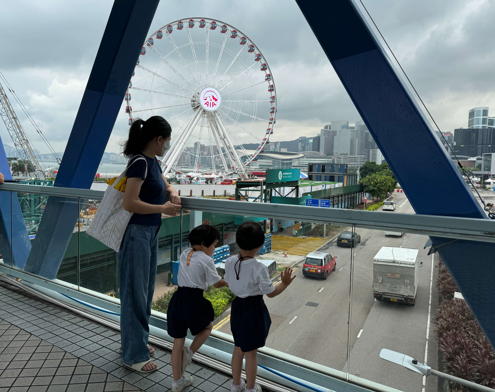
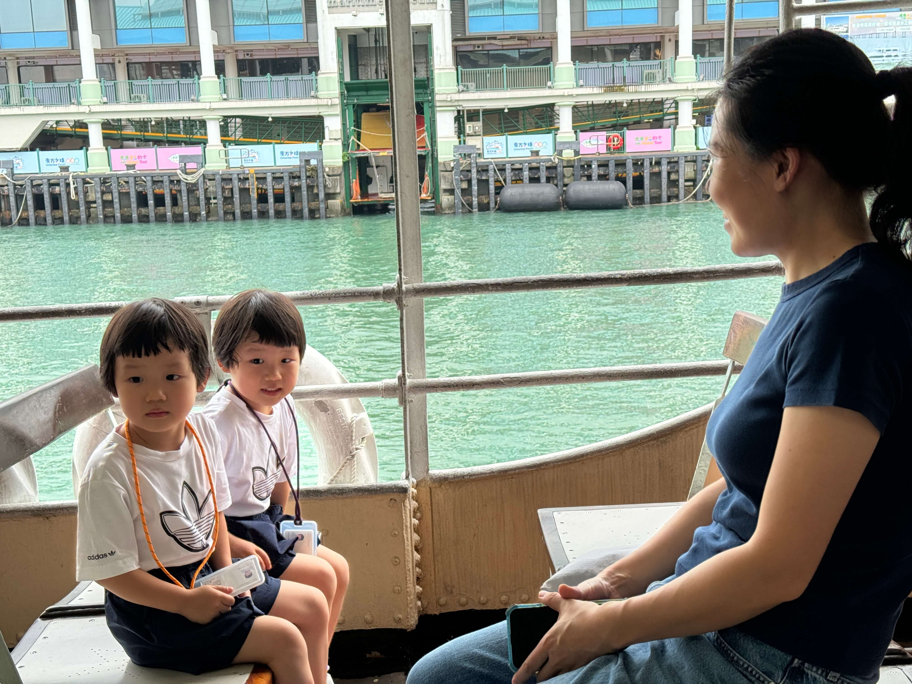
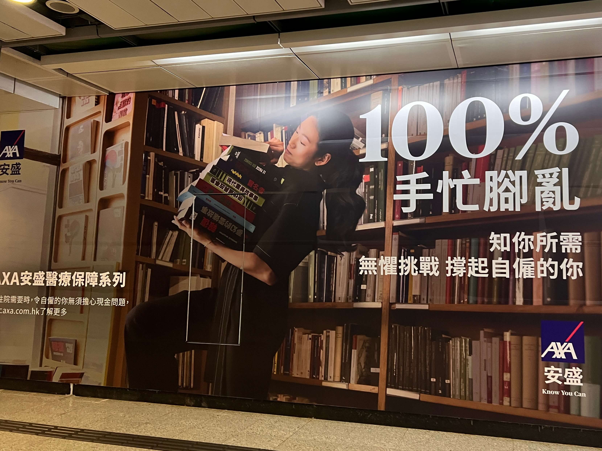
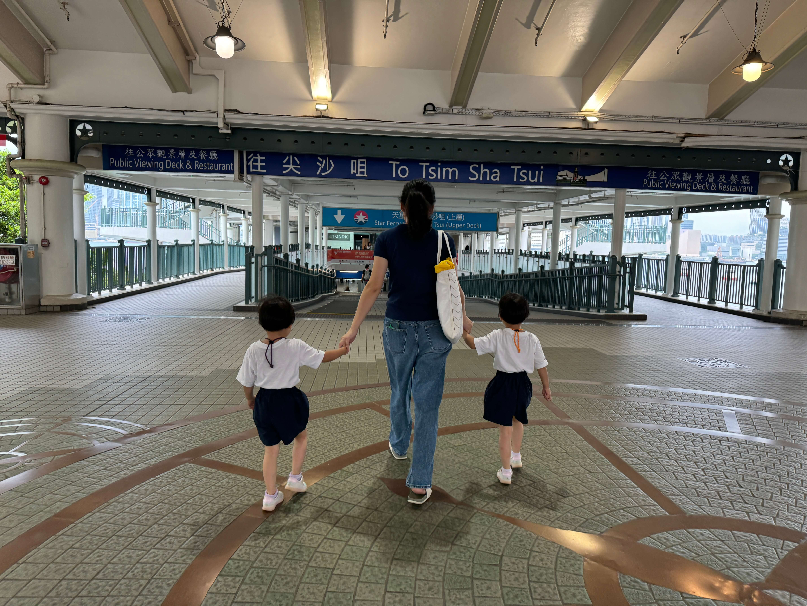
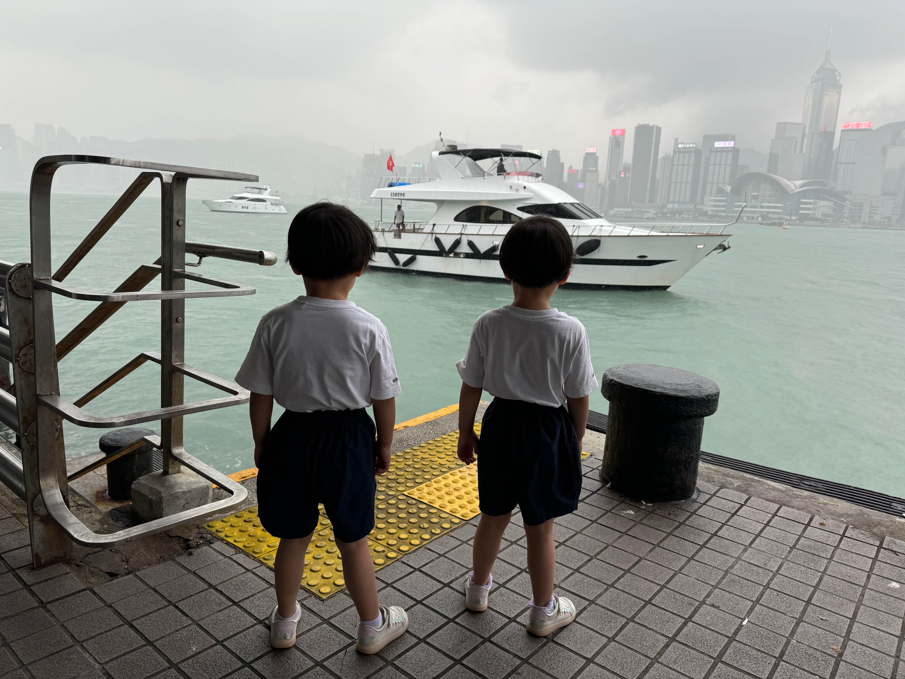

2024 年 9 月 21 日，星期六，香港，雨

## 一、宝宝畅游维港
周六本是一家人尽情享受悠闲时光的日子，然而对于我这个宝爸来说，却并非如此。

<!--more-->

宝宝和宝妈是香港作息，放假过周末。而宝爸是牛马作息，上半年在上海某单休大厂，和宝宝聚少离多，现在换成大小周的工作，本以为能多些休息，多陪陪宝宝，可这个月刚到港就遭遇了两个小周 + 两个要调休上班的周六（中秋和国庆），又变回了单休。累觉不爱啊，总觉得休息不过来，缺少属于自己的时间。

周六上午，宝妈和外婆带着宝宝们去坐了天星小轮。在天星小轮上，宝宝们尽情欣赏着维港的美丽海景，兴奋地看着窗外，眼中满是好奇。尽管香港这一天阵雨不断，但这丝毫没有影响到孩子们的兴致。

下午，宝宝回到家午睡，宝爸吃了宝宝剩下的汉堡🍔。

晚上，宝爸和宝妈又带着宝宝去维港散步，感受着海风的吹拂，听着海浪的声音，心情格外舒畅。

## 二、香港医疗之私立篇
今天通过小红书和朋友交流，研究了一下如何在香港看病。 在香港，医疗体系分为公立和私立两条线。

先来说说私立医疗，其好处显而易见。私立医院服务好，看病速度快，诊疗条件优越。很多私立医院能直接设在中环的摩天大楼里，楼上是高级打工人，楼下能看病和，环境非常好。而且时间都是预约好的，按时抵达即可，医生的号子也不紧张，有充足的时间了解病情，体验各方面都很不错。

然而，私立医疗的缺点就是价格昂贵。只适合有保险的人，主要有两种情况：

一种是在大公司上班，公司会购买医保，这种保险投保条件宽松，一般还会帮夫妻和未成年子女投保，可以尽情使用；

另一种是自己购买住院或门诊的补充医疗保险。前几天在地铁中环站看到安盛保险的广告，广告词是 **“100%手忙脚乱，知你所需，无惧挑战，撑起自雇的你”**。在如今经济形势不好，很多人失业的情况下，这个广告确实有点小讽刺。失业在家就没了公司的保险，只能自己买保险，核保条件也比较严格，实在是让人感慨万千。

## 三、香港医疗之公立篇
香港人的**平均寿命全球第一**，高水平的公立医疗功不可没。最大的好处是费用低廉，仅有一个基础费用，几乎相当于免费。香港居民和 11 岁以下小孩门诊一次 50 块钱，包含挂号费和开药的所有费用，住院一天 120 元全包。药可以一次多开一些，比如宝妈的同学在港大校医院看慢性病，第一次直接开了三个月的药，这样就避免了反复挂号。对比内地，为了节约医保，每次最多开一个月的药，宁愿让病人多挂几次号。

但公立医疗也存在明显的缺点，那就是排队长、等候时间长。首先要去普通科看病，类似于我们的全科，医生开具转诊信后才能去挂专科号。很多病排队时间极长，有新闻报道，有人拍 X 光要等半年，做痔疮要排队两年，这在国内是不可想象的。而且看病会根据病情轻重缓急决定等候时间，如果病情不紧急可能要等很久。比如网上有人说他发烧四十度，却被认为不严重，让他等了两个小时，这两个小时的等待实在是难熬。

## 四、深港医疗对比
这两年很多香港人觉得深圳看病真香。交深圳医保很便宜，然后看病就跟不要钱一样，挂号、检查、拍 X 光都很快，即使排队也就半天的事。香港也有一些计划，比如老人在深圳看病可报销，甚至还鼓励去深圳拍X光，并给予资金支持，以缓解香港医院的治疗压力。

也有很多内地人选择香港看病生娃，享受更好的医疗和国民待遇。

## 五、我的计划
我现在没有香港的保险，所以肯定要尽量走公立医疗的道路。我有高血压，准备去公立医院挂号开药，先找一家公立诊所，在普通科登记，然后每天争取抢号，据说每天早上十点钟会放号，九点五十九分打电话进去约或者十点app上拼手速。港岛和离岛的号相对多一些，能抢第二天的号。挂好号后争取一次多开几个月的药，这样也能减少去医院的次数。

之前在国内，只能开到各地的集采的仿制药，浙江和上海都有本地的品种，药效良莠不齐，一言难尽。在香港，应该都是进口原研药，我希望能通过公立医疗体系，获得更有效的治疗，控制好自己的血压，为家人和自己的未来努力奋斗。

同时，我还有杭州的医保，办了深圳的异地就医备案，可以医保直接支付，据说一般报销比例在50%左右。真要有急病，也可以去深圳看，用好两边的优势。

港漂生活虽然充满挑战，但我相信，只要我们积极面对，总能找到属于自己的幸福之路。