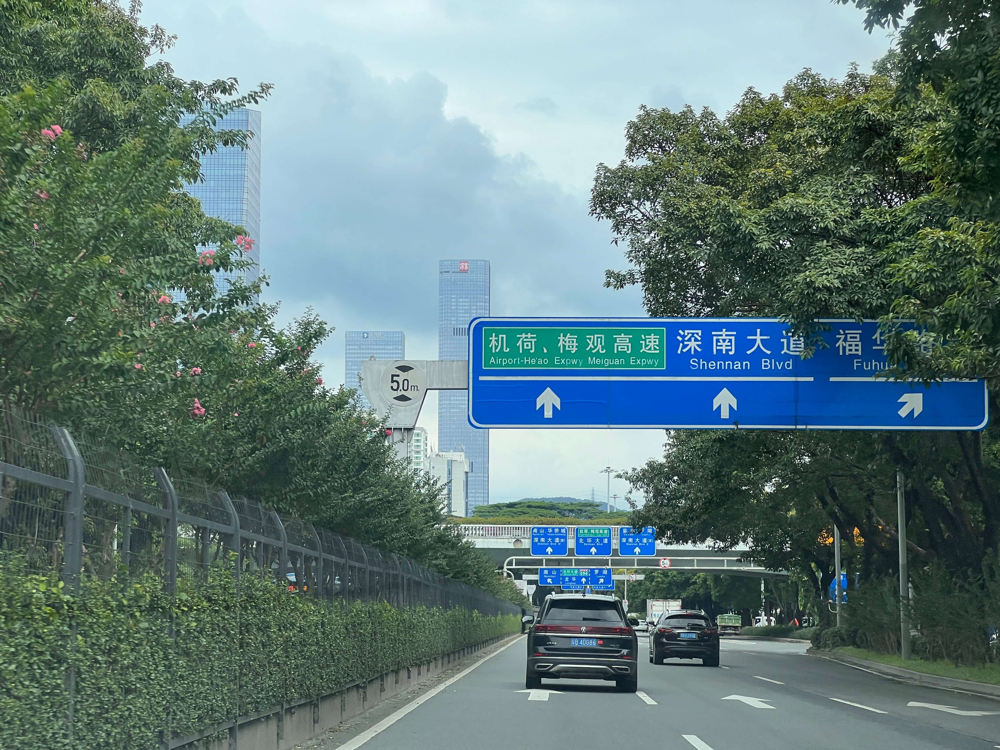
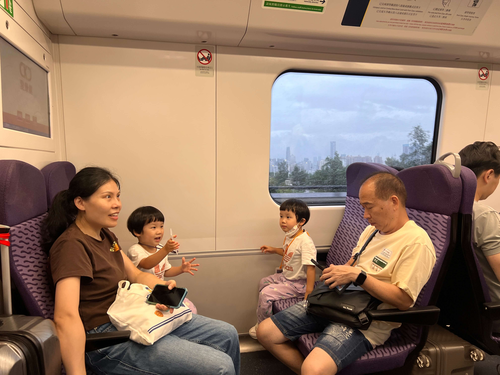
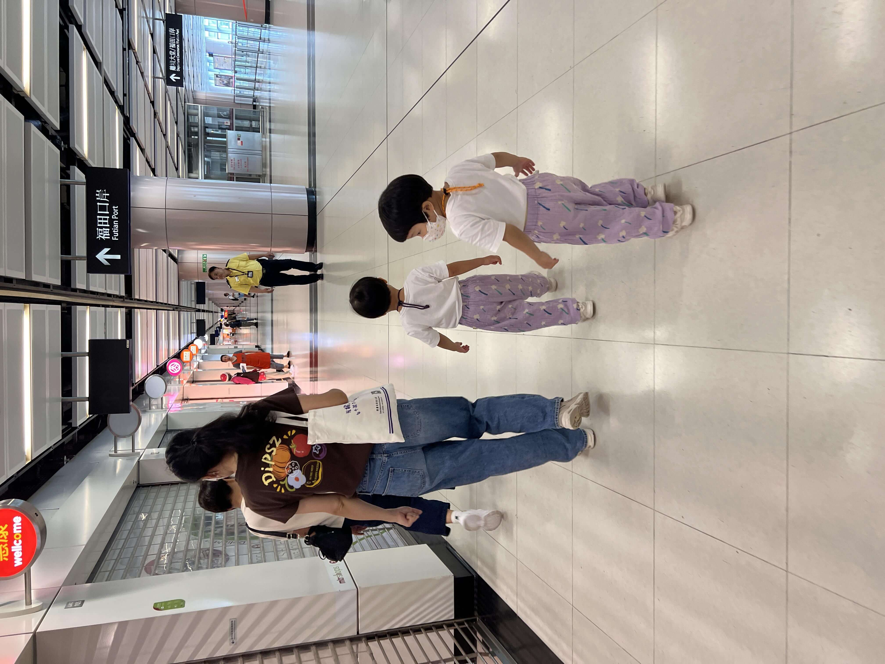
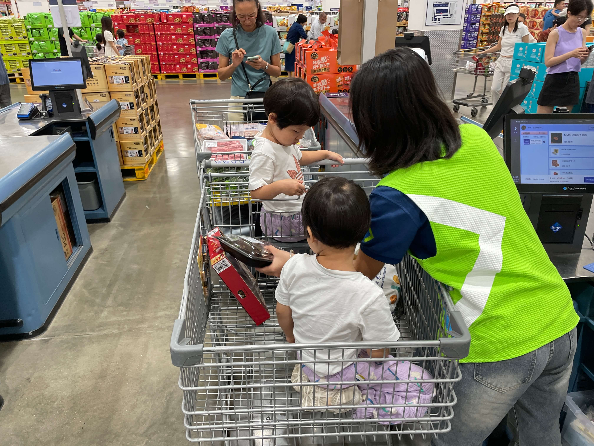
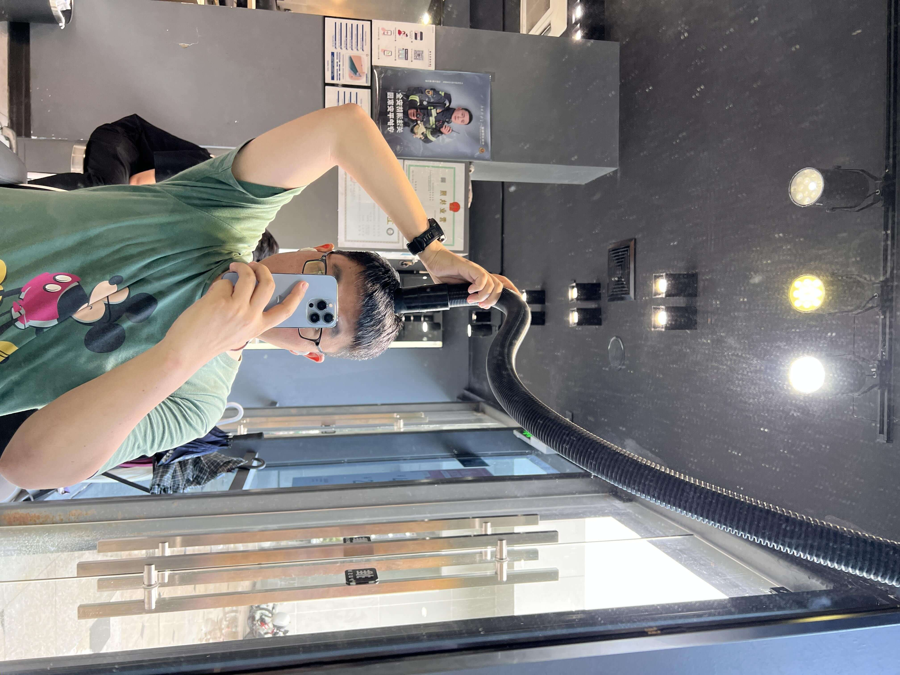
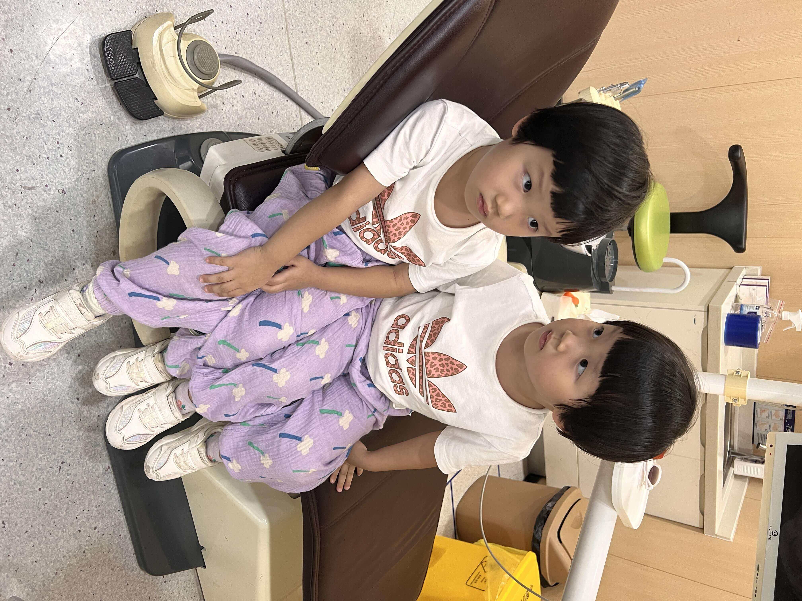
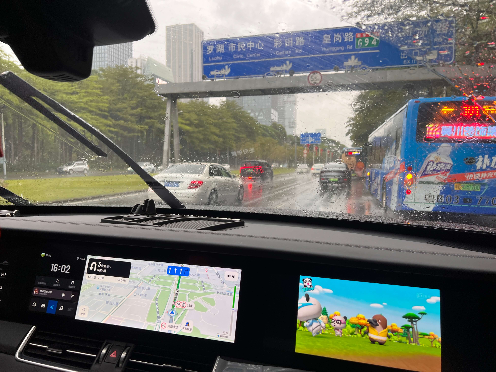
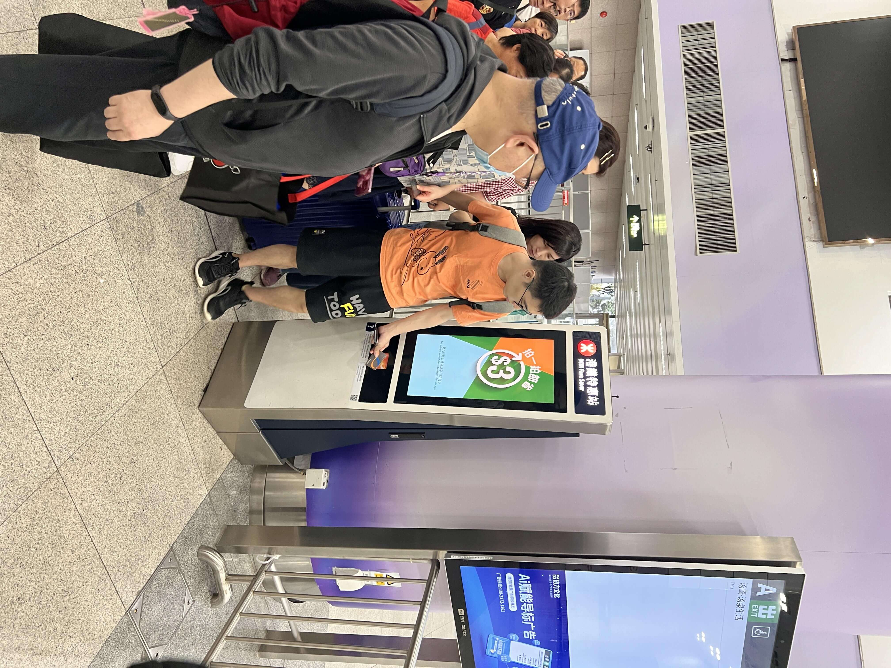
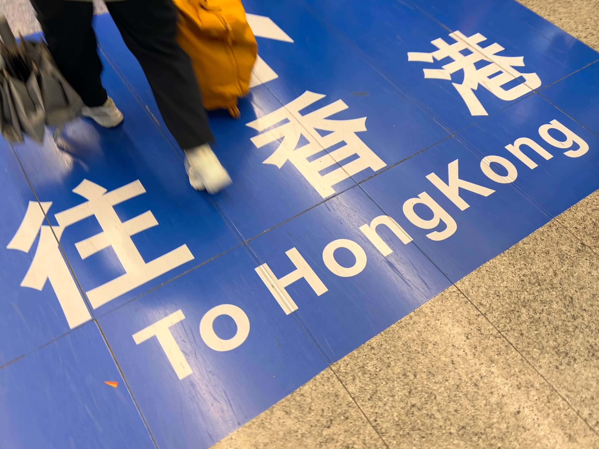

2024 年 9 月 22 日，星期日，香港暴雨23度，深圳大雨24度

## 一、北上目的

今天是周日，我和宝妈带着宝宝开启一场北上之旅。我们的目的主要有三个：
- 一是带宝宝逛逛超市（内地的物价大约是香港的一半）
- 二是宝宝口腔涂氟（内地口腔诊所的团购价格大约比香港少个零）
- 三是我要理发（内地两位数可以完成洗剪吹，香港基本上要三位数起吧）

<!--more-->

我们早上九点从西营盘铁站出发，满怀期待地踏上这趟旅程。路上，宝宝的眼睛里闪烁着好奇的光芒，仿佛在探索一个全新的世界，不停对窗外的风景向我和宝妈提问，我们先坐到金钟，再转东铁线，目标福田口岸



## 二、巧妙换乘

在金钟换成东铁线时，遇到了一个小难题。前面的两趟车都是去往罗湖的，分别等候6和12分钟发车，而我们要去的福田，要等到第三趟前往落马洲的列车，18分钟后才发车，这等待的时间有些漫长，怎么办呢？

我思考着其他的可能性，想到一个比较好的办法。那就是先坐第二辆去罗湖方向的列车，坐到倒数第二站“上水”后出站再进站，换乘去福田的列车。这个方法有几个明显的好处。
- 首先，终点站不变，总时间也一样。
- 其次，可以快点上车，这个对于带娃出行的我们来说非常重要。我们不希望因为换乘而耽误太多的时间，影响宝宝的情绪和状态。
- 第三，上第二辆车去罗湖的车，始发站，排在最前面，能够确保有座位，宝宝可以在座位上舒适地休息或者玩耍，让我们的旅程更加轻松愉快。
- 最后，也是让我最想尝试的一点是，根据网上攻略，到上水出站再进站，车费会比直达便宜几块钱。我搞不懂香港这边的定价逻辑，按理说A到B，B再到C的车票，会等于A到C（因为距离总和一致），或者分段买更贵（距离远的优惠点），香港这边是反着的，不仅东铁线出站再进站会便宜，高铁也是，广州到深圳北，深圳北到西九龙，分两段买就比直达的便宜，让人无语😒



## 三、小插曲与新发现

在上水站出站时，扣费 22.5 元，相比总价55元的总价，居然一半都不到。

然而，事情并没有那么顺利。当我们准备再次进站刷卡时，遇到了问题，工作人员告诉我，出站再进站要等一分钟之后才能刷卡，还好两辆车间隔6分钟，完全来得及，估计4分钟就有点悬了。

从上水到落马洲这一站居然花费 28.5，两程加起来 49 块左右。若单独乘坐大概是55块，如此一来能省下 6 块钱呢。用6分钟换6元钱，值不值？不同人有不同的答案。对于我们来说，总时间是一致的，区别是用6元换一站坐着变成了站着。



## 四、超市采购：中式独居生活vs美式家庭生活

过福田大概10点半，带娃两边都要走人工通道，好在这个时间排队都不长。过关后打车10分钟到了岗厦北附近的停车场，我们的车停在那里。然后沿着深南大道和农林路自驾十余分钟，开到了山姆会员超市(福田)店，据说这里周末一半都是北上消费的港人。进停车场时车位全满，本以为要一番寻觅，没想到运气不错，很快就有一辆车开走，我们得以顺利停车。

然后就是现场下载app开卡，入场开始买买买。这家会员超市很大，里面的东西都是大份的。这里的商品琳琅满目，让人应接不暇。让我感觉一下子从中式独居生活（按需点外卖，每顿不重样）变成了美式家庭生活（周末在超市大采购，备足一周的食材）。按理说，香港和深圳都是城市密度极大，生活配套极为方便的城市，完全可以精益管理食材的库存，没想到我竟然在大采购。

我们和宝妈在超市里挑选着生鲜和零食，顺便还排队领取了不少可供品尝的食物，让宝贝品品滋味。宝宝们很是开心。

另外，超市还有一个冷藏生鲜区，空调吹得凉飕飕的，比外面低不少度。我推着车带宝宝进去凉快一下，还让宝宝练习造句。
```
我先造：“爸爸被冻成了冰激凌🍨。” 
海兔说：“海兔被冻成了雪山。” 
珊瑚说：“珊瑚被冻成了冰块。” 
又说：“妈妈被冻成了雪人⛄️。” 
```
感觉还不错，宝宝们联想了好几种关于冷冻的词语。

在超市里，我还对比了一下物价。昨天在香港买了 20 个鸡蛋，花了 42 港币，约人民币两块钱一个。今天在山姆， 24 个鸡蛋大概只需 22 块钱，价格只有香港的一半。

昨天在香港看到的鸡蛋，大部分是内地进口的，包装上的产地一个是湖北，一个是贵州，还有一个写的是 “德清源”，乍一看我还以为是浙江湖州德清，仔细瞧才发现原来是寻乌。寻乌虽只是个小地方，但毛主席曾写过《寻乌调查》，读过毛选的人可能对此了解会多一些。

## 五、午餐

福田山姆没有可供吃东西的地方，于是中午我们在外面的商场里用餐，找了一圈肯德基最合适，有坐下来吃饭的地方，旁边方便放大推车。单独点了一杯果汁、一盒土豆泥，顺便多要了几个勺子和叉子，方便吃山姆里买的熟食。接着便开始享用美食，吃了两个牛肉卷和半只大烤鸡，真是大快朵颐，料足味美，让人十分满足。



## 六、理发体验：“洗剪吹”变成了“吸剪吹”

吃完饭后，我打算理个发。一开始在点评上搜索，结果搜到的店都很贵。后来在路边找到了一家叫优剪的店，好像是深圳的连锁品牌。全深圳有七八百家连锁店，全国大约一千七百多家。洗剪吹 43 块钱，儿童减法 28 元，价格符合预期。

这些连锁店似乎都没给点评付费，导致搜不到，有点遗憾。不过，这也让我们感受到了一种别样的发现之旅。有时候，那些不被大众所熟知的小店，往往会给我们带来意想不到的惊喜。

这家店特别另一个有趣的地方是不提供洗头服务，定位是快剪，主要服务周边居民，居民们剪完头发直接回家洗澡。我剪完后，理发师用一个类似吸尘器的东西把我头上的碎头发吸走，然后给了一张没有酒精的清水湿纸巾，让我把脸上的小头发屑擦一擦，还挺好玩的。“洗剪吹”变成了“吸剪吹”

## 七、宝宝午休：车和家

午后宝宝在理想车上睡了一觉。突然意识到理想汽车主打的“车和家”概念，之前在杭州有自住房，车子就没太多家的感觉，现在在深圳没有租房，这辆车就是我们在深圳的家，每次来深圳玩，宝宝需要午休时，可以睡在安全座椅上，宝妈播放些宝宝催眠音乐，比如摇篮曲，再开车出去晃两圈，宝宝很快就睡着了。

看着宝宝那甜美的睡脸，心中充满了温暖。在这个陌生的城市里，我们的车就像一个温暖的港湾，为宝宝提供了一个舒适的休息场所。我剪完发，宝宝也快睡醒了，我们接着前往下一个地点 —— 口腔涂氟。



## 八、口腔涂氟：价差极大

电话了好几家口腔诊所，大多已经约满了，最后约在了诺德口腔的连锁店。两个宝宝涂氟每人只需 19 块钱，很划算，点评每人限购一件，于是我点评拍一件，美团拍了一件。停车 50 分钟收费 15 块。怪不得他们不包停车，要是包停车的话可能就赚不到钱了，哈哈。

香港的口腔费用高，大家都有心理预期，没想到深圳的价格也很不一样。
- 诺德口腔这里洗牙+喷砂不到150元，宝宝涂氟19元一人。
- 山姆卓越会员送的1000元的口腔护理代金券，我也打电话问了诊所，洗牙500，喷砂300，宝宝涂氟400元一人，代金券需要一次性用完。实际1000元的市场价值也就50-150左右。不仅价格虚高，库存可能也有坑！宝宝涂氟要约到十月之后，成人洗牙更是最早只能约到十二月中旬，号子的紧张程度和香港的公立医院有得一拼。



## 九、雨中返程

福田山姆附近就是深圳儿童乐园，原计划有空可以带宝宝进去玩会儿，可下午雨下得实在太大，只好放弃。

我们先把车开回停车场，插上充电，然后打车去福田口岸。结果福田口岸外面堵了好几公里，等了十几分钟都不怎么动，无奈之下，找了条小路绕出来，从福民站坐地铁前往。下次周末返程还是尽量坐地铁吧，毕竟不会堵车。

地铁里，看到一群香港人骑着折叠自行车来到深圳玩，折叠车可以进地铁，也能从人工通道过海关回去。他们的折叠车折叠后，下面放了个带滑轮的架子，手扶着就能在地上轻松推行，这个工具非常好！折叠车轻便，滑轮方便，比我的大行P18敏捷多了。

深圳地铁 4 号线的福田站里有一个香港地铁的优惠处，拍八达通卡回程减 3 元，但小童卡用不了。香港小童坐地铁要求挺高，身高 95 厘米以上或三岁以上要半票，还是挺贵的。

落马洲回来时，普通座位已经坐满，下一班要等十二分钟。为了让娃轻松些，宝妈带我们坐了头等舱。东铁线的头等舱价格是普通舱的两倍，到家110元，两大两小要330元，好贵啊！与之对比，高铁福田到西九龙，二等座69元，比东铁线略贵，一等座109元，居然比东铁线便宜。



## 十、头等舱查票与秩序感悟：猛药去疴，重典治乱

上了头等舱后，找到座位坐下，列车便开动后，有乘务员查票。若未持票则会面临高达一千元的罚款！哈哈，看来香港人对秩序的遵守在一定程度上确是重典治乱的结果。

诚然，倘若如我们内地一般，违法成本时常过低，那么违法乱纪之人便会与日俱增。遇到事情，若只是敷衍了事，选择执法，便会让违法之人有恃无恐。而香港在道路违章等方面，罚款数额较之内地高出许多倍，也许提升违法成本，能更好地降低执法成本，维护社会秩序。



## 十一、总结：北上消费的思考

今天我最大的困惑是“成本”，从相关的调研来看，港人北上消费最主要的原因有三个：1. 出去逛逛，疫情期间憋在香港太闷 2.便宜 3.服务态度好

但从我自己的体会来说，虽然内地消费便宜不少，但是成本并不低。比如路费，来回坐东铁线 + 深圳打车 + 自驾电费停车费等，我们家两大两小在路费上合计花了超过500块，这个“显性成本”就很难通过买菜的方式收回来呀。

此外还有路上的时间消耗，拎着大包小包返程的体力消耗等“隐性成本”，港岛来回路上至少要4个小时。

跟风北上一趟，钱没少花，身体还这么累，意义在哪里？