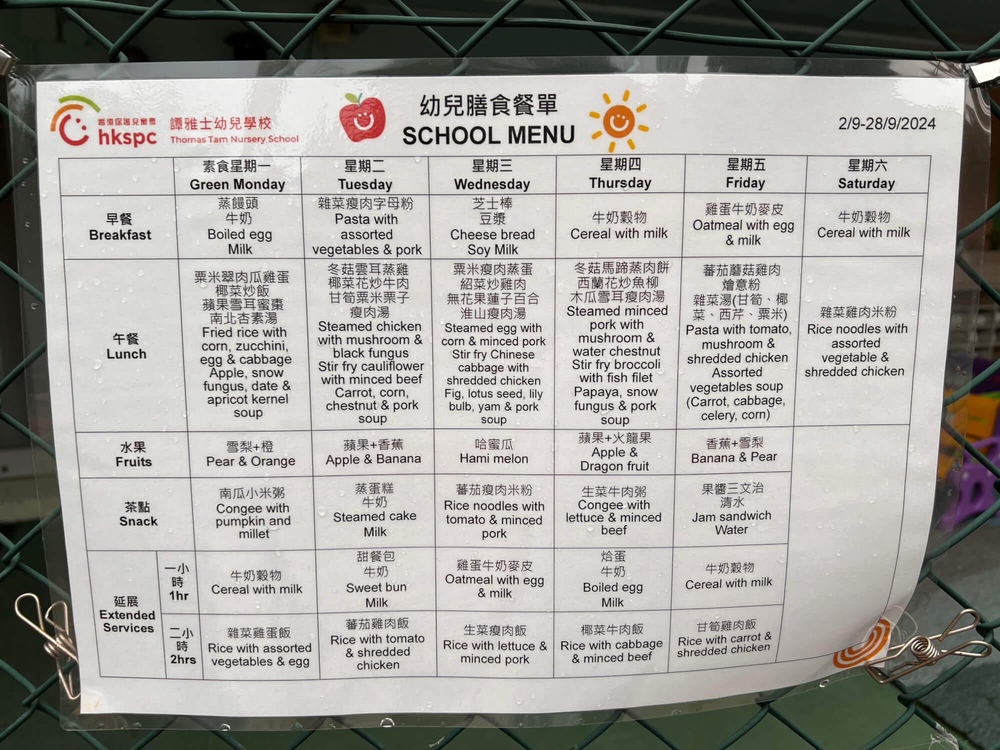

2024-09-28，周六，香港，晴

## 香港中央图书馆见闻

今天是星期六，我和宝宝都放假，宝妈则要去实验室做实验，于是我和外婆带着宝宝们前往位于铜锣湾和天后之间的香港中央图书馆，乘坐港岛线到天后，出站过马路便能看见，过了马路后才发现其实有过街天桥，没必要等红绿灯横穿马路，香港闹市区的天桥能连接所有的大楼，是个可以在空中行走的城市，这点我还需要适应。

<!--more-->

香港每个社区都有图书馆，我此前在石塘咀图书馆办过个人的借书证，那里类似于社区图书馆，而中央图书馆无需办证即可进入。

图书馆有 10 层，我们先坐观光电梯到 9 层。9 楼是参考阅览室，朝北窗外有美丽的维多利亚港海景，今天阳光很好，海水湛蓝，这里看书的环境太棒了！我们给宝宝摆拍了一张照片后被工作人员提示不允许拍照，于是坐扶梯下楼。楼下有参考图书馆（不能外借），书库，专题馆，成人借阅区，青少年借阅区等。

2 楼整层都是是儿童图书馆，全部是低矮的儿童书架、各样的儿童阅读角，电子阅读区域等。西侧是个游乐区，但活动需要提前预约，今天下午六点钟前的场次都约满了，现场预约是来不及了。宝宝虽想玩，我就去征求工作人员的意见，但最终的结果是要遵守规矩。每场活动结束后都有工作人员打扫消毒、清理玩具，再开始下一场，感觉日常运营做得非常好。后来宝宝们先后取了一些绘本，先自己看，然后我再给她们讲故事。

## 有趣的发现

今天居然看到了四对双胞胎，三对是女孩，一对是男孩。另外给宝宝讲故事的区域，说普通话的比例很高，也许内地来港的多是学霸，对图书馆更有兴趣吧！另外感觉本地小朋友菲佣来的比例比较高，外国小朋友更多的是父母带来玩。

这里宝宝也能办借书证，还能登记参加借书阅读比赛，每年借书超过六本就能参与排名，还会得到图书馆的认证盖章，据说也是升学的证明材料之一。我想给宝宝办证，可惜今天没带港澳通行证，只好拿资料回去填表，下次自己还书的时候再去社区图书馆办理。

## 返程公交见闻

上午十点从家出发，十点半到图书馆，玩到十二点离开，出门时宝宝喊饿，于是在图书馆门外的长椅上吃了点奶酪饼干，然后坐 23 路公交车回家。

23 路公交沿着铜锣湾一线行驶，经湾仔附近上山，再沿着半山腰一直开到西营盘。公交车的速度比地铁慢一些，我们特意带宝宝坐公交车，尤其是想让他在双层公交车的二楼看看香港的风景。

一路上，宝宝海兔对窗外的景象充满好奇，看到麦当劳等都会指指点点喊出来，而宝宝珊瑚则很困，上车后很快就睡着了。途中，我还看见了三家叫明明的面店，感觉还不错，打算下次有机会去品尝一下。下车后我们去了附近的麦当劳。

## 麦当劳点餐体验

我在一楼自助机点餐需排队，宝宝们去负一楼找座位。

两台自助机后排了好几人，我觉得并发太小了，也许好于前台点餐（节约服务员人力），但大陆现在的路边小餐馆都都能做到桌上扫码点餐，并发等于餐厅容量，已经足够大了。

点完餐下楼发现桌上可以扫码点餐，但扫码后需要跳转 APP，而苹果手机中国区没有麦当劳APP，跳转后是白屏，体验太差了！还是国内好，一般都是跳转到微信或支付宝小程序，不用下载 APP，用完即走，体验一流，遥遥领先啊！

## 餐食与价格

香港麦当劳挺贵，国内二十到三十元的套餐，这边要四十以上，一个汉堡就要三十多，比国内贵了不少。我们点了两个开心乐园餐和一个成人套餐，花了一百多。开心乐园餐有玉米粒、麦乐鸡、柠檬茶等，不过最重要的是玩具，玩家点餐时可以自选种类，今日玩具是 cross 联名的鞋子形状小挂件，或者可以选小册子，册子里有迷宫、折纸、贴纸等，内容很丰富，宝宝拿到玩具后特别兴奋！

## 餐厅中的交流

吃饭时，我们和坐在左边的夫妻交流起来。他们都已年满 70 岁，但说话很健谈，看上去也比实际年龄年轻。他们之前还在国外生活过 20 年，现在子女在美国，他们回香港住在附近。她们觉得现在的香港很不错，国安法出台后社会秩序稳定了下来，很依据，尤其是西营盘附近，有现代生活的好的配套，也保留了很多老东西。除了中国的重庆，其他地方很难有这种能在半山腰坐地铁的情况。他们还询问我们来这里的体验，我们表示来之后也觉得这里的社区居住体验和生活氛围很好，生活配套完善，住起来很舒服。

## 午后休闲

下午回到家后，大家都睡了个沉沉的午觉。我和宝宝们醒来都快 5 点了，外婆出去买菜准备晚餐，我和宝妈则带娃出去活动。

先带带着宝宝的滑步车到去了楼顶平台（因为楼下没院子，隔壁还在施工，只能在楼顶平台活动），宝宝一开始不太愿意滑动，后来我们玩警察抓小偷游戏，两个宝宝当警察，我当小偷，我在楼顶平台绕着晾衣架跑来跑去，让宝宝追我，通过游戏带动他她们运动出汗，这样晚饭能吃得香些。

## 佐治五世纪念公园玩耍

玩了一会儿后，我们把车送回家，然后去了不远的佐治五世纪念公园。这是个体育公园，有足球场、篮球场等设施。我们主要是奔着里面的儿童乐园去的，乐园有爬爬架、荡秋千等，宝宝们很久没玩秋千了，荡了很久，尽情释放！海兔胆子大一些，让我推得幅度大一些，珊瑚则有点害怕。这里除了我们，还有香港小朋友和小老外，有的是父母带，也有菲佣在带。

在乐园里边玩边逛，我们还看到一个基金会旗下小型幼稚园，除了收学生外，还提供临时托管服务。门口挂着每日菜单，感觉不错，有早餐、午餐，课间有点心，水果等。提供的托管，价格很便宜，每两小时收费16 港币，加餐费 6.5 港币，这个福利太好了，过几天准备打电话问问我们的宝宝能不能报名。如果可以，每周来一两次挺好，原因有三

- 一是价格优惠；
- 二是这里的条件比社区福利大楼里的托班好，有室外儿童乐园可以活动，社区托班以室内为主，室外的儿童乐园特别小。
- 三是有专业的老师照顾，和其他小朋友一起玩、说粤语，更也有助于他们融入社会。

- 宝宝现在中午 12 点到家吃饭，1 点多睡觉，3 点起床。如果能4点送来，6点接回家，比双拼幼儿园更方便，因为午睡充足，有助于长身体！

- 每天上午上学，每周下午来两次托班，另外三天可以报英语、粤语、体育的课程，大一点还可以学艺术。晚上爸妈陪娃玩，回顾复习当天的课程，这是我理想中的安排

## 平价超市购物

从乔治五世公园出来后，我们去了朋友哓枫推荐的平价超市“佳宝”买东西。价格比外面便宜很多，比如 4.5 升的桶装水，外面超市要三十多，这里只要二十。从超市出来可以坐电梯上山，要走的路不比其他超时远太多，感觉不错，下次还来！

## 晚上的家庭时光

晚上到家后开始吃饭。吃饭时顺便检验下我这几天折腾AppleTV的成果，先在奈飞上看了一集乐高动画片，然后又看了一会儿yoububekids。7 点半的时候，再看了中央一台直播的天气预报，通过这个可以学习中国地理，内地的小朋友们都是从小跟着天气预报背中国的省会名。比如我就能连着背出济南、郑州、合肥、南京，而宝妈熟悉杭州前面的几个城市的顺序。

## 待办事项与计划

还有一些事情没做。今天本想去社区健康中心登记，那里会有长期的健康辅导。另外，今天试了 HA-go，感觉整点时有望挂到号，虽不一定是很近的医院，但也不是离岛，港岛、九龙都有希望搜到。十一国内放假，香港正常上班，我打算把看病、社区健康登记、宝宝的出生证等几件事都做了，让生活走上正轨。

## 晚上散步与报纸杂志观察

晚上出去散步，沿着高街、第三街、第二街、第一街的顺序逛了一圈，对周边配套有了更深入的了解。有几点有趣的发现想分享。

首先是买报纸，本地报纸大多10 元一份，有《星岛日报》《大公报》《文汇报》《明报》等。几个 711 里还有英文报纸，本地英文报纸是《南华早报》，海外的有看到45元的《纽约时报》和30元的《财富周刊》。

这边杂志很贵，尤其是英文杂志，像《国家地理》《经济学人》《财富》等都是 70 到 100元 一本，贵得吓人。相比之下报纸更厚更大，价格便宜不少，更具性价比！

## 社区配套探访

晚上还参观了佐治五世纪念公园东侧的社区配套。

右手边是社区文化中心，有舞蹈、音乐、美术等项目。跳舞从小班 K1 的小学生就可报名，80 块钱一节课，有不同级别的课程和配套考级。画画有工笔画、中国画等，主要面向成人，100 多元一节课，一般在周末。跳舞活动也在周末，还有唱歌、合唱团以及庆祝建国 75 周年的合唱比赛、演出等相关活动，超级丰富！

左手边又是一个幼稚园，仁济医院旗下的。幼稚园也是两项业务，一块是学券幼稚园，有半天班和一天班。另一块是社区托班，面向 2 到 6 岁孩子，价格便宜，两小时一节课 16 块钱，还包含点心费用。日托时间是早上 8 点到晚上 6 点，晚上6 点到 8 点还可晚托，周六也有托班，非常方便双职工家长！

## 图书馆宣传册观察

晚上还整理了从图书馆拿来的各种宣传页，有几点收获：

### 一、传统文化与国学重视

能看出香港对传统文化、国学的重视。有岭南文化系列分享讲座，还有香港填词大赛的宣传册，从 91 年开始每年都有，今年的词牌是《卜算子》，主题不限，分学生组和公开组。把冠军、亚军、季军和优秀奖的词展示出来并附上评语，学生组冠军的作品让人眼前一亮，他读了兰芳共和国（华人曾在婆罗洲建立的国家，现在知道的人不多）的历史后很有感触就写了词，内容和主题都很有意思，体现了对国学的重视以及对获奖作品的推广！

### 二、图书馆资源与服务

包括图书馆各种数据库的使用方法，有很多 APP 以及内容丰富的儿童书、电子课程等，鼓励大家在家带孩子看，还有图书馆的分布情况，各个社区分布密集，每个区都有好几个馆，还有流动图书摊位等。

### 三、继续教育与联合培养课程

还有个区域有很多学校课程的介绍，有继续教育的，也有本科教育的。看到一个很神奇的学位广告，大一在南加州大学，大二在香港科技大学，大三在意大利米兰的一个大学，大四可任选地方，四年读完能拿到三个学校的文凭，这种联合培养课程能开阔学生视野，三个学校也涵盖了欧洲、亚洲、美洲！

今天收获满满，不仅体验了香港的文化与生活氛围，还为宝宝的成长与学习发现了诸多有益的资源和机会，期待未来能有更多美好的探索与发现！
