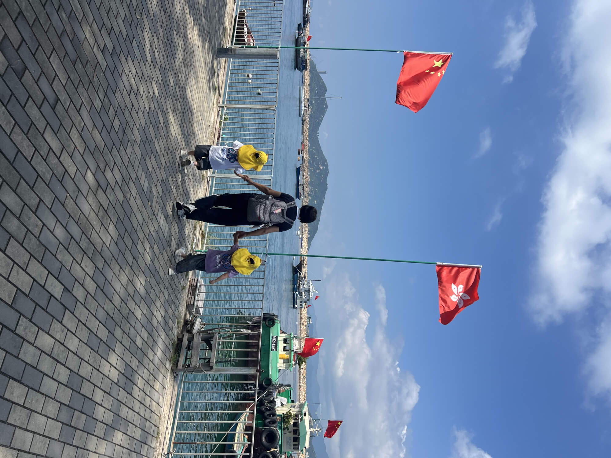
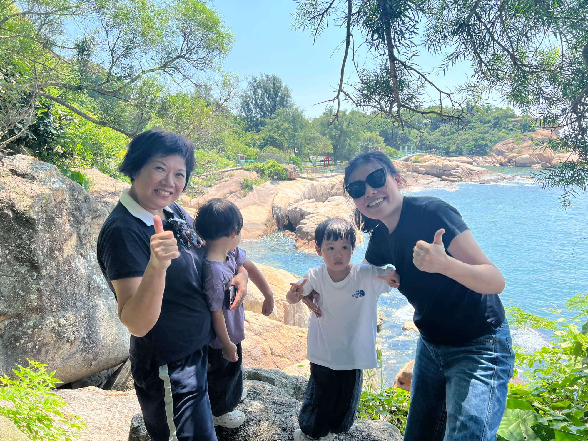
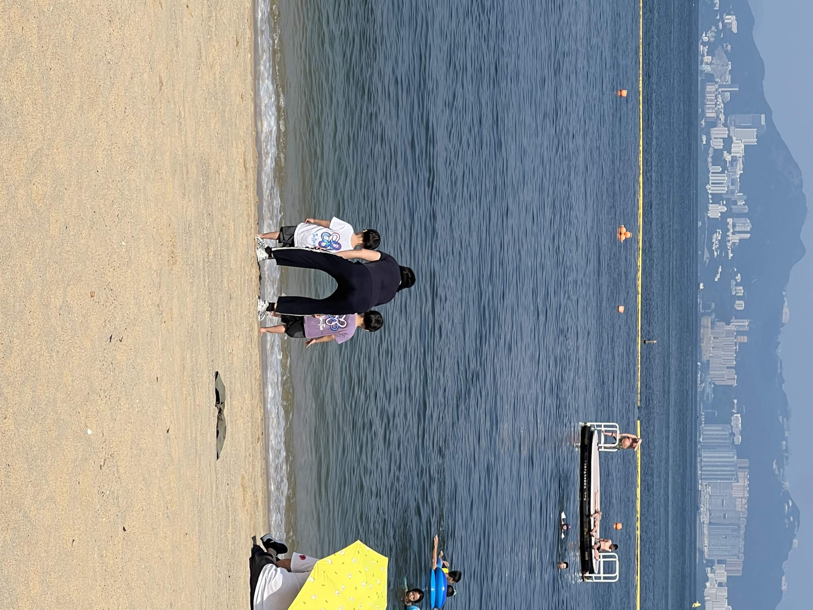
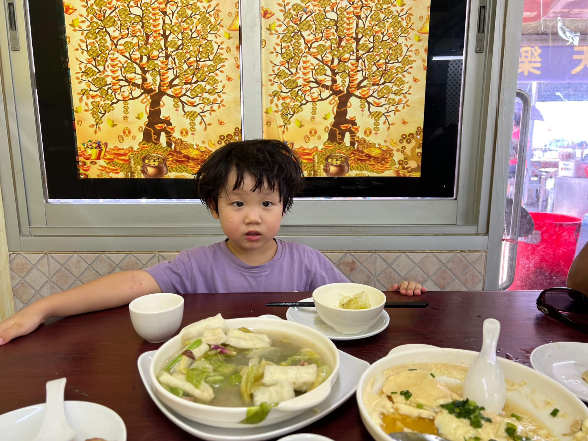
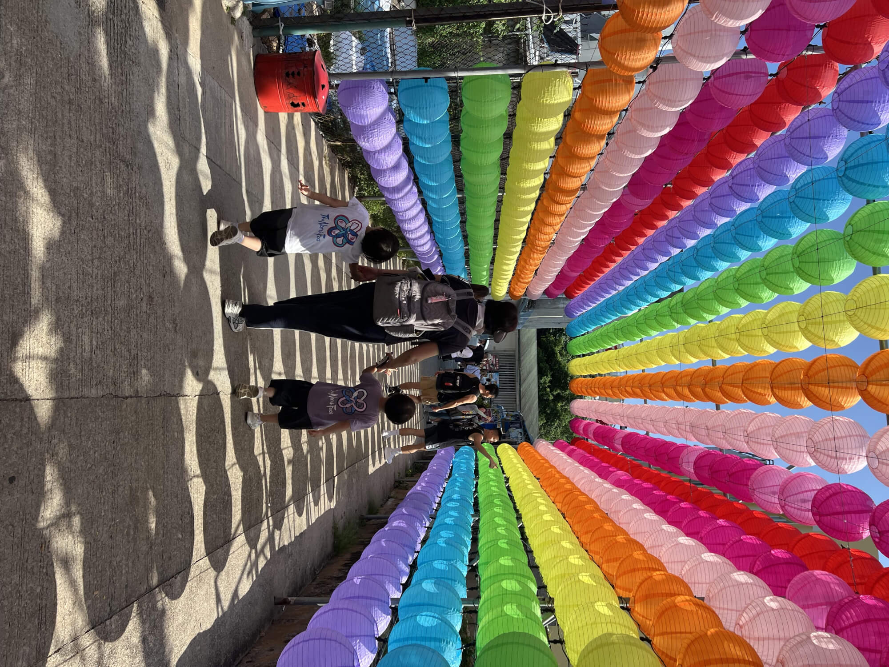
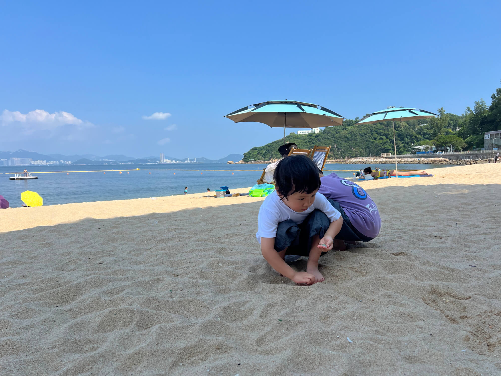
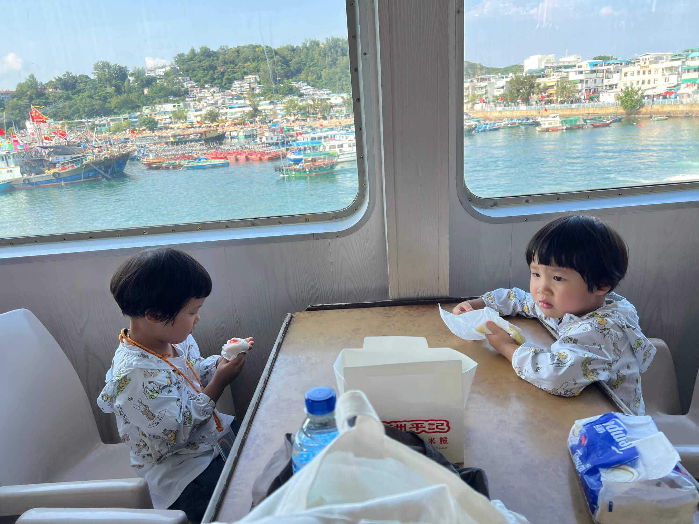

## 一、欣然启程
今日阳光灿烂，宝妈和珊瑚、海兔、外婆四人自中环 5 号码头欣然登船，驶向那充满神秘色彩的长洲岛。去程搭乘快速船，不过须臾，约摸半个小时光景，便已抵达魏雨大屿山东南侧的长洲岛。

<!--more-->

## 二、探秘张保仔洞

登岛之后，我突发奇想，提议带着小孩前往那闻名遐迩的张保仔洞。一路上，我绘声绘色地给宝宝讲述张保仔身为海盗在洞中藏匿宝藏的传奇故事，小家伙们听得兴致勃勃，满心期待。那洞位于岛的边陲之地，前往途中需跋山涉水，道路崎岖难行。历经千辛万苦，终是抵达洞口。两个小朋友探头一望，只见洞内幽深莫测，外婆见状，立刻忧心忡忡地说道：“此洞太过危险，断不可让宝宝独自涉足。” 无奈之下，我只得另寻他路，带着他们辗转来到洞的出口。此处海景美不胜收，外婆赶忙为小孩拍下诸多照片，以留作纪念。

今日洞内杳无人迹，宝宝便以为此洞不可通行，殊不知妈妈上次曾亲身从洞中爬出。稍作休憩之际，忽有一个年约六七岁的小男孩从洞口蹒跚爬出。我们好奇询问，小男孩稚声稚气地说：“这洞可难走啦，里面还有一条小蛇呢！” 宝宝们听闻，顿时心生畏惧，而后便缠着那小孩，不停地追问：“那里面到底有没有宝藏呀？有没有看到宝藏呀？” 妈妈见状，笑着解释道：“这洞历经众人探寻，倘若有宝藏，恐怕早已被人捷足先登，拿走咯！” 宝宝们这才恍然大悟。

## 三、返程逸事

踏上归程之时，因海边道路烈日炎炎，外婆灵机一动，提议改走山上小径。我们沿着小村子后方的山路徐徐前行，起初宝宝们还饶有兴致，可走着走着，便觉疲惫不堪，开始叽叽喳喳地抱怨起来。行至半途，见一村庄厕所，便带他们进去方便。妈妈冲水之时，那冲水马桶的盖子竟 “啪嗒” 一声从天而降，吓得妈妈赶忙将其捡起，重新安好。

而后继续前行，不多时便步入村庄。我们寻得一家饭店，准备用餐。外婆提议品尝点心，妈妈随即点了两个菜肴。小朋友们一边大快朵颐，一边轮流喝着柠檬水，还饶有兴致地看着电视里播放的新闻。

只见新闻中报道今日在荔枝角有一水管爆裂，一辆的士车不幸被水淹没，孩子们看得目不转睛。接着又播出一则某地因大风灾害导致洪水泛滥的新闻，宝宝们还以为是同一则新闻，天真地说：“那个的士也淹进去了。” 随后，电视中又出现了龙舟的新闻。回想起先前前往张保仔洞的途中，便看到许多龙舟悬挂在岸边。妈妈便向宝宝们娓娓道来：“待到端午节前后，他们便会开始训练，届时还会有精彩的龙舟比赛呢！” 宝宝们看着龙舟比赛的视频，兴奋不已。

## 四、街市见闻

用过餐后，我们悠然漫步至街市。街市中，卖贝、卖鱼的商贩比比皆是，小朋友们好奇地凑上前去，仔细端详那些鱼儿，眼中满是新奇。行至街市深处，一个卖平安包的摊位映入眼帘。那平安包硕大无比，每个售价十一元。我们买了三个，打算作为明日的早餐。继续前行，忽然发现一处售卖芒果糯米糍的地方，妈妈岂能错过这等美味，当即买了一些。而后，我们又来到海边，享受那惬意的海滨时光。

## 五、海边欢乐时光

宝宝们此次乃是首次亲临大海之畔，以往皆是在人工步道边的海边游玩，从未在这沙滩之上尽情嬉戏。起初，他们只是在沙滩边缘兴致勃勃地捡拾贝壳、石头之类的小物件。然而，面对那被烈日晒得滚烫的沙子，他们却踌躇不前，不敢贸然跑过去。外婆见状，索性强行拉着珊瑚冲向海边，妈妈也牵着海兔紧随其后。两个小宝贝一到海边，便如同脱缰的野马，兴奋地追逐着海浪，玩得不亦乐乎，那笑声在海风中回荡。

原本宝宝们应在两点半入睡，可今日他们玩得忘乎所以，一直到三点半仍沉浸在欢乐之中。待玩得尽兴后，小家伙们已然疲惫不堪。

## 六、归家插曲

随后，我们乘坐慢船踏上归途，选了二楼的豪华舱。舱内布置温馨，桌椅相对，宝宝们玩累了之后，便狼吞虎咽地吃起芒果和草莓糯米糍，不一会儿便呼呼大睡。大约过了四十分钟，船抵中环，两个宝宝却仍在睡梦中，被叫醒后大呼未睡醒，顿时哭闹不止。外婆和妈妈只得轮流将他们抱至地铁站，宝宝们对读卡进站出站饶有兴致，每次都要亲自操作。

回到家中，外婆出门买菜，临行前嘱咐妈妈烧一锅饭。孰料，外婆刚走，珊瑚便哭闹不休，哭得那叫一个惊天动地，在地上打滚撒泼。妈妈急中生智，想出一招转移她的注意力。妈妈带着珊瑚去淘米，轻声问道：“珊瑚呀，你想煮饭还是煮稀饭呢？” 珊瑚眨眨眼睛，想了想说：“我想吃稀饭，好久没吃稀饭了。” 于是，妈妈陪着珊瑚一边看着刻度加水，一边设定稀饭的程序。珊瑚的注意力成功被转移，也不再哭闹。她还美滋滋地想着，过一会儿外婆回来，打开电饭锅看到一锅稀饭，定会大吃一惊，说：“我要煮一锅饭，怎么变成一锅稀饭了呀！” 而后，妈妈便去学校忙自己的事情了。至于外婆带娃时的那些趣事，妈妈就不得而知咯。
