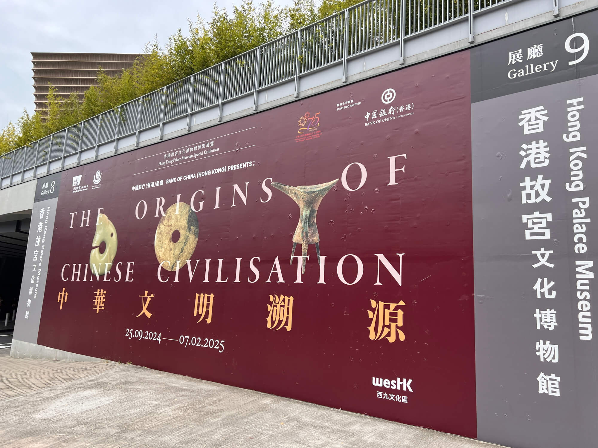
2024 年 10 月 4 日，香港，晴

## 前往香港故宫文化博物馆
我这几年很喜欢参观博物馆，到香港后，一直都很想去香港故宫参观，再加上九月底开始了特展“中华文明溯源”是我很喜欢的主题，两者叠加，我决定利用十一假期期间前往，独自一人，可以安心好好观展。

今天是周五，宝宝正常上学，上午，我规划了后面几天的安排后，决定今天出发。乘坐公交对我来说最方便，公交车穿过西区海底隧道后，在第一站下车，便是西九文化区，随后步行数百米，我便来到了心心念念的香港故宫文化博物馆。

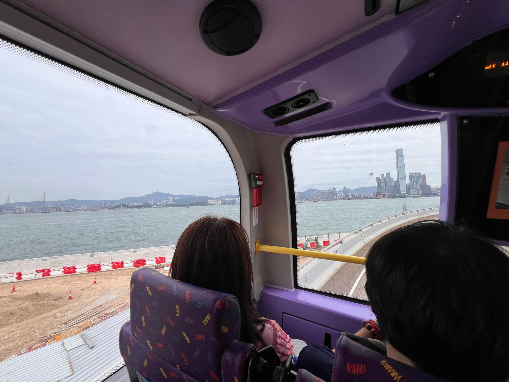

相比各地的省博，香港故宫并不宏大，但内部的建筑却典雅精美，这里地下两层，地上共有四层，LG层是报告厅，G层开始上面每层都设有不同的展厅，此外还有餐厅、商店、观景台等设施。

## 购票波折
路上，我查攻略时得知现场买票价格较高，网上买票便宜一些。然而，这一决定却耽误了不少时间，飞猪的供应商出票太慢，导致我在故宫门口等待了近半个小时才得以进入。主要的误会在于门票的时间，购票时，需要选择日期的时间，某些时间的库存有问题导致耽误，然而实际扫码入场的时候，只要日期正确就行，时间早晚都可以。上次去太平山顶在网上临时买票也差点耽误时间，看来要吸取教训，在香港网上买票一定要提前。

## 一号展厅：紫金万象——建筑、典藏与文化传承
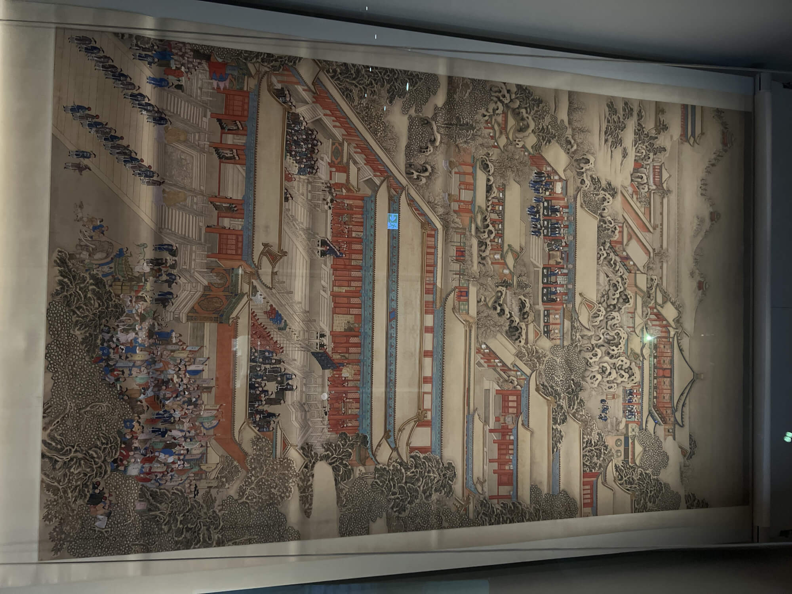
来到一楼的“紫金万象——建筑典藏与文化传承”展厅，一进门就被一幅高达四五米的国画《万国来朝图》所吸引。这幅画气势恢宏，展示的是乾隆时期的紫禁城景象，虽为复制品却十分气派。展厅的另一边，陈列着三希堂的砖头、嘉靖的城砖和嘉庆的金砖等。这里展示了很多非常大气的清宫物品，比如朝服、玉玺，画像，佛塔等，让人仿佛穿越时空，感受到了清朝宫廷的奢华与庄重。

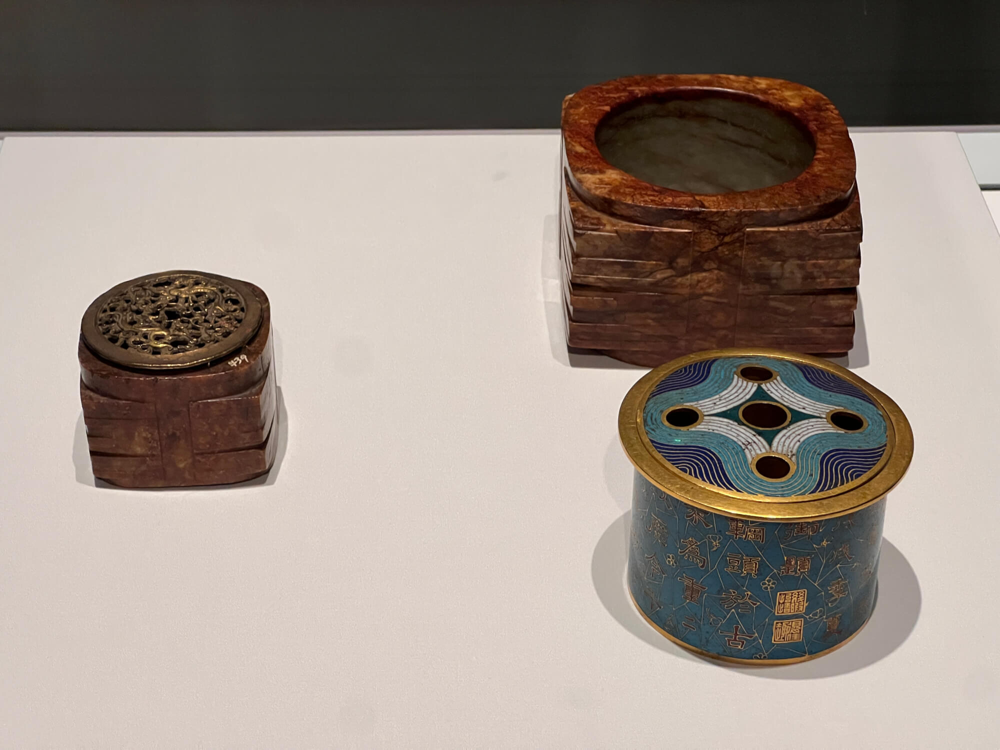
最让我开眼界的是“乾隆御题玉两节人面纹琮”，里面的玉琮是良渚文化（公元前3400-2250年）时期的，外面的掐丝珐琅内胆是乾隆时期加上的，上古礼器改造成后来的香薰，非常有意思！

## 二号展厅：紫禁一日——清代宫廷生活与艺术
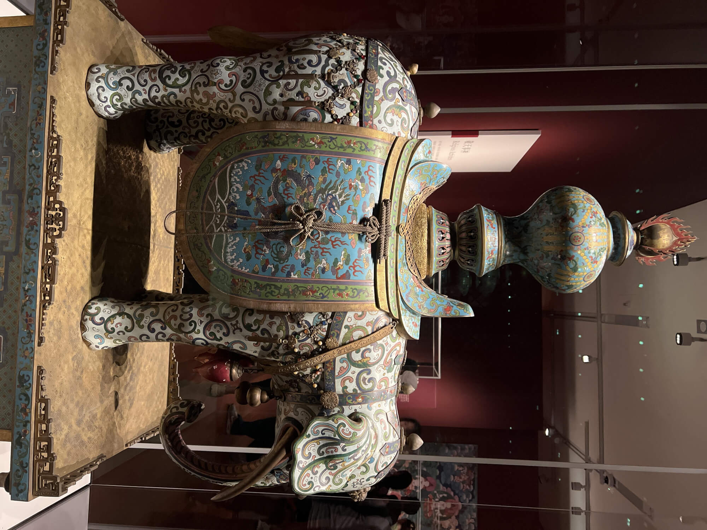
二楼的二号展厅“紫禁一日——清代宫廷生活与艺术”。这个展厅生动地展示了紫禁城的一天。从皇上清晨起床、洗漱，到开始处理政务，再到白天的礼佛仪式、喝茶以及各种活动安排，通过文字展示和产品展示，让我们对清代宫廷生活有了更深入的了解。展厅中间还有专门的区域放出萨满祭神仪式上的朗诵祝辞，那古老的声音在展厅中回荡，让人仿佛置身于那个神秘的时代。最后晚上的章节，以乾隆皇帝在梦中想念富察皇后为主题，游客可以躺在中间的圆形垫子上，聆听梦里面的诗词，感受别样的游览体验，趣味十足！

## 三号展厅：流光彰色——故宫博物院藏明代陶瓷珍品
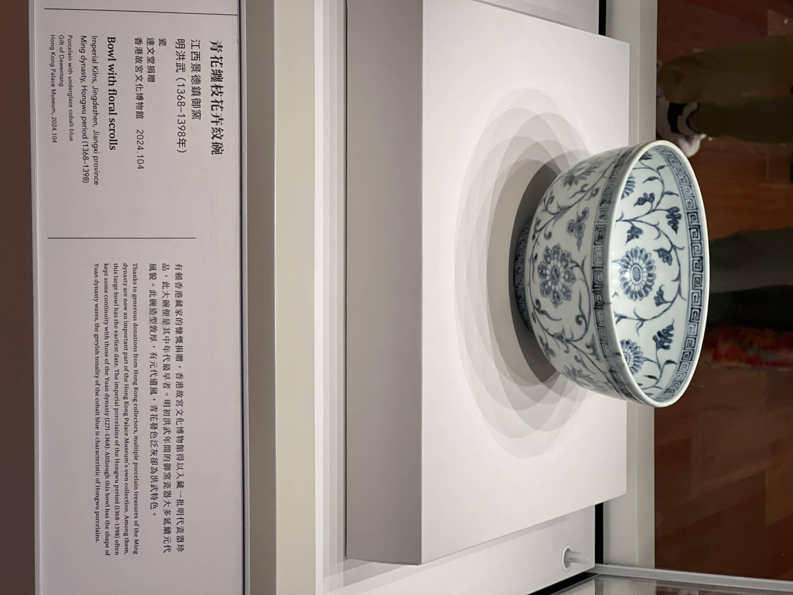
这个展厅做得十分出色，按照时间演变顺序依次介绍不同时期的陶瓷珍品。展厅内不仅有精美的藏品，还有各种制作过程的演示视频等丰富内容，让人充分感受到明代陶瓷的魅力。

## 四号展厅：故事新说——故宫博物院藏明代人物画名品
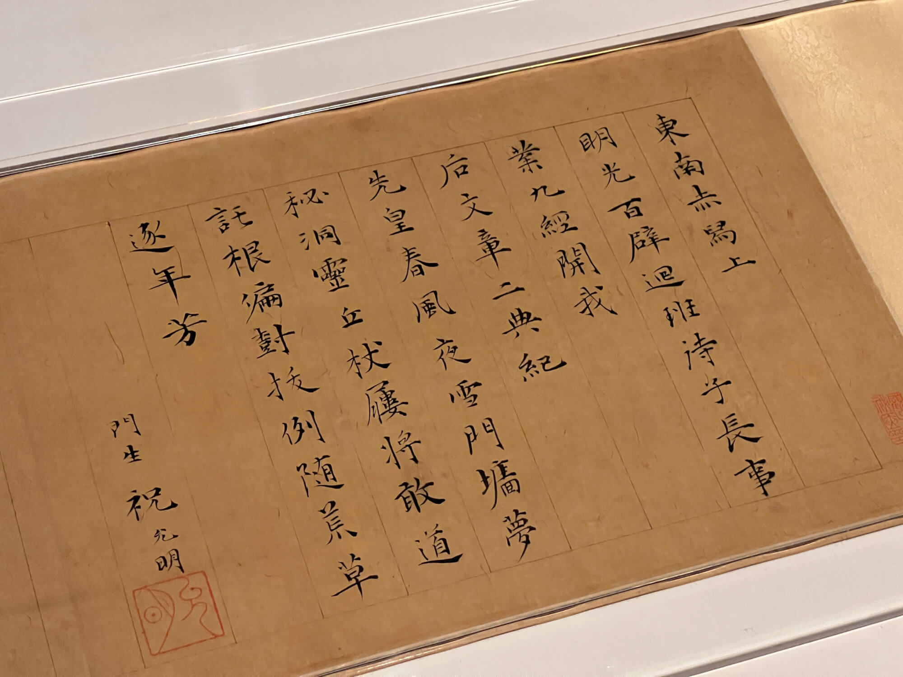
这是是香港首个中国古代人物画展。该展览从故宫博物院珍藏的绘画瑰宝中精选了 81 套（97 件）明代人物画珍品，涵盖约 60 名明代画家的存世作品，其中 14 套（16 件）为国家一级文物。因为书画不能长时间展览，要有休眠期，所以展品分四期展出，每期时长约三个月。展览大体按朝代的早期“浙江画派”、中期“吴门画派”、晚期分为三个单元，分别展示了明代不同时期的人物画风格和特点。在这里，我看到了唐伯虎、祝枝山等名家的作品，还有一幅长卷，署名仇英，实际上是当地工匠所画，都非常耐看。

## 五号展厅：器惟求新——当代设计对话古代工艺
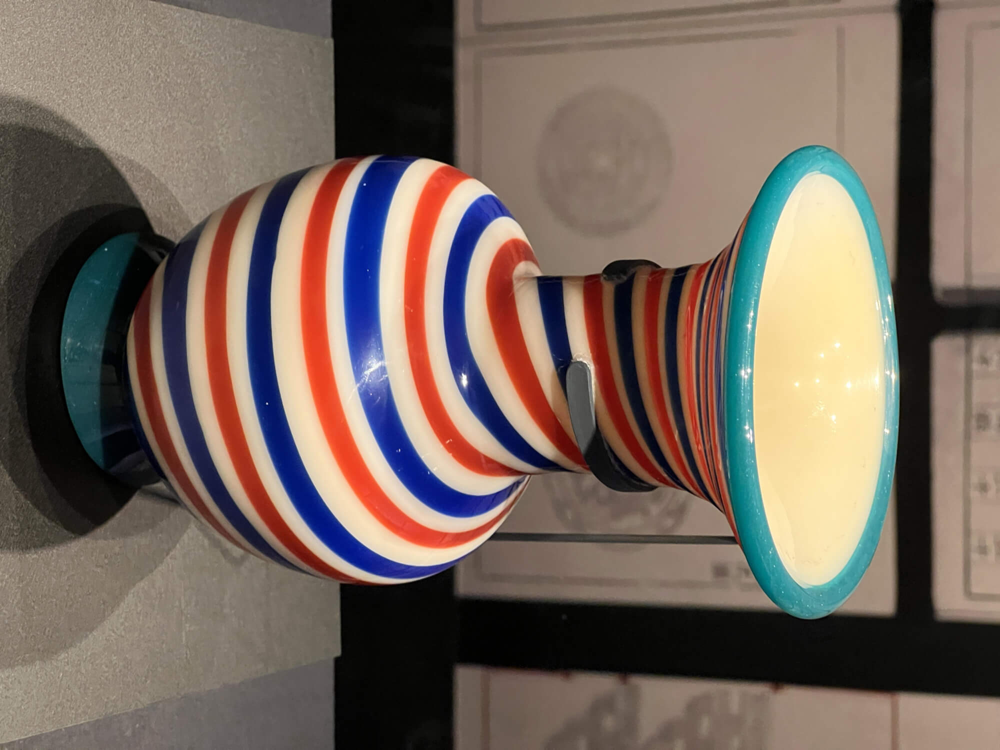

这个展远超预期。原本以为只是简单的古今对比，却没想到展厅中展出了从商朝青铜器、西周青铜器，到唐宋及清代的花瓶等众多精美的故宫馆藏器物。各种器物琳琅满目，让人眼花缭乱，带来满满的惊喜。

## 六号展厅：乐藏与共——香港故宫文化博物馆首批受赠展品展
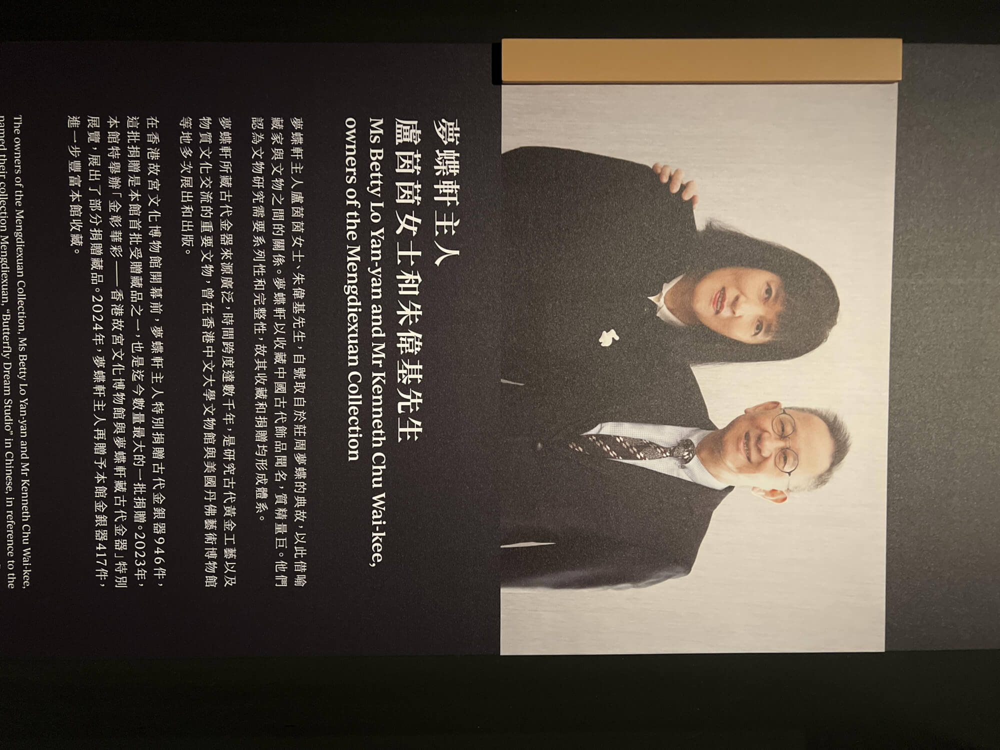
六号展厅是捐赠展，从金属、宗教、书画、陶瓷等不同分类展示了香港故宫开设以来收到的捐赠作品。其中最多的一次捐赠了几百件古代金银器，非常精美。

看完这个展厅，最大的感受是香港故宫对捐赠人特别尊重。每一个捐赠人的介绍都十分详细，有照片、名字、几句话的简介，还有其与收藏的相关故事，比如是某某的子孙，或是拍卖家、鉴赏师、艺术爱好者等身份。同时也明确了捐赠的时间和数量。这样的介绍让人能清楚地了解捐赠人是一个什么样的人，他们为何有这样的收藏以及捐赠的原因。在内地看过的很多博物馆的捐赠展，很多都只有一个名字，缺乏捐赠人的背景和捐赠原因等介绍。这种对捐赠人的尊重，让人觉得捐赠之后更能把名字留下来，也更能激励更多人参与到文物的捐赠与保护中来。

从捐赠人也可以看出香港玩古董、文物的人群特点。老钱有古董世家，还有名人的子孙后代。新钱也两个是医生、一个是知名律师。此外，还有艺术从业者，如拍卖师、画家等。这些不同身份的捐赠人，让我们对香港的社会风貌有了一个侧面的了解。

## 七号展厅： “山林世城、游历旧园新景”
这个展厅呈现出一种现代艺术风格。这里有八个由香港本地设计师设计的现代园林景观，虽不像传统园林那般规模宏大，但在一个个小角落、小拐角处，展现出独特的小景象，给人以别样的感受。

## 八号展厅：特展：“中华文明溯源”
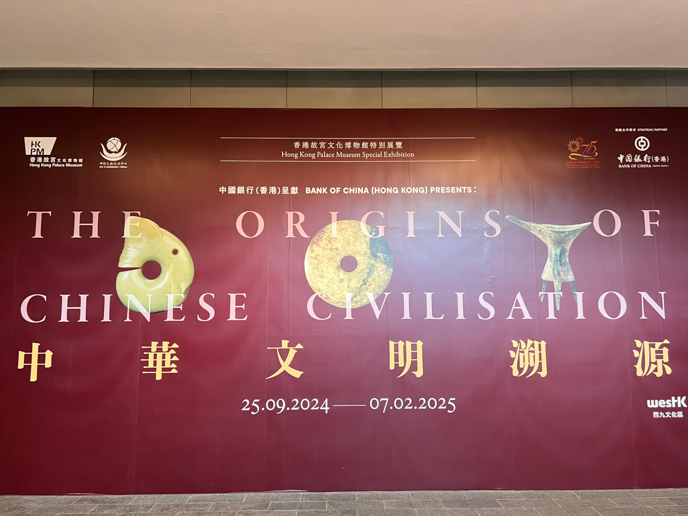

中国这些年考古有很多新发现，如林家滩等，将历史不断往前推进。这个展厅从国内很多省博及其他地方选取了每个文明（如红山文明、石卯文明等）有代表性的展品，做成了一个综合性的古代文明展。在这里能看到很多以前教科书上没有的考古新发现成果，相当于一个知识的窗口，让人感觉很不错。回去之后也可以再深入阅读学习，进一步了解中国古代文明的博大精深。

## 九号展厅：“法国百年时尚——巴黎装饰艺术博物馆服饰与珠宝珍藏”
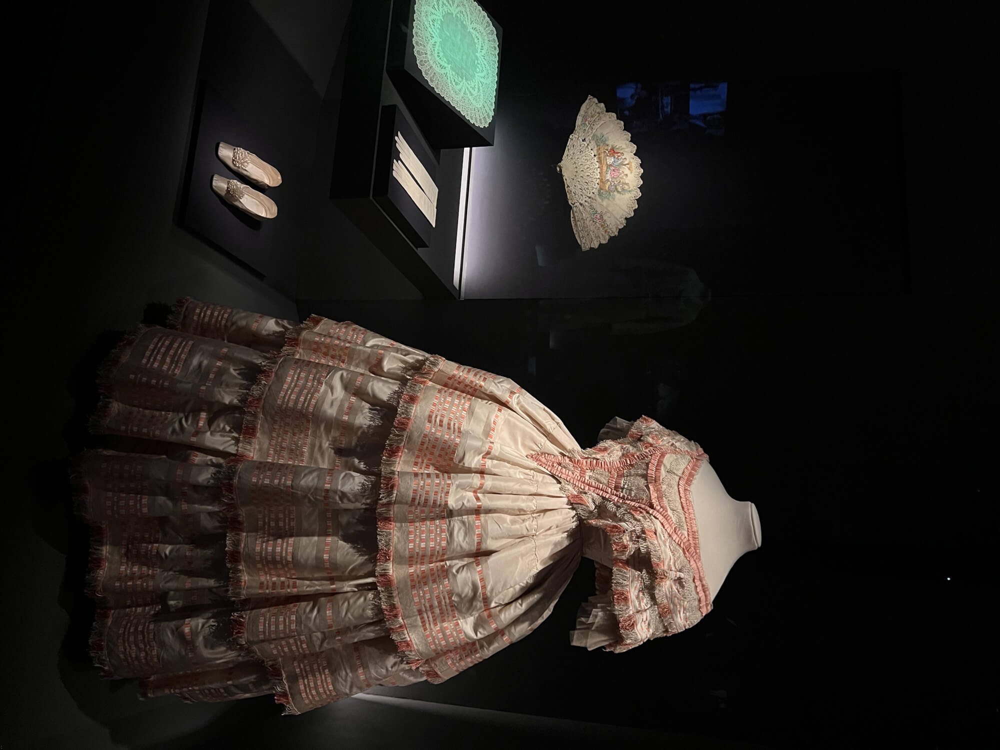

这个展厅通过服饰，展示了法国如何引领欧洲时尚，一位非常懂时尚的王后起到了重要作用。后来铁路、公路尤其是铁路网络的发展，使得全欧洲的名流都居住到巴黎，巴黎也因此成为时尚艺术中心，时尚业的发展让法国商人赚得全欧洲的财富。展览女装居多，男装不仅数量少，各个时代差距也不大，男士衣服演化较慢，而女士衣服变化非常快，不同时代有不同风格。

## 观景台
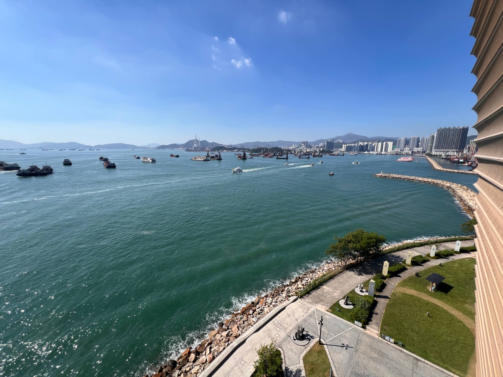
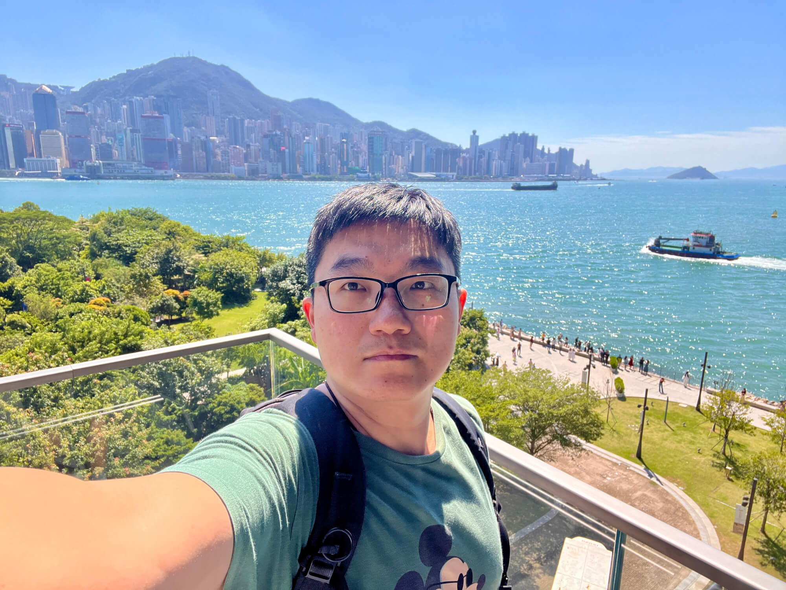
博物馆的三楼和四楼各有一个室外观景台，一个向西，晴天可以看到湛蓝的海水与开阔的海景，一个向南，正对维港，可以看到维港对岸的高楼大厦，这里是拍照的好地方！

## 博物馆的餐饮与周边交通

博物馆里有两个餐厅，价格昂贵，四楼的餐厅璟珑轩，十分高级。午餐套餐一个人要 400 多元，单点一份炒饭或面大概 200 元左右。一口类似于快餐厅，一份炒饭或者面条也要100+，让我望而却步。

参观完博物馆后，走路去九龙地铁站需要十几分钟。我乘坐了 CX1 循环摆渡车，它连接了博物馆、地铁站、高铁站、九龙地铁站等周边重要交通换乘地点，十分方便，只需 5 块钱，几分钟就能到达。第一次来到九龙站，上面是个叫做圆方的广场，非常大，将地铁站，汽车站，高铁站都连接在一起。

## 香港站闲逛
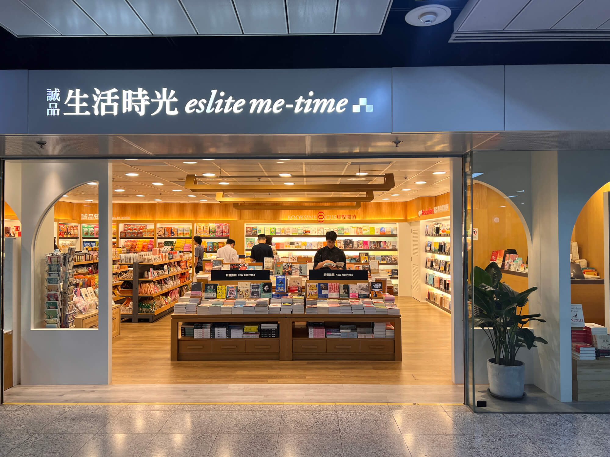
坐东涌线一站到达香港站，这里有很多可逛之处，比如有个小型的诚品书店，一半卖书，一半卖文化用品。书大多是繁体港版、台版书，还有一部分英文书。

简单扫了一圈，看到一本《香港小学生日记 1971》，是个小学生 1971 年写的近一年的日记，有日记原文和画的连环画，并且补充了很多注释并配上当时的明星、电影海报等相关图片，展现了当年香港小学生的生活以及风土人情、日常文化娱乐地标等，看着很有趣。本想买一本，但价格 288 港，让我望而却步，暂时还未适应香港的书价呀。
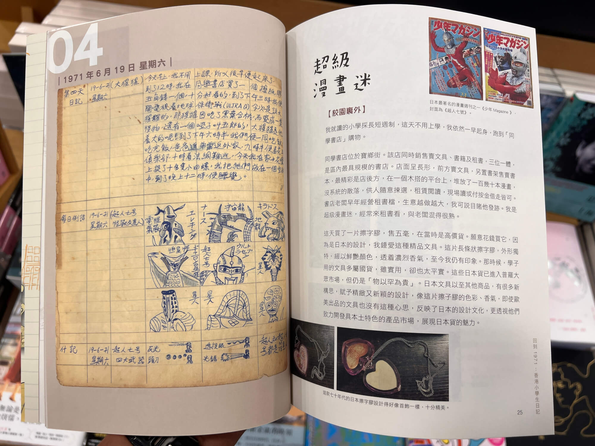
这次香港故宫文化博物馆之旅，让我深刻感受到了历史与现代的交织，艺术与文化的盛宴。从精美的文物展览到对捐赠人的尊重，从丰富的展厅内容到周边的交通便利，每一个细节都让我印象深刻。虽然在行程中也有一些小波折和遗憾，但这并不影响我对这次旅行的美好回忆。我相信，这次的经历将会激励我更加深入地了解历史文化，也期待着未来能有更多的机会去探索更多的文化宝藏。

## 神秘酒吧之约
晚上朋友邀我在香港中环置地文华东方酒店一楼的神秘小吧 "please don't tell" 想聚。

一开始我并不知道这是秘密小吧，找了许久都无果。依次询问了两个工作人员后，才得知它的位置。原来在一楼大堂吧后面有个台阶，上去后有一个小电话亭，推开电话亭的门，里面才是这个小酒吧。据悉，它是模仿美国纽约酒店在禁酒令时期那些藏在理发店后面的秘密酒吧建造的。

这个酒吧不大，大概 25 个座位。朋友告诉我，一般路边小酒吧即使店内空间不大，门口也可以站人或放置架子供人喝酒，这样能服务更多的人。而这个迷你吧为了保持秘密，外面没法站人，里面只有五六张桌子，再加吧台，所以定价偏高。

我吃了一份人造肉汉堡🍔，朋友点了一个热狗，一起吃了炸物小食，后面每人各喝了两杯鸡尾酒。酒水饮料里放冰块不少见，但这里居然放的是一根很粗的冰柱，几乎占据了接近一半的体积，掺水也太严重了吧！

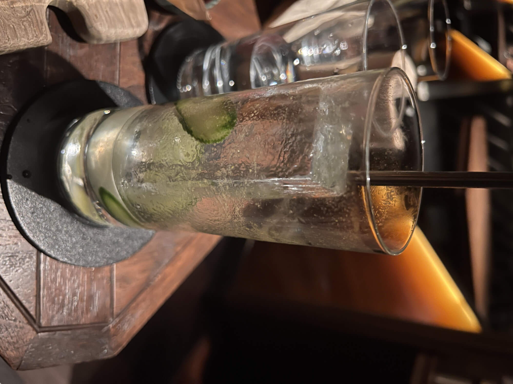

人造肉的口感和真肉几乎一样，我自己几乎没吃出来，只是在最后打嗝的时候觉得有点不对劲。朋友跟我讲了一段趣事，他同事的妻子为了让先生减肥，偷偷换了人造肉，结果先生没吃出来，但是他家的狗坚决不吃，“人造肉这东西狗都不吃！”，哈哈！

朋友给我推荐了很多本地小店美食，还交流了许多关于香港的生活话题。他家二宝刚出生，这次找了香港本地月嫂，费用高达 6 万每月，一个月的工资约等于菲佣一年的收入，让人感慨不同身份下人力价格的不均和养娃的不易。

## 总结

这次香港故宫文化博物馆之旅，让我深刻感受到了历史与现代的交织，从精美的文物展览到对捐赠人的尊重，从丰富的展厅内容到周边的便利交通，每一个细节都让我印象深刻。虽然在行程中也有一些小波折和遗憾，但这并不影响我对这次旅行的美好回忆，期待着未来能有更多的机会去探索更多的文化宝藏。