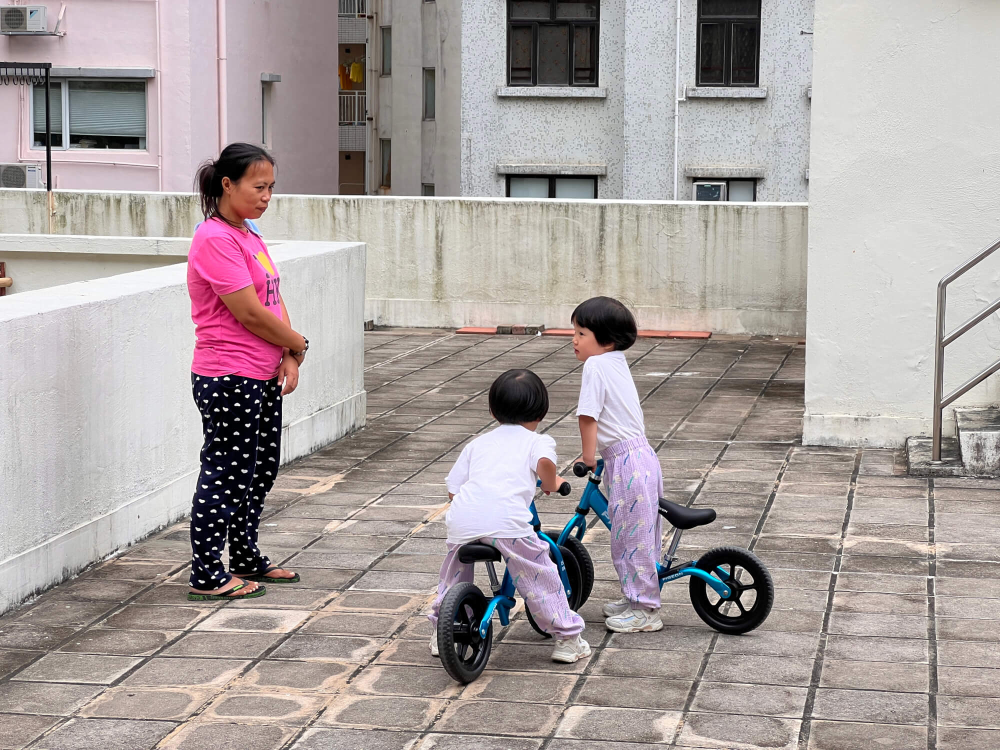

2024 年 10 月 10 日，星期四，香港晴

## 一、养成检查宝宝作业的习惯

今天虽然是周四，但明天是重阳节，香港放假一天，所以今天宝宝回来时书包里装着厚厚的周末作业。有宗教作业，英语作业，语文作业，阅读作业等。
<!--more-->
我和宝妈现在养成了每天回家查看宝宝书包的习惯，看着这些作业，感慨幼儿园小班的宝宝就要开始辅导作业了。毕竟宝宝太小，缺乏写作业的主观能动性，作业要求的字也看不懂，只能在父母的帮助下，用明确的指令完成作业，比如拿出油画棒，告诉他们需要在哪里涂色等。

## 二、第一次上社区托班
下午 4 点半到 6 点，我们把宝宝送到通善壇托班，这是社区福利中心下属的机构。有一间很大的房子，宝宝们进入前要先测量体温，37 度以下才行。然后现场付现金，每人两小时以内 30圆。今天下午有两个男生和三个女生。我本想让老师给宝宝讲他们带的书的故事，可惜老师说今天只有一个老师，没空讲，宝宝们只能自己玩。

据宝宝们回忆，教室里各种玩具还挺多的，比如切水果的玩具，就比家里的大，宝宝们觉得很有趣。房间里还有滑滑梯，不过老师说要四岁以上才能玩，还有爬隧道等。宝宝在里面玩了一个半小时，玩得很开心。

这里有大人和小孩两个厕所，珊瑚正常使用，而海兔有点胆怯，没敢跟老师说要上厕所，结果裤子湿了。我教育海兔要主动，上厕所要主动跟老师说，想要玩什么玩具也要主动说，还可以尝试跟老师说英语说粤语，锻炼交流能力。

## 三、菜鸟驿站体验
最近淘宝在香港搞活动，很多商品满 99 港币包邮，包邮不上门，只能送到自提点自提。离我们家最近的自提点在第三街，靠近社区托班，直线距离 300 多米，但去的时候要下坡，拿回来得上坡。

我买了一堆生活小杂物，重头戏是两箱康师傅矿泉水，和阿姨一起用带着两个大行李箱去取。取货和内地的驿站差不多，在手机 APP 上点取货，老板按编号，比如7-1-1234取出，然后报手机号即可。我的快递分了两个麻袋集运，我们拆看放入行李箱，方便拖行。香港垃圾处理严格，包装袋不能随意丢在自提点，一定要自己带走。

我买了一个落地的万向支架，可以夹 iPad 和手机。晚上我们用夹子跟爷爷奶奶、外婆视频，效果很不错。