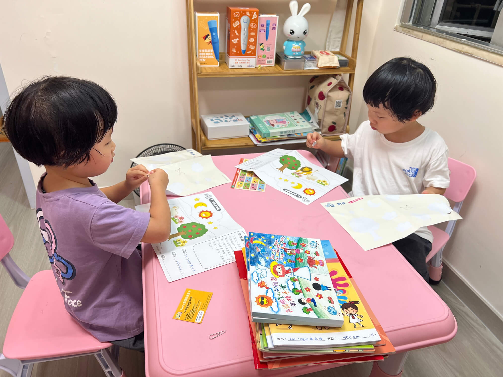

2024-10-11 周五 香港多云

## 辅导作业
宝宝现在在香港一所天主教幼稚园读K1，对应内地的幼儿园小班，今天是重阳节，放假一天，晚上辅导宝宝们写作业，没想到这个周末竟然有五项作业：
<!--more-->
### 一、宗教贴画
第一个宗教作业是宗教贴画，标题为《世界真美丽》。将大自然中的太阳、月亮、星星、河流、小鱼、大象、小羊、花草等贴在一张画有小草河岸的白纸上，带有传教性质。

### 二、宗教书籍
第二个宗教作业是依据传教书《星光伴我》，把上帝创造的东西对应的贴画贴在空格内，并学习书的前 5 页内容，还有用宝宝小手和上帝的手印泥盖 “high five”掌印。

### 三、英语作业
本周的英语作业围绕学习 letter c 展开，包括圈出 c 对应的字和动物、进行连线以及把同一行相同颜色的物品涂上相同颜色。

### 四、语文作业
语文作业主要锻炼宝宝小肌肉。有填色题，将相应物品涂成对应颜色；认数字题目，把数字与图案连线；认知题目，用五官和对应图画连线。

### 五、阅读作业
学校每周为宝宝借阅绘本，如行为规范类书籍，本周两个宝宝带回的书是中文绘本《不挑食》和《打电话》，半页绘本，半页文字，需要家长给宝宝讲解。另外还有一本《阅读图书记录册》，完成阅读后，在记录册上记录相关信息，并用花朵填色表示喜欢程度并签名，类似读后感。

### 六、其他作业
此外，平时还会传教相关的填色绘图书也需定期提交。学校每个季度有通知，明确各作业缴交日期，也会有临时作业，内容很丰富。

### 七、总体感受
对于一个 K1 的宝宝来说，有大人陪伴做作业，不会有很大压力。对于家长来说，刚上幼儿园就要辅导家庭作业，虽让人有些不适应，但能锻炼宝宝动手能力，学习知识，养成好的行为习惯，我们也很支持，愿意配合。
学校重视英语，每周有英语作业，还通过家校联系本为小朋友行为打分，并非特别应试，对规范行为也很重视，我们也很赞赏。

## 打印照片
《星光伴我》作业本的第一页要求贴上宝宝的照片。我们家里有米家照片打印机，便打印了宝宝在科德未来幼儿园托班毕业的毕业照，贴在了作业封面上。

我们顺便还打印了爸爸妈妈、爷爷奶奶、外婆与宝宝的合影，分别挂在客厅窗户上和卧室房门后，让宝宝经常能见到这些记录她们成长回忆的合影。

我还向工人姐姐要了她两个儿子和一个女儿的照片，拼成大图打印送给她，同时建议她把孩子照片贴在房间，这样看到照片会很开心。工人姐姐非常高兴，连连感谢。

## 借用手机
今晚还把备用的苹果手机借给了工人姐姐。因为她提到过自己手机屏幕有问题，打字不方便，另外拍照清晰度也一般。有了新手机，除了姐姐方便使用外，对我们也有三个好处：

1. 每天在家做游戏或带娃出去玩时能更好给宝宝拍照片、拍视频，既可以记录宝宝成长，也能为外婆记录宝宝成长的视频号提供素材，一举两得
2. 家里的部分智能设备连接了苹果HomeKit，她之前是安卓手机，无法接入，现在可以控制了
3. 我们给为宝宝准备了 AirTag 手表，要求宝宝下午出门时一定要带上。由于 AirTag 通过周围的手机发送定位，如果工人姐姐带着苹果手机和宝宝一起外出，我们能更准确地知道宝宝的位置，更加放心安全。
