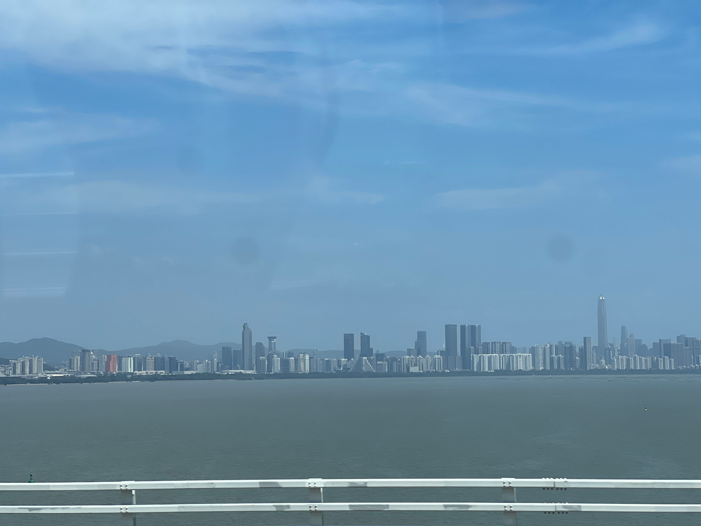
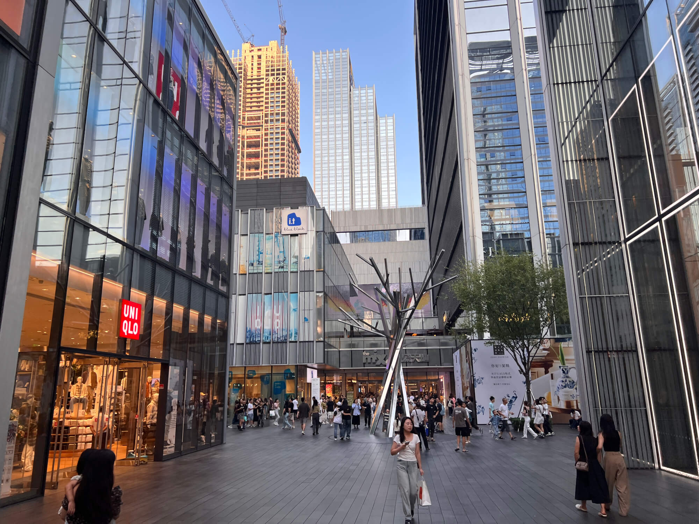
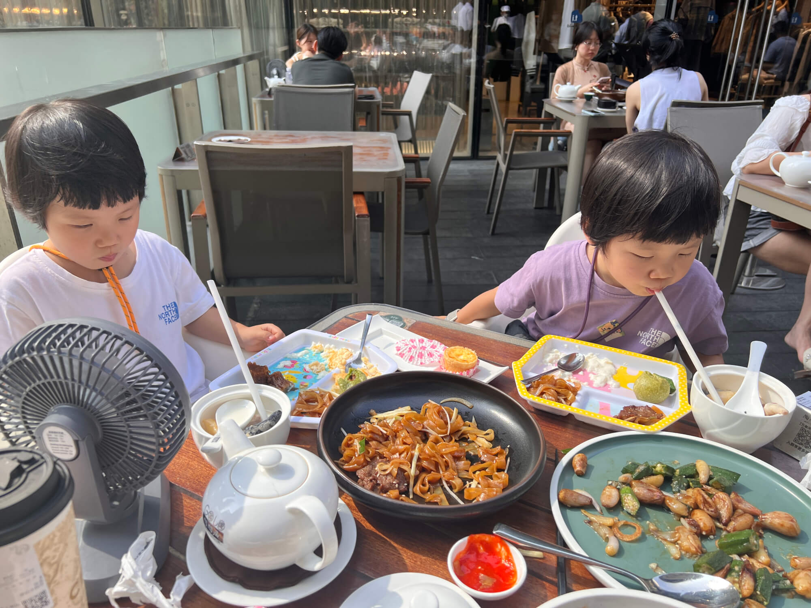
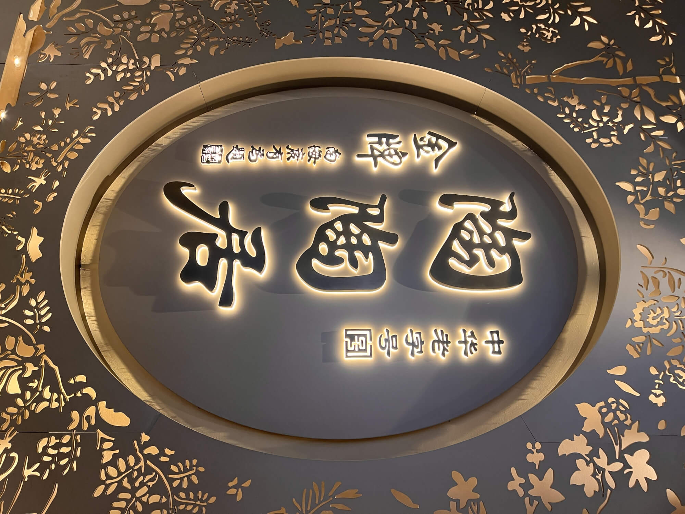
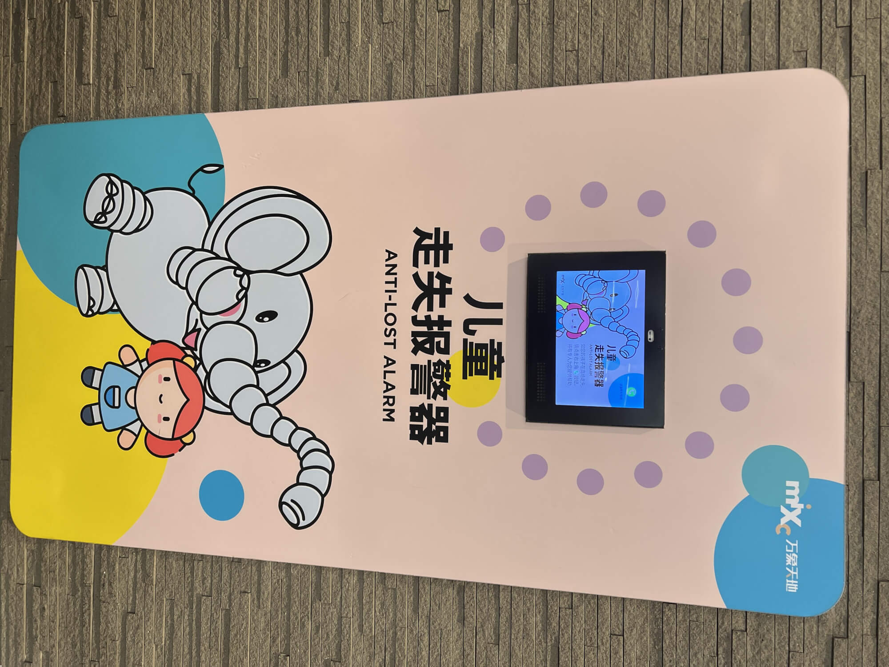
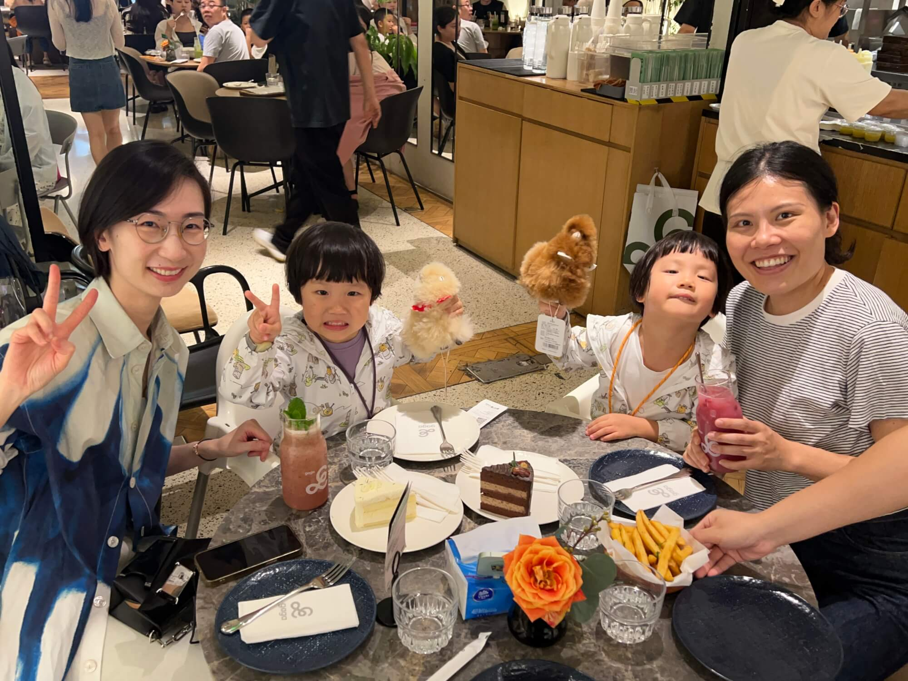
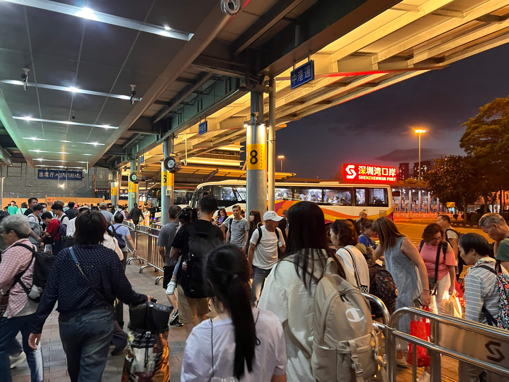
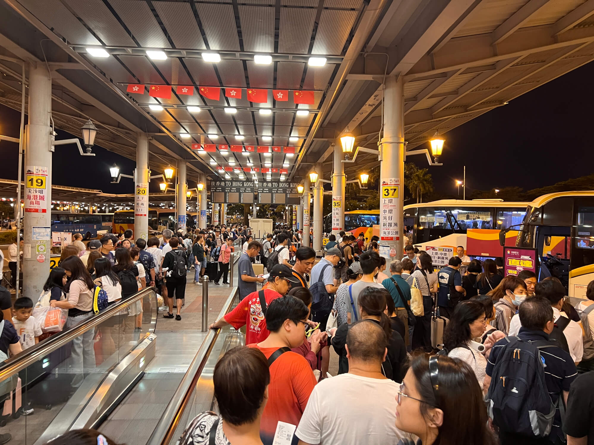

2024-10-13 周日 深圳 晴

## 出发与前往口岸
今天要去深圳玩，宝妈和同学约在了深圳湾，于是我们大巴前往。从家中出发，乘坐地铁抵达上环，从 D 出口走进信德中心。这里有港澳码头和大巴站，十分热闹。
<!--more-->
我们在 11 点 33 分赶到大巴站，赶上了 11 点 40 分的大巴前往深圳，出地铁D口到大巴站再上大巴都很近，也就100米吧。三岁以上的孩子需要购买全票，每人 60 元，一家四口花费了240 元。虽然价格比东铁线贵些，但能保证有座位，方便休息，比地铁二等座舒适。11 点 41 分大巴出发，没有去湾仔接人，直接驶向西区海底隧道，11 点 48 分进入隧道，11 点 50 分到达西九龙，之后一路朝着深圳湾前行。

## 口岸通关与取快递
交通顺畅，车程45分钟，我们在 12 点 25 分准时到达深圳湾口岸。今日是重阳节第三天，北上的人不多，南下返程的人较多。通关很顺利，大约 5 分钟通过香港边检，又过了 5 分钟通过深圳边检，10分钟就走出了口岸。出来后，我们沿着遮阳棚找到了快递点，这里有中通、顺丰等快递公司，中通小件代收是5元一件，顺丰没明码标价，意思是可以放一两天，不能长期存放。外婆从杭州寄来的宝宝推车和食物昨天到了这里，取到快递后，我们打车去华润天地吃午餐。

## 陶陶居用餐

下午一点，我们坐上出租车，10 分钟后到达万象天地。这里的金牌陶陶居人气很旺，我们排到 1 点半才有座位，还是室外的。我们团了双人套餐，又点了三个宝宝爱吃的菜，宝妈还点了霸王茶姬的外卖。妈妈带宝宝洗手回来时，菜已经上了好几个。套餐分量足，口味好，两大两小都没吃完，只好打包。一会儿霸王茶姬也到了，外卖进不来，自提点不方便，和小哥约在靠马路的优衣库附近接头。

用餐时抬头看到陶陶居的牌子，竟然署名南海康有为。经过网上查询得知，这并非集字，而是康有为在 1888 年到这里吃饭时所写，一直沿用至今。陶陶居创立于 1880 年，是广州最早的老字号之一。康有为题字时运用了《石门铭》的笔法，这是我国古代两个著名的"石门"之一，《石门颂》是汉代篆书演变到隶书的代表作，《石门铭》是魏碑隶书到楷书的经典，这个发现让此次用餐多了一份文化韵味，也让我对这家店更添一份敬意。

## 超市采购与下午茶
吃完饭，宝妈带着宝宝去逛超市，我在桌子上把茶喝完并开通手机小号的国际漫游，小号一是全球通银卡，到了深圳湾有信号后自动短信提醒到了香港，可以发送 GMKT 到10086开通国际漫游，小号二则没有提示，不够友好，不过都是移动，短信代码也是通用的，避免了人工客服的复杂验证。

Ola 精品超市里的蔬菜水果价格很高，感觉比香港还贵，我们简单买了些。

之后我们去 3 楼的 Gaga 喝下午茶，点了蛋糕、饮料和炸薯条。妈妈的同学Danny阿姨来了，给宝宝带了可爱的羊驼玩具，宝宝们很喜欢。宝妈和阿姨聊天，宝宝们在一旁玩羊驼、看动画片。我去西西弗书店逛了一圈，没买到想要的书，又帮宝妈下楼拿了另一杯外卖奶茶。今天喝了1陶陶居港式奶茶2陶陶居茶水3两种口味的霸王茶姬4两种口味的Gaga下午茶，撑了一肚子坏水。

## 返程之旅
今天是香港端午假期第三天，返程时困难重重。在华润万象打车不易，到处都是人，一路堵车。到深圳湾口岸下车时极为拥堵，好在打到的是出租车，走了上客的专用通道，没有堵太久。出入境的人很多，带小孩必须走人工通道，深圳边检几乎没排队，香港口岸虽然窗口全开但效率很低，排了一会儿。

出境后打车和坐公交都不方便，我们还是决定坐大巴。同样是去上环，中港巴士等了约 10 分钟就上车了，旁边中旅巴士排队的人还在等待。我们坐在倒数第二排，安全门出口，座位空间大很舒服。宝宝返程时有点闹情绪，后来宝妈抱着宝宝坐，我一人坐两个座位，并用语音回顾了今天的日程，记录下这忙碌的一天。

## 回顾总结：
到家后统计了一下开销，有点小吃惊。往返大巴 60元 x 4人 x 2往返 = 480元，地铁30元，打车两次50元，陶陶居 400套餐+100单点=500元，下午茶+奶茶=250元，超时采购300元，快递收发150元，合计高达1750元，比想象中多很多啊。以后还是控制去深圳的次数，每个月不超过一次吧，反正香港的山和水都是免费的。

跨境大巴比东铁线的二等座舒服，深圳湾的一地两检也高效，等年底深圳湾口岸地铁通车了，考虑把车从福田移到南山长期停放。
