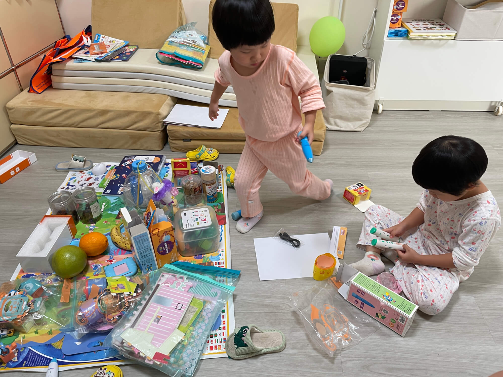

2024-10-14 周一 香港 晴

## 忙碌的一天伊始
清晨的阳光透过窗帘的缝隙洒在脸上，我悠悠转醒，心中满是惬意，毕竟今天睡了个懒觉。回想起凌晨还在加班忙碌的身影，此刻的放松显得格外珍贵。简单收拾后，便开始准备迎接新的一天。

<!--more-->

## 宝宝午睡的折腾
今天中午，宝宝们可把我闹得够呛。她们精力充沛，怎么都不肯睡觉，一直叫嚷着要玩耍。我耐着性子哄着，又是讲故事又是轻声安抚。闹到下午 2 点才入睡，我下午 2 点开始上班，中午没能休息，整个下午都处于困倦疲乏的状态，这个状态可不行，后面要想办法调整。

## 医院之行的小插曲
下午，娃要去上户外体育课，我请假一小时前往医院送尿检样本，医院距离不算远，途中虽有上下坡，但有娃同行，一切似乎也没那么艰难。我拉着香港人常用的拖拉小盒子，将两个检验瓶妥善放置其中，两个宝宝坐在盖子上面，我拉着她们缓缓前行，时不时和工人姐姐来下“赛跑”，宝宝们玩得很开心~

## 宝宝体育课报名考虑
晚上，下一期的户外体育课的课程又出来了，不同年龄段有不同的运动，2 - 4 岁是棒球之类的小活动，4 - 7 岁的则是踢足球。这一安排在 Whatsapp 群里引发了热烈讨论。

一部分人认为，让宝宝每次体验不同的活动，可以对不同运动的兴趣进行启蒙，这非常好。然而，也有人提出了不同的看法。比如时间安排不太合理等。还有像我们家宝宝，现在参与度不太高，每次前 5 - 10 分钟都会发呆或者害羞，不敢参与，耽误了时间。而且，小班的宝宝似乎太小，大一点的班宝宝又可能跟不上，让人感觉不是很合适。

除了每周一节的体育课之外，为了保证户外活动的时间，我还计划让工人姐姐每天下午都带着宝宝们在家附近转转，在楼顶平台上玩一玩。这样或许能让宝宝更加自在地玩耍，不会有参与活动时的那些困扰，而且成本较低。同时，我们可以根据宝宝的兴趣和状态随时调整活动内容，让宝宝在轻松愉快的氛围中度过时光。

## 亲子作业的温馨时光
吃完晚饭，我陪着宝宝完成家庭作业——给气球涂色。我拿出蜡笔，让宝宝挑选他们最喜欢的颜色。小家伙们眼睛放光，兴奋地选择了多种颜色，不一会儿，一个彩色的气球便呈现在眼前。海兔还别出心裁地用黑笔给气球点上了两个眼睛，说这是气球人。那一刻，我被她们的创意逗乐，心里暖暖的。亲子相伴的时光总是充满惊喜与感动，在这小小的活动中，我看到了宝宝们丰富的想象力和对世界独特的认知。

## 拿快递
最近拼多多包顺丰集运到相关，我也狂买了很多，今天自提了 8 件，自提点离我家 100 多米，很方便。之前很多东西运费很贵，现在直接买，集运也不用等凑单，这种便利让人感觉很爽。

今天还收到了一个期待已久却又状况百出的快递。宝妈一个多月前购买的物品，走AVL集运，在经历了海关扣押、漫长等待后终于送到。然而，当满心欢喜地打开包裹，却发现里面的厨房支架没有说明书。急忙去找店家，没想到店家已经跑路，店铺商品全部下架，发消息也无人回应。

拼多多上一旦商品下架就什么信息都看不到了，这与淘宝的商品快照有所不同。寻求其他商家帮助，结果都要先下单才能发视频，不过好在东西不算特别复杂，经过自己一番摸索，最终还是将其安装完成。这过程虽然有些波折，但也算是一种特殊的经历。
