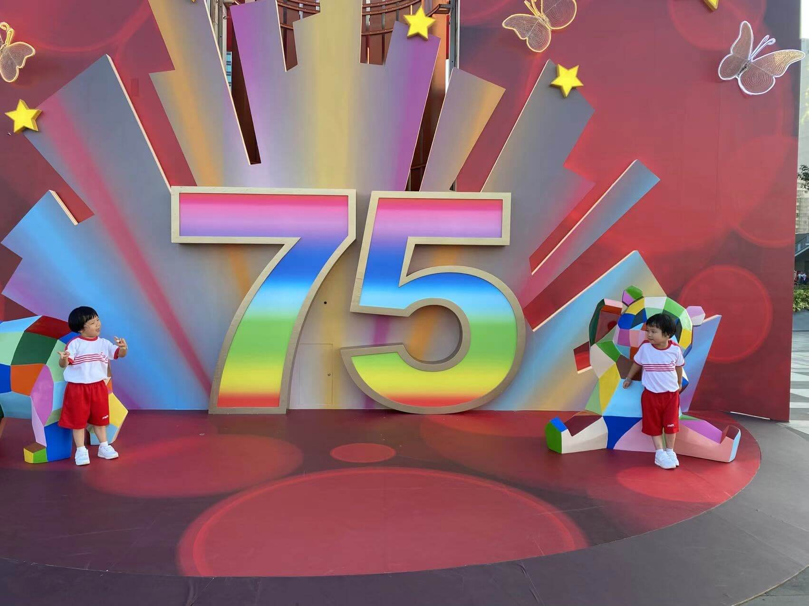
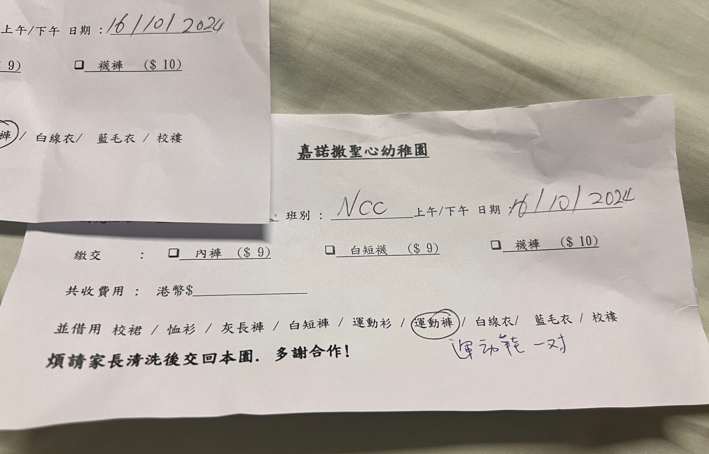
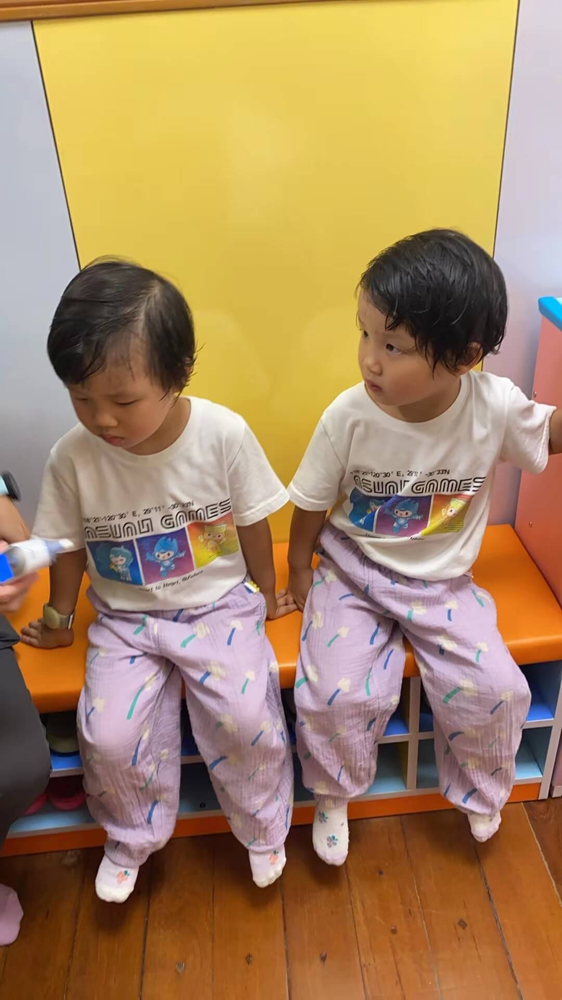

2024 年 10 月 16 日 香港 晴

## 一、学校的贴心之举
上午，宝宝如往常一样正常去上学。然而，中午时分，宝妈接到了老师的电话，告知两个宝宝都尿裤子了。心中不免有些担忧。宝宝到家后，惊喜地发现她们穿着新鞋和干净的衣服，打开书包，更是感受到了学校的贴心。
<!--more-->
原来，书包里带上的备用内裤，老师已经给宝宝换上了。而校裤和鞋子，我们虽未在书包里准备备份，但学校也有预备，换上了合码的。不仅如此，老师还在了两个宝宝的书包里各放了一个表格，上面清楚地写着从学校借了鞋子和裤子的情况，要求家长洗干净明天带回去。让我深感学校的服务和配套流程十分完善！

## 二、温馨午睡时光
中午，我陪着宝宝午睡。一开始宝宝小闹了一会儿，随后我有点累，没哄宝宝，也没摘眼镜，就睡着了。没想到，两个宝宝自己也渐渐安静下来进入了梦乡。看来，有时候以身作则确实比哄睡更有效果。我在两点醒来后去工作，而宝宝们今天醒得比较早，2 点 45 就醒了，往常他们可是要睡到 3 点多呢。

## 三、丰盛下午茶与快乐玩耍
宝宝们睡醒后，迎来了丰盛的下午茶。工人姐姐准备了红葡萄、绿葡萄、柚子、葡萄干，还有红豆汤和牛奶，真是让人垂涎欲滴！接着，工人姐姐带宝宝去楼顶上玩。中午收到的快递中，爷爷把两个宝宝的滑板车寄过来了。宝宝们在家就迫不及待地骑起来，到了楼顶更是尽情驰骋了一小时，大汗淋漓。不过，阿姨说两个宝宝控车能力还差一点，有时容易摔倒，但好在都在安全范围内。可惜的是，宝宝的头盔在大搬家后不知去向，后面得想办法再找找。

## 四、托班的小意外
下午四点半，宝宝去通善壇社区托班上课。到了托班后要先测体温，奶海没事，但珊瑚三十八度，体温有点高。于是，两个宝宝不能上课，只能回家。回来后，工人姐姐烧饭，两个宝宝在客厅无所事事。我拿出《汪汪队找不同》给她们玩，可他们还不能自己独立玩，隔一会儿就来找我，不是说找不到要看答案，就是找到了来报喜，弄得我挺烦，也影响了我的工作。

## 五、晚餐与睡前时光
晚上，宝宝吃晚饭时全程看着动画片《小猪佩奇》。我因为工作还没结束，只能让宝妈陪着宝宝吃饭。

睡前，最近海兔总是不愿意刷牙，每次都和我们捉迷藏。抓到卫生间，又要逃跑，我堵住路，她就从裤裆钻过去溜走，最后弄得又哭一场，让人无奈又心疼。珊瑚今天有点小发烧，所以很乖地早早到床上休息。我反对开空调，觉得这几天发烧与晚上开空调有关，但宝妈坚持认为开空调有助于哄宝宝睡觉，说睡着了再关。

晚上 9 点前，我给宝宝讲了英文绘本。宝宝学校阅读作业是交替的，上周发繁体中文书，这周发英文书，两个宝宝各一本，还有一本全英文学习手册。今晚讲的故事是《谁偷了饼干》，十分有趣。大意是一个小姑娘的饼干丢了，然后他就问小猫、小狗、小松鼠，最后发现是小熊偷了她的饼干，然后最后重新做了一堆饼干，大家一起分享的故事。

这是一套分级读物，这本是第二级。英文的单词都还比较简单，我也是没有强制教他们单词拼写，也就是简单把几个小动物的单词介绍了一下。宝宝现在认字母还行，认单词和发音还需多训练。上英语课回来父母没帮着复习，可能影响学习效果，需要想想如何巩固。

睡前我跟宝宝说周末带她们去图书馆玩，顺便借书，石塘咀图书馆楼上有室内儿童乐园，她们应该会很喜欢，这周是小周，我周六要加班，看来只能期待周日了。

## 总结
这一天，有欢喜有烦恼，但都是生活的珍贵回忆。
